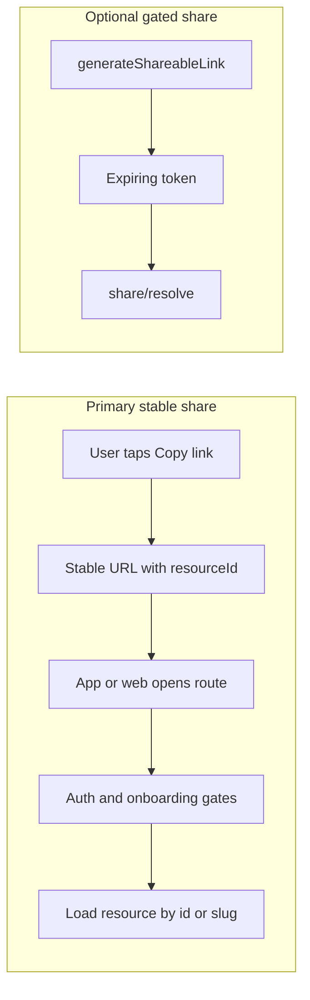

# Stable share and deep links (YouTube/Spotify-style)

## Goal

- **Primary UX:** Share and open content using **stable URLs** built from **public resource identifiers** (Mongo `ObjectId` today, optional **slug** later for prettier links), not expiring opaque tokens.
- **Secondary UX:** Keep [`shareable-link`](apps/api/src/modules/platform/shareable-link/) for **time-bound or revocable** access when the product needs it (campaigns, partner previews, “link stops working” without deleting the sermon).

This matches [`specs/api/mobile-flow.md`](specs/api/mobile-flow.md) (“Deep link — shared sermon”) better than token-only flows: the app resolves **which sermon** from the path/ID, then applies **auth and onboarding gates** as today.

## Current anchors in code

- Sermons already get a web-style URL in [`sermon.service.ts` `attachAppUrl`](apps/api/src/modules/core/sermon/sermon.service.ts): `CLIENT_APP_URL/sermons/{_id}` stored as `shareableUrl`.
- [`sermon.repository.ts` `findSermon`](apps/api/src/modules/core/sermon/sermon.repository.ts) already supports **ObjectId or `slug`**, but the **Mongoose schema** in [`sermon.model.ts`](apps/api/src/modules/core/sermon/sermon.model.ts) may not define `slug`—confirm and add **`slug` + unique sparse index** if you want Spotify-style stable paths without exposing raw ids everywhere.
- Token resolve remains at **`GET /api/v1/share/resolve`** ([`shareable-link.router.ts`](apps/api/src/modules/platform/shareable-link/shareable-link.router.ts)); treat it as **fallback / gated**, not the main “Copy link” path.

## Target contracts (document first, then implement gaps)

1. **Universal link / app link (recommended):** Same host as `CLIENT_APP_URL`, paths aligned with `shareableUrl`, e.g. `https://app.example/sermons/{idOrSlug}` so OS “Open in app” works.
2. **Custom scheme (optional):** e.g. `troott://sermon/{idOrSlug}` — document query reserved params (`t=` position) if needed later.
3. **Playlist / minister:** Parallel stable patterns: `/playlists/{id}`, `/minister/{idOrSlug}` (minister already has slug patterns elsewhere in the codebase).

**Auth behavior** (per mobile-flow): unsigned user hits link → **sign-in / sign-up**; optional **static teaser** endpoint is a separate product decision. Signed-in API for full detail can stay **`Protect`** or split **public teaser** vs **private detail** routes—pick one policy and document it in [`specs/api/mobile-flow.md`](specs/api/mobile-flow.md) or [`specs/api/deep-links.md`](specs/api/deep-links.md) (new).

## Platform: Universal Links, App Links, and redirects

- **Apple:** Host `apple-app-site-association` (JSON) on the **exact** HTTPS host users tap; paths must match app entitlements and Expo/React Native universal link config.
- **Android:** `/.well-known/assetlinks.json` with signing cert fingerprints and package name.
- **Ownership:** Decide who owns DNS, TLS, and deploy for that host (marketing site vs API subdomain vs dedicated `links.` host).
- **Fallback:** When the app is not installed: redirect to **web sermon page**, **App Store / Play**, or **marketing landing**—document one default per platform.
- **HTTPS and redirects:** Single **canonical** URL policy (see below); avoid chains that break universal link verification.

## Web vs native parity

- **Same path shape** on Expo web and native (e.g. `/sermons/:idOrSlug`) so one copied link works everywhere the product is sold.
- **Router ownership:** List which repo implements which segment (Expo Router in app, optional Next/remix marketing site) and how they stay in sync with [`attachAppUrl`](apps/api/src/modules/core/sermon/sermon.service.ts).

## Post-sign-in and onboarding continuation

- Persist **pending deep link** (full URL or normalized `{ type, id }`) when the user lands signed-out or hits auth/onboarding gates.
- After successful **sign-in** or **onboarding completion**, **replay** navigation to the target resource; clear pending state on success or explicit cancel.
- Align copy and behavior with mobile-flow §3 (return navigation preserved).

## Canonical URL policy

- One preferred form: **https**, chosen **host**, **with or without trailing slash** (pick one), **www vs apex** (pick one).
- Prevents duplicate social previews, broken caches, and “same sermon, two URLs” analytics splits.
- Document in `deep-links.md` and enforce in link generation (`attachAppUrl`, share sheets, emails).

## API: stable “open resource” surface (Phase B)

- **Audit first:** **`GET /api/v1/sermon/:id`** today—public vs `Protect`, draft/deleted/`isPublic` behavior, consistent errors for unknown slug/id ([`sermon.controller.ts`](apps/api/src/modules/core/sermon/sermon.controller.ts) + router).
- **Sermon:** If `:id` is slug, schema + index + `getSermonById` path must match [`findSermon`](apps/api/src/modules/core/sermon/sermon.repository.ts).
- **Playlist:** **`GET /api/v1/playlist/:id`** as primary share for **public** playlists; private playlists—stable id may **leak existence**; use **token share** only if you allow sharing non-public playlists.
- **Minister:** Stable open by id/slug; handle **slug rename** (redirect old slug → new, or 404 with guidance) if slugs are user-visible in links.
- **Deleted / merged content:** Define behavior for deleted sermon/playlist, merged minister accounts (404 vs redirect).

Optional: **`GET /api/v1/open/sermon/:id`** minimal teaser `{ title, imageUrl, duration }` for signed-out marketing—only if product wants preview **without** guest accounts (mobile-flow §11).

## Paywall, subscription, and region

- Stable URL for content that is **premium** or **geo-restricted**: signed-out teaser vs blur; signed-in non-subscriber upsell; consistent with subscription module and mobile-flow paywall notes.
- Document in the same matrix as auth/onboarding.

## Revocation and “went viral then pulled”

- When a sermon becomes **private**, **unlisted**, or **deleted**: old stable links should return **404/410** or teaser-only per policy.
- **CDN / HTTP cache:** Cache-Control or purge strategy so links do not serve stale public audio/metadata.
- **Open Graph / embeds:** Invalidate or short TTL for `og:image` / title when title or visibility changes.

## Security and abuse (if public teaser exists)

- **Rate limiting** on unauthenticated teaser and listing-like probes.
- **Monitoring** for abuse patterns (scraping, enumeration); ObjectIds are not sequential but bulk probing is still possible—treat as low priority unless you expose incremental ids elsewhere.

## Observability

- Metrics or structured logs: **stable open** success/failure (reason: not_found, private, paywall), vs **`share/resolve`** token path (invalid, expired, revoked).
- Helps product see adoption of stable vs token links after rollout.

## `shareable-link` role (narrow) — Phase C

- **When to use:** Document in module README: campaigns, partner windows, optional **non-public** playlist share, any flow requiring **revocation without changing resource id**.
- **Call site inventory:** Grep/code search for `generateShareableLink` and UI that still copies token URLs.
- **Operations:** TTL / cleanup for expired rows ([`cleanupExpiredLinks`](apps/api/src/modules/platform/shareable-link/shareable-link.service.ts)); dashboards or logs on **`/share/resolve`** volume and errors.
- **Sunset (optional):** If migrating users off token links, document deprecation window and client fallback order (try stable first vs token first—pick one).
- **Hydration:** Extend [`hydrateResource`](apps/api/src/modules/platform/shareable-link/shareable-link.service.ts) for **series, bite, library**, etc., if those `ShareableLinkType` values are used in production.

## SEO and social (web)

- **Open Graph / Twitter Card** meta for stable sermon (and optionally playlist/minister) pages so pasted links look good in iMessage, Slack, X.
- Align **title/description/image** with permission rules (no private audio URLs in `og:audio`).

## Client (Phase D) and analytics

- Mobile: **primary** handler parses **path-based** id/slug; **fallback** to `GET /api/v1/share/resolve?token=&resourceId=` only for gated/token flows.
- **Analytics:** Increment **`totalShares`** or a dedicated “open from share” event on **successful** stable open (distinct from token resolve) if product wants funnel data.
- **UTM parameters:** Optional convention (`utm_source=share`) on stable links—document whether server strips or preserves.

## Rollout and coordination

- **Feature flag** (or config): “Copy link” prefers stable URL vs legacy token URL during transition.
- **Release notes** for mobile + web + any **email templates** that embed links.
- **Backwards compatibility:** Old token links remain valid until sunset policy says otherwise.

## Testing matrix (minimum)

- Cold start via universal link.
- Signed out → sign in → **resume same target**.
- Signed in, **not onboarded** → policy A vs B (onboarding first vs one-off listen) per product choice.
- Invalid id / unknown slug.
- **Public** vs **private** sermon (and deleted).
- **Public** vs **private** playlist stable link.
- Token-only `share/resolve` (legacy + `tokenLookupHash` path).
- Web: paste URL in browser when app installed vs not installed.

## Implementation phases (summary)

### Phase A — Product and client contract

- Add [`specs/api/deep-links.md`](specs/api/deep-links.md) (or extend mobile-flow §3) with paths, matrix, canonical URL, universal link host, fallback when app missing, pending-URL-after-auth.
- Cross-link from [`specs/api/mobile-flow.md`](specs/api/mobile-flow.md), relevant [`specs/mobile/`](specs/mobile/) and [`specs/web/`](specs/web/) docs.
- Align [`attachAppUrl`](apps/api/src/modules/core/sermon/sermon.service.ts) path segment with mobile/web routers.

### Phase B — API and web surfaces

- Audit and implement sermon/playlist/minister stable open + optional teaser; paywall and revocation behavior.
- Canonical URL and cache/OG strategy.

### Phase C — `shareable-link` and ops

- Narrow documentation, inventory callers, optional hydration extensions, ops/metrics/sunset.

### Phase D — Clients, SEO, rollout

- Mobile/web parsers, OG tags, feature flag rollout, analytics, E2E tests.

## Risks and decisions (resolve during Phase A)

- **Signed-out preview:** Static teaser vs 401-only—must match mobile-flow §3 and §11 “optional public sermon preview.”
- **Slug vs id:** Slugs need uniqueness and migration; ids are ugly but zero migration.
- **Playlist private shares:** Stable id alone may leak existence; use **token** for non-public shares if product allows sharing them.

## Success criteria

- “Copy link” for a public sermon produces a **stable** URL that still works after weeks without token refresh.
- Deep link handler on mobile uses **path-based id** as primary.
- Token-based `share/resolve` is **documented as optional** and used only for gated scenarios you explicitly productize.
- Universal Links / App Links verify on a **production** host; signed-out → signed-in **resumes** the same content when policy allows.
- Docs and tests cover the matrix above; rollout does not break existing token links until an explicit sunset (if any).
