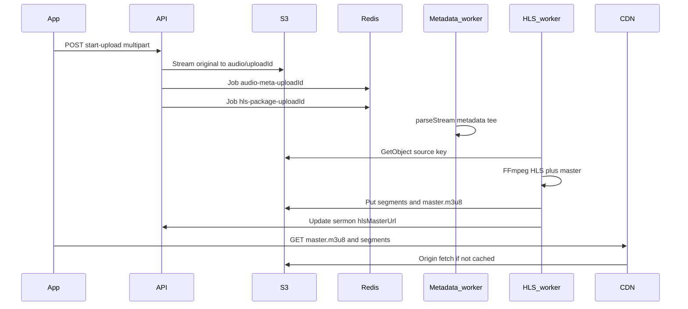

# Audio pipeline: upload through CDN playback

End-to-end flow for sermon audio: multipart upload, S3 ingest, Bull workers (metadata + HLS), derivative uploads, and how clients stream via CDN.

## 1. Client upload request

- **Endpoint:** `POST /api/v1/sermon/start-upload` with `multipart/form-data`.

**Middleware order** ([`sermon.router.ts`](../src/modules/core/sermon/sermon.router.ts)):

1. **Protect** – JWT; sets `req.user`.
2. **sermonUploadRateLimiter** – per-user hourly upload cap.
3. **requireMinisterProfile** – user must have a Minister profile.
4. **sermonAudioUploadSizeLimit** – rejects oversized `Content-Length` when present.
5. **uploadHandler** – busboy parses multipart; tees bytes into `stream` (upload body) and `metadataStream` (same bytes for probing).
6. **uploadSermon** controller.

**Controller** ([`sermon.controller.ts`](../src/modules/core/sermon/sermon.controller.ts)): validates MIME against `mediaConfig.sermonAudioMimeAllowlist`, sets `file.uploadedBy` from the authenticated user, calls `handleUploadSermon(file)`.

## 2. Streaming ingest to S3 (original file)

**Service:** `handleUploadSermon` in [`sermon.service.ts`](../src/modules/core/sermon/sermon.service.ts).

- Validates MIME and optional size (`SERMON_AUDIO_MAX_BYTES` / [`media.config.ts`](../src/configs/media.config.ts)).
- Builds `s3Key` = `{audio-folder}/{uploadId}` (e.g. `audio/<uploadId>`).
- Uses `@aws-sdk/lib-storage` `Upload` with `Body: stream` so the API does not buffer the whole file in RAM.
- On success: creates a `Sermon` with `uploadSummary` (including `s3Key`, `rawFile`), optional `minister`, `uploadState` for the metadata phase.

## 3. Asynchronous jobs (Bull + Redis)

After S3 upload completes, two jobs are enqueued:

| Job       | Queue (`JobChannel`) | Bull job name       | Stable job id           | Payload                                              |
| --------- | -------------------- | ------------------- | ----------------------- | ---------------------------------------------------- |
| Metadata  | `audio:metadata`     | `audio-metadata`    | `audio-meta-{uploadId}` | `metadataStream`, `mimeType`, `uploadId`             |
| HLS pack  | `audio:processing`   | `audio-processing`  | `hls-package-{uploadId}` | `uploadId`, `sourceS3Key` (= same `s3Key`)           |

- Metadata uses the tee’d **metadata stream** from busboy.
- HLS does **not** reuse the upload stream; it **reads the object from S3** by key after upload completes.

**Workers** ([`worker.ts`](../src/tasks/workers/worker.ts)): metadata worker + HLS packaging worker both run against Redis-backed Bull queues.

## 4. Metadata worker

**Job:** [`audio-metadata.job.ts`](../src/tasks/jobs/audio-metadata.job.ts).

- Runs `music-metadata` `parseStream` on `metadataStream`.
- Updates `uploadSummary.metadata` and sermon status as implemented.

## 5. HLS worker (transcode + derivatives to S3)

**Job:** [`audio-processing.job.ts`](../src/tasks/jobs/audio-processing.job.ts).

1. Updates sermon processing / bitrate-related state in MongoDB.
2. Reads the original via `storageService.getObjectStream(sourceS3Key)` and writes a temp ingest file.
3. Optional: if `AUDIO_LOUDNORM_BEFORE_HLS=true`, runs [`audioProcessing.runCli`](../src/modules/core/processes/audio-processing.ts) (loudnorm) to a WAV, then feeds that into packaging.
4. [`ProcessHLS`](../src/modules/core/processes/audio-processing.ts): per-rendition AAC + HLS segments under a temp directory.
5. Uploads each segment and playlist via `storageService.uploadFile` under keys such as `{uploadId}/hls/{rendition}/…` (see storage helper + folder logic).
6. Builds multivariant **`master.m3u8`** ([`hls-master.util.ts`](../src/utils/hls-master.util.ts)) and uploads it.
7. Sets **`hlsMasterUrl`** using **`urlForMediaKey`** ([`media.config.ts`](../src/configs/media.config.ts)).
8. On failure: best-effort `deleteObjectsByPrefix` under `{sourceS3Key}/hls/` and persists error fields on the sermon.

## 6. Playback and CDN

**URL construction** ([`media.config.ts`](../src/configs/media.config.ts)):

- **`urlForMediaKey(s3Key)`** prefers **`MEDIA_CDN_BASE_URL`** (or `S3_PUBLIC_HTTP_BASE`), otherwise falls back to a virtual-hosted S3 HTTPS URL.

**Intended production setup:**

1. Configure **CloudFront** (or similar) with origin = your **S3 bucket** (and correct path behavior).
2. Set **`MEDIA_CDN_BASE_URL`** to the CDN origin (no trailing slash), matching where packaged objects are reachable.
3. The app loads sermon data from your API and passes **`hlsMasterUrl`** (or equivalent) to the player (e.g. React Native Track Player).
4. The player requests **`master.m3u8`**, then variant playlists and `.ts` segments; the **CDN** caches and serves them, fetching from S3 on cache miss.

**Private buckets:** If objects are not public, you may still need **signed URLs** or **signed cookies** at the CDN or a dedicated playback API; the stored `hlsMasterUrl` may need to be complemented by short-lived signed playback URLs depending on your security model.

## Diagram

## Environment variables

| Variable                         | Role                                              |
| -------------------------------- | ------------------------------------------------- |
| `MEDIA_CDN_BASE_URL`             | CDN origin for `hlsMasterUrl` and segment URLs    |
| `S3_PUBLIC_HTTP_BASE`            | Optional alternate base before S3 URL fallback    |
| `SERMON_AUDIO_MAX_BYTES`         | Max sermon audio upload size                      |
| `SERMON_AUDIO_MIME_ALLOWLIST`    | Comma-separated MIME allowlist                    |
| `SERMON_UPLOAD_RATE_LIMIT_PER_HOUR` | Per-user upload rate limit                     |
| `AUDIO_LOUDNORM_BEFORE_HLS`      | `true` to loudnorm before HLS packaging           |
| `MULTIPART_MAX_FILE_BYTES`       | Busboy max file size (align with sermon max in prod) |

## Source files (reference)

| File | Role |
| ---- | ---- |
| [`sermon.router.ts`](../src/modules/core/sermon/sermon.router.ts) | Route middleware |
| [`sermon.controller.ts`](../src/modules/core/sermon/sermon.controller.ts) | Upload handler |
| [`sermon.service.ts`](../src/modules/core/sermon/sermon.service.ts) | S3 upload + enqueue |
| [`upload.mdw.ts`](../src/middlewares/upload.mdw.ts) | Multipart / busboy |
| [`media.config.ts`](../src/configs/media.config.ts) | CDN URL helpers + limits |
| [`audio-metadata.job.ts`](../src/tasks/jobs/audio-metadata.job.ts) | Metadata job |
| [`audio-processing.job.ts`](../src/tasks/jobs/audio-processing.job.ts) | HLS job |
| [`worker.ts`](../src/tasks/workers/worker.ts) | Worker startup |
| [`audio-processing.ts`](../src/modules/core/processes/audio-processing.ts) | FFmpeg (`runCli`, `ProcessHLS`) |
