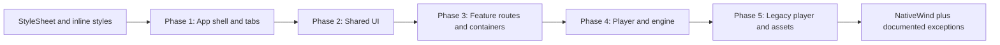

# NativeWind Migration Plan

This document is the migration plan for moving the entire app from StyleSheet and inline styles to **NativeWind** (Tailwind-style `className`). All styling decisions and patterns must follow the Cursor rule [.cursor/rules/nativewind-expo.mdc](.cursor/rules/nativewind-expo.mdc).

- **App theme:** The app is **dark-only**. Use dark Tailwind tokens only (e.g. `bg-neutral-900`, `text-neutral-100`, `border-neutral-700`). No light/dark toggles; no `dark:` variants.
- **No backward compatibility:** Migrated code must not retain StyleSheet or legacy style modules. Remove old styles and imports when done. No feature flags or dual styling paths.
- **Scope: entire app.** Every listed file must be migrated; no exclusions. Before closing the migration, run the verification commands (Section 9) and add any remaining files that still contain StyleSheet or inline styles to the appropriate phase.

---

## 1. Prerequisites

- **tailwind.config.js:** Add `./engine/**` to `content` before starting (so engine classNames are not purged). Keep `./app/**`, `./components/**`, `./screens/**`.
- **nativewind-env.d.ts**, **metro.config.js** (withNativeWind + `input: './global.css'`), **babel.config.ts** (nativewind preset): confirm in place.
- **global.css:** Must exist and include Tailwind directives (e.g. `@tailwind base;` `@tailwind components;` `@tailwind utilities;`). Create if missing.
- Use `cn()` from `@/lib/util` for conditional or merged classes.

---

## 2. Theme and token mapping (dark-only)

- Define how existing `theme.colors.*` / hex (from constants/theme, assets/styles) map to Tailwind classes. Use Tailwind semantic/neutral tokens for background, text, and borders (e.g. neutral-50 through neutral-950). Document the mapping here or in a short comment in constants/theme.
- **Typography / fonts:** Use Tailwind typography classes (`text-sm`, `text-base`, `font-medium`, `font-semibold`, etc.) where possible. For custom fontFamily (e.g. matterFonts), either extend Tailwind theme and use a class (e.g. `font-matter`) or document any remaining use of theme.typography; do not leave mixed patterns.
- **constants/theme:** Keep for non-style use if needed (e.g. JS layout numbers). Document that style-related values are superseded by Tailwind; migrate all style usages to className and remove style imports from theme where applicable.
- **Removed legacy modules:** `assets/styles/components.tsx`, `custom.tsx`, and `troott.tsx` are deleted. Use NativeWind `className` plus shared layout primitives from `@/components/shared`: `VStack`, `HStack`, `ScreenSection` (see [docs/figma-troott-ui.md](../figma-troott-ui.md) for Figma spacing alignment). **Archived copies + mapping guide:** [docs/migration/styles/README.md](styles/README.md).

---

## 3. Allowed StyleSheet exceptions (from rule)

- Animated styles (react-native-reanimated, Animated API).
- Runtime dynamic values (e.g. `width: screenWidth * 0.7`, `Dimensions.get('window')`).
- Unsupported properties (shadowPath, complex transforms).
- Each exception must be documented with an inline comment in code. Audit for any other dynamic dimensions and document as exceptions.

---

## 4. Per-file migration steps

- Replace layout first (flex, padding, margin), then colors and borders, then typography. Use spacing scale: prefer `p-2`, `p-4`, `p-6`, `p-8`; avoid `p-3`, `p-5`, `p-7`.
- When touching components that use TouchableOpacity, replace with **Pressable** and style with `className`.
- When a file is fully migrated, remove unused `StyleSheet` import and delete the `StyleSheet.create({ ... })` block (unless it is an allowed exception with a comment).
- When touching a file, apply the rule's **import order** (react -> react-native -> expo -> third-party -> internal components -> hooks -> utils -> types) and **naming** (PascalCase components, useCamelCase hooks; file names match).
- **Preserve existing error boundaries** when migrating; do not remove or break error boundaries around major layouts.

---

## 5. Phased migration order and dependencies

- **Phase 2 (shared UI) must be done before Phase 3/4** so callers receive components that already use `className` and do not need double-touching.
- **Phase 1:** App shell and tabs. Establishes SafeAreaView (from react-native-safe-area-context) + NativeWind layout; dark-only backgrounds and text.
- **Phase 2:** Shared UI and layouts. Replace StyleSheet with `className`; keep StyleSheet only where the rule allows (e.g. otpinput dynamic dimensions), with comment.
- **Phase 3:** App feature routes and containers. One folder or flow at a time.
- **Phase 4:** Player and engine. Follow the **Music app specifics** section of nativewind-expo.mdc. Prefer NativeWind for layout and containers; keep StyleSheet only for slider/scrubber or animated styles, with a short comment.
- **Phase 5:** Legacy player and assets. Replace all imports from assets/styles with `className` in consuming components; then deprecate or remove the StyleSheet exports from assets/styles. Any remaining files under screens/: migrate or explicitly mark deprecated.

---

## 6. Rule alignment (entire app)

- **Expo Image:** When migrating list, player, or sermon screens, replace `react-native` Image with `expo-image` where possible; style the wrapper with `className`.
- **Lists:** When migrating list UIs, prefer **FlashList** (from `@shopify/flash-list`) over FlatList or `.map()` for large datasets.
- **Forms:** When migrating auth or onboarding forms, ensure they are wrapped in **KeyboardAvoidingView** (e.g. `behavior="padding"`).
- **Accessibility:** When migrating touchables/buttons, add or preserve **accessibilityRole** and **accessibilityLabel** (e.g. `accessibilityRole="button"`, `accessibilityLabel="..."`).

---

## 7. Exceptions list

- **Keep StyleSheet (with comment):** components/ui/otpinput.tsx (dynamic OTP box size and conditional border), slider/scrubber in engine (thumb/track), any animated style objects. Any component using `Dimensions.get` or `screenWidth * n` for layout: keep only those rules in StyleSheet and document.
- **SafeAreaView:** Use only `react-native-safe-area-context` for screens; replace any `SafeAreaView` from `react-native` in migrated code.

---

## 8. File-level checklist

**Entire app:** every listed file must be migrated; no exclusions. Before closing the migration, run the verification commands (Section 9) and add any remaining files that still contain StyleSheet or inline styles to the appropriate phase.

### Phase 1 – App shell and tabs

- [x] app/(tabs)/home.tsx
- [x] app/(tabs)/library.tsx
- [x] app/(tabs)/profile.tsx
- [x] app/(tabs)/search.tsx
- [x] app/(tabs)/_layout.tsx
- [x] app/index.tsx
- [x] app/_layout.tsx
- [x] app/_not-found.tsx
- [x] app/_error.tsx
- [x] app/track.tsx

### Phase 2 – Shared UI and layouts

- [x] components/ui/input.tsx
- [x] components/ui/loader.tsx
- [x] components/ui/otpinput.tsx
- [x] components/ui/text.tsx
- [x] components/ui/form-switch.tsx
- [x] components/ui/toast.tsx
- [x] components/ui/bottom-sheet-modal.tsx
- [x] components/ui/screen-modal-android.tsx
- [x] components/layouts/screenview.tsx
- [x] components/containers/shared/headers.tsx
- [x] components/containers/shared/splash/index.tsx
- [x] components/containers/shared/Icons/incognito.tsx
- [x] components/containers/shared/Error.tsx

### Phase 3 – App feature routes and containers

**App routes**

- [x] app/onboarding/select-interests.tsx
- [x] app/onboarding/select-ministers.tsx
- [x] app/onboarding/_layout.tsx
- [x] app/playlist/create-playlist.tsx
- [x] app/playlist/[id].tsx
- [x] app/playlist/user-playlist-add-track.tsx
- [x] app/sermon/[id].tsx
- [x] app/sermon/_layout.tsx
- [x] app/series/[id].tsx
- [x] app/minister/[id].tsx
- [x] app/user/[id].tsx
- [x] app/auth/_layout.tsx
- [x] app/auth/verify-email.tsx
- [x] app/auth/login.tsx
- [x] app/auth/register.tsx
- [x] app/auth/enter-email.tsx
- [x] app/auth/request-password-otp.tsx
- [x] app/auth/reset-password-otp-request.tsx
- [x] app/auth/reset-password.tsx
- [x] app/auth/activate-user-account.tsx

**Auth containers (non-forms)**

- [x] components/containers/auth/OAuth.tsx
- [x] components/containers/auth/AuthHeader.tsx
- [x] components/containers/auth/TermsConditions.tsx
- [x] components/containers/auth/ResendCode.tsx
- [x] components/containers/auth/ChangeData.tsx
- [x] components/containers/auth/ResetSubtext.tsx

**Auth forms**

- [x] components/containers/auth/forms/login-form.tsx
- [x] components/containers/auth/forms/register-form.tsx
- [x] components/containers/auth/forms/forgot-password-form.tsx
- [x] components/containers/auth/forms/password-reset-form.tsx
- [x] components/containers/auth/forms/enter-email-form.tsx
- [x] components/containers/auth/forms/verify-email-otp.tsx
- [x] components/containers/auth/forms/change-password-form.tsx

**Other**

- [x] components/containers/personalisation/interests.tsx
- [x] components/containers/personalisation/favorites-ministers.tsx
- [x] components/containers/tabs/home/sermons-for-you.tsx
- [x] components/containers/tabs/home/trending-playlist.tsx
- [x] components/containers/tabs/home/UserWelcome.tsx
- [x] components/containers/tabs/home/more-from-minister.tsx
- [x] components/containers/tabs/home/liked-by-user.tsx
- [x] components/containers/tabs/home/user-highlight.tsx
- [x] components/containers/tabs/library/search.tsx
- [x] components/containers/tabs/library/header.tsx
- [x] components/containers/tabs/library/playlist.tsx
- [x] components/containers/tabs/library/category-item.tsx
- [x] components/containers/tabs/library/sort-item.tsx
- [x] components/containers/tabs/search/recently-added.tsx
- [x] components/containers/playlist/create-playlist-form.tsx
- [x] components/containers/navigation/tabbar.tsx
- [x] components/containers/navigation/see-more.tsx
- [x] components/containers/sermon/header.tsx

### Phase 4 – Player and engine

- [x] components/engine/mini-player.tsx
- [x] components/engine/full-player.tsx
- [x] components/engine/helpers/scrubber.tsx
- [x] components/containers/engine/player/single-sermon.tsx
- [x] components/containers/engine/player/horizontal-list.tsx
- [x] components/containers/engine/player/play-pause.tsx
- [x] engine/helpers/time-codes.tsx

### Phase 5 – Legacy player and assets

- [x] components/containers/player-old/mini-player.tsx
- [x] components/containers/player-old/playlist.tsx
- [x] components/containers/player-old/playlist-card.tsx
- [x] components/containers/player-old/track-card.tsx
- [x] components/containers/player-old/liked-tracks.tsx
- [x] components/containers/player-old/saved-tracks.tsx
- [x] assets/styles/custom.tsx (deprecated; no remaining usages)
- [x] assets/styles/components.tsx (deprecated; no remaining usages)
- [x] assets/styles/troott.tsx (deprecated; no remaining usages)
- [x] screens/ (none present; N/A)

---

## 9. Testing and verification

- **Testing:** After each phase, run the app and visually verify affected screens (manual QA). Optionally run existing tests or E2E if present. Document "run app and check Phase N screens" as you go.
- **Verification:** Before marking a file migrated: no inline styles for layout/spacing/colors; no StyleSheet except allowed exceptions (each commented). After each phase, run these commands from repo root to catch regressions:
  - `rg "StyleSheet\.create" --glob "*.{ts,tsx,js,jsx}"` (expect hits only in allowed-exception files and assets/styles until Phase 5).
  - `rg "style=\{\{" --glob "*.{ts,tsx,js,jsx}"` (expect no layout/color/spacing inline styles in migrated files).

**Expected remaining hits (all documented exceptions):**

| File | Reason |
|------|--------|
| components/ui/otpinput.tsx | Dynamic OTP box size and conditional border (Section 7). |
| components/engine/mini-player.tsx | Slider thumb/track (Section 7). |
| app/sermon/[id].tsx | Container insets/position; image runtime height. |
| components/containers/playlist/create-playlist-form.tsx | Camera button runtime size + shadow. |
| components/containers/personalisation/favorites-ministers.tsx | CARD_SIZE runtime dimension. |
| components/containers/player-old/*.tsx | Runtime dimensions for grid/cards/images. |
| components/containers/tabs/home/liked-by-user.tsx, user-highlight.tsx | Runtime card/box size. |
| assets/styles/*.tsx | Deprecated; no consumers; safe to remove after confirm. |
| app/index.tsx | Image/CustomImage runtime or fixed dimensions (commented). |
| components/ui/toast.tsx | Dynamic backgroundColor by toast type. |
| components/ui/form-switch.tsx | Third-party Switch.Root/Thumb + animated style. |
| app/playlist/user-playlist-add-track.tsx | Input containerstyle override (theme border/background). |
| components/containers/player-old/mini-player.tsx | Progress bar width `%` (dynamic). |
| user-highlight.tsx | Transform (translateX) for icon. |

---

## 10. Branching and rollback

- Prefer one branch per phase (or small batches) so changes can be reviewed and reverted independently if a phase causes issues.

---

## 11. Diagram

