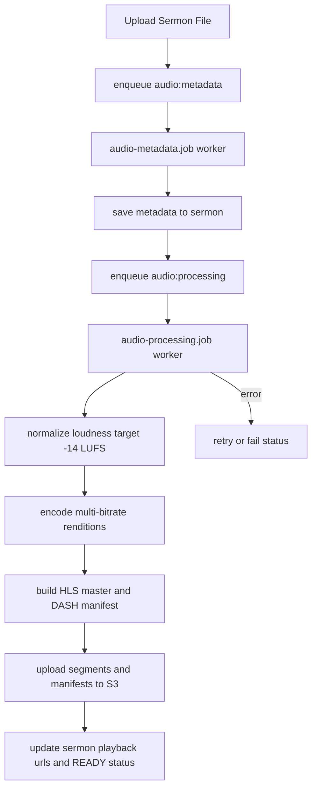

# Audio Processing Job Plan (API)

> **End-to-end upload → processing spec:** [`feature/feat-0006/PRODUCT.md`](./feature/feat-0006/PRODUCT.md) + [`TECH.md`](./feature/feat-0006/TECH.md). This document is implementation design notes and phase-2 roadmap.

This spec defines the background audio processing workflow for sermons in `apps/api/src/tasks`.

## Goal

Build a reliable queue-based audio processing pipeline that:

1. Accepts uploaded sermon audio
2. Extracts metadata
3. Normalizes loudness
4. Generates adaptive streaming outputs
5. Uploads manifests/segments to S3
6. Updates sermon playback sources in MongoDB

Primary output target:

- `audio/ogg` with **Opus** codec in `.ogg` container (preferred archival/streaming track)

Adaptive playback output targets:

- **HLS** (`.m3u8`) with multi-bitrate audio renditions
- **DASH** (`.mpd`) with multi-bitrate audio renditions

## Scope in codebase

- Queue names/jobs: `apps/api/src/queues/channel.queue.ts`
- Queue DTOs: `apps/api/src/queues/queue.dto.ts`
- Queue engine: `apps/api/src/queues/queue.ts`
- Existing metadata worker: `apps/api/src/tasks/jobs/audio-metadata.job.ts`
- New processing worker: `apps/api/src/tasks/jobs/audio-processing.job.ts`
- Existing cleanup worker: `apps/api/src/tasks/jobs/cleanup.job.ts`
- Sermon state updates: `apps/api/src/modules/core/sermon`

## Pipeline architecture



## Data contracts

### 1) Queue job payload (`AudioProcessingJobDTO`)

```ts
type OutputFormat = 'hls' | 'dash' | 'both';

interface RenditionPresetDTO {
    bitrateKbps: number; // e.g. 32, 64, 96, 128
    sampleRate?: number; // default 48000
    channels?: number; // default 2
}

interface AudioProcessingJobDTO {
    sermonId: string;
    uploadId: string;
    sourceS3Key: string;
    sourceMimeType: string;
    outputBasePrefix: string; // e.g. sermons/{sermonId}/adaptive
    segmentDurationSec: number; // default 5 or 6
    formats: OutputFormat; // usually 'both'
    renditions: RenditionPresetDTO[];
    normalizeTargetLufs?: number; // default -14
    normalizeTruePeakDb?: number; // default -1
    requestedBy?: string;
}
```

### 2) Sermon storage fields (minimum)

Store URLs/keys, not manifest file text:

- `audio.manifestUrl: string` (HLS master playlist URL)
- `audio.dashManifestUrl: string`
- `audio.variants: Array<{ bitrateKbps: number; hlsUrl?: string; dashRepId?: string }>`
- `audio.processing.status: 'queued' | 'processing' | 'ready' | 'failed'`
- `audio.processing.error?: string`

## Processing algorithm

1. **Fetch source**
    - Download or stream source audio from `sourceS3Key`.
    - Verify readability and supported input codec/container.

2. **Metadata extraction**
    - Keep existing `music-metadata` step in `audio-metadata.job.ts`.
    - Save codec/container/duration/bitrate/year.

3. **Loudness normalization**
    - Target ~`-14 LUFS` integrated, `<= -1 dBTP`.
    - Use FFmpeg loudnorm filter (2-pass recommended for accuracy).

4. **Generate adaptive renditions**
    - Rendition ladder initial: `32k`, `64k`, `96k`, `128k`.
    - Encode audio tracks for each rendition.

5. **Build manifests**
    - HLS:
        - per-rendition playlist (`{bitrate}.m3u8`)
        - master playlist (`master.m3u8`) referencing all renditions
    - DASH:
        - single `manifest.mpd` with adaptation set for audio streams

6. **Upload outputs**
    - Upload all segments/playlists to `s3://.../{outputBasePrefix}`.
    - Return deterministic object keys.

7. **Update sermon document**
    - Persist hls/dash URLs and processing status = `ready`.
    - Leave draft/publish business status unchanged unless product requires.

8. **Failure/retry**
    - Log ffmpeg stderr and pipeline stage.
    - Mark processing status `failed`.
    - Bull retry with backoff (max 3 attempts).

## FFmpeg command strategy

Use a builder utility to convert DTO options -> CLI args.

### HLS single rendition template

```bash
-y -i <input>
-map 0:a:0
-c:a aac
-b:a <bitrate>k
-ar <sampleRate>
-ac <channels>
-f hls
-hls_time <segmentDurationSec>
-hls_playlist_type vod
-hls_segment_filename <renditionDir>/seg_%03d.ts
<renditionDir>/index.m3u8
```

### HLS multi-rendition template

```bash
-i <input>
-map 0:a:0 -c:a:0 aac -b:a:0 64k
-map 0:a:0 -c:a:1 aac -b:a:1 128k
-map 0:a:0 -c:a:2 aac -b:a:2 192k
-f hls
-hls_time 5
-hls_playlist_type vod
-master_pl_name master.m3u8
<outputDir>/hls_%v.m3u8
```

### DASH template

```bash
-i <input>
-map 0:a
-c:a aac
-b:a 128k
-use_template 1
-use_timeline 1
-seg_duration 6
-adaptation_sets id=0,streams=a
-f dash
<outputDir>/manifest.mpd
```

## Queue and worker plan

### Queue channels

- Queue: `QueueChannel.AUDIOPROCESSING` (`audio-processing`)
- Job: `JobChannel.processAudio` (`audio:processing`)

### Worker behavior

`audio-processing.job.ts` should:

1. Set sermon processing status `processing`
2. Run normalization + transcode + manifest generation
3. Upload output bundle to S3
4. Update sermon playback URLs and mark `ready`
5. On error:
    - capture error message
    - mark `failed`
    - throw for Bull retry

### Retry/backoff policy

- attempts: 3
- backoff: exponential
- removeOnComplete: true
- removeOnFail: false (keep diagnostics)

## Storage layout proposal (S3)

```txt
sermons/{sermonId}/adaptive/
  hls/
    master.m3u8
    32k/index.m3u8
    32k/seg_000.ts
    64k/index.m3u8
    ...
  dash/
    manifest.mpd
    chunk-stream0-00001.m4s
```

## Observability and ops

- Structured logs with labels:
    - `audio-processing-start`
    - `audio-processing-progress`
    - `audio-processing-upload-complete`
    - `audio-processing-failed`
- Store elapsed time per stage:
    - metadata, normalize, encode, upload, db-update
- Add cleanup job for temporary local files

## Security and correctness

- Validate source key belongs to target sermon.
- Do not trust client-provided output prefixes without sanitization.
- Keep manifests/segments private by default; expose via signed CDN URLs when needed.
- Never store encryption keys in sermon documents.

## Rollout plan

### Phase 1 (MVP)

- Metadata extraction + HLS only + 3 renditions (`64k`, `96k`, `128k`)
- **Single-pass loudnorm** before HLS (`sermonAudioLoudnormFilter`; required)

### Phase 2

- Upgrade to 2-pass loudnorm (optional accuracy improvement)
- Add DASH output
- Add finer rendition ladder (`32k`, `64k`, `96k`, `128k`)

### Phase 3

- Add processing metrics dashboard
- Add reprocess endpoint for existing sermons
- Add optional DRM packaging hooks

## Acceptance criteria

1. Uploading sermon enqueues metadata and processing jobs.
2. Processing job produces valid playable HLS master playlist.
3. (If enabled) DASH manifest is generated and playable.
4. Sermon record contains stable playback URLs and processing status.
5. Failures are retried and visibly tracked in DB/logs.
6. Output loudness is near target (`~ -14 LUFS`) after normalization phase.

## References

- [FFmpeg docs](https://www.ffmpeg.org/ffmpeg.html)
- [FFmpeg consulting](https://www.ffmpeg.org/consulting.html)
- [HandBrake](https://handbrake.fr/)
- [MDN audio codecs guide](https://developer.mozilla.org/en-US/docs/Web/Media/Guides/Formats/Audio_codecs)
- [MDN containers guide](https://developer.mozilla.org/en-US/docs/Web/Media/Guides/Formats/Containers)
- [MDN audio concepts](https://developer.mozilla.org/en-US/docs/Web/Media/Guides/Formats/Audio_concepts)
- [MDN WebRTC API](https://developer.mozilla.org/en-US/docs/Web/API/WebRTC_API)
- [MDN WebRTC codecs](https://developer.mozilla.org/en-US/docs/Web/Media/Guides/Formats/WebRTC_codecs)
- [Xiph Ogg](https://xiph.org/ogg/)
- [Ogg Theora manual archive](https://archive.flossmanuals.net/ogg-theora/)
- [Google Lyra](https://github.com/google/lyra)
