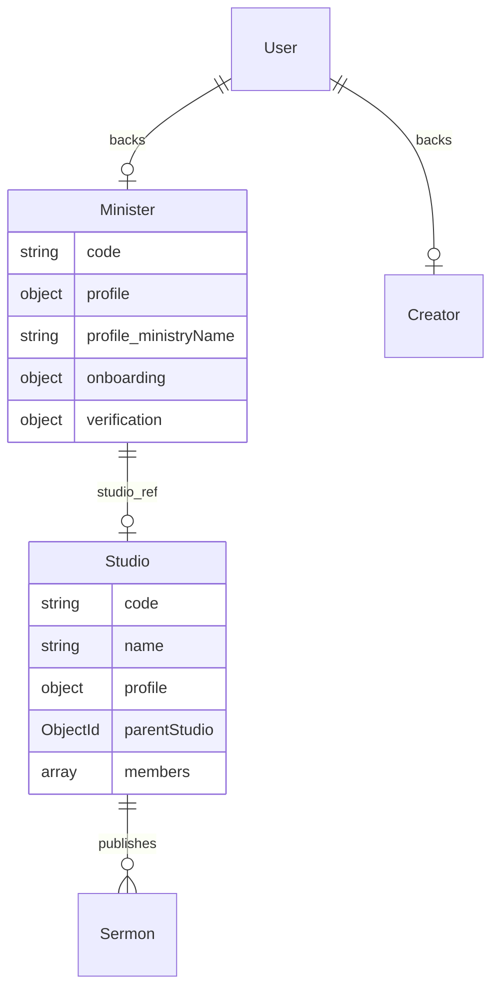
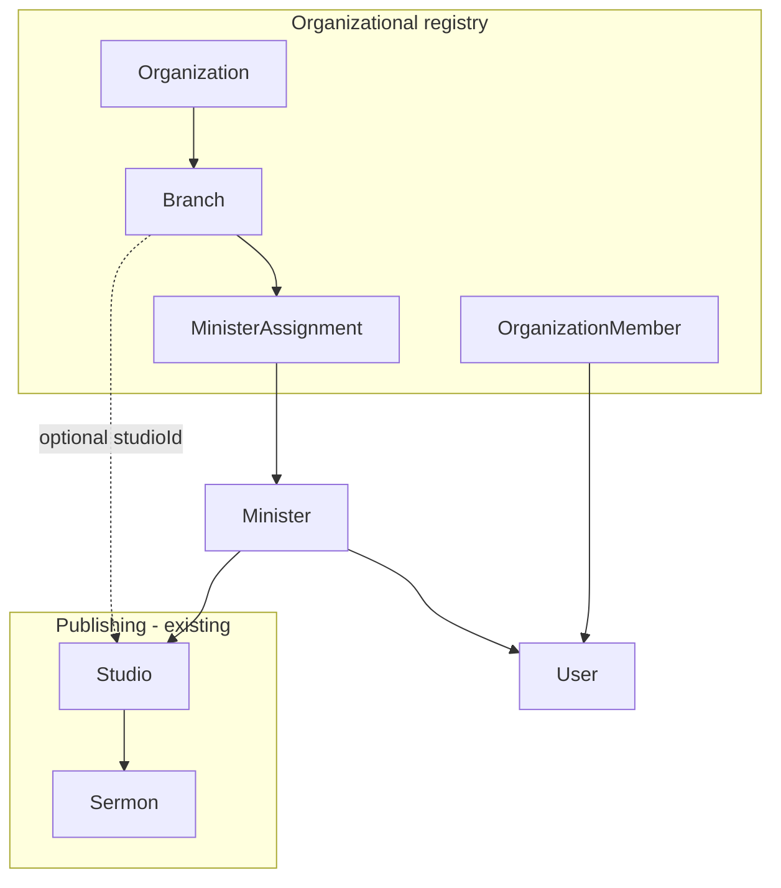

# feat-0001: Tech Spec — Organization hierarchy (`apps/api`)

## Context

See [`PRODUCT.md`](./PRODUCT.md) for domain rules and phasing.

**Exact interfaces and Mongoose schemas:** [`MODELS.md`](./MODELS.md) (authoritative field list).

This document maps **target models** to **existing code** and lists concrete API/module work.

---

## Current codebase map



**There is no `Organization`, `Branch`, or `MinisterAssignment` collection today.**

| Path | Role today |
|------|------------|
| [`interfaces/core/minister.interface.ts`](../../../../apps/api/src/interfaces/core/minister.interface.ts) | Person + embedded org marketing fields in `profile` |
| [`models/core/minister.model.ts`](../../../../apps/api/src/models/core/minister.model.ts) | Mongoose schema for above |
| [`services/core/minister.service.ts`](../../../../apps/api/src/services/core/minister.service.ts) | Register minister, onboarding milestones, `updateMinister` |
| [`interfaces/core/studio.interface.ts`](../../../../apps/api/src/interfaces/core/studio.interface.ts) | Channel + `parentStudio` + `StudioType` |
| [`models/core/studio.model.ts`](../../../../apps/api/src/models/core/studio.model.ts) | Studio persistence |
| [`services/core/studio.service.ts`](../../../../apps/api/src/services/core/studio.service.ts) | createStudio, invites, linkStudioToProfiles |
| [`controllers/core/studio.controller.ts`](../../../../apps/api/src/controllers/core/studio.controller.ts) | REST surface for studios |
| [`types/common.enum.ts`](../../../../apps/api/src/types/common.enum.ts) `DbModels` | `MINISTER`, `STUDIO` — no `ORGANIZATION` / `BRANCH` |

`DbModels` extensions and collection names: see [`MODELS.md` § DbModels](./MODELS.md#dbmodels-and-collection-names).

---

## Target architecture

```txt
Organization (1) ──< Branch (N)
       │                    │
       │                    └── optional parentBranch (self-ref)
       │
       ├──< OrganizationMember (N) >── User
       │
       └──< MinisterAssignment (N) >── Minister
                    └── optional branch
```



---

## Data models (implement from spec)

Full `I*Doc` interfaces, enums, and Mongoose `Schema` blocks:

| Model | Interface file | Model file |
|-------|----------------|------------|
| Organization | `organization.interface.ts` | `organization.model.ts` |
| Branch | `branch.interface.ts` | `branch.model.ts` |
| MinisterAssignment | `minister-assignment.interface.ts` | `minister-assignment.model.ts` |
| OrganizationMember | `organization-member.interface.ts` | `organization-member.model.ts` |
| AffiliationRequest | `affiliation-request.interface.ts` | `affiliation-request.model.ts` |
| Minister (evolution) | `minister.interface.ts` | `minister.model.ts` — add `primaryAssignment` ref |

See **[`MODELS.md`](./MODELS.md)** for every field, index, and phase 1 vs phase 2 minister `profile` shape.

---

## Studio alignment

| Studio field | Branch/Org field | Action |
|--------------|------------------|--------|
| `name` | `branch.name` | Prefer branch as source of truth for location name |
| `profile.ministryName` | `organization.name` or `branch.name` | Migrate |
| `parentStudio` | `parentBranch` | Parallel concepts — document mapping in migration |
| `StudioType.CHURCH_BRANCH` | `BranchType.*` | Map enums in mapper layer |
| `members[]` (User + StudioRole) | `OrganizationMember` + studio roles | Split concerns: org admin vs upload permissions |

**Rule:** Sermon APIs continue to key off `studioId` / minister’s linked studio. Branch does not replace studio for upload pipelines.

---

## Module layout (new)

Mirror existing core pattern:

```txt
apps/api/src/
  interfaces/core/
    organization.interface.ts
    branch.interface.ts
    minister-assignment.interface.ts
    organization-member.interface.ts
  models/core/
    organization.model.ts
    branch.model.ts
    minister-assignment.model.ts
    organization-member.model.ts
  repository/core/
    organization.repository.ts
    branch.repository.ts
    minister-assignment.repository.ts
  services/core/
    organization.service.ts
    branch.service.ts
    minister-assignment.service.ts
    affiliation.service.ts          # request / approve
  controllers/core/
    organization.controller.ts
    branch.controller.ts
    minister-assignment.controller.ts
  dtos/core/
    organization.dto.ts
    branch.dto.ts
    minister-assignment.dto.ts
  mappers/
    organization.mapper.ts
    branch.mapper.ts
    minister-assignment.mapper.ts
  routes/
    organization.router.ts
    branch.router.ts
```

Register routers in the main API app bootstrap (same pattern as `minister.router`, `studio.router`).

---

## Suggested REST surface (v1)

Base prefix example: `/api/v1` (match existing convention).

### Organization

| Method | Path | Auth | Notes |
|--------|------|------|-------|
| POST | `/organizations` | User | Create user-owned org |
| POST | `/admin/organizations` | Admin | Canonical seed |
| GET | `/organizations/:id` | Public | Published org profile |
| GET | `/organizations/search?q=` | Public | Dedup + discovery |
| PATCH | `/organizations/:id` | Org admin | Update branding |
| POST | `/organizations/:id/members` | Org owner | Invite org admin |

### Branch

| Method | Path | Auth | Notes |
|--------|------|------|-------|
| POST | `/organizations/:orgId/branches` | Org admin | Create branch |
| GET | `/organizations/:orgId/branches` | Public | List campuses |
| GET | `/branches/:id` | Public | Branch profile |
| PATCH | `/branches/:id` | Branch/org admin | Update |
| POST | `/branches/:id/link-studio` | Org admin | Set `branch.studio` |

### Minister assignment

| Method | Path | Auth | Notes |
|--------|------|------|-------|
| GET | `/ministers/me/assignments` | Minister | List affiliations |
| POST | `/organizations/:orgId/affiliation-requests` | Minister | Request join |
| POST | `/organizations/:orgId/affiliation-requests/:id/approve` | Org admin | Approve → create assignment |
| PATCH | `/assignments/:id` | Org admin | End date, deactivate |

Existing minister routes unchanged in phase 1.

---

## Migration strategy

### Phase 0 — Spec + enums (no breaking change)

- Add interfaces/models behind feature flag or empty collections.
- Document mapping table in this file.

### Phase 1 — Dual write

- On `minister.updateMinister` when `profile.ministryName` set (Get Started, profile edit):
  - If no assignment: create **user-owned** `Organization` + `Branch` + `MinisterAssignment` (role `lead_pastor` or `founder`).
  - Copy fields into org/branch; keep writing embedded `profile.*`.

### Phase 2 — Read from org/branch

- Public minister profile API merges assignment + branch + org for display.
- Search indexes organization/branch collections.

### Phase 3 — Deprecate embedded fields

- Stop writing `profile.ministryName` etc.; respond from assignment graph only.
- One-time script: backfill assignments from existing minister + studio rows.

### Backfill heuristic (script sketch)

```text
For each Minister with profile.ministryName:
  find or create Organization by normalized name + denomination
  find or create Branch under org (use ministryHQLocation)
  create MinisterAssignment(active, role inferred from onboarding)
  if minister.studio:
    set branch.studio = minister.studio
```

---

## Integration points (existing services)

| Caller | Today | After phase 1 |
|--------|-------|----------------|
| `minister.service` register | Creates minister + empty profile ministry fields | Optional default assignment |
| `minister.service` `onboardingMinistryComplete` | Sets `profile.ministryName` | Dual-write org/branch |
| `studio.service` `createStudio` | Studio with ministry profile blob | Link `branch.studio` when branch exists |
| `auth` register minister | User + minister | Unchanged |
| Web `get-started-checkpoint` | `updateMinister` | Call new affiliation API or dual-write in minister service |
| Search/catalog | Minister slug | Add org/branch slug indexes |

---

## Indexes

Defined inline in [`MODELS.md`](./MODELS.md) per schema (text search, compound unique on `organization + slug`, partial unique on active assignments).

---

## Testing

| Area | Cases |
|------|--------|
| Organization CRUD | slug uniqueness, verified canonical |
| Branch | parentBranch, org scoping |
| Assignment | multiple active=false history, one active per branch optional rule |
| Affiliation | request → approve → minister sees assignment |
| Regression | minister register, studio create, sermon upload unchanged |
| Migration | minister with only embedded fields → backfill assignment |

---

## Security

- Only `OrganizationMember` with ADMIN+ can approve affiliations or create branches.
- Ministers cannot PATCH organization they do not administer.
- Canonical org create restricted to platform admin routes.
- Public GET only for `published: true` orgs/branches.

---

## Related

- [PRODUCT.md](./PRODUCT.md)
- [MODELS.md](./MODELS.md)
- [`specs/api/minister-flow.md`](../minister-flow.md)
