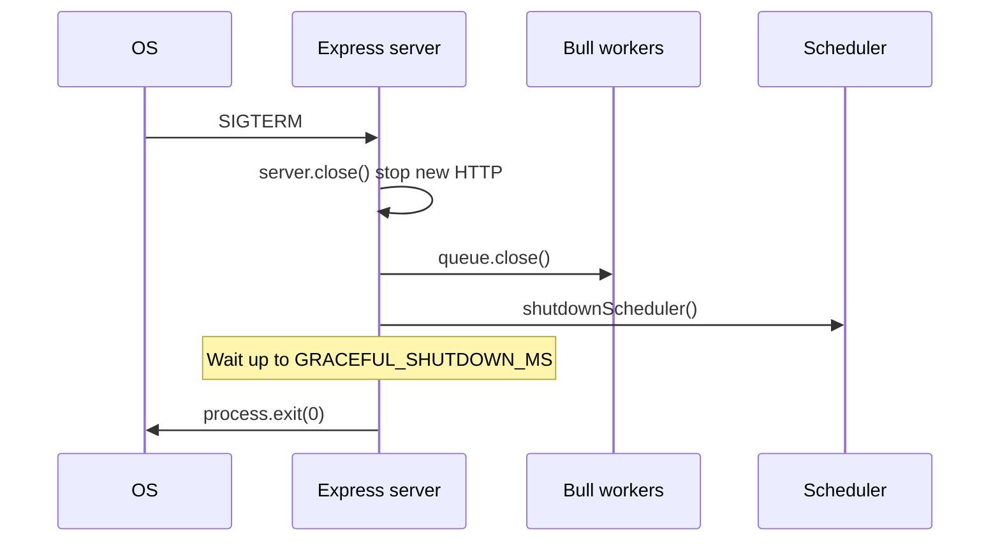

# feat-0005: Tech Spec — Production media pipeline and three-bucket storage

## Context

See [`PRODUCT.md`](./PRODUCT.md). Primary implementation in **`apps/api`**.

---

## Environment variables

| Variable | Default (prod intent) | Purpose |
| -------- | --------------------- | ------- |
| `AWS_BUCKET_NAME` | — | **Legacy** fallback when split buckets unset |
| `AWS_ORIGINALS_BUCKET` | `troott-originals` | Sermon source audio |
| `AWS_PLAYBACK_BUCKET` | `troott-playback` | HLS output |
| `AWS_STORAGE_BUCKET` | `troott-storage` | Images, documents, avatars |
| `SERMON_AUDIO_MAX_BYTES` | `536870912` (512 MiB) | Max sermon upload size |
| `MEDIA_CDN_BASE_URL` | — | CloudFront base; origin **`troott-playback`** |
| `AUDIO_LOUDNORM_FILTER` | `loudnorm=I=-16:TP=-1.5:LRA=11` | Required pre-HLS loudnorm (all sermon audio) |
| `AUDIO_HLS_WORKER_CONCURRENCY` | `1` in production, `2` otherwise | Bull HLS parallel jobs per process |
| `HLS_WORK_DIR` | `os.tmpdir()` | Temp dir for ffmpeg scratch (mount large gp3 path in prod) |
| `GRACEFUL_SHUTDOWN_MS` | `120000` | HTTP close timeout before force exit |

---

## S3 bucket routing

New module: [`apps/api/src/configs/s3-buckets.config.ts`](../../../../apps/api/src/configs/s3-buckets.config.ts)

```ts
type S3BucketRole = 'originals' | 'playback' | 'storage';

function bucketNameFor(role: S3BucketRole): string;
function inferBucketRoleFromKey(key: string): S3BucketRole;
```

| Role | Bucket env | Key patterns |
| ---- | ---------- | ------------ |
| `originals` | `AWS_ORIGINALS_BUCKET` | `audio/{uploadId}` |
| `playback` | `AWS_PLAYBACK_BUCKET` | `{uploadId}/hls/**` |
| `storage` | `AWS_STORAGE_BUCKET` | `images/*`, `documents/*`, … |

When split env vars are **unset**, all roles fall back to `AWS_BUCKET_NAME` (dev/test).

---

## File changes

### Config

| File | Change |
| ---- | ------ |
| [`aws.config.ts`](../../../../apps/api/src/configs/aws.config.ts) | Export optional `originalsBucket`, `playbackBucket`, `storageBucket` |
| [`media.config.ts`](../../../../apps/api/src/configs/media.config.ts) | Default 512 MiB; playback bucket for `publicHttpsUrlForS3Key`; `hlsWorkDir`, `hlsWorkerConcurrency` |
| [`s3-buckets.config.ts`](../../../../apps/api/src/configs/s3-buckets.config.ts) | **New** — role → bucket name |

### Storage layer

| File | Change |
| ---- | ------ |
| [`storage.service.ts`](../../../../apps/api/src/services/storage.service.ts) | `putStreamAtKey({ role, key, … })`; bucket-aware `getObjectStream`, `deleteObjectsByPrefix`, `deleteFile`; `uploadFile` → **storage** bucket |

### Sermon pipeline

| File | Change |
| ---- | ------ |
| [`sermon.service.ts`](../../../../apps/api/src/services/core/sermon.service.ts) | Multipart upload to **originals** bucket |
| [`audio-processing.job.ts`](../../../../apps/api/src/tasks/jobs/audio-processing.job.ts) | Read **originals**; write HLS via `putStreamAtKey` to **playback**; keys `{uploadId}/hls/…`; optional `HLS_WORK_DIR`; stage timing logs |
| [`audio-processing.worker.ts`](../../../../apps/api/src/tasks/workers/audio-processing.worker.ts) | Concurrency from `mediaConfig.hlsWorkerConcurrency` |

### Server lifecycle

| File | Change |
| ---- | ------ |
| [`server.ts`](../../../../apps/api/src/server.ts) | Shared shutdown: SIGTERM + SIGINT → `server.close()`, Bull close, scheduler, exit |

### Deploy artifact

| File | Change |
| ---- | ------ |
| [`apps/api/Dockerfile`](../../../../apps/api/Dockerfile) | **New** — Node 22 + ffmpeg; build from monorepo root |
| [`example.env`](../../../../apps/api/example.env) | Document new vars |

---

## HLS key layout (playback bucket)

```txt
{uploadId}/hls/master.m3u8
{uploadId}/hls/low/seg_000.ts
{uploadId}/hls/low/playlist.m3u8
{uploadId}/hls/medium/…
{uploadId}/hls/high/…
```

**Do not** use `storageService.uploadFile` for HLS segments — it prepends `audio/` via `getS3Folder`.

Manifest URL:

```ts
const masterKey = `${uploadId}/hls/master.m3u8`;
const manifestUrl = urlForMediaKey(masterKey); // CDN → troott-playback
```

Failure cleanup: `deleteObjectsByPrefix(`${uploadId}/hls/`, 'playback')`.

---

## Worker concurrency

| Host | Recommended `AUDIO_HLS_WORKER_CONCURRENCY` |
| ---- | ------------------------------------------ |
| `c6a.2xlarge` (8 vCPU), early prod | `1` |
| `c6a.2xlarge`, proven headroom | `2` |
| `c6a.xlarge` (4 vCPU) | `1` |

Metadata worker stays at concurrency **10** (lightweight vs HLS).

---

## Graceful shutdown sequence



In-flight HLS jobs: if killed mid-run, Bull retries idempotently (`hls-package-{uploadId}` job id per existing job plan).

---

## Docker build

From repository root:

```bash
docker build -f apps/api/Dockerfile -t troott-api .
docker run --rm troott-api ffmpeg -version
```

Coolify: set build context to repo root, Dockerfile path `apps/api/Dockerfile`, mount or set `HLS_WORK_DIR=/tmp/hls` on a large volume.

---

## Tests

| Test | Path |
| ---- | ---- |
| Bucket role resolution + key inference | [`test/unit/configs/s3-buckets.config.test.ts`](../../../../apps/api/test/unit/configs/s3-buckets.config.test.ts) |
| Existing sermon upload model | [`test/unit/core/sermon-upload-model.test.ts`](../../../../apps/api/test/unit/core/sermon-upload-model.test.ts) — no regression |

---

## Implementation checklist

### P0 — Code (this feature)

- [x] `s3-buckets.config.ts` + tests
- [x] Storage bucket routing + `putStreamAtKey`
- [x] Sermon upload → originals; HLS → playback keys
- [x] Default 512 MiB upload cap
- [x] HLS worker concurrency env
- [x] SIGTERM graceful shutdown
- [x] Dockerfile with ffmpeg
- [x] `example.env` + README index

### P1 — Infra (ops)

- [ ] Create S3 buckets in AWS account
- [ ] IAM role: originals read/write `audio/*`; playback read/write `*`; storage read/write `images/*`, `documents/*`
- [ ] CloudFront → `troott-playback`
- [ ] Set env on EC2/Coolify

### P2 — Observability

- [ ] Alert on Bull `audio:processing` failures
- [ ] Log aggregate stage durations weekly until p95 SLA met

---

## Gap vs audio-processing-job-plan

| audio-processing-job-plan | feat-0005 / current code |
| ------------------------- | ------------------------ |
| DASH + Opus archival | **Deferred** — HLS-only MVP |
| 2-pass loudnorm | **Deferred** — single-pass loudnorm **required** before HLS (`sermonAudioLoudnormFilter`) |
| Renditions 32–128k | **64 / 128 / 192** (existing defaults) |
| `audio.processing.status` field | Uses `item.uploadStatus` today — unchanged |

---

## References

- [`PRODUCT.md`](./PRODUCT.md)
- [`audio-processing-job-plan.md`](../../audio-processing-job-plan.md)
- [`media-compute-deployment-plan.md`](../../media-compute-deployment-plan.md)
