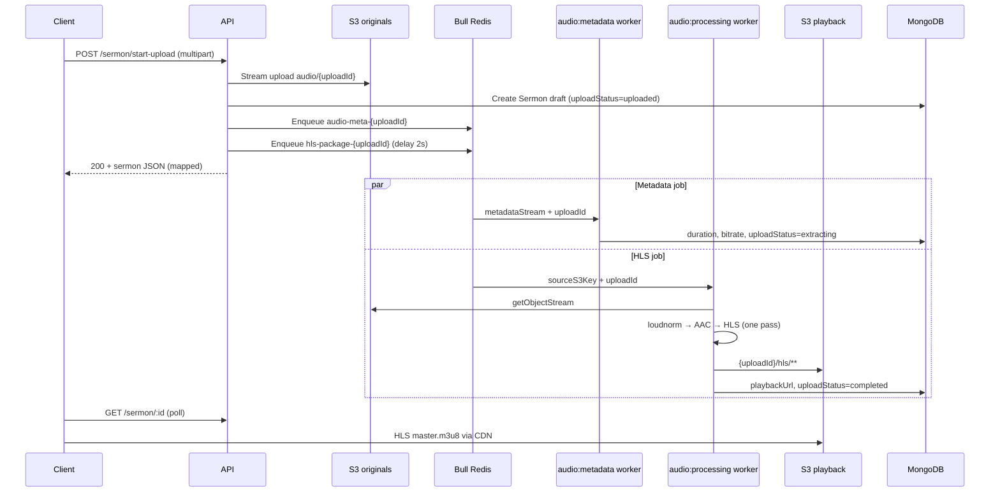

# feat-0006: Sermon audio upload through processing (API)

## Summary

**Canonical end-to-end API specification** for minister/creator sermon audio: multipart upload, S3 ingest, Bull workers (metadata + HLS), mandatory loudness normalization, derivative storage on the playback bucket, and client playback URL resolution.

| Stage | What happens | Where |
| ----- | ------------ | ----- |
| **Upload** | Studio user streams audio via `POST /api/v1/sermon/start-upload` | API → **`troott-originals`** |
| **Persist** | Draft `Sermon` created; `item.uploadStatus = uploaded` | MongoDB |
| **Metadata** | Duration, bitrate, codec from tee'd stream | Bull `audio:metadata` |
| **Processing** | Loudnorm → HLS renditions → master playlist | Bull `audio:processing` → **`troott-playback`** |
| **Playback** | Clients use `playbackUrl` / `manifestUrl`, or raw ingest until HLS ready | CDN → playback bucket |

There is **no separate normalization queue**. Loudnorm runs inside the HLS job before packaging.

Implementation details: [`TECH.md`](./TECH.md). Bucket routing, Docker, and EC2 rollout: [`feat-0005`](../feat-0005/PRODUCT.md). Web upload UX: [`specs/web/feature/feat-0018`](../../../web/feature/feat-0018/PRODUCT.md).

---

## Problem

Upload → transcode → playback behavior was split across `audio-processing-job-plan.md`, `media-compute-deployment-plan.md`, `apps/api/docs/audio-pipeline-flow.md`, and implementation notes in feat-0005. Engineers and client authors had **no single PRODUCT + TECH pair** for the full pipeline contract.

---

## Goals

1. One **product** spec for actors, status semantics, client polling, and playback fallback.
2. One **tech** spec for endpoint contract, S3 keys, job payloads, workers, env vars, and source files.
3. Explicit **mandatory loudnorm** before HLS (no feature flag).
4. Clear separation from **publish** / studio CRUD ([`specs/web/feature/feat-0006`](../../../web/feature/feat-0006/PRODUCT.md)).

---

## Non-goals

- Sermon metadata CRUD, publish, bin (web feat-0006)
- Thumbnail / document uploads (`POST /api/v1/storage/upload` → **`troott-storage`**)
- CloudFront, IAM, EC2 sizing ([`media-compute-deployment-plan.md`](../../media-compute-deployment-plan.md))
- DASH, 2-pass loudnorm, Opus archival (future)
- Dedicated processing webhook or SSE (clients poll today)

---

## Actors

| Actor | Responsibility |
| ----- | -------------- |
| **Minister / creator (web or API client)** | `POST /sermon/start-upload`; poll until `item.uploadStatus` is terminal |
| **API** | Stream to originals; create draft sermon; enqueue metadata + HLS jobs |
| **Metadata worker** | Probe duration/bitrate; set `uploadStatus → extracting` |
| **HLS worker** | Download original; loudnorm; package HLS; set `playbackUrl`; `uploadStatus → completed` or `failed` |
| **Listener clients** | Play HLS when ready; fall back to raw ingest URL until then |

---

## End-to-end flow

---

## User-visible behavior

| Actor | Behavior |
| ----- | -------- |
| **Studio user** | After upload, sermon appears as **draft** with processing indicator while `uploadStatus` is not `completed` |
| **Studio user (failure)** | `uploadStatus = failed` — must re-upload audio (no reprocess endpoint yet) |
| **Listener** | Hears normalized HLS when `playbackUrl` is set; may hear **unnormalized** raw ingest from `item.item` while HLS is pending |
| **Ops** | HLS failure removes partial `{uploadId}/hls/` prefix on playback bucket only; originals retained |

---

## Processing status (`item.uploadStatus`)

Enum: `idle` → `uploading` → `uploaded` → `extracting` / `processing` → `completed` | `failed`

**Runtime notes:**

- Metadata and HLS jobs **run in parallel** after upload. Clients may skip intermediate states.
- Treat **`completed`** as “HLS ready”; **`failed`** as “re-upload or ops intervention”.
- Metadata failure does **not** set `failed`; HLS may still succeed (duration may stay `0`).
- **`status` / `isPublished`** are separate from upload processing — a sermon can be `uploadStatus = completed` and still **`draft`** until publish.

Full state diagram and field mapping: [`TECH.md`](./TECH.md) § Sermon document.

---

## Client integration

### After upload

1. Store returned sermon `id` and `item.itemId` (`uploadRef`).
2. Poll **`GET /api/v1/sermon/:id`** (authenticated owner) or refresh minister list until `item.uploadStatus === 'completed'` or `'failed'`.
3. Show processing UI while status is `uploaded`, `extracting`, or `processing`.

### Playback URL resolution

Resolve audio in this order:

1. `playbackUrl`
2. `manifestUrl`
3. `item.item` (raw ingest — usable before HLS is ready, not loudness-normalized)

---

## Processing SLA (internal targets)

For **1–2 hour** sermons on **8 vCPU** with loudnorm (not client guarantees):

| Stage | Target |
| ----- | ------ |
| Metadata | < 2 min after upload |
| HLS ready (p50) | ≤ 45 min |
| HLS ready (p95) | ≤ 90 min until tuned |

Loudnorm adds roughly **1× ingest duration** and **15–25 GiB** temp disk per long job.

---

## Acceptance criteria

1. Authenticated studio user (minister **or** creator profile) can `POST /sermon/start-upload` with allowed MIME and receive **200** + draft sermon with `item.uploadStatus = uploaded`.
2. Source object exists at **`audio/{uploadId}`** on originals bucket.
3. Both Bull jobs enqueue with stable ids `audio-meta-{uploadId}` and `hls-package-{uploadId}`.
4. After successful processing, `item.uploadStatus = completed` and `playbackUrl` resolves to **`{uploadId}/hls/master.m3u8`** on CDN/playback bucket.
5. Loudnorm runs for **every** upload before HLS (no env flag to disable).
6. On HLS failure, partial `{uploadId}/hls/` objects are removed from playback bucket and `uploadStatus = failed`.
7. Clients can play via `item.item` before HLS completes and via `playbackUrl` after.

---

## References

- [`TECH.md`](./TECH.md) — endpoint, jobs, config, source files
- [`feat-0005`](../feat-0005/PRODUCT.md) — three-bucket rollout, Docker, graceful shutdown
- [`audio-processing-job-plan.md`](../../audio-processing-job-plan.md) — Bull/ffmpeg design notes and phase 2 roadmap
- [`media-compute-deployment-plan.md`](../../media-compute-deployment-plan.md) — EC2 sizing, disk, CloudFront
- [`apps/api/docs/audio-pipeline-flow.md`](../../../../apps/api/docs/audio-pipeline-flow.md) — short code index
- [`feat-0007`](../feat-0007/PRODUCT.md) — stream-native HLS worker; loudnorm → AAC; optimization roadmap (P1–P3)
