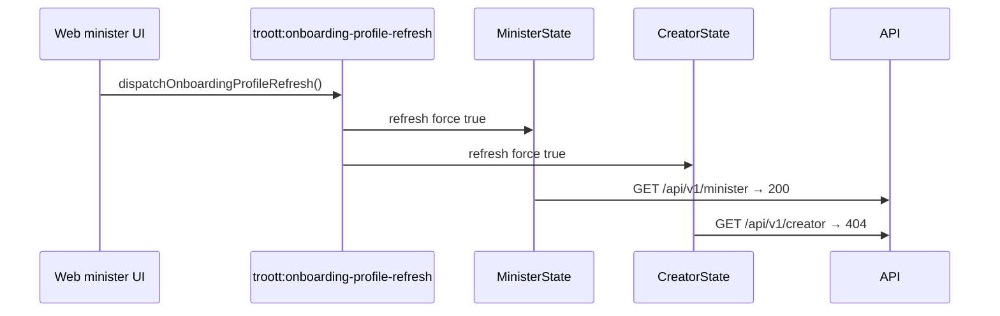

# feat-0009: Tech Spec — “Creator profile not found” (404)

## Context

See [PRODUCT.md](./PRODUCT.md).

**Endpoint:** `GET /api/v1/creator`  
**Route:** `creator.router.ts` → `getCreatorProfile`  
**Controller:** `apps/api/src/controllers/core/creator.controller.ts:392–434`  
**Service:** `creatorService.getCreatorProfile(userId)` → `creatorRepository.findOne({ user: userId })`

When no Mongo **`creators`** document exists for the JWT user id, the service returns 404 and the controller passes:

```ts
return next(
    new ErrorResponse(
        result.message || 'Creator profile not found',
        result.code || 404,
        [],
    ),
);
```

In **development**, `error.mdw.ts` logs every `ErrorResponse` with label **`ERR`** (full stack). That is why Turbo/dev shows alarming repeats even when the client treats 404 as non-fatal.

---

## API: minister and creator are provisioned separately

Registration side effects (`apps/api/src/services/user.service.ts`):

| `userType` at register | Profile row created |
| ---------------------- | ------------------- |
| `MINISTER` | `ministerService.createMinister({ user, … })` → `ministers` collection |
| `CREATOR` | `creatorService.createCreator({ user, … })` → `creators` collection |
| `LISTENER` | listener profile (not studio) |

`getCreatorProfile` does **not** check `req.user.userType === CREATOR`. Any authenticated user may call `GET /creator`; the handler only checks whether a **`creators`** document exists for `userId`. Ministers without a creator row always get 404 — **by design of the lookup**, not because JWT is invalid.

Minister routes (`minister.controller.ts`) do **not** delegate to `creatorService` for profile reads. There is **no API bug** that “turns a minister into a creator”; the minister web client invokes creator HTTP routes directly.

---

## API code placement (no utils facades)

This feature touches **persona boundaries** (minister vs creator) and often sits next to **media URL** work. Troott API convention for feat-0009 and follow-on fixes:

### Allowed layers

| Layer | Path | Use for |
| ----- | ---- | ------- |
| **Services** | `apps/api/src/services/**` | Business logic, Mongo/repository calls, CloudFront/S3 URL assembly, persona-specific onboarding, response shaping that needs env or buckets |
| **Service singletons** | `storage.service.ts`, `sermon.service.ts`, `minister.service.ts`, `creator.service.ts` | Single entry points jobs and controllers call — **no parallel util copy** |
| **Helpers (existing only)** | `apps/api/src/utils/helpers.util.ts` | Stateless, cross-cutting helpers already in repo: `getS3Folder`, `genUserCode`, slug/date helpers — **not** persona or CDN facades |
| **Controllers** | `*controller.ts` | HTTP, auth, call **one** service method, map to JSON |
| **Repositories** | `*repository.ts` | DB only |

### Disallowed for this work

| Anti-pattern | Why | Current debt (migrate away) |
| ------------ | --- | --------------------------- |
| New `apps/api/src/utils/*.util.ts` for URLs or profiles | Hides ownership; duplicates service env reads | `storage-url.util.ts` |
| URL wrappers in `audio.util.ts` (`buildSermonImageUrl`, `buildSermonPlaybackUrl`) | FFmpeg constants belong in `audio.util`; CDN URLs belong in `storage.service` / `sermon.service` | `audio.util.ts` imports `storage-url.util` |
| Mappers importing URL utils | Mappers should map fields; services return public URLs or mapper reads service | `sermon.mapper`, `minister.mapper`, `creator.mapper`, … → `storage-url.util` |
| Thin “util” that only calls a service | Extra indirection with no behavior | Any `buildX` that re-exports `buildY` from another util |
| Job/business flow in `types.util.ts` | Duplicate orchestration outside jobs/services | `types.util.ts` (legacy HLS job copy — delete, do not extend) |
| Shared `studio-profile.util` branching minister/creator | Persona split belongs in **two services**, not one abstraction | N/A — do not introduce |

### Explicit over encapsulated (required style)

When building a public CDN URL in API code, **write it in the owning service method** (same pattern as `storageService.urlForPlaybackKey` after cleanup):

```ts
// storage.service.ts — explicit, no separate util file
public urlForPlaybackKey(s3Key: string): string {
    if (!(process.env.CLOUDFRONT_PLAYBACK_URL || '').trim()) {
        throw new Error('CLOUDFRONT_PLAYBACK_URL is required');
    }
    const playbackCdn = process.env.CLOUDFRONT_PLAYBACK_URL.replace(/\/$/, '');
    const parts = s3Key.split('/').filter(Boolean);
    const [uploadId, ...rest] = parts;
    // … return `${playbackCdn}/sermon/${encodeURIComponent(uploadId)}/…`
}
```

```ts
// sermon.service.ts — image upload sets imageUrl in the same handler that writes S3
const imageUrl = `${process.env.CLOUDFRONT_STORAGE_URL.replace(/\/$/, '')}/sermon/image/${encodeURIComponent(String(uploadId))}`;
```

Do **not** add intermediate `buildSermonImageUrl()` in `audio.util.ts` or `storage-url.util.ts` unless the team explicitly collapses **into** `storage.service` as a **named public method** (still one service, not a util module).

### Persona guard on API (optional hardening, in service/controller)

If adding server-side protection for wrong-role `GET /creator`:

- Check `req.user.userType` in **`creator.controller`** or at start of **`creatorService.getCreatorProfile`** — inline, no helper file.
- Return **403** for non-creator JWT, not 404 “profile not found” (clearer than util-wrapped lookup).

Minister equivalent: `GET /minister` should not be called by creator-only clients (web gate is primary; API guard optional and symmetric).

### Implementation order (agent skills)

Follow [incremental-implementation](../../../../.agents/skills/incremental-implementation/SKILL.md):

1. **Slice 1 (web):** Persona-gated `MinisterState` / `CreatorState` refresh — stops spurious `GET /creator` (fixes logs immediately).
2. **Slice 2 (API, optional):** Role guard on `GET /creator` / `GET /minister` in controller or service — explicit `if (userType !== …)` in that file.
3. **Slice 3 (API cleanup):** Move `storage-url.util.ts` callers to `storage.service` / `minister.service` / `creator.service`; delete util file; keep `audio.util.ts` for MIME lists + `AudioLoudnessSpec` + `AudioVariants` only.

Use [api-and-interface-design](../../../../.agents/skills/api-and-interface-design/SKILL.md) for boundaries (minister service never imports creator service for reads). Use [code-simplification](../../../../.agents/skills/code-simplification/SKILL.md) when removing util layers — delete dead paths, do not add replacements with new names.

---

## Web: why `userType=minister` still hits `GET /creator`

### Architecture (shared studio shell)

```text
TroottProviders (apps/web/src/context/providers.tsx)
  UserState
    MinisterState   ← listens ONBOARDING_PROFILE_REFRESH → GET /minister
      CreatorState  ← listens ONBOARDING_PROFILE_REFRESH → GET /creator  ⚠ ungated
        StudioState
          SessionState ← refreshSession gates minister vs creator correctly
```

Both persona contexts are **always mounted** for every logged-in portal user. `CreatorState` does not lazy-mount only for creators.

### RC-1 — Global onboarding refresh hits **both** contexts (primary)

`dispatchOnboardingProfileRefresh()` (`hub-onboarding.util.ts`) fires:

```ts
window.dispatchEvent(new CustomEvent(ONBOARDING_PROFILE_REFRESH_EVENT));
```

**Both** providers listen **without** reading `userType`:

| Listener | File | On event |
| -------- | ---- | -------- |
| Minister | `ministerState.tsx:71–81` | `api.minister.getMinister()` |
| Creator | `creatorState.tsx:71–81` | `api.creator.getCreator()` → **404 for ministers** |

**Dispatch sites (minister flows included):**

| Source | File | When |
| ------ | ---- | ---- |
| Publish first sermon | `useSermon.ts` | After `onboardingFirstSermonComplete` succeeds (minister **or** creator API chosen correctly for POST; refresh event still global) |
| Get-started Continue | `ProgressButtons.tsx` | After checkpoint success |
| Document verification | `DocumentVerificationModal.tsx` | After upload success |
| Tour complete | `TourProvider.tsx` | After tour milestone |
| Profile save | `useProfile.ts` `useUpdateProfileMutation` | Dispatches event **then** refreshes only matching ctx — event still wakes creator listener |

**Typical minister upload session:**

1. User uploads audio / completes get-started / publishes draft  
2. Code calls `dispatchOnboardingProfileRefresh()`  
3. Minister context refetches → `GET /minister` → **200**  
4. Creator context **also** refetches → `GET /creator` → **404 × N** in API logs  



### RC-2 — Session hydrate (correctly gated)

`sessionState.tsx` calls `creatorCtx.refresh({ force: true })` **only** when:

```ts
normalized === UserType.CREATOR || sessionUser.isCreator
```

Minister-only users should **not** hit this path unless `isCreator` is wrongly true on the user document.

### RC-3 — Get-started / document flows (correctly gated)

These use `isCreatorPersona()` (cookie `userType === creator`):

| Module | Minister path | Creator path |
| ------ | ------------- | ------------ |
| `get-started-checkpoint.ts` | `api.minister.*` | `api.creator.*` |
| `useDocumentVerification.ts` | `getMinister`, `minister.submitVerification`, … | `getCreator`, `creator.submitVerification`, … |
| `useSermon.ts` publish milestone | `minister.onboardingFirstSermonComplete` | `creator.onboardingFirstSermonComplete` |

Minister get-started **does not** intentionally call creator routes; spurious `GET /creator` during get-started still comes from **RC-1** after `dispatchOnboardingProfileRefresh()`.

### RC-4 — Profile page (correctly gated)

`useProfile.ts`:

- `fetchProfileDto()` → `GET /minister` unless `isCreatorStudioAccount()`  
- `useUpdateProfileMutation` POST/PUT uses minister or creator client by cookie  
- On success: fires global refresh event (RC-1) **and** calls only the matching `*Ctx.refresh()`

### RC-5 — `useCreator()` in studio UI (does not by itself call API)

Many components import `useCreator()` for `creatorId` (e.g. `MySermons.tsx`, `UploadProgressStep.tsx`, `resolveStudioSermonOwnerId`). That reads context state only; **`GET /creator` runs when `refresh()` is invoked** (event, session, or explicit call). Ministers with empty `creatorId` still work for upload when `minister.id` is set.

### RC-6 — Data inconsistency (rare)

If `userType=CREATOR` but `createCreator` failed at registration, or row was deleted, `GET /creator` 404 is expected until repaired.

### RC-7 — Dev error logging (amplification)

`error.mdw.ts` logs every `ErrorResponse` as `ERR` with stack. Client may swallow 404; logs still look like a crash.

---

## Gated vs ungated web paths (summary)

| Path | Checks `userType` before `GET /creator`? |
| ---- | ---------------------------------------- |
| `creatorState.tsx` onboarding event listener | **No** — always fetches |
| `ministerState.tsx` onboarding event listener | **No** — always fetches (harmless for creators without minister row) |
| `sessionState.tsx` `refreshSession` | **Yes** |
| `get-started-checkpoint.ts` | **Yes** (`isCreatorPersona`) |
| `useDocumentVerification.ts` | **Yes** |
| `useProfile.ts` fetch/update | **Yes** |
| `useSermon.ts` onboarding POST | **Yes** (refresh event **No**) |

---

## What is **not** broken when you see this error

| Still OK | Why |
| -------- | --- |
| Sermon S3 upload | `POST /sermon/start-upload` |
| Bull metadata / HLS jobs | Queued with `sermonId`; workers do not call `GET /creator` |
| Minister onboarding checkpoints | `POST /minister/onboarding/*` when web uses minister persona helpers |
| Minister profile | `GET /minister` succeeds when row exists |

---

## Recommended fixes

### Fix 1 — Web: persona-gated refresh in context listeners (required)

In `creatorState.tsx` `refresh()` (or event handler):

- Skip `GET /creator` when cookie/session `userType !== creator`.

In `ministerState.tsx` (symmetry):

- Skip `GET /minister` when `userType !== minister`.

**Alternative:** Pass `{ persona: 'minister' | 'creator' }` on the custom event, or stop using a global event and call the correct `*Ctx.refresh()` at dispatch sites only.

**Preferred:** Gate inside each context listener so all existing `dispatchOnboardingProfileRefresh()` call sites stay safe.

### Fix 2 — Web: provider mounting (optional, larger change)

Lazy-mount `CreatorState` only for creator sessions (or colocate persona state). Lower priority if Fix 1 is done.

### Fix 3 — API: optional role guard on `GET /creator` (optional)

Return **403** when JWT `userType` is not `creator` instead of 404 “profile not found”. Makes misuse obvious; still recommend Fix 1.

### Fix 4 — Logging (optional)

Downgrade expected wrong-persona 404 or stop logging full stack once client is fixed.

### Fix 5 — Data repair (when user should be creator)

```js
db.creators.findOne({ user: ObjectId("USER_ID") })
db.users.findOne({ _id: ObjectId("USER_ID") }, { userType: 1, isCreator: 1 })
```

If `userType: 'creator'` and no creator doc → `POST /api/v1/creator` or re-run registration provisioning.

---

## Verification

### Minister (repro before fix)

1. Log in as minister with completed minister profile.  
2. Upload sermon or complete a get-started step that calls `dispatchOnboardingProfileRefresh()`.  
3. **Before fix:** API logs multiple `Creator profile not found`; network tab shows `GET /creator`.  
4. **After fix:** No `GET /creator` in network tab; no creator 404 in logs.

### Creator

1. Log in as creator with creator row.  
2. `GET /api/v1/creator` → 200.  
3. Onboarding refresh still updates creator context.

### Network tab checklist

Filter `creator` — minister session should show **zero** `GET /creator` during upload/publish except when user is on creator-only routes with `userType=creator`.

---

## Code reference map

| Layer | File | Notes |
| ----- | ---- | ----- |
| API registration | `user.service.ts` | Minister vs creator provisioning |
| API controller | `creator.controller.ts:411–418` | 404 when no `creators` row |
| API service | `creator.service.ts:264–288` | `findOne({ user })` only |
| API route | `creator.router.ts` `GET /` | Protected, no role guard |
| Web providers | `providers.tsx` | Both contexts always mounted |
| Web client | `api/clients/creator.ts` `getCreator()` | `URL_CREATOR` |
| Web context | `creatorState.tsx:47,71–81` | Ungated refresh + event |
| Web context | `ministerState.tsx:47,71–81` | Ungated refresh + event |
| Web event | `hub-onboarding.util.ts` | Global dispatch |
| Web publish | `useSermon.ts:116–119` | Dispatches after first publish |
| Web session | `sessionState.tsx:118–132` | Gated refresh |
| Web get-started | `get-started-checkpoint.ts` | Gated POST/GET |
| API log | `error.mdw.ts:64–65` | `ERR` label |
| **Debt — do not extend** | `utils/storage-url.util.ts` | Move to `storage.service` / persona services; delete |
| **Debt — do not extend** | `utils/audio.util.ts` URL exports | Keep FFmpeg/MIME only |
| **Debt — delete** | `utils/types.util.ts` | Legacy duplicate job; not a layer |

---

## Related

- [PRODUCT.md](./PRODUCT.md)
- [feat-0005 web TECH](../../../web/feature/feat-0005/TECH.md) — creator onboarding gaps
- [feat-0015 web TECH](../../../web/feature/feat-0015/TECH.md) — `dispatchOnboardingProfileRefresh` after verification
- [api-and-interface-design](../../../../.agents/skills/api-and-interface-design/SKILL.md)
- [incremental-implementation](../../../../.agents/skills/incremental-implementation/SKILL.md)
- [code-simplification](../../../../.agents/skills/code-simplification/SKILL.md)
- [documentation-and-adrs](../../../../.agents/skills/documentation-and-adrs/SKILL.md) — this spec records the placement decision
