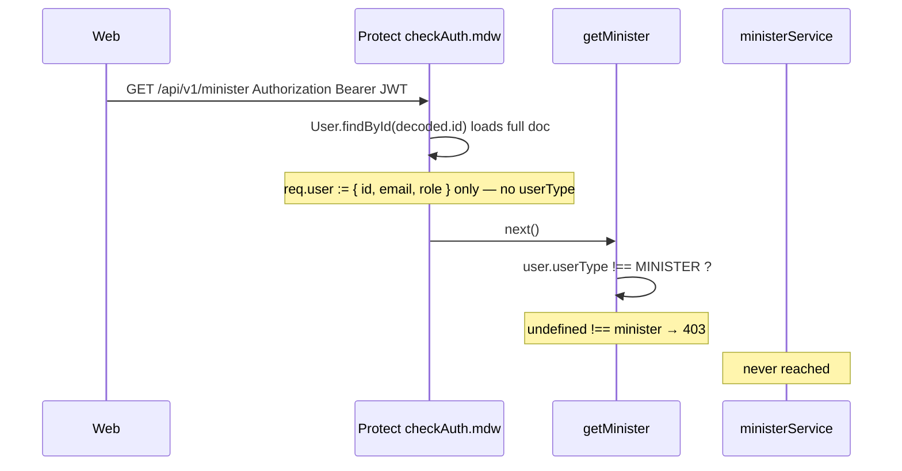

# feat-0010: Tech Spec — Minister `GET /minister` 403

## Context

See [PRODUCT.md](./PRODUCT.md).

**Error:**

```text
ErrorResponse: Minister profile is only available for minister accounts
  statusCode: 403
  at apps/api/src/controllers/core/minister.controller.ts:487
  via apps/api/src/middlewares/checkAuth.mdw.ts:72
```

---

## End-to-end flow (minister opens profile)



**Web callers (minister persona):**

| Surface | File | Gate before HTTP |
| ------- | ---- | ---------------- |
| Profile page | `apps/web/src/hooks/app/useProfile.ts` → `fetchProfileDto()` | Cookie `userType` → `api.minister.getMinister()` |
| Minister context | `apps/web/src/context/minister/ministerState.tsx` | `isMinisterPortalUser()` then `getMinister()` |
| Document verification | `apps/web/src/hooks/app/useDocumentVerification.ts` | Minister branch → `getMinister()` |

Web gates use **cookie / client `userType`**. API gate uses **`req.user.userType`**, which Protect never sets. That is the bug.

**Why upload still works:** `POST /sermon/start-upload` and processing jobs use the same `Protect` middleware but **do not** check `req.user.userType` in the controller. Only profile endpoints added a role guard on the incomplete stub.

---

## Implementation status (2026-06)

**RC-1 fixed.** `Protect` now sets `userType: user.userType` on `req.user` (`checkAuth.mdw.ts` lines 77–82). Real ministers should not 403 solely because `userType` was undefined.

If 403 persists for a minister account, verify Mongo `users.userType`, JWT freshness, and that the client is not sending a creator/listener session token. Remaining 403 on `GET /minister` for non-minister JWTs is **expected** (role guard).

For truncated Turbo stacks that only show `checkAuth.mdw.ts:83`, see [feat-0013](../feat-0013/PRODUCT.md).

---

## Root causes (ranked)

### RC-1 — `Protect` attached a partial user; `getMinister` reads `userType` (primary) — **fixed**

Historical bug. `Protect` previously omitted `userType`:

```ts
// before fix
req.user = { id: decoded.id, email: decoded.email, role: decoded.role };
```

Current code:

```ts
req.user = {
    id: String(decoded.id),
    email: decoded.email ?? user.email,
    role: decoded.role,
    userType: user.userType,
};
```

`apps/api/src/controllers/core/minister.controller.ts`:

```ts
const user = (req as any).user as IUserDoc | undefined;
if (user.userType !== UserType.MINISTER) {
    return next(new ErrorResponse(
        'Minister profile is only available for minister accounts', 403, []));
}
```

| Field on real `IUserDoc` | On `req.user` after Protect (current) |
| ------------------------ | ------------------------------------- |
| `userType: 'minister'` | `userType: 'minister'` from Mongo doc |
| `_id` / `id` | `id` from JWT |

**Historical result (before RC-1 fix):** Every authenticated minister got **403** on `GET /minister` because `userType` was missing on `req.user`.

**Contrast:** `setMinisterPassword` in the same controller loads the user via repository:

```ts
const userResult = await userRepository.findById(String(userId));
const user = userResult.data as IUserDoc;
if (user.userType !== UserType.MINISTER) { ... }
```

### RC-2 — Same pattern on `GET /creator`

`creator.controller.ts` → `getCreatorProfile`:

```ts
if (user.userType !== UserType.CREATOR) {
    return next(new ErrorResponse(
        'Creator profile is only available for creator accounts', 403, []));
}
```

Real **creator** accounts hit the same bug on profile load. Ministers were reported first because minister studio traffic dominates.

### RC-3 — Misleading error message

Message says “only available for **minister accounts**” but the check fails for **all** JWT users until `req.user.userType` is populated. Operators may search Mongo for wrong `userType` when the JWT stub is the issue.

### RC-4 — Not feat-0009 (creator 404)

| | feat-0009 | feat-0010 (this) |
| --- | --- | --- |
| Route | `GET /creator` | `GET /minister` |
| Status | 404 Creator profile not found | 403 Minister profile only for minister accounts |
| Typical cause | Minister client calls creator API | Minister client calls minister API correctly |
| Fix area | Web persona gate on refresh | API `req.user` / controller guard |

Both can appear in one session; fix independently.

---

## API code placement

**Do not** add `minister-auth.util.ts`, `persona-guard.util.ts`, or similar.

| Fix | Where | Notes |
| --- | ----- | ----- |
| **A (preferred)** | `checkAuth.mdw.ts` | After `User.findById`, set `req.user.userType = user.userType` (and any other fields controllers already assume). One fix for all routes. |
| **B** | `minister.controller.ts` / `creator.controller.ts` | At start of `getMinister` / `getCreatorProfile`, `userRepository.findById(userId)` then check `userType` — same pattern as `setMinisterPassword`. |
| **C** | `minister.service.getMinisterProfile` | Service loads user once; controller passes `userId` only. Role check next to repository lookup. |

Use existing **`userRepository.findById`** in services/controllers — not a new helper file.

`helpers.util.ts` is **not** the place for auth persona checks (see [feat-0009 TECH § API code placement](../feat-0009/TECH.md#api-code-placement-no-utils-facades)).

---

## Recommended fix (normative)

### Phase 1 — Unblock ministers (minimal)

In `checkAuth.mdw.ts`, after loading the user document:

```ts
req.user = {
    id: decoded.id,
    email: decoded.email,
    role: decoded.role,
    userType: user.userType,
};
```

Extend Express `Request.user` typing if needed so controllers do not cast to `IUserDoc` blindly.

### Phase 2 — Harden controllers (optional)

Keep `userType` guard on `GET /minister` / `GET /creator` **after** Phase 1 so wrong persona gets 403 instead of 404 from missing row.

Alternatively: drop controller `userType` guard and rely on “minister document exists for `userId`” in `ministerService.getMinisterProfile` (404 if no row). Document chosen behavior in router comments.

### Phase 3 — Logging

Downgrade or skip `ERR` stack for expected 403 wrong-persona when client bug (optional; pairs with feat-0009 web fixes).

---

## Verification

### Manual

1. Register minister → log in → complete one onboarding step.
2. Open web profile → Network: `GET /api/v1/minister` → **200**, body includes minister fields.
3. Terminal: no 403 at `minister.controller.ts:487`.
4. Upload sermon in same session → profile refresh still **200**.

### API

```bash
# Replace TOKEN with minister JWT
curl -s -o /dev/null -w "%{http_code}" \
  -H "Authorization: Bearer $TOKEN" \
  http://localhost:PORT/api/v1/minister
# Expect 200 after fix; 403 before fix
```

### Regression

- Creator JWT → `GET /creator` → 200 (after RC-2 fix).
- Listener JWT → `GET /minister` → 403 (if guard kept).

---

## Files (implementation backlog)

| File | Change |
| ---- | ------ |
| `apps/api/src/middlewares/checkAuth.mdw.ts` | Attach `userType` (Phase 1) |
| `apps/api/src/controllers/core/minister.controller.ts` | Guard only after stub fixed; or load user via repository |
| `apps/api/src/controllers/core/creator.controller.ts` | Same as minister |
| `apps/api/src/services/core/minister.service.ts` | No change required if controller/middleware fixed |
| `apps/web/src/hooks/app/useProfile.ts` | Consumer only — no change if API fixed |

---

## Decision log

| Decision | Choice | Rationale |
| -------- | ------ | --------- |
| Fix location | `Protect` adds `userType` | Single fix; matches DB already loaded in middleware |
| New utils | Forbidden | User / project convention |
| vs feat-0009 | Separate spec | 403 minister ≠ 404 creator |
| Guard keep? | Yes after stub fix | Wrong persona gets 403, not empty 404 |

---

## Related

- [PRODUCT.md](./PRODUCT.md)
- [feat-0009 TECH](../feat-0009/TECH.md)
- [feat-0004 TECH](../feat-0004/TECH.md) — token reissue
- [web-api-auth-handshake.md](../../web-api-auth-handshake.md)
