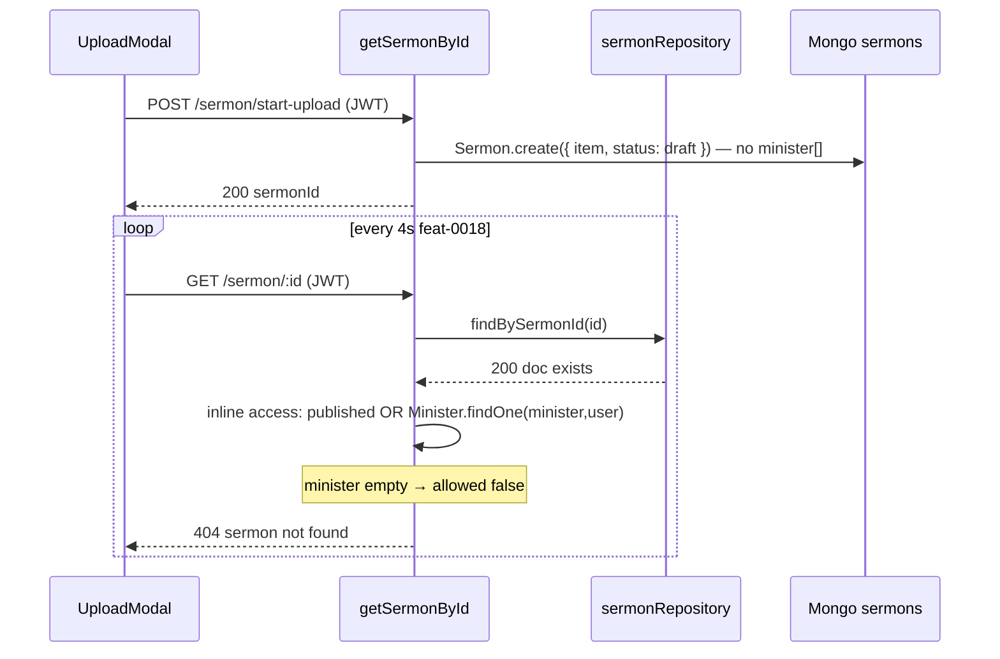

# feat-0011: Tech Spec — `GET /sermon/:id` 404 during upload polling

## Context

See [PRODUCT.md](./PRODUCT.md).

**Endpoint:** `GET /api/v1/sermon/:id`  
**Route:** `sermon.router.ts` → `getSermonById`  
**Controller:** `apps/api/src/controllers/core/sermon.controller.ts` (~799–889)  
**Web poll owner:** `UploadModal` / [feat-0018](../../web/feature/feat-0018/UPLOAD_STATUS_POLLING_SPEC.md)

**Error (access gate, not repository miss):**

```text
ErrorResponse: sermon not found
  statusCode: 404
  at sermon.controller.ts:867
```

Repository lookup succeeds; line ~867 runs when `allowed === false` after inline minister ownership check.

---

## End-to-end flow (upload poll 404)



---

## Root causes (ranked)

### RC-1 — Draft upload row has no `minister` linkage (primary)

`sermon.service.ts` → `handleUploadSermon`:

```ts
const SermonUpload = await Sermon.create({
    item: originalSermonItem,
    status: MediaStatus.DRAFT,
});
```

`item.uploadedBy` is set from JWT in the controller; **`minister` is not set** at create time.

`getSermonById` only grants non-catalog access when `Minister.findOne({ _id: mid, user: userId })` succeeds. Empty `minister` → **404**.

**Polling implication:** feat-0018 requires `GET /sermon/:id` for `item.uploadStatus`; access must allow **uploader** on draft rows before minister is attached at publish.

### RC-2 — Duplicate access logic; delete/publish use service, detail does not

| Handler | Access check |
| ------- | ------------- |
| `deleteSermon`, `moveToBin`, `cancelSermonProcessing` | `sermonService.isSermonOwnedByUser(userId, doc.minister)` |
| **`getSermonById`** | **Inline** `Minister.findOne` + published catalog only |

Even after RC-1 fix via `uploadedBy`, detail must call the **same service rules** as mutations — not a second controller copy.

### RC-3 — `minister` field is an array; controller assumes scalar

Schema (`sermon.model.ts`):

```ts
minister: [{ type: Schema.Types.ObjectId, ref: DbModels.MINISTER }]
```

Controller reads `doc.minister` as a single ref (`_id` or string). Arrays/populated arrays are not normalized → `mid` wrong or empty → false negative 404.

`sermon.service.ts` already has `ministerIdFromDoc` but it does not iterate minister arrays; extend in **service**, not a util.

### RC-4 — Creator studio (secondary)

Sermons are keyed to `minister[]` ObjectIds. Creator accounts have a **`creators`** row, not necessarily a `ministers` row. `isSermonOwnedByUser` has a partial fallback when `mid === userId` (legacy). Creator upload sessions need explicit **creator ownership** or **uploadedBy** — same RC-1 pattern.

### RC-5 — Stale doc reference in deep-links

[`deep-links.md`](../../deep-links.md) cites `sermon-access.util.ts` and `canAccessSermonDocument`. **Neither exists.** Access is inline in `getSermonById`. Do not add `sermon-access.util.ts`; implement `canUserViewSermonDetail` on **`sermon.service.ts`** and update deep-links to point here.

---

## API code placement (no utils facades)

Same convention as [feat-0009](../feat-0009/TECH.md#api-code-placement) and [feat-0010](../feat-0010/TECH.md#api-code-placement):

| Layer | Use for this fix |
| ----- | ---------------- |
| **`sermon.service.ts`** | `canUserViewSermonDetail(userId, doc)` — explicit branches, no wrapper util |
| **`sermon.controller.ts`** | Load doc, call service, return 404 if false |
| **`helpers.util.ts`** | Only existing stateless helpers if needed (e.g. ObjectId validation) — **not** sermon access |
| **Disallowed** | New `sermon-access.util.ts`, shared `studio-access.util.ts`, thin re-exports |

### Required style: explicit in service method

```ts
// sermon.service.ts — normative shape (implement inline, do not hide in util)
public async canUserViewSermonDetail(
    userId: string,
    doc: Record<string, unknown>,
): Promise<boolean> {
    if (!userId) return false;

    const isPublishedCatalogSermon =
        doc.isPublic !== false &&
        doc.status === MediaStatus.PUBLISHED &&
        doc.state !== ContentState.DELETED &&
        doc.state !== ContentState.BROKEN;
    if (isPublishedCatalogSermon) return true;

    const uploadedBy = (doc.item as { uploadedBy?: unknown } | undefined)?.uploadedBy;
    if (uploadedBy != null && String(uploadedBy) === userId) {
        return true;
    }

    const ministerIds = this.ministerIdsFromDoc(doc.minister);
    for (const mid of ministerIds) {
        if (await this.ministerProfileOwnedByUser(userId, mid)) return true;
    }

    if (await this.creatorProfileOwnedByUser(userId)) {
        // optional v1: only when doc linked to creator-owned studio sermon
    }

    return false;
}
```

Refactor **`isSermonOwnedByUser`** to reuse the same minister/creator lookups (extend in place; do not add a parallel helper file).

Controller after fix:

```ts
const allowed = await sermonService.canUserViewSermonDetail(userId, doc);
if (!allowed) {
    return next(new ErrorResponse('sermon not found', 404, []));
}
```

Delete the inline `Minister.findOne` block (~832–864).

---

## Implementation slices

Follow [incremental-implementation](../../../../.agents/skills/incremental-implementation/SKILL.md):

### Slice 1 (required) — Uploader access on draft rows

1. Add `uploadedBy` check to service access method (RC-1).
2. Wire `getSermonById` to service method (RC-2).
3. Verify: upload → poll → **200** + `item.uploadStatus` transitions; terminal logs clean.

### Slice 2 (required) — Minister array normalization

1. Add `ministerIdsFromDoc(minister: unknown): string[]` as **private** method on `SermonService` (handles `[]`, single id, populated doc, array of ids).
2. Use in `canUserViewSermonDetail` and `isSermonOwnedByUser`.

### Slice 3 (optional) — Creator studio parity

1. If creator upload uses same `start-upload` path, ensure creator JWT passes access via `uploadedBy` (Slice 1) or creator profile lookup.
2. Do **not** merge minister/creator into one util; keep lookups as explicit queries in `sermon.service.ts`.

### Slice 4 (docs)

1. Update [`deep-links.md`](../../deep-links.md) § audit — replace `sermon-access.util.ts` with `sermonService.canUserViewSermonDetail`.
2. Add cross-link in [feat-0018 UPLOAD_STATUS_POLLING_SPEC](../../web/feature/feat-0018/UPLOAD_STATUS_POLLING_SPEC.md) § API emission timing.

---

## Access matrix (normative)

| Caller | Sermon state | Must return |
| ------ | ------------- | ----------- |
| JWT uploader (`item.uploadedBy === userId`) | Draft / processing | **200** |
| Minister owner (`minister[]` → user's minister profile) | Draft / published private | **200** |
| Any authenticated | Published public catalog | **200** |
| Other user | Private draft | **404** `sermon not found` |
| Anonymous | Any | **401** (Protect) |

HTTP status for forbidden private draft stays **404** (feat-0020 contract); do not expose existence to non-owners.

---

## Verification

```bash
# API dev
cd apps/api && NODE_ENV=development pnpm dev

# Manual: minister session
# 1. POST /sermon/start-upload → note sermonId
# 2. GET /sermon/:sermonId in loop — expect 200, uploadStatus non-terminal
# 3. Terminal: no ERR at sermon.controller.ts:867

# Unit (add when implementing)
cd apps/api && NODE_ENV=development pnpm exec jest test/unit/services/sermon-access.test.ts
```

---

## Related

- [feat-0009](../feat-0009/PRODUCT.md) — spurious `GET /creator` on minister sessions
- [feat-0010](../feat-0010/PRODUCT.md) — `GET /minister` 403 when `req.user.userType` missing
- [feat-0018 UPLOAD_STATUS_POLLING_SPEC](../../web/feature/feat-0018/UPLOAD_STATUS_POLLING_SPEC.md) — web poll owner
- [feat-0006](../feat-0006/PRODUCT.md) — upload pipeline statuses

---

## Implementation status (2026-06-02)

**Shipped in API:**

| Change | File |
| ------ | ---- |
| `canUserViewSermonDetail(userId, doc)` | `sermon.service.ts` |
| `ministerIdsFromDoc`, `uploaderUserId`, `ministerProfileOwnedByUser` (private) | `sermon.service.ts` |
| `isSermonOwnedByUser(userId, doc)` — accepts full doc; checks `uploadedBy` + minister array | `sermon.service.ts` |
| `getSermonById` delegates to service; inline `Minister.findOne` removed | `sermon.controller.ts` |
| Delete / restore / move-to-bin pass full `doc` to `isSermonOwnedByUser` | `sermon.controller.ts` |
| Unit tests | `test/unit/services/sermon-access.test.ts` |

**Additional finding (same root, same fix):** `cancelSermonProcessing` and bin/delete mutations also called `isSermonOwnedByUser(userId, doc.minister)` only — uploader could not cancel mid-pipeline. Fixed by the same `uploadedBy` + doc-shaped ownership check.

**Not changed (by design):** `handleUploadSermon` still omits `minister[]` at create; `minister` is attached at publish (`handlePublishSermon`). Upload polling no longer needs minister linkage because `item.uploadedBy` grants access.
