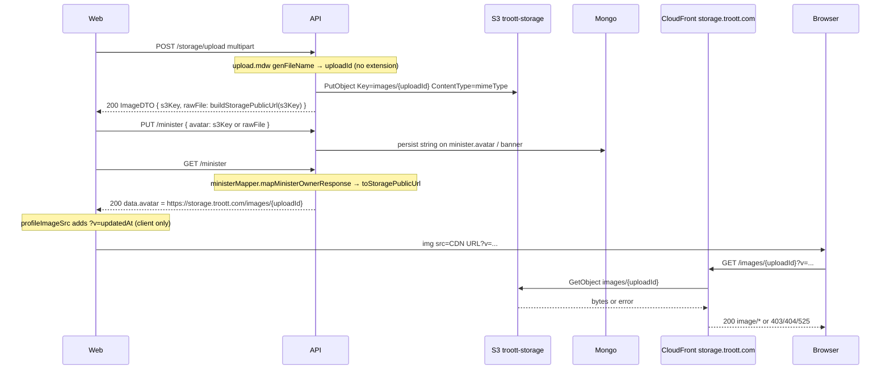
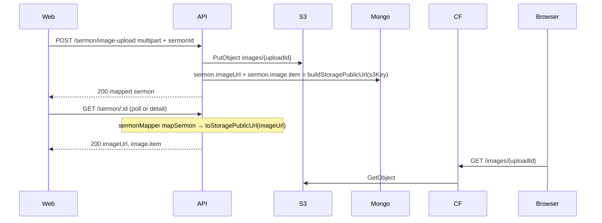

# feat-0012: Tech Spec — storage still images fail to load (request/response cycle)

## Context

See [PRODUCT.md](./PRODUCT.md).

**Example failing URL (browser GET, not API):**

```text
https://storage.troott.com/images/file-image-2026-06-03-16-28-33?v=2026-06-03T15%3A28%3A44.890Z
```

**S3 object key (must match path after `/images/`):**

```text
images/file-image-2026-06-03-16-28-33
```

Parent implementation spec: [feat-0008](../feat-0008/TECH.md).

---

## Full request/response cycle

Two common flows share the same **storage** tail (Layers 4–7).

### Flow A — Profile avatar / banner (matches `?v=` on URL)



### Flow B — Sermon cover



**Where the reported error originates:** Layers **6–7** (browser GET → CloudFront → S3). The API JSON at Layer 5 can be **correct** while the image still fails to render.

---

## Layer-by-layer failure matrix

Use this table to locate the break from observable signals.

| Layer | Component | Success signal | Failure signal | Typical cause |
| ----- | --------- | -------------- | -------------- | --------------- |
| **1** | `upload.mdw` | `uploadId` like `file-image-YYYY-MM-DD-HH-MM-SS` | 400 unsupported MIME | Client sent wrong `Content-Type` |
| **2** | `storage.service.uploadFile` / `sermon.service.handleSermonImage` | S3 upload completes; `ContentType` = client MIME | 500 upload error | Credentials, bucket name, stream empty |
| **3** | S3 `troott-storage` | `head-object` **200**, `ContentLength > 0` | **404** NoSuchKey | Wrong bucket/region/account; upload never committed |
| **4** | Mongo persist | `avatar` / `imageUrl` stores key or CDN URL | N/A | PUT omitted field |
| **5** | GET mapper + `toStoragePublicUrl` | HTTPS `storage.troott.com/images/...` in JSON | Bare `images/...` key only | `CLOUDFRONT_STORAGE_URL` **unset** in API env |
| **5b** | Redis profile cache | Cached mapped CDN URLs | Stale raw S3 URL | Old cache before mapper fix — bust `minister:profile:v2:{userId}` |
| **6** | Web `profileImageSrc` | Appends `?v=` only | Broken `` if `asset.url` missing | GET returned non-HTTPS key ([profile-image-display-spec.md](../../profile-image-display-spec.md)) |
| **7** | CloudFront `storage.troott.com` | `curl -I` **200**, `content-type: image/*` | **403** AccessDenied XML | Private bucket without OAC / wrong bucket policy |
| **7** | CloudFront | **200** | **404** Not Found | Origin path ≠ S3 key (e.g. `/sermon/image/` vs `/images/`) — see feat-0008 RC-1 |
| **7** | CloudFront / DNS | TLS handshake OK | **525** / “server not available” | DNS not pointing to distribution; cert mismatch |
| **7** | S3 object metadata | `Content-Type: image/jpeg` | `application/octet-stream` | Missing `ContentType` on PutObject (not current code path) |

**Diagnosis order (operator):**

1. Extract `{uploadId}` from URL path (ignore `?v=`).
2. `aws s3api head-object --bucket "$AWS_STORAGE_BUCKET" --key "images/{uploadId}"`
3. If step 2 fails → **Layer 2–3** (upload/env/bucket).
4. If step 2 succeeds → `curl -I "https://storage.troott.com/images/{uploadId}"`
5. If curl fails → **Layer 7** (CDN/OAC/path/TLS). API JSON is a red herring.
6. If curl succeeds but app blank → **Layer 5–6** (GET shape or web `asset.url`).

---

## Root causes (ranked)

### RC-1 — CloudFront origin cannot fetch object (most likely for “CDN URL in new tab fails”)

API emits `https://storage.troott.com/images/{uploadId}` via [`buildStoragePublicUrl`](../../../apps/api/src/utils/helpers.util.ts) when `CLOUDFRONT_STORAGE_URL` is set. That does **not** prove the distribution exists or can read `troott-storage`.

| Check | Pass | Fail |
| ----- | ---- | ---- |
| DNS `storage.troott.com` | Resolves to CloudFront | NXDOMAIN / wrong host |
| Distribution origin | `troott-storage` in same account/region | Wrong bucket or account |
| OAC / bucket policy | CloudFront can `s3:GetObject` on `images/*` | **403** XML in browser |
| Origin path mapping | Request path `/images/{uploadId}` → key `images/{uploadId}` | **404** (legacy `/sermon/image/` mismatch — [feat-0008 RC-1](../feat-0008/TECH.md#rc-1--cdn-url-path--s3-object-key-most-likely-app--infra-gap)) |

**This is infra + env, not missing `.jpg` in the URL.**

### RC-2 — Dev/prod bucket split

Local API uploads to bucket A (dev credentials); `CLOUDFRONT_STORAGE_URL` points at production distribution backed by bucket B. API returns a **valid-looking** URL; object exists only in A → CloudFront **404**.

Verify: `head-object` using the **same** `AWS_STORAGE_BUCKET` / region as the running API process.

### RC-3 — `CLOUDFRONT_STORAGE_URL` set but CDN not deployed

`example.env` documents the variable; empty default. If set to production hostname in a environment without that distribution, every generated URL 404s or TLS-fails.

When **unset**, `buildStoragePublicUrl` returns bare key `images/{uploadId}` ([helpers.util.ts:335–339](../../../apps/api/src/utils/helpers.util.ts)) — web profile code omits `asset.url` unless value starts with `http` ([useProfile.ts `assetFromApiField`](../../../apps/web/src/hooks/app/useProfile.ts)). Symptom: blank hero, not “CDN URL in new tab.”

### RC-4 — Legacy Mongo values (raw S3 URL)

Older rows store `https://troott-storage.s3.*.amazonaws.com/images/...`. GET mappers run `toStoragePublicUrl` → CDN URL in JSON ([minister.mapper.ts `mapMinisterOwnerResponse`](../../../apps/api/src/mappers/minister.mapper.ts)). If object was deleted or bucket private, CDN URL after rewrite can still fail — fix object + CDN, not mapper.

Upload write path today: `storage.service.uploadFile` sets `rawFile: buildStoragePublicUrl(s3Key)` (not raw `Location`) — [storage.service.ts:317](../../../apps/api/src/services/storage.service.ts).

### RC-5 — Empty or corrupt S3 object (upload stream)

[`upload.mdw`](../../../apps/api/src/middlewares/upload.mdw.ts) buffers multipart files in a `PassThrough` stream. If `ContentLength` is **0** on `head-object`, browser receives empty body → broken image despite **200**.

Check upload response `fileSize` and S3 `ContentLength` match.

### RC-6 — Missing extension (red herring)

| Stage | Extension |
| ----- | --------- |
| Original filename | May be `photo.png` |
| `uploadId` / S3 key | **No** extension — `file-image-2026-06-03-16-28-33` |
| CDN URL path | Same as key |
| Render requirement | S3 **`Content-Type: image/png`** set on PutObject ([storage.service.ts:299](../../../apps/api/src/services/storage.service.ts), [sermon.service.ts:261](../../../apps/api/src/services/core/sermon.service.ts)) |

Optional future: append `.{ext}` to key for human debugging — requires migration ([feat-0008](../feat-0008/TECH.md)).

---

## Layer 6 — Browser / `` / new tab

| Piece | Behavior |
| ----- | -------- |
| API JSON | No query string on `avatar` / `imageUrl` |
| Web profile | [`profileImageSrc`](../../../apps/web/src/app/profile/profile-page.util.ts) appends `?v={updatedAt}` |
| S3 GetObject | Key = path only; **`?v=` ignored** by S3 |
| CloudFront | Cache key may include query string depending on cache policy; origin request should still resolve same object |

If images fail **with and without** `?v=`, query string is not the root cause. Test:

```bash
curl -I "https://storage.troott.com/images/file-image-2026-06-03-16-28-33"
curl -I "https://storage.troott.com/images/file-image-2026-06-03-16-28-33?v=test"
```

---

## Code map (API — no new util modules)

| Concern | Location |
| ------- | -------- |
| Upload id generation (no extension) | `helpers.util.ts` → `genFileName` |
| S3 folder for images | `helpers.util.ts` → `getS3Folder` → `S3Folder.IMAGES` → prefix `images` |
| PutObject + ContentType | `storage.service.uploadFile`, `sermon.service.handleSermonImage` |
| CDN URL on write | `buildStoragePublicUrl(s3Key)` in services above |
| CDN URL on GET | `toStoragePublicUrl` in `*mapper.ts`, `minister.service` verification normalize |
| Env | `CLOUDFRONT_STORAGE_URL`, `AWS_STORAGE_BUCKET` |

Per project convention ([feat-0009 § placement](../feat-0009/TECH.md#api-code-placement)): keep URL helpers in **`helpers.util.ts`** (existing) and **services** — do not add `storage-url.util.ts`.

---

## Verification commands

Replace `{uploadId}` from API JSON or URL path.

```bash
# 1 — Object exists (Layer 3)
aws s3api head-object \
  --bucket "$AWS_STORAGE_BUCKET" \
  --key "images/{uploadId}"

# 2 — Direct S3 HTTPS (only if bucket/object is public — often 403 on private bucket)
curl -I "https://${AWS_STORAGE_BUCKET}.s3.${AWS_REGION}.amazonaws.com/images/{uploadId}"

# 3 — CDN (Layer 7) — primary user-facing check
curl -Iv "https://storage.troott.com/images/{uploadId}"

# 4 — API response shape (Layer 5)
curl -s -H "Authorization: Bearer $JWT" "$API/api/v1/minister" | jq '.data.avatar, .data.banner'

# 5 — Sermon cover
curl -s -H "Authorization: Bearer $JWT" "$API/api/v1/sermon/$SERMON_ID" | jq '.data.imageUrl, .data.image.item'
```

**Interpretation**

| head-object | curl CDN | Verdict |
| ----------- | -------- | ------- |
| 404 | — | Upload failed or wrong bucket/env |
| 200, size 0 | — | RC-5 stream/upload bug |
| 200, size > 0 | 403/404 | RC-1 CloudFront/OAC/path |
| 200 | 200, `image/*` | API/web bug (Layer 5–6) — rare if new tab also uses CDN URL |

---

## Fix ownership (phased — see feat-0008)

| Phase | Owner | Action |
| ----- | ----- | ------ |
| **P0 infra** | DevOps | CloudFront distribution for `storage.troott.com` → `troott-storage`, OAC, TLS, path 1:1 `images/*` |
| **P0 app** | API | Already emits `/images/{uploadId}` on write + GET mappers (verify env in each deploy) |
| **P1** | API | Invalidate Redis minister profile cache after mapper changes |
| **P2** | API + web | Legacy Mongo S3 URLs mapped on GET (mappers in place); optional backfill |
| **Optional** | API | Append file extension to S3 key + URL for ops clarity (not required for browser render) |

---

## Explicit non-fixes

- Adding `.png` to the CDN URL **without** changing the S3 key → **404** (worse).
- Making the storage bucket public instead of CloudFront OAC → security regression.
- Building CDN URLs on the web client → violates [web feat-0011](../../../web/feature/feat-0011/PRODUCT.md).

---

## Implementation status (2026-06-03)

**Shipped in API (feat-0012 slice — S3 keys with extensions):**

| Change | File |
| ------ | ---- |
| `buildS3ObjectKey(folder, uploadId, mimeType, filename?)` | `helpers.util.ts` |
| `extensionFromMimeType`, `extensionFromFilename` | `helpers.util.ts` |
| **`uploadFileToBucket(data, bucket, options?)`** — single multipart upload path for all buckets | `storage.service.ts` |
| `uploadFile` → delegates to `uploadFileToBucket` (`troott-storage`) | `storage.service.ts` |
| Sermon **original audio** → `uploadFileToBucket(..., troott-originals)` | `sermon.service.ts` → `handleUploadSermon` |
| Sermon **cover** → `uploadFileToBucket(..., troott-storage)` | `sermon.service.ts` → `handleSermonImage` |
| Profile / KYC / generic → `uploadFile` (unchanged entry, same key builder) | `storage.controller.ts`, `user.service.ts` |
| Expanded MIME → extension map (audio, documents, video) | `helpers.util.ts` |
| Unit tests | `test/unit/utils/helpers.storage-url.test.ts` |

New objects use keys like `images/file-image-….png`, `audio/file-audio-….mp3`, `documents/file-document-….pdf`. CDN URLs from `buildStoragePublicUrl(s3Key)` include the extension. HLS playback keys (`{uploadId}/hls/…`) unchanged — those files already carry extensions in the segment names.

Upload middleware (`upload.mdw`) unchanged — `uploadId` stays extensionless; extension is appended only when building the S3 key in `uploadFileToBucket`.

---

## Related

- [feat-0008 TECH](../feat-0008/TECH.md) — path contract, stored-value matrix, P0–P3 plan
- [feat-0011 API](../feat-0011/PRODUCT.md) — unrelated sermon GET access 404 (upload poll)
- [profile-image-display-spec.md](../../profile-image-display-spec.md) — when GET returned keys only
