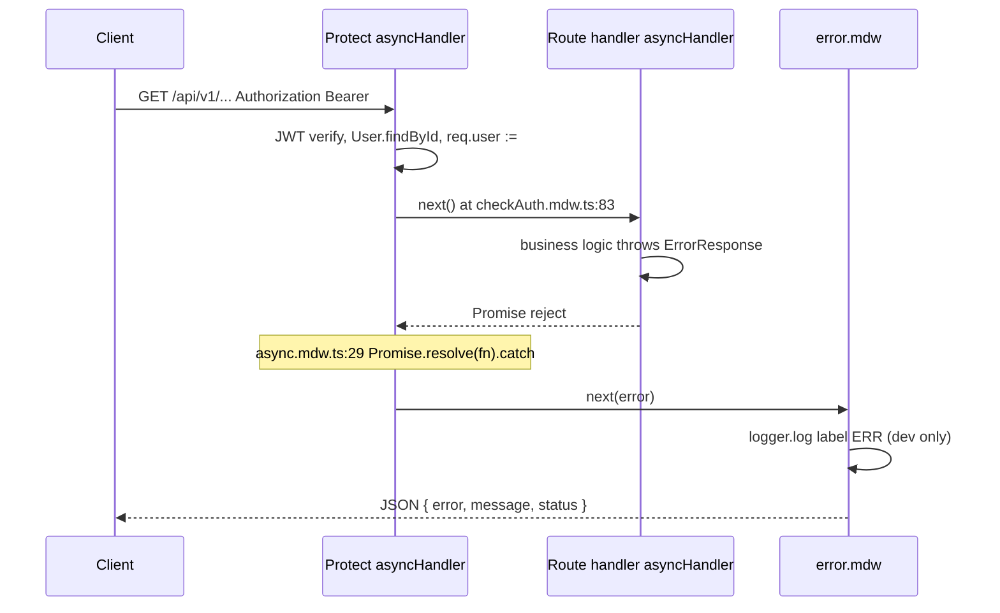

# feat-0013: Tech Spec — API dev `ERR` stack interpretation

## Context

See [PRODUCT.md](./PRODUCT.md).

**Reported stack (truncated in Turbo):**

```text
at async.mdw.ts:29:18
at Layer.handle ...
at next (.../route.js:149:13)
at checkAuth.mdw.ts:83:9
at processTicksAndRejections ...
```

**Missing from viewport:** `ErrorResponse: <message>`, `statusCode`, and usually `at sermon.controller.ts:867` (or other controller throw site).

---

## How Express + `asyncHandler` build this stack



### Frame reference

| File:line | Role |
| --------- | ---- |
| `async.mdw.ts:29` | `(fn as AsyncMiddleware)(req, res, next)` inside `.catch(next)` — **not** root cause |
| `checkAuth.mdw.ts:83` | `next()` after successful Protect — **auth succeeded** |
| `express/router/layer.js` | Express dispatch frames between middlewares |
| Controller `*.ts:NNN` | **Actual** `throw` / `next(new ErrorResponse(...))` — read this line first when present |

`error.mdw.ts` logs the full `err` object in development (`logger.log({ data: err, label: 'ERR' })`). The **message** and **stack** live on that object; Turbo may show only the bottom of `stack`.

---

## Protect success path (why line 83 appears on failures)

`apps/api/src/middlewares/checkAuth.mdw.ts`:

```77:83:apps/api/src/middlewares/checkAuth.mdw.ts
        req.user = {
            id: String(decoded.id),
            email: decoded.email ?? user.email,
            role: decoded.role,
            userType: user.userType,
        };
        next();
```

Failures **before** line 83 return `next(new ErrorResponse(...))` with **401/403** and stacks pointing at **earlier** lines (e.g. 36, 47, 54) — not line 83.

**Implication:** Any stack that includes `checkAuth.mdw.ts:83` passed Protect. Debug the **route handler** registered after `Protect` on that router.

---

## Turbo log ordering pitfall

Startup sequence in `apps/api` (typical):

1. DB connect + seed (`25 topics upserted successfully`)
2. Redis + Bull workers
3. HTTP `listen`

If an `ERR` block appears **immediately above** seeding lines in Turbo:

- Often **leftover scroll** from a previous dev-server run or a request during **hot reload** before the viewport cleared.
- Check terminal metadata: `last_exit_code: 1` on prior `pnpm dev:api` indicates restart; the error may predate the visible startup block.

**Do not** infer seeding or worker failure from middleware stacks alone.

---

## Reproduction checklist

1. **Scroll up** in `@troott/api#dev` until `ERR` and `ErrorResponse:` (or plain `Error`) message is visible.
2. Open browser **Network** tab; filter failed requests; note **method + path + status**.
3. Map message using [PRODUCT.md decision matrix](./PRODUCT.md#decision-matrix-after-reading-full-err-message).
4. If upload session: confirm poll is `GET /sermon/:id` → [feat-0011](../feat-0011/TECH.md).
5. If profile load: confirm `GET /minister` vs `GET /creator` vs cookie `userType` → [feat-0010](../feat-0010/TECH.md), [feat-0009](../feat-0009/TECH.md).
6. Re-run single request with `curl` and same Bearer token to isolate client vs server.

---

### RC-3 — Redis cache client not connected in local dev (fixed)

When `REDIS_CONFIG !== 'true'`, `redis.mdw.ts` created a client but **`await connect()` was commented out**. Protected routes that read cache first (`GET /sermon/:id`, `GET /minister`, `GET /creator`) threw before the controller line appeared in Turbo — stack tail showed only `async.mdw.ts:29` and `checkAuth.mdw.ts:83`.

**Fix:** connect local Redis via socket (same host/port as Bull), treat cache miss on Redis errors, and **start HTTP only after** DB/Redis/workers init (`server.ts`).

---

Without the truncated message line, the strongest prior evidence in the same session is:

```text
ErrorResponse: sermon not found
  at sermon.controller.ts:867:25
  statusCode: 404
```

That is [feat-0011](../feat-0011/PRODUCT.md) (draft upload polling access gate), **not** auth middleware regression.

**Verify fix landed:** `sermon.service.ts` exposes `canUserViewSermonDetail` / `isSermonOwnedByUser` including `item.uploadedBy`; controller delegates before returning 404. Restart API after pull; poll should return **200**.

If message differs after scroll-up, use the matrix in PRODUCT — do not treat this spec as overriding a specific controller error.

---

## feat-0010 implementation note (Protect RC-1)

[feat-0010 TECH](../feat-0010/TECH.md) documented RC-1: `req.user` omitted `userType`. **Current code sets `userType: user.userType`** (see citation above). Real ministers should no longer 403 solely because `userType` was undefined.

Remaining `Minister profile is only available for minister accounts` **403** means:

- JWT user is not `userType === minister` (creator/listener calling minister route), or
- Stale client calling wrong endpoint — not missing Protect field.

Update feat-0010 acceptance testing to assert RC-1 fixed; keep role guards for wrong persona.

---

## API code placement

No code changes required for this spec (documentation / runbook only). Fixes for underlying errors remain in:

- `sermon.service.ts` — [feat-0011](../feat-0011/TECH.md)
- Web persona gates — [feat-0009](../feat-0009/TECH.md)
- `checkAuth.mdw.ts` — [feat-0010](../feat-0010/TECH.md) (done)

**No** new `utils/*` modules for log parsing.

---

## Optional follow-ups (out of scope for v1)

| Idea | Benefit |
| ---- | ------- |
| Log `req.method req.path` in `error.mdw` dev branch | Instant endpoint correlation without Network tab |
| Structured `ErrorResponse` `code` field | Stable matrix keys vs English messages |
| Reduce Turbo truncation | Product / tooling, not API |
