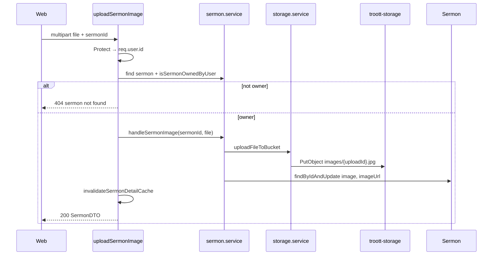

# feat-0014: Tech Spec — `POST /sermon/image-upload`

## Context

See [PRODUCT.md](./PRODUCT.md). Web trigger timing: [feat-0032 TECH](../../web/feature/feat-0032/TECH.md).

---

## Route stack

```text
POST /api/v1/sermon/image-upload
  Protect
  uploadHandler          → apps/api/src/middlewares/upload.mdw.ts
  uploadSermonImage      → apps/api/src/controllers/core/sermon.controller.ts
  sermonService.handleSermonImage
  storageService.uploadFileToBucket(..., troott-storage, { publicUrl: buildStoragePublicUrl })
```

---

## Sequence



---

## Service persistence (current)

`apps/api/src/services/core/sermon.service.ts` — `handleSermonImage`:

```ts
image: {
  item: publicImageUrl,      // CDN URL from buildStoragePublicUrl
  itemId, fileType, mimetype, size,
  uploadedBy, uploadStatus: COMPLETED,
  createdAt, updatedAt,
},
imageUrl: publicImageUrl,
status: DRAFT,
```

S3 key via `uploadFileToBucket` + `buildS3ObjectKey` → `images/file-image-….png` ([feat-0012](../feat-0012/PRODUCT.md)).

---

## Implementation gaps (to close)

### G1 — Ownership gate (required)

`uploadSermonImage` today updates any id that exists. Add before `handleSermonImage`:

```ts
const sermonExist = await sermonRepository.findBySermonId(sermonId);
if (sermonExist.error) return next(new ErrorResponse(..., 404));
const allowed = await sermonService.isSermonOwnedByUser(userId, doc);
if (!allowed) return next(new ErrorResponse('sermon not found', 404, []));
```

Use same helper as [feat-0011](../feat-0011/TECH.md) — **no new utils module**.

### G2 — `uploadedBy` on file (required)

Mirror `uploadSermon` controller:

```ts
const uid = String(req.user?.id ?? '');
if (uid) file.uploadedBy = uid;
```

### G3 — HTTP status propagation (required)

Replace blanket 500:

```ts
return next(new ErrorResponse(upload.message, upload.code || 500, []));
```

### G4 — Publish pipeline coupling

`buildPublishSermonDTO` reads `doc.image` via `buildSermonPipelineDTO`. Cover must exist on the document **before** Publish. Web uploads cover on Details; **ReviewSubmit Publish must not call `image-upload`** ([feat-0032 PRODUCT § Wizard action boundaries](../../web/feature/feat-0032/PRODUCT.md#wizard-action-boundaries-canonical)).

### G5 — No server-side fallback (required)

**Do not** implement any of the following:

- Accept `file` / cover bytes on `POST /sermon/publish/:id`
- Inside `handlePublishSermon` or `publishSermon` controller: call `handleSermonImage` when `image` is missing
- `@deprecated` publish+cover code path kept for old web builds

Validation stays strict: missing `image.item` → **400** (`Image File is required` or equivalent). Client must use `image-upload` on Details ([feat-0032 § No fallback](../../web/feature/feat-0032/PRODUCT.md#no-fallback-no-legacy-hard-requirement)).

---

## Response shape (200)

Mapper: `sermonMapper.mapSermon`. Web reads:

| Field | Use |
| ----- | --- |
| `data.image.item` | CDN URL for `` |
| `data.imageUrl` | Catalog / list thumbnail |
| `data.id` | Confirm same sermon |

---

## Error matrix

| Condition | status | message |
| --------- | ------ | ------- |
| No JWT | 401 | Unauthorized |
| No file | 400 | No file found in request |
| No sermonId | 400 | sermonId is required for cover upload |
| Sermon missing | 404 | Sermon not found |
| Not owner | 404 | sermon not found |
| S3 failure | 500 | Sermon image upload failed |
| Invalid MIME | 400 | From upload middleware / service |

---

## Cache

On success, controller already calls:

- `invalidateSermonDetailCache(sermonId, userId)`
- `invalidateCommonSermonListCaches({ ministerId, topic, userId })`

No change required for feat-0014.

---

## Testing

| Test | Assert |
| ---- | ------ |
| Owner uploads cover | 200; `image.item` set; extension in S3 key |
| Stranger same sermonId | 404 |
| Publish after cover | `validateSermonReadyToPublish` passes `image.item` |
| Second upload | Overwrites `imageUrl` |

Suggested location: extend `apps/api/test/unit/services/sermon-access.test.ts` or integration test for controller with mocked storage.

---

## API code placement

- Ownership: `sermon.service.isSermonOwnedByUser` (existing)
- Upload logic: `sermon.service.handleSermonImage` (existing)
- Controller: thin gate + `uploadedBy` + status codes
- **Do not** add `utils/sermon-cover.util.ts`
