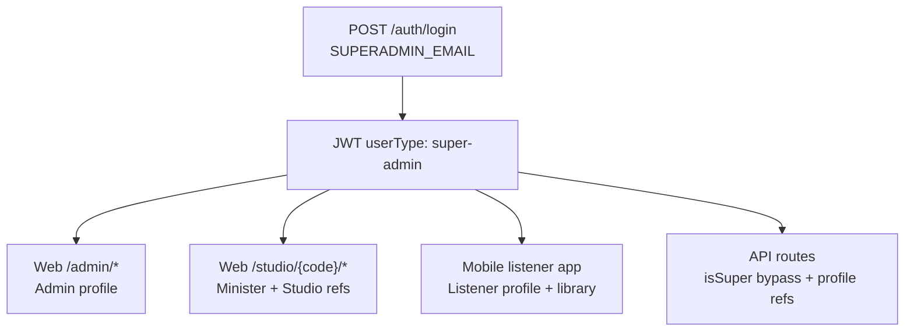

# feat-0017: Superadmin seed — all personas, all profiles, one login

## Summary

The **seeded superadmin** is a **single bootstrap account** (`SUPERADMIN_EMAIL` / `SUPERADMIN_PASSWORD`) that must:

1. Carry **every persona flag** on the `User` document.
2. Own **every linked profile document** (Admin, Minister + Studio, Creator, Listener + Library).
3. **Sign in once** and use **admin, studio (minister/creator), and listener** products without registering separate users.

**Not in scope:** multiple User rows or separate emails per persona. “Login to all accounts” means **one credential, all portals** — not impersonation of other users’ accounts.

**RBAC:** `userType === 'super-admin'` and `isSuper: true` remain authoritative for permission bypass ([`rbac.md`](../../../../apps/api/src/_specs/rbac.md)).

**Feat ID note:** API `feat-0017` is this superadmin seed. Web `feat-0017` is Sermon Analytics; mobile `feat-0017` is topic browse. Web/mobile portal hydrate for superadmin is a **separate web follow-up** (see [Web & mobile follow-ups](#web--mobile-follow-ups)).

## Problem

| Today (phase 1) | Target (phase 2) |
| ----------------- | ---------------- |
| User flags + Admin profile only | Minister + default Studio, Creator, Listener + Library |
| `GET /minister/me` 404 for superadmin | Minister ref on user; studio code in session |
| Login payload: persona flags false despite User booleans | Auth mapper uses flags + profile refs, not `userType` alone |
| Web `sessionState`: SUPER hydrates admin only | Minister/creator/studio contexts load for SUPER |
| Mobile listener blocked by `userType` | Hydrate listener context when listener profile exists |
| QA needs 4+ seeded logins | One superadmin exercises full stack |

## Consumer

- **Local / staging** (`ENABLE_SEEDING=true`)
- **QA** — admin console, web studio, mobile listener from one login
- **Engineering** — agents implementing seed + auth hydration

## Non-goals

- Production self-registration as `super-admin`
- Impersonating **other** users’ accounts (support “view as user”)
- Changing superadmin RBAC to drop `isSuper` wildcard
- Separate `SUPERADMIN_MINISTER_EMAIL` etc. (one email only)
- Full profile bootstrap in production deploy scripts

---

## Phased delivery

### Phase 1 — Shipped (flags + admin)

[`user.seed.ts`](../../../../apps/api/src/configs/seeds/user.seed.ts) creates:

| Artifact | Status |
| -------- | ------ |
| `User` with all persona booleans | Shipped |
| `SUPERADMIN` role + permissions | Shipped |
| **Admin** profile (`adminService.createAdmin`) | Shipped |
| Minister / Creator / Listener profiles | **Not shipped** |

### Phase 2 — Planned (full profile bootstrap)

Extend `seedUsers` (or `seedSuperadminProfiles`) after user create:

| Step | Service / action | User fields updated |
| ---- | ---------------- | ------------------- |
| 1 | `ministerService.createMinister` | `user.minister`, `isMinister` (idempotent if exists) |
| 2 | `studioService.provisionDefaultStudioForMinister` (via minister create) | minister `studio`; may set `user.primaryStudio` |
| 3 | `creatorService.createCreator` | `isCreator`; creator doc by `user` id (no `user.creator` field) |
| 4 | `studioService.provisionDefaultStudioForCreator` (via creator create) | creator `studio`; may overwrite `user.primaryStudio` |
| 5 | `listenerService.createListener` + `libraryService.getOrCreateLibrary` + free subscription + cold-start recs | **`user.listener`** (seed must patch — service does not set it today), `isListener` |
| 6 | Mark minister onboarding **completed** (`onboarding.step >= 6`, `status: completed`) |
| 7 | Mark creator onboarding **completed** where applicable |
| 8 | Set `user.primaryStudio` to **minister** studio after both studios exist (see [Dual studio policy](#dual-studio-policy)) |

**Idempotency (phase 2):** If superadmin already exists, **upsert missing profiles** (do not skip entire seed). Patch persona flags if false.

**Seed failure policy:** If any required profile step fails, log and **throw** (do not leave a half-bootstrapped superadmin without surfacing the error).

---

## Persona flags (normative)

| Field | Value |
| ----- | ----- |
| `userType` | `super-admin` (never changed by role attach) |
| `isSuper` | `true` |
| `isAdmin` | `true` |
| `isUser` | `true` |
| `isMinister` | `true` |
| `isCreator` | `true` |
| `isListener` | `true` |
| `isActivated` / `isActive` | `true` |

**Admin profile type:** Normative `AdminTypeEnum.BOARD` with `accessLevel: 10` (align seed comment with code).

---

## Data model after phase 2

| Collection / field | Superadmin after seed |
| ------------------ | --------------------- |
| `User.minister` | ObjectId |
| `User.listener` | ObjectId (explicit `$set` in seed if service omits) |
| `User.primaryStudio` | Minister studio ObjectId (product default) |
| `User.creator` | **N/A** — resolve creator via `creatorRepository.findOne({ user })` |
| Admin | One doc linked to user |
| Minister | One doc; onboarding completed |
| Studio | **Two** docs (minister + creator) unless product changes |
| Creator | One doc; onboarding completed |
| Listener | One doc |
| Library | One doc for listener |
| Subscription | Free plan active on listener |

`testdata.seed.ts` does not need superadmin in demo fixtures unless QA explicitly requests it.

---

## Dual studio policy

Minister and creator creation each provision a **separate** default studio. Both call `linkStudioToProfiles`, which sets `user.primaryStudio` — **last provision wins** if order is minister → creator.

**Product default for QA:** After both profiles exist, patch `user.primaryStudio` (and web `studioCode` in login) to the **minister** studio. Document the creator studio code separately if creator-only surfaces need it (future portal switcher).

| Studio | Owner | Typical web path |
| ------ | ----- | ---------------- |
| Minister | `user.minister` | `/studio/{ministerStudioCode}/sermons` |
| Creator | creator doc | `/studio/{creatorStudioCode}/…` (creator surfaces) |

---

## One login, all portals

| Portal | Requirement after phase 2 |
| ------ | ------------------------- |
| **Admin web** | `userType` super-admin + Admin doc — **works today** |
| **Studio web** | `user.minister` + Studio + completed onboarding + session hydrate — **phase 2** |
| **Creator studio surfaces** | Creator doc + creator studio — **phase 2** |
| **Mobile listener** | Listener profile + Library; gate on profile presence, not `userType === listener` — **phase 2** |

**Product rule:** Login returns **one** session. Clients choose portal by route/app, not by switching email. Optional future: explicit “portal switcher” in UI (still same JWT).

**Default post-login (web):** Superadmin still lands on **admin home** ([`auth-redirect.util.ts`](../../../../apps/web/src/utils/auth-redirect.util.ts)). QA opens studio via sidebar or direct `/studio/{code}` once `studioCode` is hydrated.

---

## Auth & session contract (normative)

Applies to **`POST /auth/login`** and **`GET /auth/me`** (same mapper).

### Login / fetchMe payload (superadmin)

| Field | Expected after phase 2 |
| ----- | ---------------------- |
| `userType` | `super-admin` |
| `isSuper` | `true` |
| `isMinister` | `true` (from `user.isMinister`, not `userType`) |
| `isCreator` | `true` (from `user.isCreator`) |
| `isListener` | `true` (from `user.isListener`) |
| `ministerCode` | Non-null when minister profile exists |
| `listenerCode` | Non-null when `user.listener` set |
| `creatorCode` | Non-null when creator profile exists (even when `userType !== creator`) |
| `studioCode` | Minister studio code (per dual-studio policy) |
| `adminCode` | Non-null |

**Today’s gaps (must fix in phase 2 PR):** [`auth.mapper.ts`](../../../../apps/api/src/mappers/auth.mapper.ts) sets `isMinister` / `isCreator` / `isListener` from `userType` only; `creatorCode` only when `userType === creator`; `listenerCode` requires `user.listener` ref.

### Minister verification

Seeded minister may have `verification.status: pending`. **Product default:** superadmin may upload and publish in dev/staging without manual verification (rely on `isSuper` API bypass where enforced). Document any route that still blocks PENDING ministers.

---

## Web & mobile follow-ups

Portal hydrate is **not** API-only. Track separately from this seed feat (do not use web `feat-0017`).

| App | Spec / area | Work |
| --- | ----------- | ---- |
| Web | [feat-0009](../../web/feature/feat-0009/PRODUCT.md) routing | [`sessionState.tsx`](../../../../apps/web/src/context/session/sessionState.tsx): SUPER must not `return` after admin-only hydrate; also load minister, creator, studio |
| Web | Sidebar / studio nav | `STUDIO_ROLES` already includes SUPER; needs `studioCode` in storage after hydrate |
| Mobile | Listener auth gate | [`useAuth.ts`](../../../../apps/mobile/api/hooks/app/useAuth.ts), onboarding guard: allow session when listener profile exists + API returns `listenerCode` / id, even if `userType` is `super-admin` |

---

## Environment & runbook

### Variables

| Variable | Required | Notes |
| -------- | -------- | ----- |
| `ENABLE_SEEDING` | `true` to run seeds | Dev/staging only; never in production deploy |
| `SUPERADMIN_EMAIL` | Yes | |
| `SUPERADMIN_PASSWORD` | Yes | |
| `SUPERADMIN_FIRSTNAME` | Yes | |
| `SUPERADMIN_LASTNAME` | Yes | |

Document in [`apps/api/example.env`](../../../../apps/api/example.env). `SUPERADMIN_*` listed in [`turbo.json`](../../../../turbo.json) `globalEnv`; add `ENABLE_SEEDING` there too.

### Seed order (hard dependency)

[`seeder.seed.ts`](../../../../apps/api/src/configs/seeds/seeder.seed.ts): roles → permissions → **plans** → users → topics. Free plan must exist before listener subscription.

### Existing databases (phase 1 superadmin already present)

1. Deploy phase 2 seed code.
2. Set `ENABLE_SEEDING=true`.
3. Re-run API start / seed — upsert creates missing profiles (no duplicate user).
4. Optional manual Mongo patch if flags were false before upsert shipped.

### Production guard

- `ENABLE_SEEDING` must not be `true` in production.
- One password unlocks all personas — acceptable for local QA only.

---

## Acceptance criteria

### Phase 1 (current)

- [x] Fresh seed: one `super-admin` user with all persona booleans `true`.
- [x] Admin profile created.
- [ ] Minister / Creator / Listener profiles — **not met** (by design until phase 2).

### Phase 2 (target)

**Seed & data**

- [ ] `user.minister`, `user.listener`, `user.primaryStudio` populated on same user id.
- [ ] Creator doc exists (lookup by `user` id).
- [ ] Minister + creator studios exist; `primaryStudio` points to minister studio.
- [ ] Minister onboarding `status === completed` (web studio without Get Started).
- [ ] Creator onboarding completed where model supports it.
- [ ] Listener Library + free subscription seeded.
- [ ] Re-seed: missing profiles created; no duplicate ministers/listeners/creators.
- [ ] `user.roles[]` includes minister, creator, listener slugs in addition to super-admin.

**Auth API**

- [ ] `POST /auth/login` and `GET /auth/me`: persona flags true; codes populated per [Auth contract](#auth--session-contract-normative).
- [ ] `GET /minister` (or `/minister/me`): 200 minister doc.
- [ ] `GET /studios/me`: minister studio with code.
- [ ] `GET /creator`: **200** with creator doc (not empty-for-superadmin).
- [ ] `GET /library` (listener context): library doc.

**Clients**

- [ ] Web: admin dashboard loads after login.
- [ ] Web: `/studio/{ministerStudioCode}/sermons` loads without 403/404 on minister hydrate.
- [ ] Mobile: listener home/library loads with same credentials (or tracked follow-up with link).

### QA manual matrix

| # | Steps | Pass |
| - | ----- | ---- |
| 1 | Fresh DB, `ENABLE_SEEDING=true`, start API | Seed logs success; one super-admin user |
| 2 | Login web with `SUPERADMIN_*` | Admin home; admin profile hydrated |
| 3 | Navigate to `/studio/{code}/sermons` | Sermon list shell loads |
| 4 | Upload flow (optional) | Draft/create reachable |
| 5 | Login mobile with same credentials | Listener home/library reachable |
| 6 | Re-run seed on same DB | No duplicate profiles; backfill if profiles were missing |

---

## Related

- [TECH](./TECH.md) — implementation steps, auth mapper, clients, tests
- [`user.seed.ts`](../../../../apps/api/src/configs/seeds/user.seed.ts)
- [`user.service.ts`](../../../../apps/api/src/services/user.service.ts) — `createDomainProfile`
- [`auth.mapper.ts`](../../../../apps/api/src/mappers/auth.mapper.ts)
- [feat-0009](../../web/feature/feat-0009/PRODUCT.md) — web auth routing (not web feat-0017 analytics)
- feat-0003 — listener library
