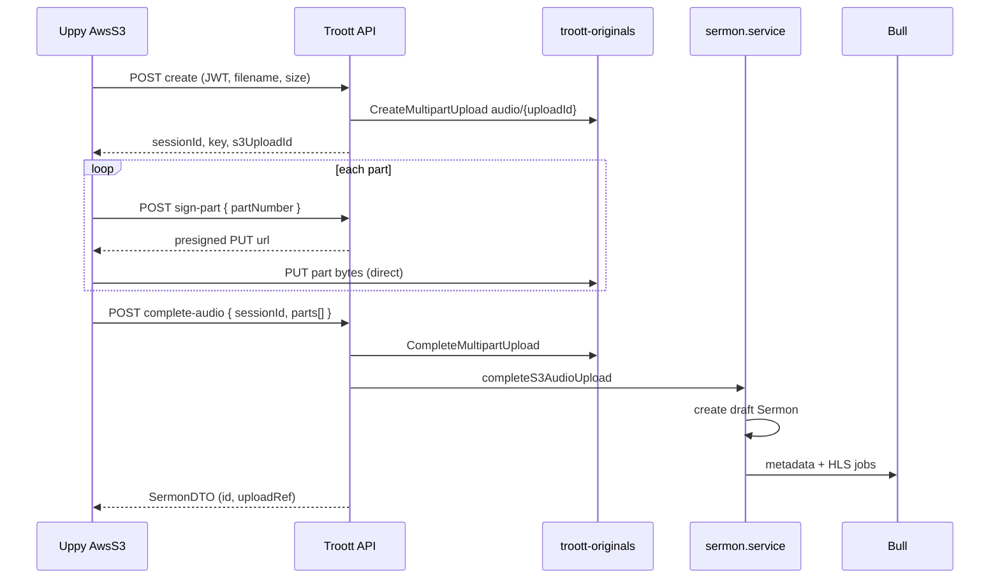

# feat-0018: Tech Spec — Direct S3 multipart uploads (API)

## Context

See [PRODUCT.md](./PRODUCT.md). **Implementation in `apps/api` only.** Web: [feat-0037 TECH](../../web/feature/feat-0037/TECH.md).

**Design rule:** Troott API **never receives file bytes** for S3 multipart flows. It calls AWS SDK (`CreateMultipartUpload`, presigned `UploadPart`, `CompleteMultipartUpload`, `AbortMultipartUpload`, `ListParts`). Uppy in the browser PUTs parts directly to S3. **No TUS. No Uppy Companion.**

---

## 1. Dependencies

No new npm packages required beyond existing `@aws-sdk/client-s3` and `@aws-sdk/s3-request-presigner` in `apps/api`.

---

## 2. Route map

### 2.1 Sermon audio (`troott-originals`)

Mount under [`sermon.router.ts`](../../../../apps/api/src/routes/sermon.router.ts).

| Method | Path | Middleware | Handler |
| ------ | ---- | ---------- | ------- |
| `POST` | `/api/v1/sermon/s3/multipart/create` | `Protect`, `sermonUploadRateLimiter`, `requireMinisterProfile` | `createSermonAudioMultipart` |
| `POST` | `/api/v1/sermon/s3/multipart/sign-part` | `Protect` | `signSermonAudioPart` |
| `GET` | `/api/v1/sermon/s3/multipart/list-parts` | `Protect` | `listSermonAudioParts` |
| `POST` | `/api/v1/sermon/s3/multipart/abort` | `Protect` | `abortSermonAudioMultipart` |
| `POST` | `/api/v1/sermon/s3/multipart/complete-audio` | `Protect`, `requireMinisterProfile` | `completeSermonAudioMultipart` |

**Legacy unchanged:** `POST /sermon/start-upload` (≤6 MB)

### 2.2 Storage (`troott-storage`)

Mount under [`storage.router.ts`](../../../../apps/api/src/routes/storage.router.ts).

| Method | Path | Middleware | Handler |
| ------ | ---- | ---------- | ------- |
| `POST` | `/api/v1/storage/s3/multipart/create` | `Protect` | `createStorageMultipart` |
| `POST` | `/api/v1/storage/s3/multipart/sign-part` | `Protect` | `signStoragePart` |
| `GET` | `/api/v1/storage/s3/multipart/list-parts` | `Protect` | `listStorageParts` |
| `POST` | `/api/v1/storage/s3/multipart/abort` | `Protect` | `abortStorageMultipart` |
| `POST` | `/api/v1/storage/s3/multipart/complete` | `Protect` | `completeStorageMultipart` |

**Cover attach (after object exists in storage bucket):**

| Method | Path | Handler |
| ------ | ---- | ------- |
| `POST` | `/api/v1/sermon/s3/multipart/complete-cover` | `completeSermonCoverMultipart` |

**Legacy unchanged:** `POST /storage/upload`, `POST /storage/upload-document`, `POST /sermon/image-upload`

---

## 3. Configuration

**New file:** `apps/api/src/configs/s3-multipart.config.ts`

```ts
export const S3_MULTIPART_THRESHOLD_BYTES = 6 * 1024 * 1024;
export const S3_MULTIPART_PART_SIZE_BYTES = 6 * 1024 * 1024; // min 5 MB for S3
export const S3_MULTIPART_PRESIGN_EXPIRY_SEC = 3600;

export const S3_STORAGE_MULTIPART_MAX_BYTES = 100 * 1024 * 1024;

export const S3_SERMON_AUDIO_MAX_BYTES =
    Number(process.env.SERMON_AUDIO_MAX_BYTES) || 512 * 1024 * 1024;

export const S3_MULTIPART_SESSION_EXPIRY_HOURS = 24;
export const S3_MULTIPART_SIGN_RATE_LIMIT_PER_HOUR = 2000; // future sign-part limiter
```

Storage max, session TTL, and sign rate are **hardcoded** in `s3-multipart.config.ts` — no env vars.

---

## 4. Upload session registry

**New collection or Redis hash:** `S3MultipartSession`

| Field | Purpose |
| ----- | ------- |
| `sessionId` | Client reference (uuid) |
| `uploadId` | Troott `file-audio-…` / `file-image-…` id |
| `s3UploadId` | AWS `UploadId` from `CreateMultipartUpload` |
| `s3Key` | e.g. `audio/{uploadId}` or `images/{uploadId}` |
| `bucket` | `troott-originals` \| `troott-storage` |
| `ownerId` | `req.user.id` |
| `purpose` | `sermon-audio` \| `storage-image` \| `storage-document` |
| `contentType` | MIME |
| `contentLength` | Declared file size |
| `finalized` | boolean |
| `createdAt` | TTL index |

**Key rule:** API mints `uploadId` and `s3Key` on **create** — client cannot choose arbitrary keys.

---

## 5. Endpoint contracts (Uppy `@uppy/aws-s3` custom signing)

### 5.1 `POST /sermon/s3/multipart/create`

**Body:**

```json
{
  "filename": "sunday.mp3",
  "contentType": "audio/mpeg",
  "contentLength": 52428800
}
```

**Steps:**

1. Validate MIME (`SERMON_AUDIO_MIME_ALLOWLIST`), size ≤ `S3_SERMON_AUDIO_MAX_BYTES`
2. Mint `uploadId`, `s3Key = audio/{uploadId}`
3. `CreateMultipartUpload` on `troott-originals`
4. Save session; return:

```json
{
  "error": false,
  "data": {
    "sessionId": "…",
    "uploadId": "…",
    "key": "audio/…",
    "s3UploadId": "…",
    "bucket": "troott-originals"
  }
}
```

Uppy stores `key`, `s3UploadId`, `sessionId` on `file.meta`.

### 5.2 `POST /sermon/s3/multipart/sign-part`

**Body:** `{ "sessionId", "partNumber": 1 }`

**Returns:**

```json
{
  "data": {
    "url": "https://troott-originals.s3…?X-Amz-…",
    "headers": { "Content-Type": "audio/mpeg" }
  }
}
```

Presigned `UploadPartCommand`. Verify session `ownerId`.

### 5.3 `GET /sermon/s3/multipart/list-parts?sessionId=…`

Calls S3 `ListParts`. Returns `{ parts: [{ partNumber, size, etag }] }` for Uppy resume.

### 5.4 `POST /sermon/s3/multipart/abort`

**Body:** `{ "sessionId" }` → `AbortMultipartUpload` + delete session.

### 5.5 `POST /sermon/s3/multipart/complete-audio` (primary)

**Body:**

```json
{
  "sessionId": "…",
  "parts": [{ "partNumber": 1, "etag": "\"abc…\"" }]
}
```

**Steps:**

1. `Protect`, `requireMinisterProfile`
2. Session ownership; not already `finalized`
3. `CompleteMultipartUpload` on S3
4. `HeadObject` — verify size, content-type
5. **`sermonService.completeS3AudioUpload({ uploadId, s3Key, mimeType, size, userId })`** — same tail as `handleUploadSermon` after S3 put:
   - Create draft `Sermon`, `item.uploadStatus: uploaded`
   - Enqueue `audio:metadata` + `audio:processing` ([feat-0006](../feat-0006/TECH.md))
6. Map sermon DTO — **identical** to `POST /sermon/start-upload`
7. Mark session `finalized: true`

**Idempotency:** Second call with same `sessionId` returns existing sermon (200).

### 5.6 Storage endpoints

Same pattern under `/storage/s3/multipart/*` with:

- `purpose`: `storage-image` \| `storage-document`
- `s3Key`: `images/{uploadId}` or `documents/{uploadId}` via [`buildS3ObjectKey`](../../../../apps/api/src/utils/helpers.util.ts)
- **`complete`** → `imageMapper.mapImage` → same envelope as `POST /storage/upload`

### 5.7 `POST /sermon/s3/multipart/complete-cover`

**Body:** `{ "sessionId", "sermonId", "parts": [...] }`

1. Complete storage multipart (if not already)
2. `isSermonOwnedByUser` ([feat-0014](../feat-0014/PRODUCT.md))
3. **`sermonService.completeS3CoverUpload(sermonId, fileMeta)`** — same as `handleSermonImage`
4. Return sermon DTO — identical to `POST /sermon/image-upload`

---

## 6. Audio sequence (canonical)



**Processing workers** read `sourceS3Key` from S3 — unchanged ([`audio-metadata.job.ts`](../../../../apps/api/src/tasks/jobs/audio-metadata.job.ts), [`audio-processing.job.ts`](../../../../apps/api/src/tasks/jobs/audio-processing.job.ts)).

---

## 7. S3 CORS (required)

Configure on **`troott-originals`** and **`troott-storage`**:

| Setting | Value |
| ------- | ----- |
| Allowed origins | `https://app.troott.com`, `http://localhost:5053` (studio dev) |
| Allowed methods | `GET`, `PUT`, `POST`, `HEAD` |
| Allowed headers | `*` |
| Expose headers | `ETag` |

Without `ETag` exposed, Uppy cannot complete multipart uploads.

---

## 8. Implementation files

| File | Action |
| ---- | ------ |
| `configs/s3-multipart.config.ts` | **Add** |
| `controllers/s3-multipart.sermon.controller.ts` | **Add** — routes + session Mongo CRUD + AWS SDK calls |
| `controllers/s3-multipart.storage.controller.ts` | **Add** |
| `routes/s3-multipart.sermon.router.ts` | **Add** |
| `routes/s3-multipart.storage.router.ts` | **Add** |
| `services/core/sermon.service.ts` | **Edit** `completeS3AudioUpload`, `completeS3CoverUpload` |
| `example.env` | No new multipart vars (limits hardcoded in `s3-multipart.config.ts`); CORS notes in ops runbook |

No separate `s3-multipart.service.ts`, `s3-multipart-session.service.ts`, or util modules — AWS + session logic stays in controllers (or inline in `sermon.service` for complete handlers).

Refactor `handleUploadSermon` to call `completeS3AudioUpload` after legacy stream upload — **one** job enqueue path.

---

## 9. Cleanup job

Extend [`cleanup.job.ts`](../../../../apps/api/src/tasks/jobs/cleanup.job.ts):

- Sessions older than TTL with `finalized: false` → `AbortMultipartUpload` + delete session
- Log `event=s3-multipart-cleanup sessionId=… key=…`

---

## 10. Security

| Rule | Detail |
| ---- | ------ |
| Presigned URL scope | Single `partNumber` + `uploadId` + `key` |
| Key minting | Server-only on create |
| JWT | All API routes; no AWS creds in browser |
| Minister gate | Sermon create + complete-audio |
| Size cap | Reject create when `contentLength` over max |

---

## 11. Testing

| Test | Cases |
| ---- | ----- |
| `s3-multipart.sermon.complete-audio.test.ts` | happy path, idempotent, wrong owner, bad parts, MIME |
| `s3-multipart.storage.complete.test.ts` | image CDN URL |
| `s3-multipart.sign-part.test.ts` | auth, expired session |

---

## 12. Commands

```bash
pnpm build:api
pnpm --filter @troott/api test -- s3-multipart
pnpm --filter @troott/api exec tsc --noEmit
```

---

## 13. Boundaries

- **Always:** `complete-audio` enqueues same Bull jobs as `start-upload`
- **Always:** `buildStoragePublicUrl` on storage complete ([feat-0008](../feat-0008/TECH.md))
- **Never:** TUS endpoints; Uppy Companion dependency; file bytes through Express body parser; standalone util/service layers for session registry (keep in controllers)
- **Ask first:** Public bucket ACL; non-standard part sizes

---

## 14. Session registry (decision)

| Decision | Choice |
| -------- | ------ |
| Store | **MongoDB** collection `S3MultipartSession` (same cluster as sermons; TTL index on `createdAt`) |
| Why not Redis-only | Survives API restart; auditable; matches existing stack |
| Fields (add) | `sermonId` (set after `complete-audio`), `status`: `pending` \| `uploading` \| `completed` \| `aborted` |

**Idempotency:** `complete-audio` with `sessionId` where `finalized === true` returns stored `sermonId` mapped DTO (200). Bull jobs **not** re-enqueued (stable `jobId` `audio-meta-{uploadId}`).

**Duplicate create:** Allowed (new session per call). Web feat-0008 single-flight prevents duplicate creates per file signature. API may optionally reject second non-finalized session for same `ownerId` + `contentLength` + `filename` within 5 min — defer to P1.

**Cleanup grace:** Do not abort sessions with `updatedAt` within last **2 hours** even if past TTL.

---

## 15. Uppy ↔ Troott API response mapping

Troott API returns `{ error, data, message, status }`. Web upload services **unwrap `data`** in signing callbacks before returning to `@uppy/aws-s3`.

### `createMultipartUpload` → Troott `POST …/create`

API `data`:

```json
{
  "sessionId": "uuid",
  "uploadId": "file-audio-2026-07-09-12-00-00",
  "key": "audio/file-audio-…",
  "s3UploadId": "aws-upload-id",
  "bucket": "troott-originals"
}
```

**Return to Uppy:**

```ts
{
  uploadId: data.s3UploadId,
  key: data.key,
  // store on file.meta for later hooks:
  sessionId: data.sessionId,
  troottUploadId: data.uploadId,
}
```

### `signPart` → Troott `POST …/sign-part`

Body: `{ sessionId, partNumber }`. Return to Uppy: `{ url: data.url, headers: data.headers }`.

### `listParts` → Troott `GET …/list-parts?sessionId=`

Return to Uppy: `{ parts: [{ PartNumber, Size, ETag }] }` (map casing per [@uppy/aws-s3](https://uppy.io/docs/aws-s3/)).

### `completeMultipartUpload` (sermon audio)

Troott `POST …/complete-audio` body: `{ sessionId, parts: [{ partNumber, etag }] }`.

Uppy hook returns void; web reads sermon from **HTTP response body** stored on `file.meta` in the upload service signing callback.

Parse: `data.id` → `sermonId`, `data.uploadRef` \| `data.item.itemId` → `uploadRef` (same as [`sermon-upload.service.ts`](../../../../apps/web/src/services/upload/sermon-upload.service.ts)).

### Small files (< 6 MB audio, legacy path)

Legacy `POST /sermon/start-upload` remains. For storage/cover ≤6 MB, legacy API multipart. **Do not** use single presigned PUT in P0 — Uppy multipart with one part is acceptable for 6–10 MB edge cases.

---

## 16. `completeS3AudioUpload` parity with `handleUploadSermon`

`completeS3AudioUpload` must perform **all** steps currently after S3 put in [`handleUploadSermon`](../../../../apps/api/src/services/core/sermon.service.ts):

| Step | Detail |
| ---- | ------ |
| `uploadId` | Minted on create using same helper as [`upload.mdw`](../../../../apps/api/src/middlewares/upload.mdw.ts) (`file-audio-{timestamp}` pattern) |
| `s3Key` | `audio/{uploadId}` on `troott-originals` |
| Owner | Resolve `Minister` by `userId`, else `Creator` — attach to sermon doc same as multipart |
| `item.item` | S3 HTTPS URL (`useS3Location: true` — raw ingest URL, not CDN) |
| `item.uploadStatus` | `uploaded` |
| `uploadedBy` | `userId` |
| Jobs | `audio:metadata` payload: `{ sourceS3Key, mimeType, uploadId, sermonId }`; `audio:processing` with `AudioVariants`, `segmentDuration: 6` |
| Job ids | `audio-meta-{uploadId}`, `hls-package-{uploadId}` (fix legacy typo separately) |

Refactor: `handleUploadSermon` calls `completeS3AudioUpload` after stream upload completes.

### Failed complete after S3 assembled

If `CompleteMultipartUpload` succeeds but DB/job enqueue fails: leave session `finalized: false`, log `event=s3-complete-audio-db-fail`, return 500. Ops may retry `complete-audio` (idempotent if sermon row exists). Do not auto-delete S3 object on first failure.

---

## 17. `complete-cover` (two-step, canonical)

**Decision:** Two HTTP steps — no duplicate `parts` on cover complete.

1. Uppy `completeMultipartUpload` → Troott **`POST /storage/s3/multipart/complete`** (assembles object; returns `ImageDTO` fields in session).
2. Web → **`POST /sermon/s3/multipart/complete-cover`** body: `{ sessionId, sermonId }` only (no `parts`).

Server: verify session `purpose === storage-image`, `finalized` on storage complete, `HeadObject`, then `completeS3CoverUpload(sermonId, fileMeta)` — same as `handleSermonImage`.

---

## 18. Error responses (all routes)

Standard `ErrorResponse` envelope. TROOTT code in `message`; HTTP status:

| Status | When |
| ------ | ---- |
| **400** | Missing body fields; invalid MIME; part list mismatch; session not complete |
| **401** | Missing/invalid JWT |
| **403** | `sign-part` / complete: `ownerId` mismatch; cover: not sermon owner |
| **404** | Unknown `sessionId`; sermon not found (cover) |
| **409** | Session already `aborted`; complete-cover before storage complete |
| **413** | `contentLength` over max |
| **429** | `sermonUploadRateLimiter` on create; **new:** `sign-part` rate limit 2000/hour/user (configurable) |
| **500** | AWS errors; DB failure after S3 complete |

---

## 19. Cancel and abort

| User action | Client | API |
| ----------- | ------ | --- |
| Cancel in-progress upload (wizard) | Uppy `cancelAll()` + `POST …/abort` `{ sessionId }` | `AbortMultipartUpload`; session `status: aborted` |
| Cancel processing (after upload) | Existing `POST /sermon/cancel-processing/:id` | Unchanged ([`cancelSermonProcessing`](../../../../apps/api/src/services/core/sermon.service.ts)); does **not** delete originals object in P0 |

Abort does not delete completed S3 objects. Cleanup job handles stale incomplete multipart.

---

## 20. Infrastructure and ops

### S3 CORS (both buckets)

| Origin | Environment |
| ------ | ----------- |
| `https://app.troott.com` | production |
| `https://staging-app.troott.com` (or staging studio URL from Coolify) | staging |
| `http://localhost:5053` | local `apps/web` dev |

Methods: `GET`, `PUT`, `POST`, `HEAD`. Expose: `ETag`. **Do not** use `AllowedOrigins: *` on `troott-originals`.

### IAM (API task role / env credentials)

Minimum on `troott-originals` and `troott-storage`:

`s3:CreateMultipartUpload`, `s3:UploadPart`, `s3:CompleteMultipartUpload`, `s3:AbortMultipartUpload`, `s3:ListParts`, `s3:HeadObject`, `s3:PutObject` (if single-PUT added later)

### S3 Lifecycle (bucket rule)

Abort incomplete multipart uploads after **7 days** (safety net alongside app cleanup).

### Config constants (hardcoded)

| Constant | Value |
| -------- | ----- |
| `S3_STORAGE_MULTIPART_MAX_BYTES` | 100 MB |
| `S3_MULTIPART_SESSION_EXPIRY_HOURS` | 24 |
| `S3_MULTIPART_SIGN_RATE_LIMIT_PER_HOUR` | 2000 (reserved; not wired) |

Sermon audio max remains `SERMON_AUDIO_MAX_BYTES` env (shared with legacy upload).

### Logging (structured)

| Event | When |
| ----- | ---- |
| `s3-multipart-create` | session created |
| `s3-multipart-sign-part` | partNumber, sessionId |
| `s3-multipart-complete-audio` | uploadId, sermonId, bytes |
| `s3-multipart-abort` | sessionId |
| `s3-multipart-cleanup` | stale session aborted |

### Local dev

Use real AWS dev buckets with CORS for `localhost:5053`, or MinIO with same API code paths documented in README snippet (P1).

---

## 21. Testing (expanded)

| Level | Scope |
| ----- | ----- |
| Unit | complete-audio idempotency, owner gate, MIME, part mismatch |
| Integration | Mock `@aws-sdk/client-s3` Complete/ListParts/HeadObject |
| Manual | 50 MB wizard; DevTools offline resume; verify ETag in CORS |
| E2E (P1) | Playwright: upload → poll → `uploadStatus: completed` |

Assert Bull `addJob` called once per `uploadId` on idempotent complete retry.

---

## 22. Boundaries (additions)

- **Ask first:** Single presigned PUT for &lt;5 MB; public bucket ACL
- **Never:** Expose AWS access keys to browser; skip `HeadObject` verify on complete
