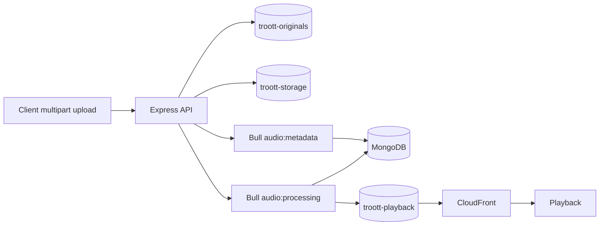
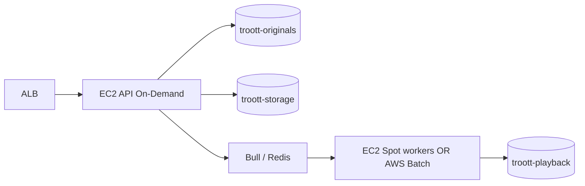

# Media compute and storage deployment plan (API)

This spec defines how **`apps/api`** should run in **AWS production** for sermon **upload**, **FFmpeg HLS packaging**, and **playback delivery**, given:

- **Environment:** production (always-on, no Spot-only monolith, multi-AZ where practical)
- Typical sermon duration: **1–2 hours**
- **Single deployment** today (HTTP + Bull workers + scheduler in one process — no API/worker split yet)
- Original sermon audio in **`troott-originals`**
- Packaged HLS / playback assets in **`troott-playback`**
- All other uploads (images, documents, avatars, etc.) in **`troott-storage`**

Related implementation spec: [`feature/feat-0005/PRODUCT.md`](./feature/feat-0005/PRODUCT.md).

---

## Goal

Deploy the Troott API monolith so that:

1. Ministers can upload **1–2 hour** audio without hitting size or timeout limits.
2. HLS packaging (ffmpeg) completes reliably on compute sized for long jobs.
3. Sermon originals, playback output, and general uploads live in **separate S3 buckets** (`troott-originals`, `troott-playback`, `troott-storage`).
4. Mobile/web clients play **`playbackUrl` / `manifestUrl`** via CDN.
5. The design allows **worker split + Spot** later without changing client contracts.

---

## Non-goals (this spec)

- Splitting API and worker into separate ECS services (phase 2).
- AWS Batch, Lambda-only transcode, or VT1 video instances.
- Replacing Bull/Redis with SQS/Step Functions (optional future).
- Product UX for upload/processing (see [`minister-flow.md`](./minister-flow.md)).

---

## Current codebase (baseline)

| Concern | Location |
| ------- | -------- |
| Monolith boot | `apps/api/src/server.ts` — DB, Redis, `startWorkers()`, scheduler, Express |
| Upload → S3 | `sermon.service.ts` — streaming multipart to S3 |
| Metadata job | `audio-metadata.job.ts` |
| HLS job | `audio-processing.job.ts` — S3 download → temp → ffmpeg → S3 upload |
| Workers | `apps/api/src/tasks/workers/worker.ts` — email, metadata, HLS |
| Storage | `storage.service.ts`, `aws.config.ts`, `media.config.ts` — today **one** bucket; target **three** (§ S3 storage layout) |
| Default upload cap | `SERMON_AUDIO_MAX_BYTES` — **100 MiB** default (see § Constraints) |

Pipeline today (unchanged contract):

**Bucket routing:** sermon **audio** → `troott-originals`; HLS **output** → `troott-playback`; **images** and other non-sermon-audio uploads → `troott-storage` (via `POST /storage/upload`, avatars, KYC docs, etc.).

---

## Content constraints (1–2 hour sermons)

### Duration

| Metric | Assumption |
| ------ | ---------- |
| Typical sermon | **60–120 minutes** |
| HLS segment duration | **6 s** (default in `audio-processing.job.ts`) |
| Segment count (2 hr) | ~**1,200** segments **per rendition** |
| Renditions | **3** (64 / 128 / 192 kbps AAC default) |

### File size (ingest)

Order-of-magnitude for **compressed** uploads (MP3/AAC/M4A):

| Duration | ~128 kbps MP3 | ~192 kbps |
| -------- | ------------- | --------- |
| 1 hour | ~55–60 MiB | ~85 MiB |
| 2 hours | ~110–120 MiB | ~170 MiB |

**WAV/lossless** uploads can exceed **1 GiB** for 2 hours — product should prefer compressed ingest or raise limits accordingly.

**Action:** Raise `SERMON_AUDIO_MAX_BYTES` for production (recommend **512 MiB minimum**, **1 GiB** if WAV allowed). Current default **100 MiB** is **too low** for 2-hour MP3 and blocks longer sermons.

### Processing time (ffmpeg HLS, CPU)

Rough planning numbers (single job, 3 renditions, no loudnorm):

| Sermon length | vCPU | Estimated wall time |
| ------------- | ---- | ------------------- |
| 1 hour | 4 | ~15–30 min |
| 2 hours | 4 | ~30–60 min |
| 2 hours | 8 | ~20–40 min |

With `AUDIO_LOUDNORM_BEFORE_HLS=true`, add **~1× ingest duration** for the extra WAV pass (large temp file).

**Implication:** Processing often exceeds **AWS Lambda’s 15-minute limit** — Lambda is **not** the primary transcode target. EC2/Fargate long-running tasks are.

### Ephemeral disk (per HLS job)

On the compute host (EC2 volume mounted for `/tmp` or Fargate ephemeral):

| Artifact | ~2 hr sermon |
| -------- | ------------ |
| Ingest copy from S3 | 110–120 MiB (MP3) up to **1+ GiB** (WAV) |
| Normalized WAV (optional) | up to **~1.2 GiB** stereo 44.1 kHz |
| HLS scratch (3 renditions) | **200–400 MiB** typical |
| **Peak working set** | **Plan 15–25 GiB** safe; **50 GiB** if loudnorm + WAV ingest |

---

## Recommended deployment (phase 1 — production monolith)

### Decision summary

| Area | Production recommendation |
| ---- | ------------------------- |
| **Compute (primary)** | **EC2 On-Demand** (or **Compute Savings Plan** / Reserved after baseline is stable) running the **same Docker image** |
| **Orchestration** | **ECS on EC2** (recommended) or **Docker on EC2 + ALB** — not Fargate-first for cost |
| **Instance count** | **2+** in different AZs behind ALB (rolling deploy + redundancy) |
| **Instance class (starting)** | **`c6i.2xlarge`** (8 vCPU / 16 GiB) or **`c7g.2xlarge`** (Graviton, if image supports arm64) |
| **Root/data volume** | **≥ 100 GiB gp3** per instance for `/tmp` + concurrent HLS jobs (see § Ephemeral disk) |
| **Image** | Custom **Docker**: Node 22 + **system ffmpeg** + built `apps/api` |
| **Registry** | **Amazon ECR** |
| **Ingress** | **Application Load Balancer** → EC2 targets (or ECS service) |
| **MongoDB** | Atlas **production** tier (or managed), not on app host |
| **Redis** | **ElastiCache** Multi-AZ (required when instance/task count > 1 for shared Bull queues) |
| **Spot** | **No** for production monolith — defer Spot to phase-2 **worker-only** fleet |

### EC2 vs Fargate (production)

| Factor | EC2 (recommended prod) | Fargate |
| ------ | ---------------------- | ------- |
| **Cost (24/7 monolith)** | **Lower** — steady workload; Savings Plans reduce further | **Higher** per vCPU/RAM-hour |
| **Long HLS jobs (1–2 hr)** | Large instance disk + no Fargate ephemeral cap surprises | Works but pay premium; 50 GiB ephemeral adds cost |
| **ffmpeg / Node drift** | **Avoided** if you run **Docker on EC2** (same image as local) | Same — image-based |
| **Ops** | Patch AMI, capacity planning | AWS manages placement |
| **When to use Fargate** | Staging, spikes, or if team has no EC2 ops | Not default for prod monolith |

**Production default:** **EC2 + Docker + ALB**. Use **Fargate** only if ops constraints outweigh cost (small team, no instance admin).

**Why not Spot for production monolith:** Spot interruption kills **live API**, **in-flight multipart uploads**, and **half-finished HLS** on the same host ([Spot 2-minute notice](https://img.ly/blog/how-to-run-ffmpeg-on-aws-spot-instances-for-scalable-low-cost-video-processing/) is often insufficient for 2-hour transcodes).

### Production compute sizing (1–2 hr sermons)

| Resource | Minimum (prod) | Notes |
| -------- | -------------- | ----- |
| **vCPU** | **8** per instance (`c6i.2xlarge`) | 4 vCPU tight when 2+ concurrent 2 hr HLS jobs |
| **Memory** | **16 GiB** | Headroom for Node + ffmpeg + temp files |
| **Instance disk** | **100 GiB gp3** | `/tmp` HLS scratch; not only root 8 GiB default |
| **Instances** | **2** (Multi-AZ) | ALB health checks; deploy one at a time |
| **Deploy stop timeout** | **≥ 90–120 min** | Longest HLS job + drain (ECS/Ec2 ASG) |

Scale **out** (more instances in ASG) when Bull queue depth or CPU sustains high; avoid running **multiple schedulers** without leader election (see § Operations).

### Container image requirements

1. Base: `node:22-bookworm-slim` (or Amazon Linux 2023).
2. Install **ffmpeg** + **ffprobe** (`apt` or pinned static build).
3. Build: `pnpm install`, `pnpm build`, `CMD ["node", "dist/server.js"]`.
4. CI gate: `ffmpeg -version` in image build.
5. Do **not** rely on `@ffmpeg/ffmpeg` (WASM) for server HLS — `audio.service` uses host binary.

Reference patterns: [FFmpeg in Docker (Collabnix)](https://collabnix.com/how-to-use-ffmpeg-in-docker-pre-built-image-vs-custom-dockerfile/), [AWS audio transcoding on EC2 + ffmpeg](https://aws.amazon.com/blogs/media/automating-audio-editing-and-transcoding-using-aws/).

---

## S3 storage layout

Production uses **three buckets**. Names below are the production bucket names; staging/dev may use suffixed variants (e.g. `troott-originals-staging`) via env — not a single shared bucket with prefixes.

### Three-bucket model (production)

| Bucket | Purpose | Writers | Example keys |
| ------ | ------- | ------- | ------------ |
| **`troott-originals`** | Original sermon audio only (source of truth for reprocess) | API sermon upload (`sermon.service.ts`) | `audio/{uploadId}` |
| **`troott-playback`** | HLS segments, master playlist, packaged playback assets | HLS job (`audio-processing.job.ts`) | `{uploadId}/hls/{rendition}/*`, `{uploadId}/hls/master.m3u8` |
| **`troott-storage`** | Everything else: images, documents, avatars, banners, KYC uploads | `storage.service.ts`, `POST /storage/upload`, profile uploads | `images/{uploadId}`, `documents/{uploadId}`, … (via `getS3Folder(mimeType)`) |

### Why three buckets

| Concern | Rationale |
| ------- | --------- |
| **Cost & lifecycle** | Originals are large and long-retained; playback is CDN-hot; storage bucket is many small objects — different IA/Glacier policies per bucket. |
| **IAM** | API can write originals + storage; HLS worker reads originals and writes **only** playback; public CDN origin is **only** `troott-playback`. |
| **Blast radius** | Re-pack / delete derived HLS never touches user images or the canonical original. |
| **Operations** | CloudFront, metrics, and alarms scoped to playback bucket without noise from avatar uploads. |

### Key layout (by bucket)

**`troott-originals`**

| Key pattern | Content |
| ----------- | ------- |
| `audio/{uploadId}` | Minister-uploaded sermon source file |

**`troott-playback`**

| Key pattern | Content |
| ----------- | ------- |
| `{uploadId}/hls/master.m3u8` | HLS master playlist |
| `{uploadId}/hls/{rendition}/*.ts` | AAC segments (64 / 128 / 192 kbps) |
| `{uploadId}/hls/{rendition}/index.m3u8` | Rendition playlists |

**`troott-storage`**

| Key pattern | Content |
| ----------- | ------- |
| `images/{uploadId}` | Cover art, thumbnails, general images |
| `documents/{uploadId}` | PDFs, verification docs |
| Other folders from `getS3Folder()` | Non-audio, non-playback uploads |

Sermon audio must **not** land in `troott-storage`. Images and documents must **not** land in `troott-originals` or `troott-playback`.

### Legacy single-bucket (code today)

`aws.config.ts` exposes one `AWS_BUCKET_NAME` used for all uploads. Implementation phase routes by asset type to the three buckets above; until then, document the target mapping in env (§ Environment variables).

### IAM (task role)

| Bucket | Permissions |
| ------ | ----------- |
| **`troott-originals`** | `s3:PutObject`, `s3:GetObject`, `s3:DeleteObject` on `audio/*` (multipart sermon upload; delete on sermon removal) |
| **`troott-playback`** | `s3:PutObject`, `s3:GetObject`, `s3:DeleteObject` on `*` (HLS upload + `deleteObjectsByPrefix` on failure) |
| **`troott-storage`** | `s3:PutObject`, `s3:GetObject`, `s3:DeleteObject` on `images/*`, `documents/*`, … (general upload API + avatars) |

Task role should **not** grant blanket `s3:*` on all three buckets if a narrower policy suffices.

### CDN

- **`MEDIA_CDN_BASE_URL`** → CloudFront distribution with origin **`troott-playback`** only (OAC; bucket private).
- `urlForMediaKey()` in `media.config.ts` builds `playbackUrl` / `manifestUrl` from playback keys.
- **`troott-storage`** may use a separate CloudFront distribution or signed URLs for images; **`troott-originals`** stays private (no public CDN; signed URL or internal read for processing only).

### Lifecycle (optional)

| Bucket | Policy |
| ------ | ------ |
| **`troott-originals`** | Standard; transition to IA after 90d; retain for reprocess |
| **`troott-playback`** | Standard; invalidate CloudFront on re-pack |
| **`troott-storage`** | Standard; optional IA for old documents; aggressive cleanup for temp uploads if applicable |

---

## Environment variables (deployment)

| Variable | Purpose |
| -------- | ------- |
| `MONGODB_URI` | Mongo |
| `REDIS_*` | Bull / cache |
| `AWS_REGION` | S3 client |
| `AWS_BUCKET_NAME` | **Legacy** — single bucket; replace with split below |
| `AWS_ORIGINALS_BUCKET` | **`troott-originals`** — sermon source audio |
| `AWS_PLAYBACK_BUCKET` | **`troott-playback`** — HLS output |
| `AWS_STORAGE_BUCKET` | **`troott-storage`** — images, documents, avatars, etc. |
| `MEDIA_CDN_BASE_URL` | CloudFront base (origin: **`troott-playback`**) |
| `SERMON_AUDIO_MAX_BYTES` | **≥ 536870912 (512 MiB)** prod; see § Content constraints |
| `SERMON_AUDIO_MIME_ALLOWLIST` | Restrict to compressed formats if size is a concern |
| `AUDIO_LOUDNORM_BEFORE_HLS` | `false` in prod until disk/CPU validated for 2 hr |
| `PORT` | Container port (e.g. 5000) |

---

## What not to use (and why)

| Option | Verdict | Reason |
| ------ | ------- | ------ |
| **Lambda-only HLS** | No | 15 min max; 2 hr × 3 renditions exceeds limit ([Weird Sheep Labs](https://weirdsheeplabs.com/blog/using-ffmpeg-in-aws-lambda-with-docker)) |
| **Spot-only monolith** | No | API + upload + transcode die together |
| **VT1 instances** | No | Video hardware transcode; workload is **audio AAC HLS** ([AWS VT1 blog](https://aws.amazon.com/blogs/opensource/run-open-source-ffmpeg-at-lower-cost-and-better-performance-on-a-vt1-instance-for-vod-encoding-workloads/)) |
| **Elastic Transcoder** | No | Deprecated; use ffmpeg in container |
| **AWS Batch (now)** | Defer | Requires worker split / job submission redesign ([aws-samples/aws-batch-with-ffmpeg](https://github.com/aws-samples/aws-batch-with-ffmpeg)) |
| **Fargate as prod default** | Avoid | Higher cost for 24/7 monolith; use EC2 unless ops override |

**Alternative:** **ECS on Fargate** with the same Docker image is valid for **non-prod** or if the team explicitly accepts higher cost for zero instance management.

---

## Operations

### Health checks

- ALB HTTP health on existing API health route (`routes.router.ts`).
- **Readiness:** Mongo + Redis connected (task should not receive traffic until `connect()` in `server.ts` completes).

### Graceful shutdown (production deploy / scale-in)

Today:

- Bull workers close on `SIGTERM` (`worker.ts`).
- HTTP server in `server.ts` primarily handles `SIGINT` for scheduler.

**Required for production (EC2 or Fargate):**

1. On `SIGTERM`: stop accepting new HTTP connections; drain in-flight uploads (or fail fast with retry-safe client).
2. Stop Bull from picking new jobs; allow current HLS job up to **stop timeout** (align with max sermon transcode ~60–90 min).
3. Close Redis/Mongo; exit.

If stop timeout < longest transcode, **in-flight HLS** should fail and **Bull retry** (5 attempts in `job.ts`) must re-run idempotently (job id `hls-package-{uploadId}`).

### Horizontal scaling

| Component | Rule |
| --------- | ---- |
| **API hosts** | 2+ behind ALB (Multi-AZ); shared Redis for Bull |
| **Bull concurrency** | HLS worker concurrency **10** default — on 2 hosts, up to 20 parallel HLS jobs; for 2 hr sermons in prod recommend **1–2 concurrent HLS jobs per instance** until metrics prove headroom |
| **Scheduler** | Run cron on **one** instance only, or make scheduled jobs idempotent |

### Observability

| Signal | Action |
| ------ | ------ |
| Bull failed jobs (`audio:processing`) | Alert |
| Sermon `item.uploadStatus=failed` | Dashboard / support runbook |
| Task CPU sustained > 80% during transcode | Scale instance size or add ASG capacity |
| Disk full on `/tmp` or data volume | Increase gp3 size; check WAV + loudnorm |
| HLS stage timing logs | `audio-hls-processor` label |

---

## Upload and processing SLA (product-facing)

For **1–2 hour** sermons (internal targets, not client guarantees until measured):

| Stage | Target |
| ----- | ------ |
| Upload complete (network dependent) | User-driven |
| Metadata job | < 2 min after upload |
| HLS ready (3 renditions, 4 vCPU, no loudnorm) | **≤ 45 min** for 2 hr (p50); **≤ 90 min** (p95) until tuned |
| Failed processing | Visible `uploadStatus=failed`; user can retry upload/reprocess |

Clients already fall back to `item.item` (raw ingest URL) until HLS is ready (`audio-pipeline-flow.md` §6).

---

## Phase 2 (future — not required for initial AWS deploy)

When cost or queue depth justifies split:

- API hosts **On-Demand** (no ffmpeg required after split).
- Workers: **Spot** + S3 in/out + idempotent HLS ([IMG.LY Spot guidance](https://img.ly/blog/how-to-run-ffmpeg-on-aws-spot-instances-for-scalable-low-cost-video-processing/)).

---

## Implementation checklist (engineering)

### P0 — Deploy production monolith

- [ ] Dockerfile with ffmpeg + Node app; push to **ECR**
- [ ] **ECS on EC2** (or Docker on EC2) + **ALB**; **2× `c6i.2xlarge`** (or equivalent) Multi-AZ
- [ ] **100 GiB gp3** (or larger) for HLS temp work
- [ ] ElastiCache Redis **Multi-AZ**; Mongo Atlas production + VPC peering/private link
- [ ] Raise `SERMON_AUDIO_MAX_BYTES` for 2 hr MP3 (≥ 512 MiB)
- [ ] `MEDIA_CDN_BASE_URL` + CloudFront OAC on **`troott-playback`**
- [ ] `NODE_ENV=production`; secrets via SSM/Secrets Manager (not baked in image)

### P1 — Storage split (three buckets)

- [ ] Create **`troott-originals`**, **`troott-playback`**, **`troott-storage`** in production account/region
- [ ] `AWS_ORIGINALS_BUCKET` / `AWS_PLAYBACK_BUCKET` / `AWS_STORAGE_BUCKET` in `aws.config.ts`
- [ ] `sermon.service.ts` → write/read/delete sermon audio on **`troott-originals`** only
- [ ] `audio-processing.job.ts` → read from originals, write/delete HLS on **`troott-playback`** only
- [ ] `storage.service.ts` + profile/KYC uploads → **`troott-storage`** only
- [ ] Lifecycle policies per bucket (§ S3 storage layout)

### P2 — Reliability for long jobs

- [ ] SIGTERM graceful shutdown (HTTP drain + Bull)
- [ ] Reduce HLS worker concurrency per task for 1–2 hr load
- [ ] Metrics: job duration vs sermon duration
- [ ] Document reprocess path for stuck `processing`

### P3 — Cost optimization (after split)

- [ ] Worker-only Spot fleet or AWS Batch
- [ ] Consider loudnorm 2-pass only when CPU/disk validated

---

## Acceptance criteria

1. Minister can upload a **2-hour** MP3 within `SERMON_AUDIO_MAX_BYTES` without 413/rejection.
2. After upload, sermon reaches **`item.uploadStatus=completed`** and **`playbackUrl`** points to valid HLS master on CDN.
3. API runs as **one Docker image** on **production EC2** (no worker split required for launch).
4. Sermon audio in **`troott-originals`**, HLS in **`troott-playback`**, images and other uploads in **`troott-storage`**, with documented key layout.
5. Two production hosts share **one Redis**; Bull jobs are not duplicated across isolated Redis instances.
6. Processing failure sets **`failed`**, cleans HLS prefix on **`troott-playback`** (existing behavior), and Bull can retry without corrupting playback.
7. **No Spot-only** production monolith; ALB serves traffic from healthy instances in **≥ 2 AZs**.

---

## References

- [IMG.LY — FFmpeg on AWS Spot (S3, interruption handling)](https://img.ly/blog/how-to-run-ffmpeg-on-aws-spot-instances-for-scalable-low-cost-video-processing/)
- [AWS — Automating audio editing and transcoding](https://aws.amazon.com/blogs/media/automating-audio-editing-and-transcoding-using-aws/)
- [AWS — VT1 for video VOD (not audio-primary)](https://aws.amazon.com/blogs/opensource/run-open-source-ffmpeg-at-lower-cost-and-better-performance-on-a-vt1-instance-for-vod-encoding-workloads/)
- [Collabnix — FFmpeg in Docker](https://collabnix.com/how-to-use-ffmpeg-in-docker-pre-built-image-vs-custom-dockerfile/)
- [Weird Sheep Labs — FFmpeg in Lambda limits](https://weirdsheeplabs.com/blog/using-ffmpeg-in-aws-lambda-with-docker)
- [AWS re:Post — FFmpeg on EC2 (install + resources, not “streaming instance” type)](https://repost.aws/questions/QUut8nPdlUTISdapleRNxaRw/do-all-aws-ec2-instances-support-ffmpeg-streaming)
- [Deepgram — FFmpeg audio basics](https://deepgram.com/learn/ffmpeg-beginners)
- [aws-samples/aws-batch-with-ffmpeg](https://github.com/aws-samples/aws-batch-with-ffmpeg) (phase 2)
- Internal: [`audio-processing-job-plan.md`](./audio-processing-job-plan.md)
