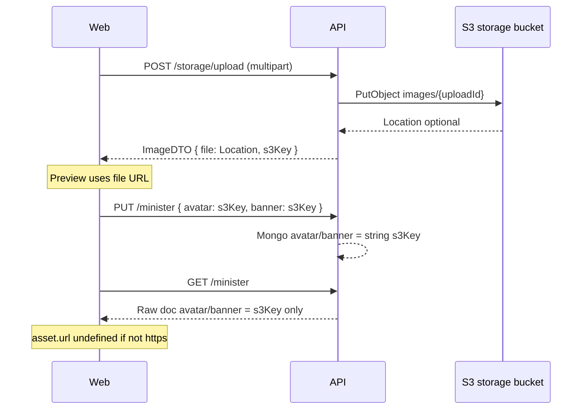

# Profile image upload — API display gap (investigation spec)

> **Canonical fix spec:** [feat-0033 web PRODUCT](../web/feature/feat-0033/PRODUCT.md) + [feat-0016 API PRODUCT](./feature/feat-0016/PRODUCT.md). This document retains the original root-cause analysis.

## Summary

Profile **cover** and **avatar** upload to S3 succeeds (`POST /api/v1/storage/upload`), and the web client persists the returned **`s3Key`** on `PUT /api/v1/minister` (or `/creator`). After save, **`GET /minister` does not return browser-loadable HTTPS URLs** for those fields. The portal only renders images when `avatar` / `banner` values start with `http://` or `https://`.

This is an **API contract and resolution gap**, not a React upload bug. Product intent is already documented in [feat-0011 web spec](../web/feature/feat-0011/PRODUCT.md) (UC-P11 / UC-P12): **clients must use display URLs from the API**; the API must supply them on GET.

Related: [feat-0024 profile parity](../web/feature/feat-0024/PROFILE_DATA_ACTIONS_SPEC.md) (read UI); [audio pipeline buckets](media-compute-deployment-plan.md) (split S3 buckets).

---

## Symptom

| Step | Expected | Observed |
| ---- | -------- | -------- |
| Upload in Edit Profile modal | Preview from `ImageDTO.file` | Often works (upload response includes `file`) |
| Save profile | Hero shows new images | Images disappear or never appear after refetch |
| Reload `/profile` | Same images as saved | Blank hero / initials fallback |
| Network tab on GET `/minister` | `avatar` / `banner` are HTTPS URLs | Typically bare keys, e.g. `images/<uploadId>` |

---

## End-to-end flow (as implemented)



---

## Root causes (verified in `apps/api`)

### RC-1 — GET `/minister` returns raw Mongo document (no display URL mapping)

`getMinisterProfile` returns the repository document as-is. The controller caches and returns that object without `ministerMapper.mapMinisterResponse`.

| Location | Behavior |
| -------- | -------- |
| `minister.service.ts` → `getMinisterProfile` | `result.data = ministerResult.data` (raw `IMinisterDoc`) |
| `minister.controller.ts` → `getMinister` | JSON `data: result.data`; Redis key `minister:profile:${userId}` TTL 300s |
| `creator.service.ts` → `getCreatorProfile` | Same pattern for creators |

**Impact:** Response shape is inconsistent with `MinisterResponseDTO` comments (CDN URLs). Fields `avatar` / `banner` are whatever was stored (usually `images/...` keys).

### RC-2 — Mapper emits storage keys, not display URLs

When `mapMinisterResponse` / `mapMinisterProfile` **are** used (e.g. public minister profile), avatar/banner are still **keys or opaque strings**, not resolved URLs:

```29:41:apps/api/src/mappers/minister.mapper.ts
        let avatarOut: string | undefined;
        if (typeof m.avatar === 'string') {
            avatarOut = m.avatar;
        } else {
            avatarOut = m.avatar?.s3Key;
        }

        let bannerOut: string | undefined;
        if (typeof m.banner === 'string') {
            bannerOut = m.banner;
        } else {
            bannerOut = m.banner?.s3Key;
        }
```

Interface docs say “CDN URL” (`minister.interface.ts`), but implementation passes through **DB values** with no `urlFor…` / signed URL step.

### RC-3 — Persisted value is `s3Key` only (by design on web PUT)

Web `useProfile.ts` sends `avatar` / `banner` as `s3Key` strings (correct for storage). Mongo schema stores plain strings:

```22:23:apps/api/src/models/core/minister.model.ts
        avatar: { type: String },
        banner: { type: String },
```

**Contrast — sermon cover (works for display when full URL stored):** sermon upload persists `imageUrl: s3Response.Location` (full S3 URL) in `sermon.service.ts`. Minister profile does **not** mirror that pattern on GET.

### RC-4 — No storage-bucket URL helper used for profile images

| Helper | Bucket used | Used for profile GET? |
| ------ | ----------- | --------------------- |
| `storageService.uploadFile` | `bucketNameFor('storage')` | Upload only |
| `urlForMediaKey` / `publicHttpsUrlForS3Key` in `media.config.ts` | **`playback`** bucket via `bucketNameFor('playback')` | **No** — and wrong bucket if applied to `images/*` keys |
| `storageService.getSignedUrl(key, role?)` | Infers role from key → `storage` for `images/…` | **Not called** from minister/creator mappers |

Profile images live under keys like `images/{uploadId}` in the **storage** bucket (`example.env`: `AWS_STORAGE_BUCKET`). There is **no** `STORAGE_CDN_BASE_URL` (or equivalent) wired for still images.

### RC-5 — Upload `ImageDTO.file` may be unusable even before save (environment)

`ImageDTO.file` is `uploadResult.data.rawFile` → `s3Response.Location` from the AWS SDK.

| Condition | Effect |
| --------- | ------ |
| Storage bucket **private** (no public read, no CloudFront origin) | Browser `` fails (403) even during edit preview |
| `Location` undefined (some endpoint/path-style configs) | `file` empty; preview broken immediately |
| `MEDIA_CDN_BASE_URL` set for **playback/HLS only** | Does not apply to `images/*` in storage bucket unless origin is configured |

### RC-6 — Web display rule (confirms API must send HTTPS)

```41:56:apps/web/src/hooks/app/useProfile.ts
function assetFromApiField(stored: string | null | undefined): Asset | null {
    if (!stored) {
        return null;
    }
    if (stored.startsWith('http://') || stored.startsWith('https://')) {
        return {
            fileName: '',
            s3Key: '',
            url: stored,
        };
    }
    return {
        fileName: stored.split('/').pop() ?? '',
        s3Key: stored,
    };
}
```

If GET returns `images/abc`, **`url` is omitted** → `profileImageSrc` returns `undefined` → hero shows gradient/initials only. This is correct **given** feat-0011 “no client S3 URL building”; the API must send HTTPS URLs.

---

## API contract (current vs required)

### POST `/api/v1/storage/upload`

| Field | Semantics today | OK for DB write? | OK for ``? |
| ----- | --------------- | ---------------- | ------------------- |
| `s3Key` | e.g. `images/{uploadId}` | Yes | No (relative key) |
| `file` | S3 `Location` URL | Optional duplicate | Only if bucket/CDN is publicly readable |

### PUT `/api/v1/minister` (and `/creator`)

| Field | Stored in Mongo | Display on GET today |
| ----- | --------------- | -------------------- |
| `avatar` | string (`s3Key`) | Same string |
| `banner` | string (`s3Key`) | Same string |

### GET `/api/v1/minister` (required for feat-0011 / feat-0024)

| Field | Required for web | Today |
| ----- | ---------------- | ----- |
| `avatar` | HTTPS URL **or** parallel `avatarUrl` | Usually `images/…` key |
| `banner` | HTTPS URL **or** parallel `bannerUrl` | Usually `images/…` key |

**Recommendation:** Keep storing **`s3Key`** internally; add **resolved display fields** on GET (see below). Avoid requiring the web to call a second URL endpoint per image unless using short-lived signed URLs.

---

## Recommendations (API-first, ordered)

### R1 — Resolve display URLs in API on every profile GET (P0)

Introduce a small shared helper, e.g. `resolveStorageImageUrl(key: string | null | undefined): string | null`:

1. If value is already `http(s)://`, return as-is (backward compatible).
2. If value looks like a key (`images/…`, etc.), build URL using **`bucketNameFor('storage')`** — not playback.
3. Prefer env **`STORAGE_CDN_BASE_URL`** (new) or reuse **`S3_PUBLIC_HTTP_BASE`** documented for **storage** origin.
4. If bucket is private and no CDN: use `storageService.getSignedUrl(key, 'storage')` and return **time-limited** URL (document TTL; consider 1h+ for profile).

Apply in:

- `ministerMapper.mapMinisterResponse` and `mapMinisterProfile` for `avatar` / `banner` (and `profile.ministryLogo` if used).
- **Always** map before response in `getMinisterProfile` / `getCreatorProfile` (fix RC-1).
- Same for `PUT` response bodies if clients rely on returned doc.

**Do not** use `urlForMediaKey()` as-is for profile images — it targets the **playback** bucket (`media.config.ts`).

### R2 — Return stable DTO from `GET /minister` (P0)

Replace raw Mongoose document with `await ministerMapper.mapMinisterResponse(minister)` in `getMinisterProfile`, and cache **that DTO** (or cache raw + map on read). Invalidate cache on `PUT` (already deletes `minister:profile:${userId}`).

Align `GET /creator` profile with the same pattern (creator mapper today is missing; mirror minister).

### R3 — Optional dual-field contract (P1, clearer writes)

Extend `MinisterResponseDTO`:

| Field | Purpose |
| ----- | ------- |
| `avatar` / `banner` | Display URL (HTTPS) for clients |
| `avatarKey` / `bannerKey` | Optional; internal key for admin tools |

Or keep a single field as URL on GET while PUT continues to accept `s3Key` only (document breaking change if any client expects key on GET).

### R4 — Environment and infrastructure (P0 ops)

| Variable | Purpose |
| -------- | ------- |
| `AWS_STORAGE_BUCKET` | Must match upload target (already used) |
| `STORAGE_CDN_BASE_URL` (new) | CloudFront (or similar) origin → storage bucket, public `images/*` |
| Or `S3_PUBLIC_HTTP_BASE` | Document that it must point at **storage** host for still images, not playback |

Confirm in AWS:

- CORS on bucket if web loads S3 URLs directly.
- CloudFront cache behavior for `images/*` if using CDN.
- Whether `Location` from upload is public; if not, R1 must use signed URLs or CDN.

### R5 — Align with sermon cover pattern (P2 alternative)

**Not recommended as primary fix:** store full `Location` on minister `avatar`/`banner` like `sermon.imageUrl`. Couples DB to bucket URL format and complicates CDN migration. Prefer R1 (resolve at read time from key).

### R6 — Regression tests (P1)

| Test | Assert |
| ---- | ------ |
| Mapper unit | `avatar: 'images/x'` + env base → `https://…/images/x` |
| Mapper unit | `avatar: 'https://cdn/…'` → unchanged |
| Integration | Upload → PUT minister with `s3Key` → GET minister → `avatar` matches `^https://` |
| Signed URL path | Private bucket → GET returns URL containing `X-Amz-Signature` or CDN URL |

### R7 — Web (out of scope for this doc, do not fix API in web)

Do **not** reintroduce `VITE_S3_*` or `resolveAssetUrl` on web (feat-0011). After R1+R2, existing `assetFromApiField` works without changes.

Optional hardening: if API adds `avatarUrl` separate from `avatar`, map in `ministerResponseToProfileDTO` only.

---

## Decision matrix: public CDN vs signed URLs

| Approach | Pros | Cons |
| -------- | ---- | ---- |
| **CDN/public origin on storage bucket** | Stable URLs; simple ``; matches sermon CDN story | Infra setup; cache invalidation on replace |
| **Signed URLs on GET** | Works with private bucket | Expire (1h default in `storageService`); refetch needed; harder caching |
| **Store full S3 URL in Mongo** | Quick hack | Breaks on bucket/CDN change; duplicates key |

**Recommendation:** CDN (or public read) for profile stills **plus** resolve from `s3Key` on GET. Use signed URLs only if buckets must stay private.

---

## Verification checklist (manual)

1. `POST /storage/upload` — note `data.s3Key` and `data.file`; open `data.file` in browser tab (200 vs 403).
2. `PUT /minister` with `"avatar": "<s3Key>"` — response body `avatar` value.
3. `GET /minister` — `avatar` / `banner` must be loadable HTTPS (not only `images/…`).
4. Reload `/profile` — hero shows image without web env vars.
5. After deploy, clear Redis `minister:profile:*` or wait TTL if old key-only payloads were cached.

---

## Files to change (implementation reference)

| Area | File |
| ---- | ---- |
| URL helper | New `apps/api/src/utils/storage-image-url.util.ts` (or extend `media.config.ts` with `urlForStorageKey`) |
| Mapper | `apps/api/src/mappers/minister.mapper.ts` (+ creator equivalent) |
| Service | `apps/api/src/services/core/minister.service.ts` (`getMinisterProfile`) |
| Controller | `apps/api/src/controllers/core/minister.controller.ts` (ensure cached value is mapped DTO) |
| Config | `apps/api/example.env` — document `STORAGE_CDN_BASE_URL` |
| DTO docs | `apps/api/src/dtos/core/minister.dto.ts` — clarify avatar/banner are display URLs on GET |
| Tests | `apps/api/test/unit/mappers/minister.mapper.test.ts` (new) |

---

## Status

| Item | State |
| ---- | ----- |
| Investigation | **Complete** (code paths verified 2026-06-02) |
| API fix | **Partial** — owner mapper + CDN mapping shipped; verify cache + CDN infra per [feat-0016](./feature/feat-0016/PRODUCT.md) |
| Web workaround | **Not recommended** (violates feat-0011) |

---

## Related specs

| Doc | Link |
| --- | ---- |
| Web profile parity | [feat-0024 PROFILE_DATA_ACTIONS_SPEC.md](../web/feature/feat-0024/PROFILE_DATA_ACTIONS_SPEC.md) |
| Web image delivery rules | [feat-0011 PRODUCT.md](../web/feature/feat-0011/PRODUCT.md#web-image-delivery-portal-wide) |
| Image upload DTO | `apps/api/src/dtos/storage.dto.ts` |
