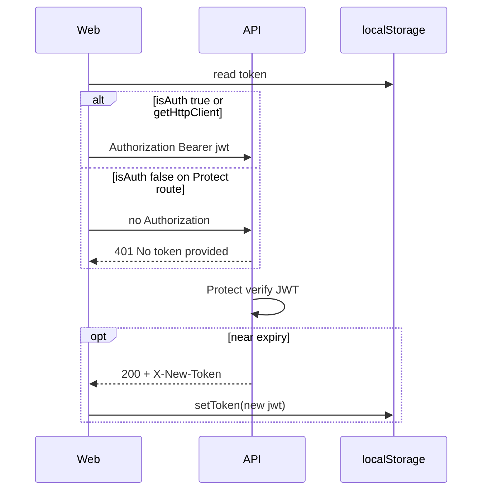

# Web ↔ API authentication handshake

> **Canonical auth model:** [feat-0004 PRODUCT](./feature/feat-0004/PRODUCT.md) + [TECH](./feature/feat-0004/TECH.md)  
> **Web client layout:** [`apps/web/docs/adr/0001-web-api-client.md`](../../apps/web/docs/adr/0001-web-api-client.md)

This spec defines how the **Vite web app** (`apps/web`) and **API** (`apps/api`) must exchange credentials on every request cycle. It exists to prevent “handshake” failures where one side assumes a session the other never receives.

---

## Summary

| Layer | Rule |
| ----- | ---- |
| **API** | Protected routes accept **only** `Authorization: Bearer <jwt>`. Cookies are **not** read by `Protect`. |
| **Web** | JWT lives in **`localStorage`** (authoritative for HTTP). Cookies mirror metadata for UX only. |
| **Web `call()`** | `isAuth: true` **must** match every API route that uses `Protect`. |
| **Web uploads** | `getHttpClient()` always attaches Bearer via interceptor (same as `isAuth: true`). |
| **Reissue** | API may return `X-New-Token`; web **must** persist it before the next request. |

---

## 1. API contract (normative)

### 1.1 Protected routes

**Middleware:** [`apps/api/src/middlewares/checkAuth.mdw.ts`](../../apps/api/src/middlewares/checkAuth.mdw.ts) (`Protect`)

**Request header (required):**

```http
Authorization: Bearer <jwt>
```

**Parsing:**

```ts
const token = req.header('authorization')?.split(' ')[1];
```

- Header name is case-insensitive in Express (`authorization` / `Authorization`).
- Scheme must be `Bearer` with a single space before the JWT.
- **No** `Cookie`, `x-access-token`, or query-string token is supported on `Protect`.

### 1.2 Error responses (auth failure)

| Condition | HTTP | `message` (typical) |
| --------- | ---- | ------------------- |
| Missing / empty Bearer | **401** | `No token provided` |
| Invalid signature | **401** | `Invalid token` |
| Expired JWT | **403** | `Token has expired` |
| `tokenVersion` mismatch | **401** | `Token revoked` |
| User not found | **401** | `Invalid or expired token` |

Envelope: Troott standard `{ error, message, code, data }` via `ErrorResponse`.

### 1.3 Silent reissue

When remaining JWT lifetime ≤ 5 hours (`shouldReissueToken`), a **successful** `Protect` response may include:

```http
X-New-Token: <new-jwt>
```

**CORS:** [`apps/api/src/configs/app.config.ts`](../../apps/api/src/configs/app.config.ts) exposes `X-New-Token` to browser clients.

Clients **must** replace the stored JWT when this header is present. Clients **must not** call `POST /auth/token` on a timer in production (feat-0004).

### 1.4 Public routes

Routes **without** `Protect` do not require `Authorization`. Examples:

- `POST /auth/login`, `POST /auth/register`, …
- `GET /sermon/` (list), `GET /sermon/topic/:topic`, `GET /sermon/minister/:ministerId`, …

**Important:** `GET /sermon/:id` is **not** public — it uses **`Protect`** (feat-0004: no anonymous sermon teaser).

---

## 2. Web client contract (normative)

### 2.1 Token storage

| Store | Keys | Used for HTTP? |
| ----- | ---- | -------------- |
| `localStorage` | `token`, `userId`, `userType`, `userEmail`, … | **Yes** — `getToken()` reads here |
| Cookies (`universal-cookie`) | `token`, `userId`, `userType`, … | **No** — not sent to API automatically |

After login / activate, [`persistAuthFromResponse`](../../apps/web/src/api/services/local-storage.ts) writes **both** stores. Only `localStorage` feeds `Authorization`.

### 2.2 Two HTTP paths (must stay aligned)

| Path | Module | Bearer attached when |
| ---- | ------ | -------------------- |
| **A. `axiosService.call()`** | [`apps/web/src/api/core/axios.tsx`](../../apps/web/src/api/core/axios.tsx) | `dto.isAuth === true` → `getConfigWithBearer()` |
| **B. `axiosService.getHttpClient()`** | Same file, request interceptor | **Always** → `getConfigWithBearer()` on every request |

**Rule:** If API route has `Protect`, web must use **path A with `isAuth: true`** or **path B**.

### 2.3 `isAuth` flag semantics

```ts
isAuth: true  → headers include Authorization: Bearer ${localStorage.token}
isAuth: false → JSON headers only (lg, ch) — no Authorization
```

When `isAuth: true` but `localStorage` has no token, web still sends the request **without** Bearer (warns in console). API returns **401** `No token provided`.

### 2.4 Response handling

| Event | Web action |
| ----- | ---------- |
| Any 2xx/4xx with `X-New-Token` | `storage.setToken(header)` (interceptor + `call()` success path) |
| 401 / 403 on authenticated call | Clear auth + redirect login ([`invalidateStaleSession`](../../apps/web/src/utils/auth-session.util.ts)) |
| Public `isAuth: false` call | Do not clear auth on 401 unless product requires it |

---

## 3. Route matrix (web minister / studio)

**Mismatch = bug.** Web `isAuth` must match API `Protect`.

| Method | API path | API `Protect` | Web client method | Web `isAuth` (required) |
| ------ | -------- | ------------- | ------------------- | ------------------------- |
| `POST` | `/sermon/start-upload` | Yes | `sermon.startUpload` | via `getHttpClient()` (Bearer) |
| `POST` | `/sermon/image-upload` | Yes | `sermon.uploadCover` | via `getHttpClient()` |
| `GET` | `/sermon/:id` | **Yes** | `sermon.getSermonById` | **`true`** |
| `GET` | `/sermon/` | No | `sermon.getAllSermons` | `false` |
| `GET` | `/sermon/minister/:ministerId` | No | `sermon.getSermonsByMinister` | `false` |
| `PUT` | `/sermon/update/:id` | Yes | `sermon.updateSermon` | `true` |
| `POST` | `/sermon/publish/:id` | Yes | `sermon.publishSermon` | `true` |
| `GET` | `/auth/user` | Yes | `auth.fetchMe` | `true` |
| `GET` | `/discovery/home` | Yes | `discovery.getHome` | `true` |
| `GET` | `/playback/sermon/:sermonId` | Yes | `playback.getPlaybackForSermon` | `true` |

Full Protect inventory: grep `Protect` under `apps/api/src/routes/`.

---

## 4. Observed failure (2026-06-02)

### Symptom

After a **successful** sermon upload:

```text
sermon-upload — Queued audio-meta + HLS jobs …
ERR — ErrorResponse: No token provided
    at checkAuth.mdw.ts:30
```

Upload and a follow-up request ran in the same session; only the follow-up lacked Bearer.

### Root cause

1. **`POST /sermon/start-upload`** uses `getHttpClient().post(...)` → interceptor **always** adds `Authorization`. Upload succeeds when user is logged in.
2. Post-upload UI loads draft detail via **`GET /sermon/:id`** → `sermon.getSermonById` used `axiosService.call({ isAuth: false })` while API mounts **`Protect`** on `GET /sermon/:id`.
3. Request reached API **without** `Authorization` → **401** `No token provided`.

This is **not** a CORS or cookie issue; it is an **`isAuth` / `Protect` mismatch**.

### Fix (web)

Set `isAuth: true` on `getSermonById` (and audit any other Protect routes still marked `isAuth: false`).

### Fix (verification)

1. Login on web → upload sermon audio → confirm no `No token provided` in API logs.
2. Network tab: `GET /api/v1/sermon/:id` includes `Authorization: Bearer …`.
3. Optional: Supertest — `GET /sermon/:id` without Bearer → 401 (feat-0004 checklist).

---

## 5. Request / response cycle (sequence)



---

## 6. Non-goals

- Cookie-based API sessions for web (API does not implement them on `Protect`).
- `POST /auth/token` polling from web production code.
- Sending Bearer on intentionally public catalog routes (optional; server ignores if route is public).

---

## 7. Related specs

| Document | Relationship |
| -------- | ------------ |
| [feat-0004](./feature/feat-0004/PRODUCT.md) | Token-only auth, `X-New-Token`, `GET /sermon/:id` requires Bearer |
| [feat-0006](./feature/feat-0006/PRODUCT.md) | Upload uses Bearer on `start-upload` |
| [deep-links.md](./deep-links.md) | Signed-out users must login before `GET /sermon/:id` |

---

## Implementation checklist

- [x] Document handshake (this file)
- [x] Fix `apps/web/src/api/clients/sermon.ts` — `getSermonById` → `isAuth: true`
- [ ] Periodic audit: diff `Protect` routes vs web `isAuth: false` clients
- [ ] Supertest: `GET /sermon/:id` without Bearer → 401
