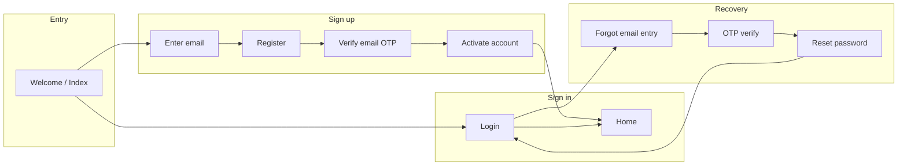

# Mobile auth screens specification

**Master journey (UX, all states and edge cases):** [`specs/api/mobile-flow.md`](../api/mobile-flow.md) — Registration (§4A), Activation (§4B), entry points (§3), interruptions (§7), feedback patterns (§9). **Account model:** no guest account; marketing/sign-in only until the user has a real session.

This document specifies the authentication-related **implementation** in `apps/mobile` using the following taxonomy: **Structure**, **Components**, **Design system and tokens**, **Variants**, **States**, **Constraints**, **Functionality (actions)**, **Behaviour or interactivity**, **Flow**, **Output**, **Code quality**, and **Testing**. It reflects the current Expo Router layout and components as implemented; gaps (stubs, TODOs) are called out under **Constraints**.

---

## Structure

### Navigation shell

- **Auth stack:** `app/auth/_layout.tsx` — Expo Router `Stack` with `headerShown: false`, `contentStyle.backgroundColor: theme.colors.grey[950]`, and a `Stack.Screen` entry named `create-account` with `presentation: 'formSheet'`.
- **Layout vs routes:** The repo’s file-based route for account creation is `app/auth/register.tsx` (`/auth/register`). The `create-account` screen name in `_layout` does not match a `create-account.tsx` file; until that is reconciled, `formSheet` options may not apply to registration. Treat as **implementation drift** (see **Constraints**).
- **Entry / marketing:** `app/index.tsx` — welcome-style screen (hero image, logo, tagline, primary and outline CTAs). Not under `/auth` but part of the unauthenticated path.
- **Per-route screens:** thin route files compose `ScreenView`, `SharedHeader`, optional `TermsAndConditions`, and a focused form component.

### Route inventory (`app/auth/`)

| Route file                       | Purpose                                                                  |
| -------------------------------- | ------------------------------------------------------------------------ |
| `login.tsx`                      | Email/password login; terms; login form.                                 |
| `register.tsx`                   | Create account (name, email, password); leads to verify email.           |
| `verify-email.tsx`               | Post-signup email OTP.                                                   |
| `activate-user-account.tsx`      | Account activation placeholder.                                          |
| `enter-email.tsx`                | Collect email; continues to `register` (stores email in register store). |
| `request-password-otp.tsx`       | Password reset OTP request (minimal / stub).                             |
| `reset-password-otp-request.tsx` | Alternate OTP request shell (stub).                                      |
| `reset-password.tsx`             | New password shell (stub).                                               |

### Layering

- **Routes:** orchestration only (no business logic heavy lifting).
- **Forms:** `components/containers/auth/forms/*` — `react-hook-form` + Zod.
- **Cross-cutting:** `api/hooks/useAuth.tsx` (mutations, navigation side effects), `stores/*` (register, user, OTP), `services/storage-service` and `secure-storage` for persistence where wired.

---

## Components

### Layout and chrome

| Component            | Path                                             | Role                                                                                                                    |
| -------------------- | ------------------------------------------------ | ----------------------------------------------------------------------------------------------------------------------- |
| `ScreenView`         | `components/layouts/screenview.tsx`              | `SafeAreaView` wrapper; `paddingHorizontal: theme.sizes.spacing.md`, vertical `gap: theme.sizes.spacing.lg`, `flex: 1`. |
| `SharedHeader`       | `components/containers/shared/headers.tsx`       | Centered title; optional `variant` (`auth` \| `home` \| `playlist`); bottom border `grey[800]`.                         |
| `TermsAndConditions` | `components/containers/auth/TermsConditions.tsx` | Legal copy / links where required on auth steps.                                                                        |

### Forms and inputs

| Component                          | Used on                                         |
| ---------------------------------- | ----------------------------------------------- |
| `LoginForm`                        | Login                                           |
| `SignUpform` (`register-form.tsx`) | Register                                        |
| `VerifyEmailForm`                  | Verify email                                    |
| `EnterEmailForm`                   | Enter email                                     |
| `FormInput`                        | Text fields with optional left icon (Iconsax).  |
| `OTPFormInput`                     | Single-field OTP on verify screen.              |
| `Button`                           | Primary actions; supports loading and variants. |

### Optional / partial

| Component       | Notes                                                                         |
| --------------- | ----------------------------------------------------------------------------- |
| `OAuth`         | Apple / Google placeholders (`TODO` in handlers); divider (“or”) layout.      |
| `ChangeData`    | Copy + “(Change)” for email; not wired to live store in all screens.          |
| `AuthHeader`    | Legacy/alternate header in `components/containers/auth/`.                     |
| `WelcomeScreen` | Exists under `screens/Auth/`; root welcome is implemented in `app/index.tsx`. |

---

## Design system and tokens

### Source of truth

- **Theme:** `constants/theme.ts` aggregates `colors`, `typography`, `sizes`, and static layout helpers (`FLEX`, `BACKGROUND_COLOR`).
- **Responsive hook:** `useTheme()` extends theme with `dimensions` and grid-related layout (image width/height, `RESPONSIVE_SIZE`). Auth screens primarily use static `theme`.

### Colors (`constants/colors.ts`)

- **Neutrals:** `grey[50]`–`grey[950]` (auth stack background uses `grey[950]` in `_layout`).
- **Accent:** `teal` scale — primary buttons use `teal[500]` (see `Button` primary variant).
- **Semantic / links:** `blue[300]` used for inline emphasis on verify copy; `red` scale available for errors.
- **Text on dark:** headers often use `white[50]`; muted body uses `grey[200]` etc.

### Typography (`constants/typography.ts`)

- **Family:** Matter (weights100–900, italic pairs).
- **Usage:** `Text` component consumes `typography.*` keys; screen copy aligns with `sizes.typography.*` for scale.

### Sizes (`constants/sizes.ts`)

- **Typography scale:** `xs` … `7xl` (numeric px).
- **Spacing:** `xs`–`2xl` (used for padding, gaps, button height).
- **Radius:** `xs`–`full` (buttons use `radius.xs`).
- **Screen:** `width` / `height` from `Dimensions.get('screen')`; register form uses `screen.width * 0.45` for split name fields.

### Motion

- **Button:** `react-native-reanimated` press and color interpolation in `components/ui/button.tsx`.

---

## Variants

### Button (`components/ui/button.tsx`)

- **`primary`:** `backgroundColor: teal[500]`, label `grey[800]`.
- **`outline`:** border `grey[100]`, label `grey[100]` — used for secondary CTA (e.g. Login on welcome).
- **`secondary`:** reserved / minimal styling in switch.
- **`ghost`:** `grey[600]` fill, `grey[100]` text.
- **Props:** `isLoading`, `leftIcon` / `rightIcon`, `containerStyle` overrides (OAuth uses outline + custom border radius/color).

### Header

- Default: centered title, full-width bottom border.
- **`playlist`:** row layout with optional left/right slots.

### ScreenView

- Optional `screenStyle` merge for one-off spacing (e.g. `enter-email` sets `marginTop: 0`).

---

## States

### Global / session

- **Signed in vs not signed in:** `useAuthStore` / `useUserStore` (implementation split across stores); persisted slice for user/token in auth store. There is **no** guest or anonymous account; unauthenticated users only see pre-auth routes until they register and activate (see master journey doc).
- **First launch:** `isFirstTimeUser` in auth store + MMKV key when cleared.

### Per control

- **Submit disabled:** forms use `disabled={!form.formState.isValid}` on primary `Button` until Zod-valid.
- **Loading:** `Button.isLoading`; welcome/index uses `disabled` + `isLoading` while fake delay runs.
- **OTP / resend:** `useAuth` implements countdown for forgot-password flow (`setResendCountdown`); verify-email UI shows static “Resend Code” text (wire-up may differ).

### Error and empty

- **API errors:** `handleMutationError` + toast (`components/ui/toast`) in `useAuth` mutations.
- **Edge redirects:** login/register/activate mutations branch on `status` (e.g. `206` → activate, `400` → register).

---

## Constraints

### Product and platform

- **Safe areas:** All stack auth content should respect `ScreenView` / Safe Area; full-bleed welcome uses custom container — verify notch and home indicator.
- **Keyboard:** Forms should keep primary action reachable (scroll + `KeyboardAvoidingView` if missing — audit on small devices).
- **Biometric / secure token:** `secureStorage` used on logout reset; full login token persistence paths include commented legacy — implementation must be consistent before release.

### Implementation gaps (current codebase)

- **Auth stack screen name:** `_layout.tsx` registers `create-account` as `formSheet`; signup is implemented at `register.tsx`. Rename the screen to `register` or add `create-account.tsx` that re-exports the same UI so presentation options apply.
- **Welcome / login shortcuts:** `app/index.tsx` and `login-form.tsx` use `router` navigation (and timeouts on index) without always calling `useAuth` mutations — spec target is: **all sign-in/sign-up paths go through validated API + store updates**.
- **Password reset routes:** `request-password-otp`, `reset-password-otp-request`, `reset-password` are mostly shells (`SharedHeader` + `TermsAndConditions` only).
- **Verify email:** displays placeholder email string; “Change” is static — must bind to `useRegisterStore` / session email.
- **Activate screen:** placeholder copy only.
- **OAuth:** handlers log only; no provider configuration in spec until implemented.

### Accessibility

- **Touch targets:** Buttons use fixed height (`sizes.spacing["2xl"]`) — meet minimum 44pt where platform requires.
- **Labels:** Ensure `FormInput` / OTP fields expose accessibility labels and error text.

### Media

- **Image upload:** Not part of current auth routes. If added (e.g. avatar on register), treat as optional step: picker permissions, max size, crop rules, and upload progress — see **Functionality**.

---

## Functionality — actions

Document each user-visible action with **trigger**, **preconditions**, **system effect**, and **destination**.

| Action                                  | Preconditions               | Effect                                                                                              | Navigation / output                                                                                                                            |
| --------------------------------------- | --------------------------- | --------------------------------------------------------------------------------------------------- | ---------------------------------------------------------------------------------------------------------------------------------------------- |
| Open app (welcome)                      | Cold start                  | Fonts/splash from root layout; optional delay                                                       | Stay on index or auto-route per product rules                                                                                                  |
| Create Account (welcome)                | None                        | Should start signup                                                                                 | **Current:** `router.push('/auth/enter-email')` after a short delay. **Target:** same path with real loading from mutation if needed.          |
| Login (welcome)                         | None                        | Should open login                                                                                   | **Current:** `router.push('/home')` after delay (bypasses `/auth/login`). **Target:** `/auth/login` unless session restore sends user to home. |
| Submit login                            | Valid email/password schema | Call login API; persist user/session; clear player UI flags in form                                 | Success: `/home`; errors: toast; special statuses: activate/register                                                                           |
| Submit register                         | Valid signup schema         | Persist email in register store; advance flow                                                       | Current: `/auth/verify-email` (API may be separate step)                                                                                       |
| Submit email (enter-email)              | Valid email                 | Send or store for next step                                                                         | Per `EnterEmailForm` implementation                                                                                                            |
| Submit email OTP                        | Valid OTP schema            | Verify with API                                                                                     | Target: onboarding (e.g. `/onboarding/select-ministers`) when wired                                                                            |
| Resend OTP                              | Cooldown elapsed            | Mutation resend                                                                                     | Reset inputs; restart countdown                                                                                                                |
| Forgot password                         | Email known                 | Send OTP                                                                                            | Step `otp` in forgot-password store                                                                                                            |
| Reset password                          | OTP + new password          | `ResetPasswordMutation`                                                                             | Success: `/login`                                                                                                                              |
| Logout                                  | Authenticated               | Clear user, token, secure storage; invalidate queries                                               | `/login`                                                                                                                                       |
| Change email (verify)                   | OTP screen                  | Return to email entry with state cleared                                                            | Router back + store update                                                                                                                     |
| **Upload an image (optional / future)** | Auth or onboarding policy   | Pick from library/camera; validate MIME/size; optional crop; upload to storage; show progress/error | Updated avatar URL in user profile — **not in current auth screens**; specify when adding                                                      |

---

## Behaviour or interactivity

- **Validation:** On change/submit via `react-hook-form` + Zod (`validation/login.ts`, `validation/signup.ts`, `validation/otp.ts`). Errors should surface on fields where `FormInput` supports error props.
- **Primary CTA:** Disabled until valid reduces accidental API calls.
- **Loading:** Buttons show `Loader`; duplicate taps should be suppressed while `isLoading`.
- **Toasts:** Success and error feedback from mutations (`useAuth`).
- **Back navigation:** Stack back gesture / header back (if added) should preserve draft form policy per screen.
- **Deep links:** Magic links / reset links should land on `reset-password` or `activate-user-account` with token query params — define when backend contract is fixed.

---

## Flow

### Target happy paths (logical)

### Implementation notes

- **Today:** several arrows are stubbed or navigate to onboarding/home without API (`login-form`, `verify-email-otp`). The diagram is the **contract** the app should converge on.

---

## Output

### Client-side artifacts

- **Stores:** User profile fields after login/activate (`useUserStore` / auth store); register email in `useRegisterStore`.
- **Storage:** `storage-service` keys for email, user id, user type; `secureStorage` cleared on logout; MMKV for first-time flag.
- **React Query:** `auth` query keys invalidated on logout.
- **UI feedback:** Toaster messages for mutation results.

### Server expectations (reference)

- Login/register/activate return user + token payload shape consumed in `useAuth` (`IAPIResponse`).
- HTTP statuses drive branching (`206` incomplete activation, `423` locked, etc.) — document in API spec separately; mobile must handle each with a single clear screen.

---

## Code quality

- **Single responsibility:** Route files stay thin; forms own field layout and submit handlers calling hooks or services.
- **Types:** DTOs (`dtos/user.dto.tsx`, `dtos/auth.dto.tsx`) and Zod-inferred types for forms — avoid `any` on API responses at boundaries.
- **Consistency:** Prefer `theme` tokens over hard-coded hex in new auth UI; align icon size (e.g. 20) and `grey[400]` for inactive icons with existing forms.
- **Dead code:** Remove duplicate welcome implementations (`WelcomeScreen` vs `index`) once one path is canonical.
- **Security:** Do not log passwords or OTPs; store tokens only in secure storage when enabling full auth.

---

## Testing

### Unit

- Zod schemas: invalid emails, short passwords, OTP length.
- Pure helpers: countdown, redirect mapping from HTTP status (extract if logic grows).

### Component

- `LoginForm` / `SignUpform`: render fields, submit calls mock mutation, button disabled when invalid.
- `Button`: variants and loading state (no double submit).

### Integration / E2E

- Full flows: register → verify → activate → home; login → home; forgot password → reset → login.
- Cold start: persisted session restores to home; cleared session shows welcome/login.
- **Visual regression (optional):** welcome and auth stack on small/large phones.

### Manual checklist

- [ ] Safe area on notched devices for all auth routes
- [ ] Keyboard does not obscure primary button
- [ ] Airplane mode shows actionable error
- [ ] Logout clears sensitive data and cannot return to `/home` without re-auth

---

## Revision history

- **2026-04-14:** Spec from `apps/mobile` audit; section taxonomy (Structure through Testing) explicit in intro; `create-account` vs `register` layout drift documented; welcome/login and enter-email flows synced to current route code.
