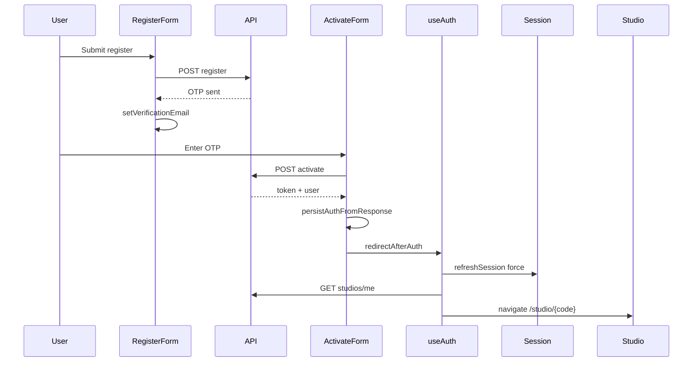
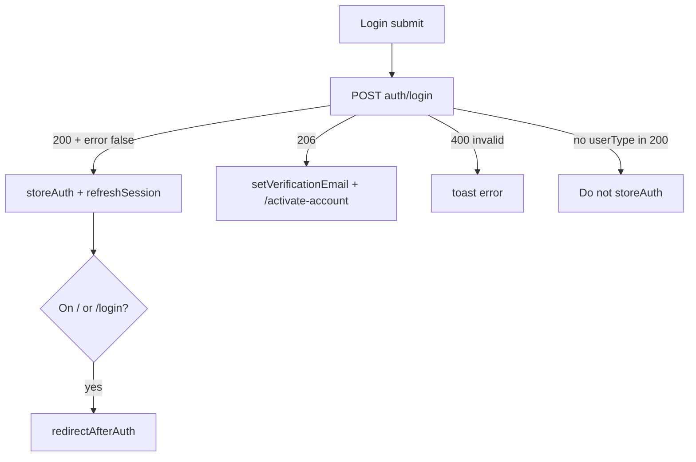

# feat-0001: Tech Spec — Web authentication and session

## Context

See [`PRODUCT.md`](./PRODUCT.md) for consumer-visible invariants. This document maps them to the current `apps/web` implementation and API contracts.

### Route and path anchors

| Concern | File | Notes |
|--------|------|--------|
| Canonical paths | `apps/web/src/routes/paths.ts` | `PATH_LOGIN`, `PATH_REGISTER`, `PATH_ACTIVATE_ACCOUNT`, `AUTH_PUBLIC_PATHS`, `isAuthEntryRedirectPath` (root + login only) |
| Auth route constants | `apps/web/src/constants/auth-routes.ts` | `AUTH_ROUTES` re-exports |
| Public app routes | `apps/web/src/routes/app.route.tsx` | Login, register, activate, verify-otp, forgot, reset, unauthorized |
| Auth gate | `apps/web/src/routes/routes.tsx` (32–72) | `AuthGate`: session → role hydrate → unauthorized |
| Dashboard shell | `apps/web/src/routes/dashboard.route.tsx` | `INTERNAL_PORTAL_ROLES` |
| Admin shell | `apps/web/src/routes/admin.route.tsx` | `ADMIN_PORTAL_ROLES` |
| Studio nested routes | `apps/web/src/routes/studio.route.tsx` | `/studio/:studioCode/...` |
| Minister onboarding | `apps/web/src/routes/minister.route.tsx` | `/get-started/...` |

### Session and redirect anchors

| Concern | File | Notes |
|--------|------|--------|
| Primary auth hook | `apps/web/src/hooks/app/useAuth.ts` | `login`, `register`, `redirectAfterAuth`, mount effect (122–137), `login` 200/206 (194–248) |
| Post-auth routing | `useAuth.ts` (72–114) | Admin → minister onboarding → `navigateToStudioPortal` → unauthorized |
| Studio entry | `apps/web/src/utils/studio-portal.util.ts` | Cache code, `getMyStudio`, fallback `/get-started` |
| Role helpers | `apps/web/src/utils/roles.util.ts` | `INTERNAL_PORTAL_ROLES`, `isAdminPortalRole`, `isStudioContentRole` |
| Onboarding gate | `apps/web/src/utils/minister-onboarding.util.ts` | `isMinisterOnboardingComplete` |
| Session refresh | `apps/web/src/context/session/sessionState.tsx` | `refreshSession`, `SessionHydrator` |
| Auth persist | `apps/web/src/api/services/local-storage.ts` | `storeAuth`, `setVerificationEmail`, `persistAuthFromResponse` |
| Clear session | `apps/web/src/utils/auth-session.util.ts` | `clearLocalAuth` |
| Session routing (headless) | `apps/web/src/context/session/AuthSessionRouting.tsx` in `App.tsx` inside `<Router>` | No UI; `/` → login via route; entry redirect on `/` + `/login` |

### Form anchors

| Flow | Component |
|------|-----------|
| Login | `apps/web/src/components/shared/auth/login-form.tsx` |
| Register | `apps/web/src/components/shared/auth/register-form.tsx` |
| Activate | `apps/web/src/components/shared/auth/activate-account.tsx` |
| OTP | `apps/web/src/components/shared/auth/otp-form.tsx` |
| Forgot | `apps/web/src/components/shared/auth/forgot-password.tsx` |
| Reset | `apps/web/src/components/shared/auth/reset-password.tsx` |
| Change password | `apps/web/src/components/shared/auth/ChangePasswordForm.tsx` (profile) |

### API client

| Concern | File |
|--------|------|
| Auth endpoints | `apps/web/src/api/clients/auth.ts` |
| Envelope toasts | `apps/web/src/api/core/api-envelope-toast.ts` — `isApiHttp2xxErrorEnvelope`, `toastIfApiEnvelopeError` |
| Axios | `apps/web/src/api/core/axios.tsx` |

### Backend (login/register contract)

| Concern | File |
|--------|------|
| Login | `apps/api/src/controllers/auth.controller.ts` (`loginUser` ~210–280) |
| Register | `auth.controller.ts` (~40–122) |
| Password match | `apps/api/src/services/auth.service.ts` `matchEncryptedPassword` |
| User password field | `apps/api/src/models/user.model.ts` — `password: { select: false }` (required for persist) |

### PRODUCT behavior mapping (implementation)

| Behavior range | Implementation |
|----------------|----------------|
| 1–5, 92, 100 | `paths.ts`, `useAuth` effect 122–129, `AuthGate` 46–53 |
| 3, 37–47, 88–91 | `redirectAfterAuth`, `studio-portal.util.ts`, `roles.util.ts` |
| 6–13, 94–95 | `register-form.tsx`, `useAuth.register`, API `registerUser` |
| 14–20, 98 | `activate-account.tsx`, `persistAuthFromResponse`, `redirectAfterAuth` |
| 21–23, 99 | `otp-form.tsx`, `Verification` route; no persist on standalone success |
| 24–36, 89, 96 | `login-form.tsx`, `useAuth.login` |
| 29, 89 | Login `status === 206` → `setVerificationEmail`, `PATH_ACTIVATE_ACCOUNT` |
| 48–56 | `forgot-password.tsx`, `reset-password.tsx`, `useAuth` forgot/reset |
| 57–61 | `ChangePasswordForm`, `PATH_CHANGE_PASSWORD` in `minister.route.tsx` |
| 62–67, 93, 97 | `routes.tsx` `AuthGate`, `dashboard.route.tsx`, `admin.route.tsx` |
| 68–70 | `sessionState.tsx`, `SessionHydrator` |
| 71–73, 85 | `useAuth.logout`, `logoutUser`, `clearLocalAuth` |
| 74–78 | Axios + session hydrate error handling |
| 79–82 | Form `submitting` / `setLoading`, gate loading UI |
| 83–86 | API status codes 206, 423, 403 surfaced in controllers |
| 95 | API `user.model` password field + `encryptUserPassword` + `resetPassword` save |

## Proposed changes

**Implemented (feat-0001):**

1. **Password persistence (API)** — `password` on User schema; encrypt after role attach; reset saves.
2. **Listener UX** — `auth-redirect.util.ts` + `Unauthorized.tsx` with mobile-app copy (`UNAUTHORIZED_REASON_LISTENER`).
3. **`state.from`** — `canAccessReturnPath` + `redirectAfterAuth({ returnTo })` on login and entry-path session effect.
4. **Dead code** — Removed unused `useAuth.redirect(roles)`.
5. **Forgot-password errors** — Toasts when `data.error` on 2xx envelope (respecting `isApiHttp2xxErrorEnvelope`).
6. **Post-login redirect** — `login()` calls `redirectAfterAuth` after 200; session effect depends on `isLoggedIn`.
7. **Role gate copy** — `AuthGate` passes `state.message` to unauthorized for wrong role.

## End-to-end flows

### Register → activate → studio (minister)

### Login active vs inactive

## Risks and mitigations

| Risk | Mitigation |
|------|------------|
| Post-auth races before minister/studio hydrate | `redirectAfterAuth` awaits `refreshSession({ force })`; gate shows Loading while hydrating (Behavior 63) |
| Wrong studio segment in URL | `navigateToStudioPortal` uses `StudioResponseDTO.code` only (Behavior 41) |
| Double toasts | Forms check `isApiHttp2xxErrorEnvelope` (Behavior 78, 96) |
| Legacy passwords missing in DB | Forgot-password reset path (Behavior 95); manual QA on pre-fix accounts |
| Listener signs into web | Unauthorized by design; open question for copy (Behavior 43) |

## Testing and validation

Manual and automated checks mapped to PRODUCT behaviors:

| Behaviors | Verification |
|-----------|----------------|
| 1–5 | Logged out: visit each public path → no redirect to login; visit `/studio/foo` → login |
| 6–13 | Register new minister email → OTP message → activate route; duplicate email → error |
| 14–20 | Activate with valid/invalid OTP; resend OTP; minister → get-started if onboarding incomplete |
| 21–23 | `/verify-otp` success → lands login without studio |
| 24–36 | Login active → studio/admin; wrong password → error; 206 → activate + email stored |
| 37–47 | Matrix: admin → `/admin/users`; minister incomplete → `/get-started`; creator → `/studio/{code}`; listener → `/unauthorized` |
| 48–56 | Full forgot → OTP → reset → login with new password |
| 57–61 | Signed-in change password success/fail |
| 62–67 | Direct URL admin as minister → unauthorized; no token → login |
| 68–74 | Hard refresh with token → profile hydrated; logout → login, storage empty |
| 75–78 | Open `/unauthorized` as wrong role; trigger API error → single toast |
| 79–82 | Keyboard submit, loading states visible |
| 83–86 | Lock account after 5 fails (API); inactive → 206 path |
| 87–100 | Regression checklist before merge; run on staging with real email |

**API integration (recommended):**

- Register + activate + login e2e against local API with Mailhog or logged OTP.
- Login returns 200 only when `isActive` and password matches encrypted store.

**Unit (web):**

- `normalizeUserType` / `roleMatchesAllowList` token normalization (`routes.tsx`, `useAuth.ts`).
- `isMinisterOnboardingComplete` edge cases.
- `navigateToStudioPortal` fallback when `getMyStudio` returns no code (mock API).

## Follow-ups

- Implement `state.from` post-login redirect if approved (Open question 3).
- Listener-specific web messaging (Open question 1).
- E2E Playwright suite for auth happy paths (not in repo today).
- Remove or wire `useAuth.redirect(roles)`.

## Reference specs

- Template depth: `specs/web/feature/feat-0000/PRODUCT.md` (Warp APP-1915 style)
- Legacy outline: `specs/web/00 - authentication.md` (empty; superseded by this feature folder)
- Mobile parity: `specs/mobile/00 - auth.md`, `specs/api/web-flow.md`
- [feat-0003](../../auth/feature/feat-0003/PRODUCT.md) — admin/super-admin login yes, public register no
