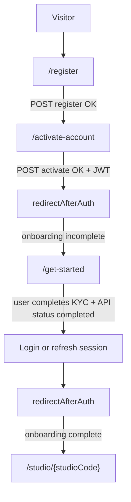
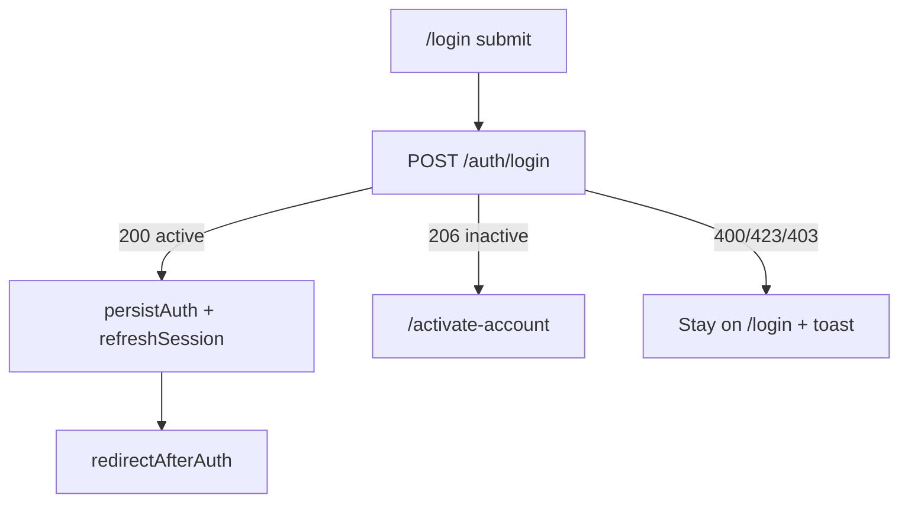
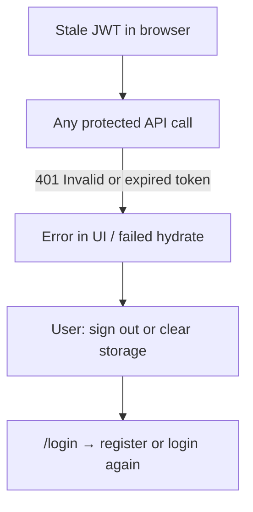

# feat-0009: Web authentication and minister onboarding routing

## Summary

This spec defines **every navigation and redirect** the Troott web app (`apps/web`) must perform during authentication, session bootstrap, role-based portal entry, and minister **Get Started** onboarding. It consolidates and extends [feat-0001](../feat-0001/PRODUCT.md) (auth flows) with minister onboarding routes and post-auth ordering in one routing contract.

## Problem

Routing logic is distributed across forms (`login-form`, `register-form`, `activate-account`), headless session effects (`AuthSessionRouting`, `SessionHydrator`), route guards (`AuthGate`), and `useRedirectAfterAuth`. Without a single routing map, teams cannot tell whether a bug (e.g. landing on studio with “Invalid or expired token”, or skipping `/activate-account` after register) is a product gap or implementation drift.

## Non-goals

- Mobile app routing (`apps/mobile`).
- API request/response schemas (except HTTP status codes that **trigger** a route).
- Studio upload wizard step routing inside `/studio/:studioCode/sermons/upload/...` (see [feat-0008](../feat-0008/PRODUCT.md)).
- Admin CRUD navigation beyond default admin home.
- OAuth / social sign-in (UI disabled).
- Automatic repair of legacy bookmarks (`/dashboard`, `/activate`, etc.).

## Consumer

Ministers and creators using the web portal; platform admins and super-admins; internal QA.

## Canonical path reference

All paths below are defined in [`apps/web/src/routes/paths.ts`](../../../../apps/web/src/routes/paths.ts) and exposed to UI via [`apps/web/src/constants/auth-routes.ts`](../../../../apps/web/src/constants/auth-routes.ts) as `AUTH_ROUTES` where applicable.

### Public (no session required)

| Path | Purpose |
|------|---------|
| `/` | Redirects to `/login` |
| `/login` | Sign in |
| `/register` | Create account (minister by default on register page) |
| `/activate-account` | Register OTP activation (issues JWT on success) |
| `/verify-otp` | Standalone OTP verify (alternate entry; not primary after register) |
| `/forgot-password` | Password recovery (email + OTP steps) |
| `/reset-password` | Set new password after recovery OTP |
| `/preview`, `/no-network` | System / preview |
| `/open/sermon/:sermonId` | Public sermon preview |

### Authenticated — global (not studio-scoped)

| Path | Purpose |
|------|---------|
| `/get-started` | Minister/creator onboarding hub (accordion checklist) |
| `/get-started/verify-account` | Account verification intro |
| `/get-started/verify-account/personal-information` | Personal information |
| `/get-started/verify-account/verify-document` | Document verification (nested sub-steps) |
| `/get-started/home-address` | Home address |
| `/get-started/ministry-input` | Ministry profile |
| `/get-started/tour-guide` | Product tour |
| `/profile` | User profile |
| `/profile/change-password` | Change password while signed in |

### Authenticated — studio (minister / creator)

| Path pattern | Purpose |
|--------------|---------|
| `/studio/:studioCode` | Studio home (dashboard) |
| `/studio/:studioCode/sermons` | My sermons |
| `/studio/:studioCode/sermons/upload` (+ file, details, thumbnail, publish segments) | Upload wizard |
| `/studio/:studioCode/sermons/:sermonId` (+ `/resume`, `/edit`) | Sermon detail |
| `/studio/:studioCode/analytics`, `/bin` | Analytics, bin |

### Authenticated — admin

| Path | Purpose |
|------|---------|
| `/admin` | Admin home |
| `/admin/users` | Default post-auth destination for admin roles |
| `/admin/sermons`, `/admin/sermons/minister/:ministerId` | Admin sermon views |

### System

| Path | Purpose |
|------|---------|
| `/unauthorized` | Signed in but wrong role or unknown portal role |
| `*` (not found) | 404 |

**Not auth routes:** `/get-started/...` is **private minister onboarding**, not email OTP activation. API `POST /auth/activate` has no dedicated page path.

---

## Behavior

### A. Global session rules

1. **No session** means no valid `token` + `userID` in local storage (see `storage.checkToken()` and `storage.checkUserID()`).

2. A visitor **without** a session who opens any path **not** listed as public (section “Public”) is redirected to **`/login`** with `state.from` set to the attempted path. Local auth artifacts are cleared first so stale JWTs do not linger.

3. A visitor **with** a session who opens **`/`** or **`/login`** is sent through **post-auth routing** (section F); they do not remain on login.

4. A visitor **with** a session on other **public auth paths** (`/register`, `/activate-account`, `/forgot-password`, etc.) is **not** auto-redirected away by the global session effect; they can complete that funnel unless a form navigates elsewhere.

5. On app load with a session, **session hydration** runs once (`SessionHydrator` → `refreshSession`) to load user, minister, creator, studio, or admin context as applicable.

6. **Logout** always clears local auth and navigates to **`/login`**, regardless of API logout success.

7. After a **database wipe** or user deletion, a stale browser session may produce API **401** (“Invalid or expired token”). The user must sign out or clear site data and sign in again; routing must not treat that as a successful portal entry.

### B. Registration routing

8. Successful **`POST /auth/register`** (`error: false`): user is **not** signed in; verification email is stored; success toast; navigate to **`/activate-account`**.

9. Failed register (validation, duplicate email, OTP email failure, network): user **stays on `/register`**; error toast; **no** navigation to activate.

10. Register must **not** navigate to studio, admin, or `/get-started` on success.

11. **Recommended hardening (product):** clear any stale local auth at the start of register success before navigating to activate, so old JWTs cannot confuse hydration (see Open questions).

### C. Account activation routing (`/activate-account`)

12. Activation requires stored verification email; if missing → toast + navigate to **`/register`**.

13. Successful **`POST /auth/activate`** with token in response: persist session; run **post-auth routing** immediately (section F). Minister with incomplete onboarding must land on **`/get-started`**, not studio.

14. Successful activate **without** token: user is **not** silently signed in; direct to **`/login`** explicitly.

15. Failed activation: remain on **`/activate-account`** with error toast.

16. Resend OTP on activate: stay on activate; no sign-in until activation succeeds.

### D. Standalone `/verify-otp`

17. Successful verify on **`/verify-otp`**: navigate to **`/login`**, not studio/admin, unless activation already persisted a session through another path.

18. `/verify-otp` does **not** replace `/activate-account` as the primary post-register path.

### E. Login routing

19. Successful login **HTTP 200**, `error: false`, recognized portal user type: persist auth, refresh session, set cookies; if current path is **`/`** or **`/login`**, run **post-auth routing**.

20. Login **HTTP 206** (inactive account, `!isActive`): store verification email; navigate to **`/activate-account`**; **do not** persist full session as active user.

21. Login **400** invalid credentials / account not found: stay on login; toast.

22. Login **423** locked: stay on login; distinct message.

23. Login **403** deactivated: stay on login; distinct message.

24. Login **200** but missing/unsupported `userType`: **do not** persist auth; stay on login.

25. **Listener** or generic **user** type on **200**: may persist per API but post-auth sends to **`/unauthorized`** with listener-specific copy (web is not the listener product).

### F. Post-auth routing order (authoritative)

When `redirectAfterAuth` runs (after login on `/` or `/login`, after activation persist, or from `AuthSessionRouting` on entry paths), apply this **strict order**:

| Step | Condition | Destination |
|------|-----------|-------------|
| 1 | No token / user id | `/login` |
| 2 | Refresh session (force when just authenticated) | — |
| 3 | Listener-like user type | `/unauthorized` (`reason: listener-portal`) |
| 4 | `state.from` / return path safe for role | That path (replace) |
| 5 | Admin or super-admin | `/admin/users` |
| 6 | Minister or creator, onboarding **incomplete** | `/get-started` |
| 7 | Minister or creator, onboarding **complete** | `/studio/{studioCode}` (see G) |
| 8 | Unknown / empty role after refresh | `/unauthorized` |

**Precedence:** Admin beats minister onboarding beats studio. Minister onboarding is evaluated only for `userType === minister` (creator uses creator onboarding rules in code).

**Replace navigation:** use `replace: true` for entry redirects from `/` and `/login` so Back does not return to login with an active session.

### G. Studio entry routing (after onboarding complete)

26. Studio URL uses **public studio `code`** in the path: `/studio/{code}/...`, never Mongo user id.

27. **Order for resolving `{code}`:**
   - Prefer cached `studioCode` in local storage or `StudioContext` if present.
   - Else `GET /studios/me` (or equivalent “my studio” API); cache code on success.
   - If no studio available → **`/get-started`**, not `/unauthorized` and not a blank studio shell.

28. `StudioPortal` may resolve studio by route param via `GET /studio/:code` when context cache does not match; on failure show API message (e.g. auth errors) inline, not a silent redirect.

### H. Forgot password and reset routing

29. **`/forgot-password`**: multi-step (email → OTP → success); store email on success; OTP type is **forgot-password**, not register.

30. After OTP success on forgot flow → user can continue to **`/reset-password`**.

31. **`/reset-password`**: requires stored email; else redirect **`/forgot-password`**.

32. Successful reset → success feedback → **`/login`**; user is **not** auto-signed in.

33. Forgot/reset must not leave an active portal session mid-flow unless product explicitly changes.

### I. Route protection (AuthGate)

34. Routes with `isAuth: true` without a session → **`/login`** with `state.from`.

35. Routes with `roles: [...]` show **Loading…** while session/role hydrate, then:
   - Role matches → render route.
   - Role does not match → **`/unauthorized`** (not login).

36. Dashboard parent (`DashboardLayout`) allows **internal portal roles**: admin, super, minister, creator.

37. Admin subtree allows **admin portal roles only**.

38. **`/get-started`** and **`/profile`** require auth; ministers mid-onboarding must still reach get-started when post-auth sends them there.

### J. Minister onboarding (Get Started) routing

39. **Completion signal (server):** minister onboarding is complete when `minister.onboarding.status === 'completed'` (API). Until then, post-auth routing sends ministers to **`/get-started`**.

40. **Get Started hub** (`/get-started`): checklist UI driven by [`apps/web/src/_data/onboarding.tsx`](../../../../apps/web/src/_data/onboarding.tsx). User navigates manually via buttons to sub-routes (verify account, home address, ministry, tour, upload sermon). Local `onboarding_progress` in localStorage tracks UI checklist only; it does **not** replace server onboarding status for post-auth.

41. **Onboarding sub-routes** (all under auth, nested in dashboard layout):

| Step (product) | Route |
|----------------|-------|
| Verify account (hub) | `/get-started/verify-account` |
| Personal information | `/get-started/verify-account/personal-information` |
| Document verification | `/get-started/verify-account/verify-document` (+ `document1`, `select`, `upload` children) |
| Home address | `/get-started/home-address` |
| Ministry profile | `/get-started/ministry-input` |
| Tour | `/get-started/tour-guide` |
| Upload first sermon (links) | `/studio/{code}/sermons/upload/...` (requires studio code in storage) |

42. Completing onboarding steps in the UI does **not** automatically run post-auth again; when API marks minister onboarding complete, the next login or a manual navigation to studio should use **post-auth** or sidebar “Studio” links.

43. **Upload sermon** links from onboarding require a resolvable studio code in storage; if missing, paths may use a placeholder segment until studio is loaded.

44. Minister onboarding must **not** be skippable via post-auth while `onboarding.status !== 'completed'` except via direct URL entry (user can open studio URL manually; API may still deny actions).

### K. Deep link return (`state.from`)

45. After AuthGate redirect to login, attempted path is stored in `location.state.from`.

46. After successful login/activation, if `from` is **safe** and **allowed for role**, navigate there instead of default home.

47. Safe return paths: must be in-app, not public auth paths, not `/login` or `/unauthorized`. Role rules:
   - `/admin/*` → admin roles only.
   - `/studio/*` → studio content roles only.
   - `/get-started/*` → minister, creator, or admin.
   - `/profile/*` → internal portal roles.

### L. Unauthorized

48. **`/unauthorized`**: user may still have a valid session.

49. Listener accounts see mobile-app guidance; other roles see generic “no access to this area”.

50. Links: sign out, back to login (non-listener).

---

## End-to-end flow diagrams

### New minister (happy path)

### Login inactive vs active

### Session without valid user (after DB wipe)

---

## Acceptance criteria (routing)

- [ ] Register success always navigates to `/activate-account` when `error: false`.
- [ ] Login 206 always navigates to `/activate-account` without persisting active session.
- [ ] Login/activation 200 for minister with incomplete onboarding always lands on `/get-started`, not studio.
- [ ] Login/activation 200 for admin always lands on `/admin/users`.
- [ ] Login/activation 200 for listener always lands on `/unauthorized`.
- [ ] Unauthenticated access to `/studio/foo` redirects to `/login` with `from` set.
- [ ] Wrong role on `/admin/*` redirects to `/unauthorized`, not login.
- [ ] Forgot → reset → login path never auto-enters studio.
- [ ] `/verify-otp` success goes to `/login` unless already activated via `/activate-account`.

---

## Open questions

1. Should register success **clear stale auth** before navigating to activate? **Recommendation:** yes, to avoid hydrate errors after DB reset.
2. Should incomplete onboarding **block** manual `/studio/:code` URLs (redirect to get-started)? **Current:** post-auth blocks; manual URL may still open studio shell.
3. Should local checklist progress sync to server onboarding status? **Current:** server `minister.onboarding.status` is authoritative for post-auth only.
4. Creator onboarding completion uses creator profile or `user.onboard.status`; document separately if creator KYC diverges from minister paths.

---

## Related specs

- [feat-0001](../feat-0001/PRODUCT.md) — Auth forms, session, errors (behaviors 1–100).
- [feat-0003](../feat-0003/PRODUCT.md) — Admin vs self-service registration boundaries.
- [feat-0008](../feat-0008/PRODUCT.md) — Studio upload routing (subpaths under studio).
- [`apps/web/docs/auth-routes.md`](../../../../apps/web/docs/auth-routes.md) — Short path cheat sheet.
