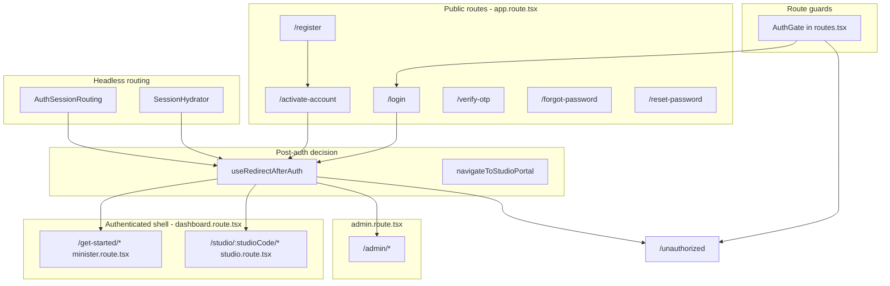

# feat-0009: Tech Spec — Web authentication and minister onboarding routing

## Context

See [`PRODUCT.md`](./PRODUCT.md) for the full routing contract. This document maps routes and redirect triggers to **`apps/web`** implementation files and API status codes.

## Architecture overview



## Route registration

| Layer | File | Role |
|-------|------|------|
| Path constants | [`apps/web/src/routes/paths.ts`](../../../../apps/web/src/routes/paths.ts) | `PATH_*`, `AUTH_PUBLIC_PATHS`, `isAuthPublicPath`, `isAuthEntryRedirectPath` |
| Auth route aliases | [`apps/web/src/constants/auth-routes.ts`](../../../../apps/web/src/constants/auth-routes.ts) | `AUTH_ROUTES` |
| Public routes | [`apps/web/src/routes/app.route.tsx`](../../../../apps/web/src/routes/app.route.tsx) | Login, register, activate, verify-otp, forgot, reset, unauthorized |
| Dashboard shell | [`apps/web/src/routes/dashboard.route.tsx`](../../../../apps/web/src/routes/dashboard.route.tsx) | `DashboardLayout` + `INTERNAL_PORTAL_ROLES` |
| Minister onboarding | [`apps/web/src/routes/minister.route.tsx`](../../../../apps/web/src/routes/minister.route.tsx) | `/get-started` tree |
| Studio | [`apps/web/src/routes/studio.route.tsx`](../../../../apps/web/src/routes/studio.route.tsx) | `/studio/:studioCode` tree |
| Admin | [`apps/web/src/routes/admin.route.tsx`](../../../../apps/web/src/routes/admin.route.tsx) | `/admin` tree, `ADMIN_PORTAL_ROLES` |
| Router assembly | [`apps/web/src/routes/routes.tsx`](../../../../apps/web/src/routes/routes.tsx) | `AuthGate` wrapper, `useRoutes` |
| App shell | [`apps/web/src/App.tsx`](../../../../apps/web/src/App.tsx) | `AuthSessionRouting` inside `Router` |

## Redirect implementers

| Mechanism | File | When it runs |
|-----------|------|----------------|
| Entry redirect | [`AuthSessionRouting.tsx`](../../../../apps/web/src/context/session/AuthSessionRouting.tsx) | Token on `/` or `/login` → `redirectAfterAuth`; no token on protected path → clear + `/login`; public path with token → stay |
| Session bootstrap | [`SessionHydrator.tsx`](../../../../apps/web/src/context/session/SessionHydrator.tsx) | Once on load if token + userID |
| Post-auth router | [`useRedirectAfterAuth.ts`](../../../../apps/web/src/hooks/app/useRedirectAfterAuth.ts) | Ordered role/onboarding/studio/admin decisions |
| Studio code resolution | [`studio-portal.util.ts`](../../../../apps/web/src/utils/studio-portal.util.ts) | `navigateToStudioPortal` after onboarding complete |
| Return path policy | [`auth-redirect.util.ts`](../../../../apps/web/src/utils/auth-redirect.util.ts) | `canAccessReturnPath`, `isSafeReturnPath` |
| Onboarding gate | [`minister-onboarding.util.ts`](../../../../apps/web/src/utils/minister-onboarding.util.ts) | `minister.onboarding.status === 'completed'` |
| Portal onboarding | [`portal-onboarding.util.ts`](../../../../apps/web/src/utils/portal-onboarding.util.ts) | Minister vs creator completion for `redirectAfterAuth` |
| Role sets | [`roles.util.ts`](../../../../apps/web/src/utils/roles.util.ts) | `STUDIO_CONTENT_ROLES`, `ADMIN_PORTAL_ROLES`, `INTERNAL_PORTAL_ROLES` |

## Form-level navigations

| Flow | Component | Success navigation | Failure |
|------|-----------|-------------------|---------|
| Register | [`register-form.tsx`](../../../../apps/web/src/components/shared/auth/register-form.tsx) | `setVerificationEmail` + `navigate(AUTH_ROUTES.activateAccount)` | Stay on register, toast |
| Login | [`login-form.tsx`](../../../../apps/web/src/components/shared/auth/login-form.tsx) | 200: toast; routing via session on `/` or `/login` | 206: toast info; `useAuth.login` → activate |
| Activate | [`activate-account.tsx`](../../../../apps/web/src/components/shared/auth/activate-account.tsx) | `persistAuthFromResponse` + `redirectAfterAuth` | Stay on activate; missing email → register |
| Verify OTP | [`otp-form.tsx`](../../../../apps/web/src/components/shared/auth/otp-form.tsx) | `navigate(AUTH_ROUTES.login)` | Stay, toast |
| Forgot | [`forgot-password.tsx`](../../../../apps/web/src/components/shared/auth/forgot-password.tsx) | Step → `reset-password` or `login` | Stay in flow |
| Reset | [`reset-password.tsx`](../../../../apps/web/src/components/shared/auth/reset-password.tsx) | → `login` | → `forgot-password` if no email |
| Logout | [`useAuth.ts`](../../../../apps/web/src/hooks/app/useAuth.ts) `logout` | `clearLocalAuth` + `/login` | — |

## API triggers (backend)

| API | Route | Typical status | Web routing reaction |
|-----|-------|----------------|----------------------|
| `POST /auth/register` | Public | 200 `error: false` | → `/activate-account` |
| `POST /auth/activate` | Public | 200 + token | `redirectAfterAuth` |
| `POST /auth/login` | Public | 200 | persist + `redirectAfterAuth` if on `/` or `/login` |
| `POST /auth/login` | Public | 206 | `setVerificationEmail` + `/activate-account` (in `useAuth.login`) |
| `POST /auth/login` | Public | 400 / 423 / 403 | Toast; stay on login |
| `GET /auth/user` | Protect | 401 | Hydration fails silently today; user may see errors on protected pages |
| `GET /minister` | Protect | 401 | Minister context error |
| `GET /studios/me` | Protect | 401 | Studio resolution falls through to `/get-started` or error in portal |

Middleware reference: [`apps/api/src/middlewares/checkAuth.mdw.ts`](../../../../apps/api/src/middlewares/checkAuth.mdw.ts) — 401 messages include `Invalid or expired token` when JWT valid but user document missing.

## Post-auth decision table (implementation)

Source: [`useRedirectAfterAuth.ts`](../../../../apps/web/src/hooks/app/useRedirectAfterAuth.ts)

```typescript
// Order of evaluation (simplified)
if (!hasToken) → PATH_LOGIN
await refreshSession({ force })
if (isListenerLikeUserType(ut)) → PATH_UNAUTHORIZED + listener reason
if (returnTo && canAccessReturnPath(ut, returnTo)) → returnTo
if (isAdminPortalRole(ut)) → /admin/users
if (isStudioContentRole(ut) && !isStudioOnboardingComplete(...)) → PATH_GET_STARTED
if (isStudioContentRole(ut)) → navigateToStudioPortal(...)
→ PATH_UNAUTHORIZED
```

### Minister onboarding check

```typescript
// minister-onboarding.util.ts
minister?.onboarding?.status === 'completed'
```

Creator: [`creator-onboarding.util.ts`](../../../../apps/web/src/utils/creator-onboarding.util.ts) or `user.onboard.status === 'completed'`.

## Minister onboarding route tree

Mounted at path prefix `get-started` under dashboard layout ([`minister.route.tsx`](../../../../apps/web/src/routes/minister.route.tsx)):

```
/get-started                          → GetStarted.tsx (checklist)
/get-started/verify-account           → GetVerified
/get-started/verify-account/personal-information → VerifyUserInfo
/get-started/verify-account/verify-document    → VerifyDocument
  /document1, /select, /upload                 → nested
/get-started/home-address             → HomeAddressInfo
/get-started/ministry-input           → MinistryInfo
/get-started/tour-guide               → TourGuidePage
/get-started/complete-profile         → redirect → home-address
/profile, /profile/change-password    → profile routes (same layout parent)
```

Checklist link targets: [`apps/web/src/_data/onboarding.tsx`](../../../../apps/web/src/_data/onboarding.tsx) — uses `PATH_GET_STARTED` + studio path helpers (`studioPath(segment)`).

## Studio portal resolution

[`StudioPortal.tsx`](../../../../apps/web/src/app/studio/StudioPortal.tsx):

1. Normalizes `:studioCode` in URL (lowercase).
2. If context/cache matches route → show `Outlet`.
3. Else `api.studio.getStudio(segment)` → on error display `res.message` (e.g. 401 text).
4. On success → cache code, render child routes (`Dashboard`, `MySermons`, etc.).

[`navigateToStudioPortal`](../../../../apps/web/src/utils/studio-portal.util.ts) used by post-auth when onboarding complete:

1. `preferredCode` or `storage.getStudioCode()`
2. Else `api.studio.getMyStudio()`
3. Fallback `PATH_GET_STARTED`

## AuthGate

[`routes.tsx`](../../../../apps/web/src/routes/routes.tsx) `AuthGate`:

- No token → `<Navigate to={PATH_LOGIN} state={{ from: pathname }} />`
- `roles` mismatch after hydrate → `<Navigate to={PATH_UNAUTHORIZED} />`
- Hydrating → loading placeholder

## Storage keys (routing-related)

| Key | Set when | Used for |
|-----|----------|----------|
| `token`, `userID` | login / activate | Session detection |
| `userType` cookie | login / activate | Role gates, post-auth |
| Verification email | register, login 206, forgot | activate / reset |
| `studioCode` | session refresh, studio load | `/studio/{code}` links, onboarding upload links |
| `onboarding_progress` | Get Started UI only | Checklist display (not post-auth) |

## Known gaps vs PRODUCT (track in implementation)

| Gap | PRODUCT behavior | Current code |
|-----|------------------|--------------|
| Stale JWT after register | Recommended clear auth | Register does not clear old token |
| Register failure still shows “success” path | Only navigate when `!res.error` | Correct; ensure API errors not misclassified as success |
| Manual `/studio` while onboarding incomplete | Open question | No route guard redirect to get-started |
| `fetchMe` 401 after DB wipe | User must re-login | `refreshSession` returns early; StudioPortal may show API message |

## Testing matrix

| Scenario | Expected URL |
|----------|----------------|
| Logged out → `/studio/x/sermons` | `/login` (`from` set) |
| Register OK | `/activate-account` |
| Activate OK (minister, incomplete onboarding) | `/get-started` |
| Login 200 minister (complete onboarding) | `/studio/{code}` |
| Login 206 | `/activate-account` |
| Login listener 200 | `/unauthorized` |
| Admin login 200 | `/admin/users` |
| Minister visits `/admin/users` | `/unauthorized` |
| Forgot complete → reset → success | `/login` |
| `/verify-otp` success | `/login` |
| Stale token after DB wipe | Clear storage → `/login`; fix data |

## Related implementation docs

- [`apps/web/docs/auth-routes.md`](../../../../apps/web/docs/auth-routes.md)
- [`apps/web/docs/routing.md`](../../../../apps/web/docs/routing.md) (if present)
- [feat-0001 TECH](../feat-0001/TECH.md) — Auth form and session details
