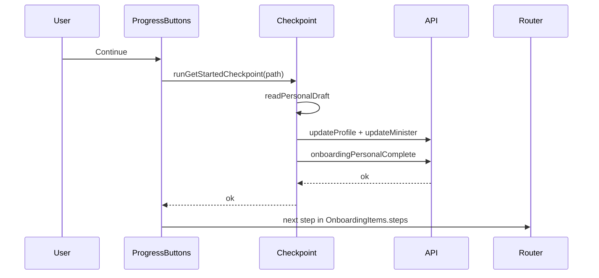

# feat-0010: Tech Spec — Web Get Started (`/get-started`)

## Context

See [`PRODUCT.md`](./PRODUCT.md) for product behavior and UI. This document maps screens to files, storage keys, API checkpoints, and navigation helpers.

## Route tree

Registered in [`apps/web/src/routes/minister.route.tsx`](../../../../apps/web/src/routes/minister.route.tsx) under dashboard layout ([`dashboard.route.tsx`](../../../../apps/web/src/routes/dashboard.route.tsx)).

```
/get-started                          → GetStarted.tsx (hub, NO InnerLayout)
/get-started/                         → index
  InnerLayout (Save & Exit + ProgressButtons)
    verify-account                    → GetVerified.tsx + verify-account-form
    verify-account/personal-information → VerifyUserInfo.tsx + personal-info-form
    verify-account/verify-document    → VerifyDocument.tsx + Outlet
      index                           → SelectDocumentType.tsx
      document1                       → verify-document1.tsx
      select                          → verify-document.tsx
      upload                          → UploadDocumentWrapper.tsx
    complete-profile                  → Navigate → home-address
    home-address                      → HomeAddressInfo.tsx + home-address-form
    ministry-input                    → MinistryInfo.tsx + MinistryInput.tsx
    tour-guide                        → TourGuidePage.tsx

/profile                              → UserProfile (not onboarding checklist)
/profile/change-password              → ChangePassword
```

Path constants: [`apps/web/src/routes/paths.ts`](../../../../apps/web/src/routes/paths.ts) (`PATH_SEG_GET_STARTED_*`).

## File map

| Concern | Path |
|---------|------|
| Hub UI | [`apps/web/src/app/get-started/GetStarted.tsx`](../../../../apps/web/src/app/get-started/GetStarted.tsx) |
| Checklist data | [`apps/web/src/_data/onboarding.tsx`](../../../../apps/web/src/_data/onboarding.tsx) |
| Inner chrome | [`apps/web/src/components/layouts/InnerLayout.tsx`](../../../../apps/web/src/components/layouts/InnerLayout.tsx) |
| Page title block | [`apps/web/src/components/shared/get-started/PageHeader.tsx`](../../../../apps/web/src/components/shared/get-started/PageHeader.tsx) |
| Footer nav | [`apps/web/src/components/shared/get-started/ProgressButtons.tsx`](../../../../apps/web/src/components/shared/get-started/ProgressButtons.tsx) |
| Save & Exit | [`apps/web/src/components/shared/get-started/SaveAndExit.tsx`](../../../../apps/web/src/components/shared/get-started/SaveAndExit.tsx) |
| Busy shared state | [`apps/web/src/components/shared/get-started/GetStartedProgressContext.tsx`](../../../../apps/web/src/components/shared/get-started/GetStartedProgressContext.tsx) |
| API on Continue | [`apps/web/src/services/get-started-checkpoint.ts`](../../../../apps/web/src/services/get-started-checkpoint.ts) |
| Draft R/W | [`apps/web/src/services/get-started-draft-storage.ts`](../../../../apps/web/src/services/get-started-draft-storage.ts) |
| Save & Exit routing | [`apps/web/src/services/get-started-save-exit.ts`](../../../../apps/web/src/services/get-started-save-exit.ts) |
| Completion gates | [`apps/web/src/utils/portal-onboarding.util.ts`](../../../../apps/web/src/utils/portal-onboarding.util.ts), [`minister-onboarding.util.ts`](../../../../apps/web/src/utils/minister-onboarding.util.ts) |
| Studio redirect | [`apps/web/src/app/studio/StudioPortal.tsx`](../../../../apps/web/src/app/studio/StudioPortal.tsx) |
| Sidebar item | [`apps/web/src/_data/navdata.tsx`](../../../../apps/web/src/_data/navdata.tsx), [`Sidebar.tsx`](../../../../apps/web/src/components/shared/navigation/Sidebar.tsx) |

### Form and field components

| Screen | Components |
|--------|------------|
| Verify intro | `verify-account-form`, `CountrySelect`, `IconText` |
| Personal | `personal-info-form`, `LegalNameInput`, `DOBPicker` |
| Document type | `SelectDocumentType`, `IconRadioSelect` |
| Document method | `verify-document1`, `FileUploadDialog` |
| Document tips | `verify-document`, `IconText` |
| Document upload | `UploadDocumentWrapper`, `file-upload` |
| Address | `home-address-form`, `AddressInput`, `PostalCode`, `CityInput`, `PhoneInput` |
| Ministry | `MinistryInput`, `MinistryForm`, `MinistryWebsite`, `MinistryLocation`, `MinistryDescription` |

## UI layout tokens (implementation)

| Element | Classes / pattern |
|---------|-------------------|
| Hub outer | `p-20` |
| Hub card | `border border-border rounded-md`, `p-15`, `space-y-6` |
| Hub title | `text-2xl font-bold` |
| Progress track | `bg-neutral-400/60 h-2 rounded-full` |
| Progress fill | `bg-primary h-2 rounded-full transition-all` |
| Accordion item | `border px-6 rounded-md`, open: `data-[state=open]:bg-accent` |
| Inner shell | `m-10 pl-6 pt-2 pr-6`, content `max-w-3xl mx-auto px-6` |
| PageHeader title | `text-[28px] font-bold` |
| PageHeader desc | `text-[16px] text-muted-foreground` |
| Footer actions | `border-t mt-8 pt-6`, Back `variant="ghost"`, Continue `px-12` |
| Verify intro column | `pr-80` on form wrapper |

## Client storage

### Current (shipped)

| Key | Location | Purpose |
|-----|----------|---------|
| `onboarding_progress` | `localStorage` | Hub accordion completed ids (`"1"`–`"4"`) — **deprecated** (see PRODUCT production §1) |
| `troott.getStarted.draft.personal` | `sessionStorage` | Country, DOB |
| `troott.getStarted.draft.address` | `sessionStorage` | Address + phone |
| `troott.getStarted.draft.ministry` | `sessionStorage` | Ministry fields |
| `selectedDocumentType` | `localStorage` | NIN / license / passport |
| `uploadedDocuments` | `localStorage` | Client file metadata (upload step) |

### Production (target — PRODUCT §3)

| Key | Location | Purpose |
|-----|----------|---------|
| `troott.getStarted.verifyAccount.country` | `localStorage` | Verify intro residence mirror; cleared after personal checkpoint + logout |

Draft helpers: `readPersonalDraft`, `writePersonalDraft`, etc. in [`get-started-draft-storage.ts`](../../../../apps/web/src/services/get-started-draft-storage.ts).

`clearDraftForCheckpointPath` runs after successful Continue.

## Checkpoint API matrix

`runGetStartedCheckpoint(fromPath)` in [`get-started-checkpoint.ts`](../../../../apps/web/src/services/get-started-checkpoint.ts):

| Path | Validation | API calls (minister; creator uses `api.creator.*`) |
|------|------------|-----------------------------------------------------|
| `…/personal-information` | Country + DOB | `user.updateProfile`, `minister.updateMinister`, `minister.onboardingPersonalComplete` |
| `…/verify-document/upload` | (none) | `minister.onboardingDocumentComplete` |
| `…/home-address`, `…/complete-profile` | Street, city, phone | `user.updateProfile`, `minister.onboardingAddressComplete` |
| `…/ministry-input` | Ministry name | `minister.updateMinister`, `minister.onboardingMinistryComplete` |
| `…/tour-guide` | (none) | `minister.onboardingTourComplete` |
| Other paths | — | `{ ok: true }` (no-op) |

## ProgressButtons navigation logic

Group 1 `steps` in [`onboarding.tsx`](../../../../apps/web/src/_data/onboarding.tsx) (current order — **reorder in production** to match PRODUCT canonical document flow):

```text
personal-information → verify-document (index) → select → document1 → upload
```

Canonical production order: `… → verify-document → select → document1 → upload`.

```text
stepGroup = OnboardingItems.find(item => pathname.startsWith(item.action))
steps = stepGroup.steps[].action
currentIndex = steps.indexOf(pathname)

Continue:
  checkpoint = runGetStartedCheckpoint(pathname)
  if !checkpoint.ok → toast.error, stop
  clearDraftForCheckpointPath(pathname)
  if currentIndex < steps.length - 1 → navigate(steps[currentIndex + 1])
  else if pathname === tour-guide → studio upload or hub
  else → PATH_GET_STARTED

Back:
  if pathname === tour-guide → ministry-input
  else if currentIndex > 0 → steps[currentIndex - 1]
```

### Verify-account intro edge case

Path `/get-started/verify-account` is **not** in group 1 `steps`. Therefore `currentIndex === -1`:

- **Continue:** checkpoint no-op; `-1 < steps.length - 1` → navigates to `steps[0]` (`personal-information`).
- **Back:** disabled (`currentIndex <= 0`).

Upload wrapper may also advance within group 1 after file submit ([`UploadDocumentWrapper.tsx`](../../../../apps/web/src/components/shared/upload/UploadDocumentWrapper.tsx)).

## Save & Exit

[`get-started-save-exit.ts`](../../../../apps/web/src/services/get-started-save-exit.ts):

- `hasDraftSupport(pathname)` — personal, home-address, complete-profile alias, ministry.
- `flushDraftForPath` — re-write session draft.
- `resolveGetStartedExitPath` — studio home if `isStudioOnboardingComplete`, else hub.

## Portal gating (server)

```typescript
// minister-onboarding.util.ts
minister?.onboarding?.status === 'completed'
```

Used by:

- `shouldShowGetStartedNavItem` / `isStudioOnboardingComplete` ([`portal-onboarding.util.ts`](../../../../apps/web/src/utils/portal-onboarding.util.ts))
- [`useRedirectAfterAuth.ts`](../../../../apps/web/src/hooks/app/useRedirectAfterAuth.ts) → `PATH_GET_STARTED`
- [`StudioPortal.tsx`](../../../../apps/web/src/app/studio/StudioPortal.tsx) → redirect if incomplete

### What is **not** gated today

| Surface | Gated? | Notes |
|---------|--------|--------|
| Hub `4/4` progress | No API tie | [`GetStarted.tsx`](../../../../apps/web/src/app/get-started/GetStarted.tsx) — `onboarding_progress` in `localStorage` |
| Sidebar Dashboard / Sermons / Analytics / Bin | No | [`Sidebar.tsx`](../../../../apps/web/src/components/shared/navigation/Sidebar.tsx) + [`resolveStudioNavUrl`](../../../../apps/web/src/utils/studio-nav.util.ts); disabled only when `href === null` (no studio code) |
| `/get-started/*` inner steps | Auth only | No milestone prerequisite between steps |
| `/profile` | Auth only | Outside checklist |

### Hub progress implementation (quirks A)

```typescript
// GetStarted.tsx — not server-backed
const STORAGE_KEY = 'onboarding_progress';
// completedSteps.length / OnboardingItems.length → "n/4 completed"
// handleStepComplete only from expanded AccordionContent button onClick
```

Collapsed `AccordionTrigger` button: `navigate(item.action)` only — no `handleStepComplete`.

### Studio nav while incomplete (quirks B)

```text
User clicks "Sermons" (url /sermons in navdata)
  → resolveStudioNavUrl('/sermons', sidebarStudioCode)
  → /studio/{code}/sermons
  → StudioPortal mounts
  → if !isStudioOnboardingComplete → navigate(PATH_GET_STARTED, { replace: true })
```

If minister context reports `onboarding.status === 'completed'`, no redirect. Hub can still show 4/4 from stale `onboarding_progress` independently.

**QA:** Clear `localStorage.onboarding_progress` to reset hub bar; compare with `GET` minister `onboarding.status`.

## First sermon milestone (item 4)

[`useSermon.ts`](../../../../apps/web/src/hooks/app/useSermon.ts) — `usePublishSermonMutation` onSuccess:

```typescript
if (!data.error && variables.payload.status === MediaStatus.PUBLISHED) {
  // api.minister.onboardingFirstSermonComplete or api.creator.*
}
```

API also exposes [`tryCompleteOnboardingAfterFirstPublish`](../../../../apps/api/src/services/core/minister.service.ts) server-side. **Gap:** web does not refetch minister/creator context or hub after this call; hub still uses local `onboarding_progress`.

---

## Hub progress (production target)

Replace [`GetStarted.tsx`](../../../../apps/web/src/app/get-started/GetStarted.tsx) local state with helper derived from `minister.onboarding.step`:

```typescript
// Suggested: hubProgressFromStep(step: number) → { completedIds: string[], count: number }
// step >= 2 → item "1"; step >= 4 → "2"; step >= 5 → "3"; step >= 6 → "4"
```

Clear `localStorage.onboarding_progress` on hub mount during migration.

---

## Breadcrumbs (debt)

[`breadcrumb-map.tsx`](../../../../apps/web/src/components/shared/navigation/breadcrumb-map.tsx) includes stale paths (e.g. `/get-started/home-address/home-address`). Align when nested verify-account routing lands (PRODUCT §7).

---

[`onboarding.tsx`](../../../../apps/web/src/_data/onboarding.tsx) `studioPath(segment)`:

- Uses `getStoredStudioCode()` from [`studio-nav.util.ts`](../../../../apps/web/src/utils/studio-nav.util.ts).
- Fallback: `/studio/_/…` when code missing.

## Sequence: Continue on personal information



## Testing checklist

See PRODUCT **Test plan**. Summary:

| Case | Expected |
|------|----------|
| Hub only | Save & Exit absent; accordion works |
| Verify intro Continue | → personal-information |
| Personal Continue without country | Toast; stay on page |
| Address Continue without phone | Toast; stay on page |
| Tour complete with studio code | Navigate to `/studio/{code}/sermons/upload` |
| Publish first sermon | `onboardingFirstSermonComplete` fired |
| Minister incomplete + `/studio/x` | Redirect `/get-started` |
| Onboarding complete | Sidebar hides Get Started |
| Production: hub from API step | No `onboarding_progress` dependency |
| Production: nav while incomplete | Redirect hub |

**Automated:** none in `apps/web` today — add per PRODUCT test plan when shipping production §1–§3.

---

## Production implementation checklist

| Priority | Item | Primary files |
|----------|------|---------------|
| P0 | Hub from `onboarding.step` | `GetStarted.tsx`, minister/creator context |
| P0 | Item 4 + publish refetch | `useSermon.ts`, query invalidation |
| P1 | Nav redirect while incomplete | `Sidebar.tsx`, shared guard with `StudioPortal` |
| P1 | Intro country dual-write | `verify-account-form.tsx`, `get-started-draft-storage.ts` |
| P1 | Document Continue validation | `get-started-checkpoint.ts` |
| P2 | Reorder group 1 steps | `onboarding.tsx` |
| P2 | Copy fixes | verify-document, ministry PageHeader |
| P3 | Nested verify routes | `minister.route.tsx`, `GetVerified.tsx` |
| P3 | Logout clears localStorage keys | auth logout handler |

---

## Studio path helper (checklist item 4)

[`onboarding.tsx`](../../../../apps/web/src/_data/onboarding.tsx) `studioPath(segment)`:

- Uses `getStoredStudioCode()` from [`studio-nav.util.ts`](../../../../apps/web/src/utils/studio-nav.util.ts).
- Fallback: `/studio/_/…` when code missing.

Item 4 `steps` list studio upload segments for reference; those routes are outside `InnerLayout`.

---

## Related

- [feat-0010 PRODUCT](./PRODUCT.md)
- [feat-0007 PRODUCT](../feat-0007/PRODUCT.md) — Save & Exit
- [feat-0008 PRODUCT](../feat-0008/PRODUCT.md) — Studio upload / publish
- [feat-0009 TECH](../feat-0009/TECH.md) — Post-auth and studio guards
