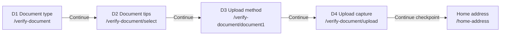
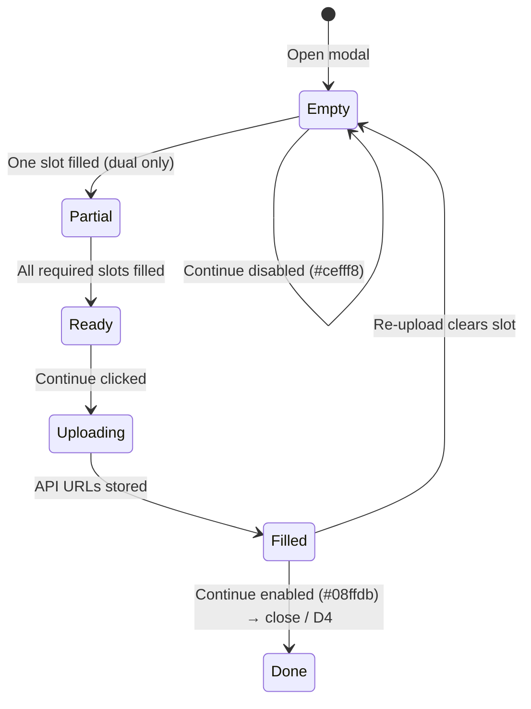
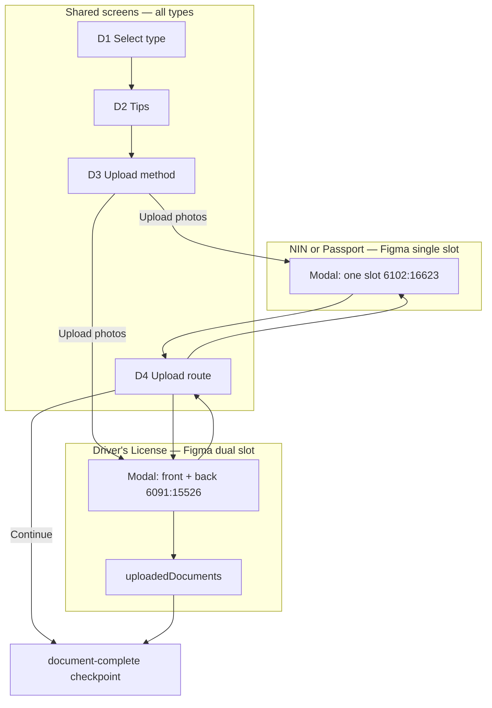

# feat-0013: Web document verification uploads (Get Started)

## Summary

**Document verification** is the Get Started step where a minister or creator selects a government ID type, uploads clear photos (or a passport PDF), and submits them for platform review. The experience lives under **Verify account → Document verification**, with page copy that explains why ID is collected and a **document upload modal** that matches the visual and interaction quality of the **studio upload modal** ([feat-0006](../feat-0006/PRODUCT.md) / `UploadModal`).

This spec owns **product behavior and UI** for identity capture. Onboarding ladder position, checkpoints, and milestone APIs remain in [feat-0005](../feat-0005/PRODUCT.md) (UC-C30–C35).

## Problem

Today document verification is split across multiple routes (`select`, `document1`, `upload`), legacy `FileUploadDialog` styling that does not match studio modals, inconsistent document-type keys in `localStorage`, and placeholder submit paths (console / local blob URLs) instead of **storage upload → verification submit → document milestone**.

Users need one clear flow: read why ID is required, pick a type, upload in a polished modal, and continue only when files are valid and persisted.

## Non-goals

- Admin review UI for `verification.status` (approve/reject).
- Replacing the full Get Started hub or personal-information step ([feat-0005](../feat-0005/PRODUCT.md)).
- Mobile listener KYC.
- Camera / QR “take picture with phone” (may be a later phase; MVP is **upload photos** in-modal).
- Client-side S3/CDN URL construction ([feat-0011](../feat-0011/PRODUCT.md) — consume API `file` URLs from `POST /storage/upload`).
- A fourth legacy type (`passport-file` / generic “Passport” card) — product surface is **three** types aligned with API `DocumentType`.

## Consumer

Authenticated **minister** and **creator** portal users during Get Started (`INTERNAL_PORTAL_ROLES`), after personal information (onboarding step ≥ 1).

---

## Frozen flow (do not change)

The **committed** minister/creator Get Started tree defines **four document screens in a fixed order**. Implementation and redesign work must **preserve**:

- The **URLs** and **route components** below
- **Back / Continue** via `ProgressButtons` + `OnboardingItems` step list (`apps/web/src/_data/onboarding.tsx`)
- **Parent shell** on every child route (`VerifyDocument` header + `InnerLayout` Save & Exit + footer buttons)

**Allowed without a flow change:** restyle the upload dialog to match `UploadModal` / `UPLOAD_SHELL`, wire real `POST /storage/upload` + `POST …/verification` inside existing **Continue** handlers, fix checkpoint validation per document type. **Not allowed:** merging screens, skipping tips/method steps, or adding a fifth route without a new spec.

**Source of truth (grep / HEAD):** `minister.route.tsx` verify-document `subroutes`, `onboarding.tsx` steps 2–5 under Verify account, `VerifyDocument.tsx`, `SelectDocumentType.tsx`, `verify-document.tsx`, `verify-document1.tsx`, `UploadDocumentWrapper.tsx`, `get-started-checkpoint.ts` (upload path only).

**Figma parity (pacepard-ui-agent channel `5mtmmnxl`, file open in Desktop):** modal frames below — implementation already targets these in `DocumentVerificationContent.tsx`; only **shell/copy/states** change, not D1–D4 routes.

---

## Figma reference (Troott)

| Item | Value |
| ---- | ----- |
| **File** | [Troott](https://www.figma.com/design/9lFM6TncipSv0pNVGBWZwA/Troott) (`fileKey` `9lFM6TncipSv0pNVGBWZwA`) |
| **Pacepard channel** | `5mtmmnxl` |
| **Modal component** | `Frame 1618868882` — **477×556**, `cornerRadius` 12, fill `#333234`, stroke `#545454` @ 50% |
| **Code alignment** | Same width as `EditProfileDialog` (`477px`); document modal uses Figma `#333234` card (profile edit uses `#2b2a2c` shell) |

### Modal chrome (all document types)

| Region | Figma spec | Notes |
| ------ | ---------- | ----- |
| Header | 61px; back `eva:arrow-ios-back-outline` 24px; title **Document verification** — Matter Medium 16px, `#eaeaea`, tracking 0.16 | Matches legacy `FileUploadDialog` title |
| Body padding | ~18px horizontal (`12867` vs `12849` frame) | |
| Section title | Matter Medium **20px** / 30px line, `#eaeaea` | `config.headline` |
| Section body | Matter Regular **16px** / 24px, `#bdbdbd` | `config.description` |
| Footer | Top border `#545454` @ 50%; full-width **Continue** 441×38–42, radius 6 | |
| Continue disabled | Fill `#cefff8`, label `#9d9d9d` | Until required slots filled |
| Continue enabled | Fill `#08ffdb`, label `#292929` | After required uploads |

### Figma node map — upload modal by type

| Document type | Layout | Empty state (node) | Filled / re-upload (node) | Figma link |
| ------------- | ------ | ------------------ | ------------------------- | ---------- |
| **International Passport** (`passport`) | Single slot 441×180 | [`6102:16623`](https://www.figma.com/design/9lFM6TncipSv0pNVGBWZwA/Troott?node-id=6102-16623) | [`6102:16190`](https://www.figma.com/design/9lFM6TncipSv0pNVGBWZwA/Troott?node-id=6102-16190) | User-provided |
| **NIN** (`nin`) | **Same frames as passport** — copy swap only | `6102:16623` | `6102:16190` | Same nodes |
| **Driver's License** (`drivers-license`) | Dual slot 214×156 + 13px gap | [`6091:15526`](https://www.figma.com/design/9lFM6TncipSv0pNVGBWZwA/Troott?node-id=6091-15526) | [`6100:15802`](https://www.figma.com/design/9lFM6TncipSv0pNVGBWZwA/Troott?node-id=6100-15802) | User-provided |

**Slot empty:** dashed border `#bdbdbd` @ 30%, radius 8, centered icon + label + **JPEG or PNG only** (12px `#bdbdbd`).

**Slot filled:** solid border `#707070`, image preview (`#eaeaea` / 20% fill in Figma), link **Re-upload front** / **Re-upload back** — Matter Medium 14px `#eaeaea`, bordered pill.

**Passport filled:** single wide preview (~300×180 inside 441×180), no separate re-upload link in Figma — product may use tap-on-preview or same re-upload pattern as license for parity.

### Figma node map — Get Started page screens (D1 and D3)

These are **full-page** frames (`1200×960` artboard, `440px` content column) with **Save and Exit** — not the 477px upload modal.

| Screen | Route | Figma node | Link | State |
| ------ | ----- | ---------- | ---- | ----- |
| **D1** Document type | `…/verify-document` (index) | *(no dedicated node in this set — use same card pattern as D3)* | — | Three `IconRadioSelect` options (NIN, Driver's License, International Passport) |
| **D3** Upload method — default | `…/verify-document/document1` | [`6109:14936`](https://www.figma.com/design/9lFM6TncipSv0pNVGBWZwA/Troott?node-id=6109-14936) | [Figma](https://www.figma.com/design/9lFM6TncipSv0pNVGBWZwA/Troott?node-id=6109-14936) | Method cards unselected / default |
| **D3** Upload method — Upload photos selected | `…/verify-document/document1` | [`6109:14563`](https://www.figma.com/design/9lFM6TncipSv0pNVGBWZwA/Troott?node-id=6109-14563) | [Figma](https://www.figma.com/design/9lFM6TncipSv0pNVGBWZwA/Troott?node-id=6109-14563) | **Upload photos** card stroke `#08ffdb`; **Back** + **Continue** |

**Figma label quirk:** frames `6109:14936` / `6109:14563` use section text **Document Type** above the two method cards. **Committed code** (`verify-document1.tsx`, git `59e7706` / `05f9b26`) correctly labels this section **Upload Method** and keeps **document type** on **D1** only (`SelectDocumentType.tsx`). Do not merge D1 and D3 routes.

**D3 page copy (Figma — target for `document1` outlet):**

| Element | Text |
| ------- | ---- |
| Title | Document Verification — Matter SemiBold **28px** `#eaeaea` (matches `PageHeader`) |
| Subtitle | Please select a way to complete document verification — 16px `#bdbdbd` |
| Section label | **Upload Method** in code (not “Document Type”) |
| Option A | Take picture with phone — `ri:camera-3-fill` 24px, card `#333234`, border `#545454` @ 50%, radius 8, height 58 |
| Option B | Upload photos — `heroicons-solid:cloud-upload` 24px, same card; **selected** border solid `#08ffdb` |
| Footer | `ProgressButtons`: **Back** + **Continue** `#08ffdb` (Figma `6109:14563`; artboard `6109:14936` shows Continue only — treat as partial mockup) |

**D3 interaction (committed git — preserve):**

| User action | Behavior |
| ----------- | -------- |
| Select **Upload photos** | Opens upload modal immediately (`FileUploadDialog` / `DocumentVerificationModal`) — git `verify-document1` `handleContactTypeChange` |
| Select **Take picture with phone** | No modal (MVP: disabled or no-op until camera flow exists) |
| Modal **Continue** | Upload + submit; then navigate to D4 or close per implementation |
| Footer **Continue** on D3 | `ProgressButtons` → next route **D4** (`onboarding.tsx` step 5) without requiring modal complete |

**Git reference (committed UI):** `59e7706`, `05f9b26` — `IconRadioSelect` + `FileUploadDialog` on `document1`; `SelectDocumentType` on index. Current WIP that replaces radios with a single **Upload photos** button is **not** the committed pattern — restore radios + Figma cards.

---

## Page shell (all document screens)

| Chrome | Component |
| ------ | ----------- |
| Layout | `InnerLayout` — **Save and Exit** top-right (Figma `6109:14937`) |
| Parent header | `VerifyDocument` → `PageHeader` |
| Body | `<Outlet />` (step-specific) |
| Footer | `ProgressButtons` — **Back** / **Continue** |

**PageHeader copy by route:**

| Route | Title | Description (target) |
| ----- | ----- | -------------------- |
| **D1**, **D2**, **D4** | Document Verification | Your ID will be used to verify your personal information. |
| **D3** (`document1`) | Document Verification | **Please select a way to complete document verification** ([`6109:14936`](https://www.figma.com/design/9lFM6TncipSv0pNVGBWZwA/Troott?node-id=6109-14936)) |

Implementation: keep parent `VerifyDocument` or pass route-aware description into `PageHeader` for the `document1` child only.

---

## Screen flow (committed — all document types)

Entry: user completes **Personal information**, then **Continue** lands on screen **D1**.

| Step | Onboarding title (`onboarding.tsx`) | URL | Component | Screen purpose |
| ---- | ----------------------------------- | --- | ----------- | -------------- |
| **D1** | Document Verification | `/get-started/verify-account/verify-document` | `SelectDocumentType` | Choose ID type (required for later steps) |
| **D2** | Document tips | `…/verify-document/select` | `VerifyDocumentForm` | Read tips before capture |
| **D3** | Upload method | `…/verify-document/document1` | `VerifyDocument1` | Choose how to capture; open upload modal from here |
| **D4** | Document Verification | `…/verify-document/upload` | `UploadDocumentWrapper` | Full-screen step with upload modal always open |

**Navigation rules (committed):**

| Action | Behavior |
| ------ | -------- |
| **Continue** on D1–D3 | `ProgressButtons` → next URL in table (no document API checkpoint on these paths) |
| **Continue** on D4 | `runGetStartedCheckpoint` for upload path → `onboardingDocumentComplete` when local gates pass |
| **Back** | Previous URL in table (from `onboarding.tsx` step order) |
| **Save & Exit** | Unchanged ([feat-0007](../feat-0007/PRODUCT.md)) |

**Checkpoint on D4 only (committed):** requires `selectedDocumentType` in `localStorage` and `uploadedDocuments` JSON with **both** `front` and `back` keys (`get-started-checkpoint.ts`). Toast if missing.

---

## Screen detail — D1: Document type

| UI element | Content |
| ---------- | ------- |
| Section label | **Document Type** |
| Control | `IconRadioSelect` — three options (see table below) |
| Default (committed) | First interaction sets type; persist on change |

| UI label | `localStorage` value (`selectedDocumentType`) |
| -------- | --------------------------------------------- |
| National Identity Number (NIN) | `nin` |
| Driver's License | `drivers-license` |
| International Passport | `passport` |

**Continue:** advances to D2. Type must be chosen before upload modals on D3/D4 (toast if missing on committed D3 when opening upload).

---

## Screen detail — D2: Document tips

| UI element | Content |
| ---------- | ------- |
| Illustration | `/images/assets/verify-doc.png` |
| Tips (bullets) | Upload a complete image of your ID document. |
| | Ensure all details are readable in the image you upload. |
| | Place documents against a solid-colored background. |

**Continue:** advances to D3. No upload on this screen.

---

## Screen detail — D3: Upload method

**Figma:** [`6109:14936`](https://www.figma.com/design/9lFM6TncipSv0pNVGBWZwA/Troott?node-id=6109-14936) (default), [`6109:14563`](https://www.figma.com/design/9lFM6TncipSv0pNVGBWZwA/Troott?node-id=6109-14563) (Upload photos selected).

**Component:** `VerifyDocument1` — git-committed pattern uses `IconRadioSelect` (not a lone button).

| UI element | Spec |
| ---------- | ---- |
| Page subtitle | Please select a way to complete document verification |
| Section label | **Upload Method** |
| Control | `IconRadioSelect` — two full-width cards (58px height), radio on right |
| Option 1 | **Take picture with phone** — camera icon |
| Option 2 | **Upload photos** — cloud-upload icon; selected stroke `#08ffdb` |
| On select Upload photos | Open **document upload modal** immediately (6102 / 6091 nodes by type) |
| Footer | **Back** + **Continue** via `ProgressButtons` |

**Out of scope for D3:** Removing **Take picture with phone** row unless product explicitly deprecates it; Figma includes both options.

---

## Screen detail — D4: Upload capture route

| UI element | Content (committed) |
| ---------- | --------------------- |
| Layout | `UploadDocumentWrapper` renders `FileUploadDialog` with `useOutletFlow={true}` (modal treated as primary content) |
| Modal | Same `FileUploadDialog` chrome as D3; **Continue** in modal runs `onSubmit` then may auto-advance within verify-account group |

**Committed gap (fix in implementation, same screen):** D4 modal config is **generic front+back** and does not branch on `selectedDocumentType`; D3 modal **does** branch. Target: D4 uses the **same per-type config** as D3 without adding routes.

**Continue (footer):** On D4 only, runs document milestone when `uploadedDocuments` has required keys (see per-type).

---

## Per document type — screens + modal (Figma + committed flow)

All types: **D1 → D2 → D3 → D4** (unchanged). Modal opens from **D3 Upload photos** and is always open on **D4**.

### Flow summary

| Type | D1 label | Modal layout (Figma) | Slots | Modal Continue → |
| ---- | -------- | ---------------------- | ----- | ---------------- |
| NIN | National Identity Number (NIN) | Single (`6102:16623` / `16190`) | `nin_page` (maps to API `frontPage`) | Storage + verification; normalize for D4 checkpoint |
| Driver's License | Driver's License | Dual (`6091:15526` / `6100:15802`) | `front`, `back` | Same |
| International Passport | International Passport | Single (same nodes as NIN) | `passport_page` → `frontPage` | Same |

### National Identity Number (NIN) — `nin`

| Item | Spec |
| ---- | ---- |
| **Figma frames** | Reuse passport nodes `6102:16623` (empty), `6102:16190` (filled) — **layout identical** |
| **Modal header** | Document verification |
| **Headline** | Upload an image of your NIN |
| **Description** | Make sure the photo of your NIN isn’t blurry and that it clearly shows your face and NIN number. |
| **Empty slot** | Icon: ID card; **Upload NIN**; **JPEG or PNG only** |
| **Filled** | Image preview in 441×180 zone; optional **Re-upload** control (match license pattern if not in Figma) |
| **API** | `national_identity_number`; `document.frontPage` = uploaded URL |
| **Committed code gap** | HEAD used 2-slot license modal — **replace** with Figma single-slot |

### Driver's License — `drivers-license`

| Item | Figma copy (exact) |
| ---- | ------------------ |
| **Figma frames** | `6091:15526` (empty), `6100:15802` (filled) |
| **Headline** | Upload your driver’s license |
| **Description** | Make sure your photos aren’t blurry and the front of your driver’s license clearly shows your face. |
| **Slot — front** | **Upload front** / JPEG or PNG only — 214×156 |
| **Slot — back** | **Upload back** / JPEG or PNG only — 214×156 |
| **Filled** | **Re-upload front**, **Re-upload back** under each preview |
| **API** | `drivers_license`; `frontPage` + `backPage` |

### International Passport — `passport`

| Item | Figma copy (exact) |
| ---- | ------------------ |
| **Figma frames** | `6102:16623` (empty), `6102:16190` (filled preview) |
| **Headline** | Upload an image of your passport |
| **Description** | Make sure the photo of your passport isn’t blurry and that it clearly shows your face. |
| **Empty slot** | Icon: `guidance:passports`; **Upload passport**; **JPEG or PNG only** |
| **Filled** | Centered photo-page preview in slot |
| **API** | `international_passport`; `passport_page` → `frontPage` |
| **PDF** | Figma shows JPEG/PNG only; API may accept PDF — if enabled, extend hint text without changing layout |

### Modal state machine (all types — same UX rules)

---

## End-to-end flow diagram (by document type)

---

## Data & API (same routes — persistence improvements only)

Within the **frozen** D3/D4 modals, engineering may replace blob/`console.log` with:

1. `POST /api/v1/storage/upload` per slot → `ImageDTO.file`
2. `POST /api/v1/minister/verification` or `/creator/verification` with `{ document: { type, frontPage, backPage? } }`
3. Normalize passport / NIN / license into `uploadedDocuments` (or equivalent) so D4 **Continue** checkpoint matches type

This does **not** add screens; it completes the backend handoff on existing **Continue** actions.

---

## Document upload modal (UI-only — same entry points as committed)

Apply on **D3** (Upload photos) and **D4** (`UploadDocumentWrapper`). **Do not** add routes or change when the modal opens.

**Visual source:** Figma `Frame 1618868882` (477px) above; **interaction source:** existing `FileUploadDialog` + `DocumentVerificationContent` slot logic; **studio alignment:** footer CTA tokens from `UPLOAD_SHELL` where they match Figma (`#08ffdb` primary).

The capture UI must **not** keep legacy dialog chrome (`mt-8 justify-center flex flex-col` on `DialogContent`):

| Quality | Requirement |
| ------- | ------------- |
| Shell | `UPLOAD_SHELL` tokens: `#2b2a2c` surface, `#545454` borders, `rounded-2xl`, max width ~827px, `max-h-[92dvh]`, no default browser close chip unless styled |
| Header | Matter medium 16px title **Document verification**; optional leading glyph; **X** close control |
| Body | Inner content card `#333234` / `#707070` border; clear title + helper copy per document type |
| Dropzones | Dashed border when empty; image preview when selected; format hint (JPEG/PNG; PDF only for passport) |
| Footer | Sticky footer strip `#333234`: **Cancel** (outline / ghost) + primary **Continue** `#08ffdb` on `#292929` text |
| Progress | Per-file uploading state (spinner on slot); disable Continue until all required slots filled |
| Errors | Inline validation (type/size) + Sonner on API failure |
| Confirm leave | If required files selected and user closes, confirm discard (match `UploadProgressStep` cancel pattern) |

**Entry (unchanged):** D3 → **Upload photos** opens modal; D4 → modal always open (`useOutletFlow`).

**Non-MVP:** “Take picture with phone” on D3 may stay visible but disabled until camera/QR exists.

---

## Capture rules by document type (modal slots)

| Type | Layout | Field IDs | Required | Accepted (Figma hint) |
| ---- | ------ | --------- | -------- | --------------------- |
| NIN | `single` | `nin_page` | 1 | JPEG, PNG |
| Driver's License | `dual` | `front`, `back` | 2 | JPEG, PNG each |
| International Passport | `single` | `passport_page` | 1 | JPEG, PNG (PDF optional per API, not in Figma) |

---

## Use case catalog

| ID | Screen | Use case | Main flow | Postcondition |
| -- | ------ | -------- | --------- | ------------- |
| **UC-D01** | Shell | View document verification chrome | Any D1–D4 route | Title + description + Back/Continue |
| **UC-D02** | D1 | Select document type | Pick one of three radios → Continue | `selectedDocumentType` set |
| **UC-D03** | D2 | Read document tips | Review bullets → Continue | Navigate to D3 |
| **UC-D04** | D3 | Choose upload method | `IconRadioSelect`: Take picture or Upload photos | Upload photos → modal opens ([`6109:14563`](https://www.figma.com/design/9lFM6TncipSv0pNVGBWZwA/Troott?node-id=6109-14563)) |
| **UC-D05** | D3 modal | Capture NIN | front + back → modal Continue | Files held for D4 / API (committed: console only) |
| **UC-D06** | D3 modal | Capture driver's license | front + back → modal Continue | Same |
| **UC-D07** | D3 modal | Capture passport | `passport_page` → modal Continue | `internationalPassportDocuments` (committed) |
| **UC-D08** | D4 | Upload on dedicated route | Modal open; fill slots → modal Continue | `uploadedDocuments` (front+back) when license/NIN path |
| **UC-D09** | D4 | Complete document step | Footer **Continue** | `onboardingDocumentComplete` when checkpoint passes |
| **UC-D10** | D4 | Continue without uploads | Footer Continue | Toast: select type / upload front and back |
| **UC-D11** | D1 | Change type after upload | Select different radio | Clear prior upload keys (target); confirm if modal dirty |
| **UC-D12** | Any | Back through ladder | Back | Previous screen in D1→D4 order |
| **UC-D13** | D3/D4 | Persist to API (target) | Modal Continue with storage + verification POST | `verification.status` pending; normalized local state |
| **UC-D14** | — | Creator persona | Same D1–D4 | Creator verification + document-complete endpoints |

---

## API surface (existing)

| Action | Method | Path | Notes |
| ------ | ------ | ---- | ----- |
| Upload ID image/PDF | POST | `/api/v1/storage/upload` | Multipart; response `ImageDTO.file` URL for `frontPage` / `backPage` |
| Submit minister verification | POST | `/api/v1/minister/verification` | Body: `{ document: { type, frontPage, backPage? } }` |
| Submit creator verification | POST | `/api/v1/creator/verification` | Same shape |
| Document milestone (minister) | POST | `/api/v1/minister/onboarding/document-complete` | After successful submit |
| Document milestone (creator) | POST | `/api/v1/creator/onboarding/document-complete` | When creator parity enabled |
| Verification status | GET | `/api/v1/minister/verification/status` (and creator) | Optional read-only UI |

**Validation (server):** `document.type` and `document.frontPage` required; personal step must be complete before submit.

---

## Acceptance criteria

- [ ] **Four screens** D1→D4 exist at committed URLs; `ProgressButtons` order matches `onboarding.tsx`.
- [ ] Shell copy: **Document Verification** + ID privacy description on all child routes.
- [ ] D1: three document type labels exactly as specified.
- [ ] D2: tips illustration + three bullets unchanged in meaning.
- [ ] D3 matches Figma [`6109:14936`](https://www.figma.com/design/9lFM6TncipSv0pNVGBWZwA/Troott?node-id=6109-14936) / [`6109:14563`](https://www.figma.com/design/9lFM6TncipSv0pNVGBWZwA/Troott?node-id=6109-14563): subtitle, two method cards, `IconRadioSelect` (git-committed).
- [ ] Selecting **Upload photos** opens type-specific upload modal (6102 / 6091).
- [ ] D4: upload route shows modal; footer Continue runs document checkpoint only on this path.
- [ ] Upload modal uses **UPLOAD_SHELL** (UI parity with sermon upload modal).
- [ ] Modal matches Figma nodes: NIN/passport single-slot (`6102:*`), license dual-slot (`6091:*` / `6100:*`).
- [ ] Disabled/enabled Continue colors match Figma (`#cefff8` / `#08ffdb`).
- [ ] (Target) Storage + verification API on modal Continue; D4 checkpoint accepts passport without fake `back` key.
- [ ] Creator uses creator milestone/verification clients.

---

## Test plan

| # | Screen | Case | Expected |
| - | ------ | ---- | -------- |
| 1 | — | Personal step incomplete | Cannot reach document ladder (feat-0005) |
| 2 | D1 | Select NIN → Continue | D2 tips |
| 3 | D2 | Continue | D3 upload method |
| 4 | D3 | Continue without modal | D4 upload route |
| 5 | D3 | Select Upload photos on [`6109:14563`](https://www.figma.com/design/9lFM6TncipSv0pNVGBWZwA/Troott?node-id=6109-14563) | Modal opens; complete upload |
| 5b | D3 | Footer Continue without modal | Navigates to D4 (committed `ProgressButtons`) |
| 6 | D4 | Modal front+back + footer Continue | `onboardingDocumentComplete` success (committed localStorage gate) |
| 7 | D4 | Footer Continue without `uploadedDocuments` | Toast error |
| 8 | D3 | Passport PDF in modal | `internationalPassportDocuments` set (committed) |
| 9 | D1 | Back from D3 | D2 |
| 10 | UI | Modal chrome | Matches `UPLOAD_SHELL` width, colors, footer CTAs |
| 11 | — | Creator | Same screens; creator document-complete API |

---

## Related specs

- [feat-0013 TECH](./TECH.md) — routes, components, data flow
- [feat-0015 PRODUCT](../feat-0015/PRODUCT.md) — **target** post-upload route to `/get-started`, hub `1/4`, storage clear
- [feat-0005 Get Started](../feat-0005/PRODUCT.md) — onboarding ladder UC-C30–C35
- [feat-0006 Upload modal](../feat-0006/PRODUCT.md) — studio upload shell reference
- [feat-0011 Profile](../feat-0011/PRODUCT.md) — portal image URL consumption
- [`01 - onboarding.md`](../../01%20-%20onboarding.md) — index
