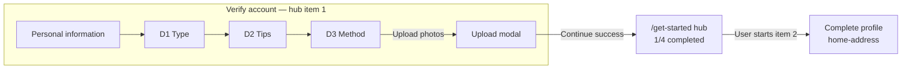

# feat-0015: Document upload completion — hub return, 1/4 progress, storage lifecycle

## Summary

After a minister or creator **successfully uploads and submits** identity documents (NIN, International Passport, or Driver's License), the product must:

1. **Record the document onboarding milestone** on the server.
2. **Navigate to the Get Started hub** (`/get-started`).
3. **Show hub progress `1/4 completed`** (first hub accordion item done).
4. **Clear stale client document keys** from `localStorage` so the server profile is the source of truth.

This spec owns **post-upload routing**, **hub progress semantics**, and **when to wipe Get Started local state**. Capture UI and modal design remain in [feat-0013](../feat-0013/PRODUCT.md). Ladder position and milestones remain in [feat-0005](../feat-0005/PRODUCT.md).

## Problem

Today the flow splits completion across two moments:

| Moment | Current behavior | User confusion |
| ------ | ---------------- | -------------- |
| Modal **Continue** (D3 or D4) | `submitVerification` + write `uploadedDocuments`; from D3 → route **D4** | User thinks upload is “done” but hub still shows verify incomplete |
| D4 footer **Continue** | `onboardingDocumentComplete` → **home-address** | Extra screen after upload; hub `1/4` only updates if user later visits hub |

Document keys can linger in `localStorage` after the server already stores verification. Users need one clear “you’re done with verify account” outcome: **return to hub at 1/4**.

## Non-goals

- Changing document type labels, modal Figma layout, or D1–D4 route URLs ([feat-0013](../feat-0013/PRODUCT.md) frozen screens).
- Admin verification approve/reject.
- Mobile onboarding.
- Removing D4 route (may remain for re-upload / Save & Exit resume until deprecated).

## Consumer

Authenticated **minister** and **creator** on web Get Started, after personal information is complete (server step ≥ 1).

---

## Hub progress: what `1/4` means

The hub (`GetStarted.tsx`) shows:

```text
{completedSteps.length}/{OnboardingItems.length} completed   →   e.g. 1/4
```

| Hub # | Accordion item | Marked complete when server `onboarding.step` ≥ |
| ----- | -------------- | ----------------------------------------------- |
| 1 | Verify your account | **2** (`ONBOARDING_STEP_DOCUMENT`) |
| 2 | Complete your profile | **4** (`ONBOARDING_STEP_MINISTRY`) |
| 3 | How to use troott | **5** (`ONBOARDING_STEP_TOUR`) |
| 4 | Upload first sermon | **6** (`ONBOARDING_STEP_FIRST_SERMON`) |

**`1/4`** means the entire **Verify your account** block is done (personal info **and** document verification). Personal alone does **not** increment hub count; document milestone is required.

Mapping: `hubCompletedItemIds()` in `hub-onboarding.util.ts`.

### Hub UI (Get Started header + accordion CTAs)

Figma hub frame: [`6115:15910`](https://www.figma.com/design/9lFM6TncipSv0pNVGBWZwA/Troott?node-id=6115-15910).

| Element | Figma spec | Implementation (`GetStarted.tsx`) |
| ------- | ---------- | ----------------------------------- |
| Progress label | `{n}/4 completed`, Matter 12px, `#bdbdbd` | Same; **no loading ellipsis** — show count from context immediately |
| Progress track | 4px height, `#9d9d9d`, 6px radius | `h-1 rounded-md bg-[#9d9d9d]` |
| Progress fill | `#6f94b8` | Width = `(completedSteps.length / 4) * 100%` |
| Active accordion CTA | Solid `#08ffdb`, text `#292929`, 32px | Primary button on incomplete items |
| Completed accordion CTA | Outline `#08ffdb` border + text, label **Completed** | `variant="outline"` + Troott token classes; visible on collapsed row and in expanded body |

Hub progress and **Completed** labels derive **only** from server `onboarding.step` ([feat-0007](../feat-0007/PRODUCT.md) — not `localStorage.onboarding_progress`).

### Hub refresh after document upload

After modal success, hub must read **fresh** `onboarding.step ≥ 2` without full-page loading.

| Source | Field | Notes |
| ------ | ----- | ----- |
| Minister profile | `minister.onboarding.step` | Primary for ministers |
| Creator profile | `creator.onboarding.step` | Primary for creators |
| Session user | `user.onboard.step` | Fallback when profile parse pending |

**Client sequence after modal Continue:**

1. `submitVerification` + `onboardingDocumentComplete` (API invalidates Redis minister/user profile cache).
2. `dispatchOnboardingProfileRefresh()` — `MinisterState` / `CreatorState` listeners call `refresh({ force: true })`.
3. `navigate(PATH_GET_STARTED)` — hub renders from updated context.

**Do not** call `refreshSession({ force: true })` on hub mount — it sets `isHydratingSession` and traps the route `AuthGate` on **Loading…**. Hub relies on `SessionHydrator` bootstrap + profile refresh event only.

**Minister profile parse:** lean API docs use `_id`; `parseMinisterPayload` must accept `_id` (not only `id` + `code`) or hub stays **0/4**.

Interactive tour for hub item 3 → [feat-0016](../feat-0016/PRODUCT.md) (separate spec; `onboardingTourComplete` → **3/4**).

---

## Target routing after upload (all document types)

**Same destination for NIN, passport, and driver's license.** Types differ only in **modal slots**, not in post-upload navigation.

| Document type | Modal layout | Required slots | After successful modal **Continue** |
| ------------- | ------------ | -------------- | ----------------------------------- |
| **NIN** (`nin`) | Single (Figma `6102:*`) | `nin_page` → API `frontPage` | → **`/get-started`** |
| **International Passport** (`passport`) | Single (same frames) | `passport_page` → `frontPage` | → **`/get-started`** |
| **Driver's License** (`drivers-license`) | Dual (Figma `6091:*` / `6100:*`) | `front` + `back` | → **`/get-started`** |

**Driver's License “two pages”** = **two upload slots in the modal** (front and back), **not** two onboarding routes.

### Flow (target)



### Explicit routing rules

| User action | Route after |
| ----------- | ----------- |
| Modal **Continue** — upload + submit + milestone **success** | **`/get-started`** (hub) |
| Modal **Continue** — API failure | Stay on current route; modal open; toast error |
| Modal **Back** with unsaved file picks | Stay; discard confirm ([feat-0013](../feat-0013/PRODUCT.md)) |
| Hub **Continue profile** / accordion item 2 | `/get-started/home-address` (unchanged) |
| D4 footer **Continue** | Exit to hub **only** if server step ≥ 2 (already completed via modal); otherwise toast — **no** milestone API, **no** `localStorage` gate |

**Do not** send users to `/get-started/home-address` immediately after document upload. Hub is the completion landing page for verify account.

---

## Server updates (two calls, one user moment)

On modal **Continue**, the client runs **in order**:

| # | API | Purpose | Server effect |
| - | --- | ------- | ------------- |
| 1 | `POST /storage/upload` (per file) | Persist images | CDN/S3 URL in response |
| 2 | `POST /minister/verification` or `/creator/verification` | Submit ID payload | `verification.status` → pending; document URLs stored |
| 3 | `POST …/onboarding/document-complete` | Document milestone | `onboarding.step` → **≥ 2**; verify-account hub item eligible |

Then:

| # | Client action |
| - | ------------- |
| 4 | `dispatchOnboardingProfileRefresh()` — minister/creator context refetch (not full session hydrate) |
| 5 | `clearDocumentVerificationLocalStorage()` — drop stale document keys |
| 6 | `navigate('/get-started')` |

**Personal milestone** (`onboardingPersonalComplete`, step ≥ 1) still runs only from personal-information footer Continue ([feat-0005](../feat-0005/PRODUCT.md)).

---

## Backend onboarding API (minister & creator — 6 steps)

Source of truth: `apps/api/src/services/core/minister.service.ts` (creator mirrors the same constants in `creator.service.ts`).

Field: `minister.onboarding.step` / `creator.onboarding.step` (integer **0–6** before/at completion). Routes: `apps/api/src/routes/minister.router.ts`, `creator.router.ts`.

| Step | Service constant | `onboarding.step` after milestone | Milestone endpoint (minister) | Milestone endpoint (creator) | Web UI block |
| ---- | ---------------- | --------------------------------- | ----------------------------- | ---------------------------- | ------------ |
| 0 | — | 0 (initial) | — | — | Hub **0/4** |
| 1 | `STEP_PERSONAL` | 1 | `POST /api/v1/minister/onboarding/personal-complete` | `POST /api/v1/creator/onboarding/personal-complete` | Personal information |
| 2 | `STEP_DOCUMENT` | 2 | `POST /api/v1/minister/onboarding/document-complete` | `POST /api/v1/creator/onboarding/document-complete` | Document verification (feat-0013) |
| 3 | `STEP_ADDRESS` | 3 | `POST /api/v1/minister/onboarding/address-complete` | `POST /api/v1/creator/onboarding/address-complete` | Home address |
| 4 | `STEP_MINISTRY` | 4 | `POST /api/v1/minister/onboarding/ministry-complete` | `POST /api/v1/creator/onboarding/ministry-complete` | Ministry profile |
| 5 | `STEP_TOUR` | 5 | `POST /api/v1/minister/onboarding/tour-complete` | `POST /api/v1/creator/onboarding/tour-complete` | Tour |
| 6 | `STEP_FIRST_SERMON` | 6 | `POST /api/v1/minister/onboarding/first-sermon-complete` | `POST /api/v1/creator/onboarding/first-sermon-complete` | First sermon publish |

Additional endpoints:

| Endpoint | Purpose |
| -------- | ------- |
| `POST /api/v1/minister/verification` | Submit ID images (`document.type`, `frontPage`, optional `backPage`); also sets `onboarding.step` to **≥ 2** when personal is complete |
| `POST /api/v1/creator/verification` | Creator parity |
| `POST /api/v1/minister/onboarding/skip` | Jump to completed (support) |
| `POST /api/v1/creator/onboarding/skip` | Creator skip |

### feat-0015 API sequence (document modal Continue)

All three document types use the **same three calls** after storage upload:

```text
POST /api/v1/storage/upload                    (per slot)
POST /api/v1/minister|creator/verification     → step ≥ 2, verification pending
POST /api/v1/minister|creator/onboarding/document-complete  → idempotent if step ≥ 2
```

**Hub `1/4`** requires `onboarding.step ≥ 2` (`ONBOARDING_STEP_DOCUMENT` in `hub-onboarding.util.ts`).

**Note:** `submitVerification` already advances `onboarding.step` to at least **2** on the server. The explicit `document-complete` call remains required in the client contract for a clear milestone boundary and idempotent re-entry (D4 footer, re-upload).

### Hub vs server step mapping

| Hub display | Server `onboarding.step` ≥ |
| ----------- | -------------------------- |
| **0/4** | 0–1 (verify account incomplete) |
| **1/4** | **2** (document done — verify account complete) |
| **2/4** | **4** (ministry done — profile block complete) |
| **3/4** | **5** (tour done) |
| **4/4** | **6** (first sermon / onboarding completed) |

Steps **3** (address) does not increment hub count alone; hub item 2 completes at step **4** (ministry).

---

## Use case catalog

| ID | Scenario | Actor | Preconditions | Main flow | Postcondition |
| -- | -------- | ----- | ------------- | --------- | ------------- |
| **UC-V01** | Upload NIN | Minister/Creator | Step ≥ 1; type `nin` | D3 → modal → one image → Continue | Hub `1/4`; step ≥ 2; document keys cleared |
| **UC-V02** | Upload passport | Minister/Creator | Step ≥ 1; type `passport` | Same; single slot | Same |
| **UC-V03** | Upload driver's license | Minister/Creator | Step ≥ 1; type `drivers-license` | Modal front + back → Continue | Same |
| **UC-V04** | Re-upload from hub | Returning user | Step ≥ 2; hub item 1 complete | Hub → verify-document → modal replace | New verification submit; hub stays `1/4` |
| **UC-V05** | Upload without personal | Any | Step &lt; 1 | Modal Continue | API 400; stay on flow |
| **UC-V06** | Partial license (front only) | Any | Dual modal | Continue disabled until both slots filled | No API calls |
| **UC-V07** | Discard modal with picks | Any | Files selected, not submitted | Back → discard dialog | No route change; no server write |
| **UC-V08** | Change document type on D1 | Any | Prior submit in session | Select different type | Clear `uploadedDocuments` only; server verification unchanged until new submit |
| **UC-V09** | Save & Exit mid-verify | Any | Drafts on screen | Save & Exit | Drafts per [feat-0007](../feat-0007/PRODUCT.md); document keys cleared only after milestone |
| **UC-V10** | Creator persona | Creator | Creator APIs enabled | Same as UC-V01–03 | `creator` verification + document-complete |
| **UC-V11** | Session logout | Any | Any local state | Logout | `clearGetStartedLocalStorage()` — all Get Started keys |

---

## localStorage lifecycle (cross-board)

### Keys

| Key | Purpose | Set by |
| --- | ------- | ------ |
| `troott.getStarted.draft.personal` | Personal form draft | Personal step |
| `troott.getStarted.verifyAccount.country` | Country picker | Personal step |
| `selectedDocumentType` | D1 type choice | Cleared on modal milestone / logout |
| `uploadedDocuments` | **Removed** — no client checkpoint gate | Legacy key cleared on logout / milestone |
| `internationalPassportDocuments` | **Legacy** | Remove on clear |
| `driverLicenseDocuments` | **Legacy** | Remove on clear |
| `onboarding_progress` | **Legacy** | Cleared on hub mount / logout |

Constants: `get-started-local-storage.util.ts`, `get-started-draft-storage.ts`.

### When to clear

| Event | Clear |
| ----- | ----- |
| **Document milestone success** (modal Continue target) | `clearDocumentVerificationLocalStorage()` — `selectedDocumentType`, `uploadedDocuments`, legacy passport/license keys |
| **Personal checkpoint success** | Personal draft + verify-account country |
| **Address checkpoint success** | Address draft |
| **Ministry checkpoint success** | Ministry draft |
| **User changes document type on D1** | `uploadedDocuments` (+ legacy keys if present) |
| **Logout / session invalid** | `clearGetStartedLocalStorage()` — **all** keys above + legacy |
| **Hub mount** | `onboarding_progress` legacy only (existing) |
| **Discard modal** (unsaved picks) | **None** — in-memory files only |

**Rule:** Document completion is **modal-only**. Do not persist `uploadedDocuments` for footer checkpoints. Server `onboarding.step` is authoritative after modal success.

---

## Delta from feat-0013 (current implementation)

| Area | feat-0013 (current) | feat-0015 (target) |
| ---- | ------------------- | ------------------ |
| Modal success route (D3) | `/verify-document/upload` (D4) | **`/get-started`** |
| Document milestone | D4 footer Continue only | **Modal Continue** (then optional D4 alignment) |
| Hub progress after upload | Unchanged until user hits D4 footer | **`1/4` immediately** after modal + refresh |
| Storage clear | D4 footer checkpoint path | **Immediately after milestone** on modal success |
| Next user-initiated step | Auto-advance to home-address from D4 | User chooses **Complete profile** from hub → home-address |

---

## Acceptance criteria

- [x] NIN, passport, and driver's license modal **Continue** → storage upload → verification submit → `onboardingDocumentComplete` → **`/get-started`**.
- [x] Hub displays **`1/4 completed`** and **Verify your account** accordion marked complete after refresh.
- [x] Hub progress bar and **Completed** buttons match Figma [`6115:15910`](https://www.figma.com/design/9lFM6TncipSv0pNVGBWZwA/Troott?node-id=6115-15910) (fill `#6f94b8`, outline Completed).
- [x] Hub does not block on session re-hydrate (`AuthGate` Loading) when visiting `/get-started`.
- [x] `clearDocumentVerificationLocalStorage()` runs on successful document milestone.
- [x] No navigation to **home-address** solely from document upload success.
- [x] Driver's license requires **both** slots before Continue enables.
- [x] Creator uses creator verification + document-complete endpoints.
- [x] Logout clears all Get Started local keys.
- [x] Backend 6-step minister/creator API documented in this spec.

---

## Related specs

- [feat-0013 PRODUCT](../feat-0013/PRODUCT.md) — D1–D4 screens, modal Figma
- [feat-0013 TECH](../feat-0013/TECH.md) — components, hook
- [feat-0016 PRODUCT](../feat-0016/PRODUCT.md) — Tour & Tutorial (hub item 3 → **3/4**)
- [feat-0005 PRODUCT](../feat-0005/PRODUCT.md) — full onboarding ladder
- [feat-0005 TECH](../feat-0005/TECH.md) — minister/creator milestone map
- [feat-0007 PRODUCT](../feat-0007/PRODUCT.md) — Save & Exit; hub progress from server only
- [`01 - onboarding.md`](../../01%20-%20onboarding.md) — index
