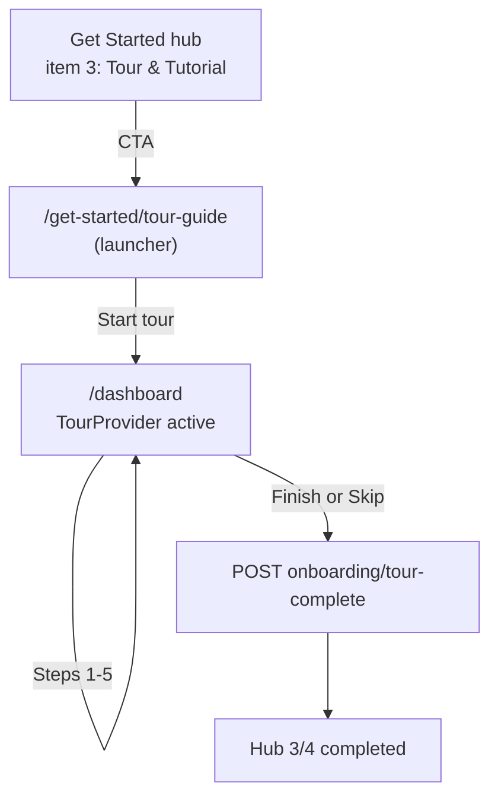

# feat-0016: Tour & Tutorial — interactive studio onboarding walkthrough

> **Figma file:** [Troott `9lFM6TncipSv0pNVGBWZwA`](https://www.figma.com/design/9lFM6TncipSv0pNVGBWZwA/Troott). Screenshots: export via [`assets/README.md`](./assets/README.md) or [`scripts/export-figma-assets.sh`](./scripts/export-figma-assets.sh) (pacepard-ui-agent, channel `5mtmmnxl`).

## Summary

Replace the placeholder [`TourGuidePage`](../../../../apps/web/src/app/get-started/TourGuidePage.tsx) with a **5-step interactive product tour** that runs on the **studio dashboard** (`/dashboard`). Each step dims the page, spotlights a target control, and shows a **Figma-aligned popover** (badge, title, body, Previous / Next or Finish, step counter, Skip tour).

On **Finish** or **Skip tour**, the client calls `POST …/onboarding/tour-complete`, refreshes onboarding context, and returns the user to the Get Started hub at **`3/4 completed`** (server `onboarding.step ≥ 5`).

Complements [feat-0010](../feat-0010/PRODUCT.md) (Get Started ladder), [feat-0015](../feat-0015/PRODUCT.md) (hub progress), and [feat-0007](../feat-0007/PRODUCT.md) (Save & Exit). Supersedes feat-0010 § “Interactive tour (deferred)”.

## Problem

| Today | Gap |
| ----- | --- |
| `/get-started/tour-guide` is static copy | No guided discovery of upload, nav, sermons, analytics, feed |
| Hub item 3 “How to use troott” only marks complete via footer **Continue** | Users skip the product without seeing studio surfaces |
| Figma defines full tour UX | Not implemented in code |

## Consumer

Authenticated **minister** and **creator** on web, typically from Get Started hub item 3 (`/get-started/tour-guide`) or deep link after ministry step (server step ≥ 4).

## Non-goals

- Mobile listener onboarding tour
- Admin portal tour
- Re-running tour after `onboarding.step ≥ 5` (unless product adds “Replay tour” later)
- Migrating the whole app to **coss ui / Base UI** just for this feature

---

## Figma reference (Troott file `9lFM6TncipSv0pNVGBWZwA`)

Channel: `5mtmmnxl` (pacepard-ui-agent). Screenshots: [`assets/README.md`](./assets/README.md).

### Global popover chrome (all steps)

| Region | Figma spec |
| ------ | ---------- |
| Card | 381×256px popover (`Frame 1618868654`), `#333234` fill, `#405e5e` border, 12px radius |
| Pointer | Polygon caret toward anchor (top or left per step) |
| Badge | Pill “Tour & Tutorial”, `#405e5e` bg, `#d2e7e7` text, Matter SemiBold 12px |
| Skip | “Skip tour”, top-right, `#bdbdbd`, 12px |
| Title | Matter SemiBold 16px, `#eaeaea` |
| Body | Matter Medium 14px / 20px line-height, `#bdbdbd` |
| Footer rule | `#545454` 50% opacity |
| Primary CTA | `#08ffdb` fill, `#292929` text, 8px radius — label **Next** (steps 1–4) or **Finish** (step 5) |
| Previous | Text button `#bdbdbd`, hidden on step 1 |
| Step counter | `{n} of 5`, `#eaeaea`, 12px, footer right |

### Global screen treatment

- Full dashboard layout visible under a **dim overlay** (~70% black).
- **Spotlight** on target: white/teal stroke on highlighted element; rest of UI non-interactive except popover controls.
- Sidebar **Get Started** mini-card may remain visible (Figma shows `1/4 completed` — independent of tour step counter).

---

## Five tour steps

### Step 1 — Upload from computer

| | |
| --- | --- |
| **Figma screen** | [`3809:486`](https://www.figma.com/design/9lFM6TncipSv0pNVGBWZwA/Troott?node-id=3809-486) |
| **Figma popover** | [`3815:958`](https://www.figma.com/design/9lFM6TncipSv0pNVGBWZwA/Troott?node-id=3815-958) |
| **Route** | `/dashboard` |
| **Anchor** | Top quick-action card **“Upload from computer”** (first card in dashboard action row) |
| **Popover placement** | Below card, caret points up |
| **Title** | Upload, manage and share |
| **Body** | Upload your message, organize the details, and send it in for review all from one place. Everything you need to manage your content and share it on Troott starts here. |
| **Footer** | **Next** only · **1 of 5** · no Previous |


---

### Step 2 — Dashboard (sidebar)

| | |
| --- | --- |
| **Figma screen** | [`3815:17094`](https://www.figma.com/design/9lFM6TncipSv0pNVGBWZwA/Troott?node-id=3815-17094) |
| **Figma popover** | [`3815:17355`](https://www.figma.com/design/9lFM6TncipSv0pNVGBWZwA/Troott?node-id=3815-17355) |
| **Route** | `/dashboard` (same page; sidebar focus changes) |
| **Anchor** | Sidebar nav item **Dashboard** (`/dashboard`, [`navdata.tsx`](../../../../apps/web/src/_data/navdata.tsx)) |
| **Popover placement** | Right of sidebar item, caret points left |
| **Title (Figma)** | Create new clip |
| **Body (Figma)** | Start something impactful. Upload your message, add details, and prepare for review. Your voice meets structure to deliver truth with clarity across the Troott platform. |
| **Troott copy note** | Figma title references “clip”; production sidebar label is **Dashboard**. Prefer **Dashboard** as anchor label; title/body may be revised to “Your studio home” in a copy pass — until then ship Figma verbatim. |
| **Footer** | **Previous** · **Next** · **2 of 5** |


---

### Step 3 — Sermons (sidebar)

| | |
| --- | --- |
| **Figma screen** | [`3815:17483`](https://www.figma.com/design/9lFM6TncipSv0pNVGBWZwA/Troott?node-id=3815-17483) |
| **Route** | `/dashboard` (sidebar spotlight; optional navigate to `/sermons` on Next — see TECH) |
| **Anchor** | Sidebar **Sermons** (`/sermons`) |
| **Title (Figma)** | My clips |
| **Body (Figma)** | Manage and organize your teachings, clips. Upload content from your device, track pending reviews, and keep everything in one place as you build your impact library. |
| **Troott mapping** | Sidebar label **Sermons**; title may display **My sermons** in copy pass |
| **Footer** | **Previous** · **Next** · **3 of 5** |


---

### Step 4 — Analytics (sidebar)

| | |
| --- | --- |
| **Figma screen** | [`3816:18146`](https://www.figma.com/design/9lFM6TncipSv0pNVGBWZwA/Troott?node-id=3816-18146) |
| **Figma popover** | [`3816:18407`](https://www.figma.com/design/9lFM6TncipSv0pNVGBWZwA/Troott?node-id=3816-18407) |
| **Route** | `/dashboard` or `/analytics` when step active |
| **Anchor** | Sidebar **Analytics** (`/analytics`) |
| **Title** | Performance Stats |
| **Body** | Track how your messages are doing across the platform. From views and reach to engagement and shares this section gives you a clear view of your content's impact over time. |
| **Footer** | **Previous** · **Next** · **4 of 5** |


---

### Step 5 — Your feed

| | |
| --- | --- |
| **Figma screen** | [`3816:18796`](https://www.figma.com/design/9lFM6TncipSv0pNVGBWZwA/Troott?node-id=3816-18796) |
| **Figma popover** | [`3816:18535`](https://www.figma.com/design/9lFM6TncipSv0pNVGBWZwA/Troott?node-id=3816-18535) |
| **Route** | `/dashboard` |
| **Anchor** | **Your feeds** section (dashboard panel below upload zone) |
| **Popover placement** | Above section, caret points down |
| **Title** | Feed |
| **Body** | This is where you'll see updates on your teachings like reviews, approvals, feedback, and more. Think of it as your content heartbeat, helping you stay aligned and inspired. |
| **Footer** | **Previous** · **Finish** (not Next) · **5 of 5** |


---

## User flows



| Action | Behavior |
| ------ | -------- |
| Hub **Tour & Tutorial** | Navigate to `/get-started/tour-guide` |
| Tour launcher **Start** (or auto on mount) | `navigate('/dashboard')` + `startTour()` |
| **Next** / **Previous** | Update step index; reposition popover; update spotlight |
| **Skip tour** | Confirm optional → `tour-complete` → `/get-started` |
| **Finish** (step 5) | `tour-complete` → `/get-started` |
| Inner **Continue** on tour-guide (legacy) | Still valid: milestone if tour already done via interactive path |

**Hub progress after tour:** `onboarding.step ≥ 5` → hub **`3/4 completed`**, accordion item 3 **Completed** ([feat-0015](../feat-0015/PRODUCT.md)).

---

## UI library strategy — Origin UI (legacy) vs coss ui vs shadcn

Troott web already uses **shadcn + Radix**. The tour needs **two layers**:

```text
┌─────────────────────────────────────┐
│  Dimmed overlay + cutout spotlight  │  ← NOT in Origin/coss — custom or driver.js / @reactour/tour
│         ┌──────────────┐            │
│         │ Popover card │            │  ← Origin onboarding-tour / coss Popover
│         │ Step n of 5  │            │
│         │ [Skip][Next] │            │
│         └──────────────┘            │
└─────────────────────────────────────┘
```

### Origin UI → coss ui (current)

| Legacy Origin UI | coss ui (current) |
| ---------------- | ----------------- |
| [originui.com](https://originui.com) redirects to coss | [coss.com/ui](https://coss.com/ui) |
| Radix + shadcn-style particles | Base UI + Tailwind |
| `npx shadcn@latest add @coss/ui` or copy from docs | 484+ particles |

### Components that map to this tour

| Pattern | Use in feat-0016 |
| ------- | ---------------- |
| **Popover — Onboarding tour** | Primary card: badge, body, step counter, Next/Skip |
| **Popover — Tooltip-like with steps** (`popover-05`) | Footer `{current+1}/{total}` + Next |
| **Popover — Tooltip-like with nav** | Previous / Next on steps 2–5 |
| **Dialog — Onboarding dialog** | Optional welcome before step 1 (non-goal v1) |
| **Stepper** | Optional footer dots (Figma uses text counter only) |
| **Tooltip variants** | Not used — too easy to miss for forced onboarding |

### coss ui (if adopted later)

| coss feature | Tour use |
| ------------ | -------- |
| Popover / Popup `tooltipStyle` | Coach-mark with arrow |
| Detached animated popovers | Popup moves between targets |
| Dialog / Sheet | Skip confirm, completion |

### Recommendation (accepted for v1)

**Hybrid — Origin-style popover + custom spotlight**

1. Copy **Origin UI onboarding-tour** (or tooltip-like-with-steps) into `apps/web/src/components/shared/tour/` using existing shadcn `Popover` + Troott tokens (`#333234`, `#08ffdb`, `#405e5e`).
2. Add thin **orchestrator** (`TourProvider`, step index, `data-tour` selectors, overlay).
3. **Do not** migrate the app to coss ui / Base UI for this feature alone.
4. Optional: `@reactour/tour` or `driver.js` **only** for overlay + spotlight geometry if custom SVG mask is too costly.

---

## API

| Persona | Endpoint | When |
| ------- | -------- | ---- |
| Minister | `POST /api/v1/minister/onboarding/tour-complete` | Finish or Skip |
| Creator | `POST /api/v1/creator/onboarding/tour-complete` | Finish or Skip |

Idempotent when server step already ≥ 5. Then `dispatchOnboardingProfileRefresh()` + navigate `/get-started`.

---

## Acceptance criteria

- [ ] Five steps match Figma anchors, copy, and popover chrome (badge, Skip, counter, CTAs).
- [ ] Step 1: no Previous; steps 2–4: Previous + Next; step 5: Previous + **Finish**.
- [ ] Overlay blocks interaction outside popover + spotlight.
- [ ] Finish and Skip call tour-complete and land on hub at **3/4** when prior steps satisfied.
- [ ] Tour launch from `/get-started/tour-guide` without requiring placeholder Continue-only flow.
- [ ] `data-tour` selectors stable for dashboard cards and sidebar items.
- [ ] Keyboard: Esc → Skip confirm; focus trap in popover.
- [ ] Minister and creator personas.

---

## Related specs

- [feat-0010 PRODUCT](../feat-0010/PRODUCT.md) — tour-guide route, milestone on Continue
- [feat-0010 TECH](../feat-0010/TECH.md) — file map, `ProgressButtons` tour path
- [feat-0015 PRODUCT](../feat-0015/PRODUCT.md) — hub `3/4` semantics
- [feat-0006 PRODUCT](../feat-0006/PRODUCT.md) — post-tour upload sermon gate
