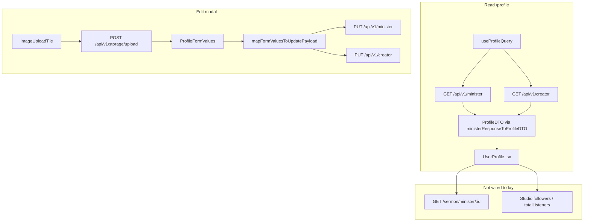

# feat-0024: Profile — data sources, actions, and Figma parity

## Summary

`/profile` is the minister/creator **public identity** preview. Users **read** how listeners see them and **edit** bio, imagery, ministry metadata, location, and social handles in a modal.

This spec ties three Figma frames to **verified** API endpoints and **current** web code (`UserProfile.tsx`, `EditProfileDialog.tsx`, `useProfile.ts`). Numbers in Figma (128 sermons, 46,204 listens, etc.) are **design samples only** — implementation must not hard-code them.

---

## Figma screenshots and frames

| Frame | Node | File (target) | Notes |
| ----- | ---- | ------------- | ----- |
| Profile read (minimal hero) | `11578:98647` | `assets/profile-read-minimal-hero.png` | Full page ~1200×1809; hero without banner photo |
| Profile read (with cover) | `11745:106250` | `assets/profile-read-with-cover.png` | Same content; hero shows uploaded **banner** |
| Edit Profile | `11732:105889` | `assets/edit-profile-modal.png` | Modal 477×774; Cancel + **Save Changes** |

Figma file: [Troott `9lFM6TncipSv0pNVGBWZwA`](https://www.figma.com/design/9lFM6TncipSv0pNVGBWZwA/Troott).

### Figma copy inventory (extracted from nodes — not API data)

**Page header**

- Title: `Profile`
- Subtitle: `This is how listeners will see you on the platform.`

**Hero**

- Display name, `@slug`, ministry name
- Subline: `{monthly audience} • {followers}` (example: `600K monthly audience` / `10.5k Followers`)
- Button: `Edit profile`

**Insight cards**

- `Sermons published`, `Total Listens`, `Followers`, `Member Since`

**Left column (below cards)**

- `About` (long bio)
- `Contact` — Email; Phone · Optional
- `Ministry Details` — Church; Location
- `Social Networks` — Instagram · Optional; Twitter · Optional; TikTok · Optional

**Right column**

- `Recent Sermons` + link `See all`
- Rows: title, `{Mon DD, YYYY} • {n} plays`

**Edit modal (`11732:105889`)**

- `Background image` — helper: JPEG, PNG, WEBP, MAX 5MB, **1280×740 max**
- `Profile picture` — helper: JPEG, PNG, WEBP, **BMP**, Max 5MB, **500×500 max**
- `Minister's Name`, `Ministry Name`, long text area, `Location`, `Social networks` (optional)
- Footer: `Cancel`, `Save Changes`

**Figma quirk (documented):** The long text area under the second single-line `Ministry Name` label contains biography paragraphs in the design file. **Product label = About / bio.** Code correctly uses field label `About` (`profile.description`).

---

## Route and entry points

| URL | Component | Auth |
| --- | --------- | ---- |
| `/profile` | `UserProfile` | Signed-in internal portal user |

| Action | Entry | Expected behavior |
| ------ | ----- | ----------------- |
| Open profile | Sidebar **Profile**, account menu **Profile** | Navigate to `/profile`; `useProfileQuery()` runs |
| Edit profile | Hero button, About empty-state link | `EditProfileDialog` `open=true` |
| Close edit | X, Cancel, overlay | Dirty → confirm discard; else close |
| Save Changes | Modal footer | Partial `PUT`; toast; close; read view updates |
| See all | Recent sermons header | Navigate to `/studio/{studioCode}/sermons` (**not wired**) |

---

## Architecture (data flow)



---

## Read view — UI regions vs data

| Figma region | UI element | Data source (production) | Shipped today | Gap |
| ------------ | ---------- | ------------------------- | ------------- | --- |
| Page header | Title + subtitle | Static copy | **Missing** | Add header block |
| Cover | `coverImage` | `MinisterResponseDTO.banner` → `Asset` | Wired if URL on GET | Ensure API returns display URL in `avatar`/`banner` |
| Avatar | `avatar` | `MinisterResponseDTO.avatar` | Wired | Same |
| Display name | Hero H2 | `profile.ministerialName` else `firstName lastName` | Wired | — |
| Handle | `@slug` | `slug` | Wired | Read-only |
| Ministry | Subtitle | `profile.ministryName` | Wired | — |
| Audience line | Grey subline | `monthlyListeners` + **followers** | **Missing** | Map `monthlyListeners` from GET; followers from **studio** or API gap |
| Edit profile | Button | Opens dialog | Wired | — |
| Sermons published | Card | Published sermon **count** | `—` | `GET /sermon/minister/:id?status=published` → `total` |
| Total Listens | Card | Aggregate play count | `—` | **No minister-level field** — studio `totalListeners` or analytics (TBD) |
| Followers | Card | Follower count | `—` | **No minister-level field** — studio `followers` (TBD) |
| Member Since | Card | `createdAt` | Wired | — |
| About | Left card | `bio` ← `profile.description` | Wired | — |
| Contact email | Row | `email` or `profile.email` | **Missing** | Extend `ProfileDTO` + mapper |
| Contact phone | Row | `phoneNumber` + `phoneCode` | **Missing** | Not in edit modal (Settings) |
| Ministry church | Row | `profile.ministryName` | **Missing** | Read section |
| Ministry location | Row | `profile.ministryHQLocation` | **Missing** | Mapped on save; not shown on read |
| Social rows | Rows | `profile.socials[]` | **Missing** | Map instagram/twitter/tiktok for read |
| Recent sermons | List | Sermon API | Placeholder text | See [Recent sermons](#recent-sermons) |
| See all | Link | Studio route | **Missing** | `studioSermonsPath(studioCode)` |

---

## Edit modal — fields vs API

Account type: `cookieService.getUserType()` → minister `GET/PUT /minister` or creator `GET/PUT /creator` (`useProfile.ts`).

| Figma / UI label | Form key | PUT payload (minister) | GET field | Shipped |
| ---------------- | -------- | ---------------------- | --------- | ------- |
| Background image | `coverImage` | `banner` = `s3Key` or `''` clear | `banner` | Yes |
| Profile picture | `avatar` | `avatar` = `s3Key` or `''` | `avatar` | Yes |
| Minister's Name | `ministerialName` | `profile.ministerialName` | `profile.ministerialName` | Yes |
| Ministry Name | `ministryName` | `profile.ministryName` | `profile.ministryName` | Yes |
| About | `bio` | `profile.description` | `profile.description` | Yes |
| Location | `ministryHQLocation` | `profile.ministryHQLocation.address` | Join `address, city, state` | Yes |
| Instagram / Twitter / TikTok | `instagram` etc. | `profile.socials[]` | `profile.socials[]` | Yes |
| Ministry website | — | `profile.websiteUrl` | In DTO | **No form field** (feat-0011 UC-P10) |
| Slug | — | `slug` | `slug` | **Not editable** here |

**Image upload:** `POST /api/v1/storage/upload` via `api.storage.uploadImage`; preview from `ImageDTO.file` (`ImageUploadTile.tsx`). Client validation: JPEG/PNG/WEBP, 5MB (BMP in Figma for avatar — **not** accepted in code today).

**Save rules:** `mapFormValuesToUpdatePayload` sends **only changed** fields; `Save Changes` disabled when pristine; empty asset removal sends `null` → `''` on PUT.

---

## Actions specification

### A1 — Load profile (page mount)

| Step | Behavior |
| ---- | -------- |
| 1 | `useProfileQuery()` with key `['profile','me', role]` |
| 2 | Minister: `api.minister.getMinister()` → `parseMinisterResponsePayload` → `ministerResponseToProfileDTO` |
| 3 | Creator: `api.creator.getCreator()` → `creatorResponseToProfileDTO` |
| 4 | Loading: skeleton; error: message + **Retry** |

**Mapper gaps today (`useProfile.ts`):** Does not map `phoneNumber`, `profile.phoneNumber`, `profile.email`, or `monthlyListeners` into `ProfileDTO`.

### A2 — Open / close Edit profile

| Step | Behavior |
| ---- | -------- |
| 1 | `setEditOpen(true)` |
| 2 | `mapProfileToFormValues(profile)` seeds form |
| 3 | Close with dirty form → `window.confirm` discard |
| 4 | Close clean → dialog unmounts |

### A3 — Upload cover or avatar (in modal)

| Step | Behavior |
| ---- | -------- |
| 1 | User picks file → validate type/size |
| 2 | `api.storage.uploadImage(file, onProgress)` |
| 3 | On success: `Asset { s3Key, fileName, url: dto.file }` in form state |
| 4 | Persisted on **Save** only (not on upload alone) |

### A4 — Save Changes

| Step | Behavior |
| ---- | -------- |
| 1 | Build `UpdateProfilePayload` from diff |
| 2 | If empty diff → close without API |
| 3 | `useUpdateProfileMutation` → `PUT` minister or creator |
| 4 | On success: refetch profile, `qc.setQueryData`, `ministerCtx.refresh` / `creatorCtx.refresh`, `ONBOARDING_PROFILE_REFRESH_EVENT` |
| 5 | Toast `Profile updated`; close dialog |
| 6 | Read view must show new hero/about without full page reload |

### A5 — See all (recent sermons)

| Step | Behavior |
| ---- | -------- |
| 1 | Resolve `studioCode` from minister/creator context |
| 2 | `navigate(/studio/${code}/sermons)` |
| 3 | **Today:** link absent |

### A6 — Recent sermon row (optional v1)

| Step | Behavior |
| ---- | -------- |
| 1 | Click row → sermon detail or player (product TBD) |
| 2 | **v1:** rows non-clickable; **See all** only |

---

## Recent sermons

**Do not use** `GET .../recently-published` for this widget — that route returns sermons from the **last 7 days** only (`sermon.controller.ts`).

**Recommended:**

```http
GET /api/v1/sermon/minister/:ministerId?status=published&sort=-releaseDate&limit=3&page=1
```

Map each row (see `mapApiSermonToTableRow`):

| Figma column | API field |
| ------------ | --------- |
| Title | `title` |
| Date | `releaseDate` or `createdAt` → `Apr 14, 2026` |
| Plays | `playCount` → `2,340 plays` |

Empty state: `No published sermons yet.` (no fake rows).

---

## Insight cards — data sources

| Card | Figma example | Recommended source | API / notes |
| ---- | ------------- | ------------------ | ----------- |
| Sermons published | 128 | `total` from minister sermon list | `status=published`, `limit=1` |
| Total Listens | 46,204 | **Gap** | No `totalPlays` on `MinisterResponseDTO`. Candidates: `studio.totalListeners` when minister has studio; future analytics aggregate |
| Followers | 10,581 | **Gap** | `studio.followers` on studio doc — not on minister GET |
| Member Since | Mar 2023 | `createdAt` | Implemented |

**Hero audience line:** Format `monthlyListeners` from minister GET (field exists on `MinisterResponseDTO`). Pair with follower count using same source as Followers card. If follower source unavailable, show monthly listeners only or omit line (never fake `600K` / `10.5k`).

---

## API reference (verified in repo)

| Method | Path | Used for |
| ------ | ---- | -------- |
| GET | `/api/v1/minister` | Profile load (minister) |
| PUT | `/api/v1/minister` | Profile save |
| GET | `/api/v1/creator` | Profile load (creator account) |
| PUT | `/api/v1/creator` | Profile save |
| POST | `/api/v1/storage/upload` | Avatar / banner upload |
| GET | `/api/v1/sermon/minister/:ministerId` | Recent sermons + published count |

**Minister GET fields relevant to profile** (`MinisterResponseDTO` / mapper):

- Identity: `firstName`, `lastName`, `email`, `slug`, `phoneNumber`, `phoneCode`, `countryPhone`
- Media: `avatar`, `banner`
- Profile nested: `description`, `ministerialName`, `ministryName`, `ministryHQLocation`, `websiteUrl`, `socials`, `email`, `phoneNumber`
- Metrics: `monthlyListeners`, `createdAt`, `updatedAt`

**Not on minister GET today:** `followers`, `totalListeners`, `publishedSermonCount`.

---

## Code map

| Concern | Path |
| ------- | ---- |
| Read page | `apps/web/src/app/profile/UserProfile.tsx` |
| Types / mappers | `apps/web/src/app/profile/profile.types.ts` |
| Hooks | `apps/web/src/hooks/app/useProfile.ts` |
| Edit modal | `apps/web/src/components/features/profile/EditProfileDialog.tsx` |
| Upload tile | `apps/web/src/components/features/profile/ImageUploadTile.tsx` |
| Minister client | `apps/web/src/api/clients/minister.ts` |
| Sermon list | `apps/web/src/hooks/app/useSermon.ts`, `sermon-list-map.util.ts` |

---

## Gap register (implementation backlog)

| ID | Priority | Item | Status |
| -- | -------- | ---- | ------ |
| G1 | P0 | Page header (title + subtitle) | **Done** (`UserProfile.tsx`) |
| G2 | P0 | Map `monthlyListeners` (+ followers when source defined) into DTO and hero | **Done** (`useProfile.ts`, `useProfileInsightStats`) |
| G3 | P0 | Insight: sermons published via list `total` | **Done** (`useProfileStats.ts`) |
| G4 | P1 | Insight: total listens + followers (studio or API) | **Done** (studio `totalListeners` / `followers`) |
| G5 | P1 | Read sections: Contact, Ministry Details, Social Networks | **Done** (`ProfileReadSections.tsx`) |
| G6 | P1 | Recent sermons query + row UI | **Done** (`useProfileRecentSermons.ts`) |
| G7 | P1 | **See all** → My Sermons | **Done** (`ProfileRecentSermons.tsx`) |
| G8 | P2 | Avatar BMP accept (match Figma) | **Done** (`ImageUploadTile.tsx`) |
| G9 | P2 | Ministry website field in modal (UC-P10) | Open |
| G10 | P2 | Slug edit (product decision) | Open |

---

## Acceptance criteria

1. Opening `/profile` as a minister with API data shows real name, slug, ministry, bio, images (when URLs returned), and Member Since.
2. **Edit profile** → change ministerial name and About → **Save Changes** → hero and About update without manual refresh.
3. Upload new avatar/cover → save → hero reflects new images.
4. Social handles saved in modal appear in read **Social Networks** section (after G5).
5. With ≥1 published sermon, Recent sermons shows up to 3 real rows with date and play count (after G6).
6. **See all** navigates to studio sermons list (after G7).
7. Insight cards show API-backed numbers or `—` — never Figma sample integers.
8. No `profile.dummy.ts`, no mock query fallback.

---

## Manual test plan

| # | Steps | Expected |
| - | ----- | -------- |
| 1 | Sign in as minister with populated profile → `/profile` | Hero, about match API |
| 2 | **Edit profile** → change location → save | Location visible in Ministry Details (after G5) |
| 3 | Upload cover → save → reopen page | Cover persists |
| 4 | Clear bio → save | About empty state with Edit link |
| 5 | Publish 1 sermon → reload profile | Recent list shows sermon (after G6) |
| 6 | **See all** | Lands on `/studio/{code}/sermons` (after G7) |
| 7 | Creator account | Creator GET/PUT; minister-only fields hidden |
| 8 | Network failure on save | Error toast; dialog stays open |

---

## Distinction from sermon edit

Figma node `11578:98647` in older notes sometimes referred to sermon edit — in the linked Troott file that node is the **Profile read** frame (1200px content width, “Profile” title). Sermon edit is [feat-0022](../feat-0022/SERMON_EDIT_SPEC.md) at `/studio/:code/sermons/:id/edit`.

---

## Related specs

| Doc | Link |
| --- | ---- |
| **Profile images not showing (API)** | [profile-image-display-spec.md](../../api/profile-image-display-spec.md) |
| Web image delivery | [feat-0011 PRODUCT.md](../feat-0011/PRODUCT.md#web-image-delivery-portal-wide) |
