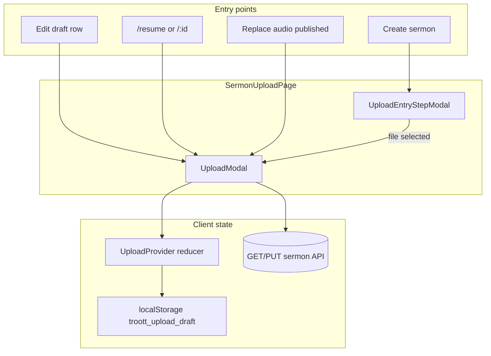

# feat-0027: Draft sermon editor — upload modal state and use cases

## Summary

The **upload modal** (`UploadModal`) hosted on **`SermonUploadPage`** is the **canonical editable UI for sermon drafts**. Users finish or change unpublished work only through this wizard—not through `SermonEditPage` ([feat-0025](../feat-0025/SERMON_EDIT_ROUTING_SPEC.md)).

This spec defines:

1. **What state** the modal owns and how it is persisted.
2. **All entry paths** into draft edit mode.
3. **Step behavior**, validation, and URL sync.
4. **Close, abandon, and resume** rules.
5. **Known gaps** in current code vs normative target.

Numbers in examples are illustrative. Behavior must follow **API data** and the rules below—not hard-coded demo values.

---

## Product rule (normative)

```text
IF sermon is draft (see § Draft detection)
  THEN full edit UX = SermonUploadPage + UploadModal (+ UploadEntryStepModal when no audio yet)
ELSE IF sermon is published
  THEN full edit UX = SermonEditPage (/sermons/:id/edit) — NOT this spec
```

| Surface | Draft | Published |
| ------- | ----- | --------- |
| Row **Edit** | Upload wizard + `resumeSermonId` | Sermon details |
| **Create sermon** (new) | Upload wizard, no `resumeSermonId` | N/A |
| **Replace audio** (from published details) | Wizard **file/progress** step only | Same |
| **Sermon details** form | Must not be primary draft editor | Primary editor |

---

## Architecture



### Components (verified paths)

| Piece | Path | Role |
| ----- | ---- | ---- |
| Page host | `apps/web/src/app/studio/SermonUploadPage.tsx` | Entry vs wizard open; `resumeSermonId` hydrate |
| Entry modal | `components/shared/upload/UploadEntryStepModal.tsx` | Pick audio (no `sermonId` yet) |
| Wizard | `components/shared/upload/UploadModal.tsx` | Tabs, footer, polling owner |
| Progress | `UploadProgressStep.tsx` | Multipart / `start-upload` |
| Details | `SermonDetailsForm.tsx` | Title, description, category, thumbnail |
| Settings | `ListenerSettings.tsx` | Visibility, schedule |
| Review | `ReviewSubmit.tsx` | Save draft, Publish |
| Context | `context/upload/uploadState.tsx` + `uploadReducer.tsx` | Single source of truth in session |

---

## State model (normative)

### 1. In-memory: `IUploadContext` / `ISermonUpload`

Canonical shape: `apps/web/src/utils/interfaces.util.tsx` (`ISermonUpload`, `IUploadContext`).

| Field | Purpose | Persisted locally? | On server resume? |
| ----- | ------- | ------------------ | ----------------- |
| `sermonId` | Mongo sermon id after `start-upload` or resume | Yes (metadata only) | Yes |
| `uploadRef` | Audio item id for publish body | Yes | **Gap today** — must hydrate from `item.itemId` |
| `file` | `File` for new multipart upload | **No** (not JSON-serializable) | N/A — use playback URL + `uploadComplete` |
| `title`, `description`, `tags`, `category` | Metadata | Yes | Partial (resume loads) |
| `thumbnail`, `thumbnailPreview` | Cover | No / preview only | **Gap** — hydrate from `imageUrl` / `image` |
| `visibility`, `isPublic` | Listener settings | Yes | **Gap** — map from API `visibility` |
| `scheduledDate` | Optional schedule | Yes | **Gap** |
| `seriesId` | Series link | Yes | **Gap** |
| `slug` | Share slug when known | Yes | **Gap** |
| `uploadComplete` | Client: audio accepted by API | Derived on resume | Set from `resolveSermonPlaybackUrl` |
| `currentStep` | Wizard tab | URL + reducer | Set on resume (`review` or `details`) |
| `progress`, `isLoading` | Transfer UI | Session only | Reset on resume |
| `errors` | Validation | Session only | Cleared on load |

**Normative:** Resuming a draft must populate **all** fields required to render Details, Settings, and Review without empty defaults that overwrite server truth on save.

### 2. Browser: `localStorage` (`UPLOAD_STORAGE_KEY`)

- **When:** `title` or `description` changes (`uploadState.tsx` effect).
- **What:** Metadata fields only; `file`, `thumbnail`, `thumbnailPreview` stripped.
- **Risk:** Stale local copy can pre-fill a **new** create session if not cleared on successful publish or explicit `clearStoredData`.
- **Normative:** On **successful Publish** or intentional **Reset**, clear local storage. On **resume** with `resumeSermonId`, **server wins** over localStorage for that `sermonId` (load API first, then optional merge of in-flight local only if same `sermonId`).

### 3. Server: sermon document

| Action | API (indicative) | When |
| ------ | ---------------- | ---- |
| Create + upload audio | `POST /sermon/start-upload` | New file on progress step |
| Save metadata | `PUT /sermon/update/:id` | Details auto-save / explicit |
| Save draft | `POST /sermon/publish` with draft status | Review **Save as draft** / close auto-save |
| Publish | `POST /sermon/publish` published | Review **Publish** |
| Cover | Cover upload service | Details thumbnail |
| Status poll | `GET /sermon/:id` | After upload; see feat-0018 polling spec |

Draft row on **My Sermons** must reflect server state after any save (invalidate `sermonQueryKeys`).

### 4. URL sync (wizard steps)

| Step key | Route segment | Component |
| -------- | ------------- | ----------- |
| `progress` | `sermons/upload/file` | `UploadProgressStep` |
| `details` | `sermons/upload/details` | `SermonDetailsForm` |
| `settings` | `sermons/upload/thumbnail` | `ListenerSettings` |
| `review` | `sermons/upload/publish` | `ReviewSubmit` |

Mapping: `upload-wizard-route.util.ts`. Changing tabs calls `onStepChange` → `SermonUploadPage.syncStepToUrl` (`replace: true`).

**Normative:** In-wizard edits must **not** reset when the URL segment changes. Only `currentStep` and scroll position may change.

---

## Wizard steps (draft edit behavior)

### Progress (`UploadProgressStep`)

| Use case | Behavior |
| -------- | -------- |
| New draft, first file | User selects file → multipart upload → `sermonId` + `uploadRef` set |
| Resume draft **with** audio | Skip entry modal; may land on **review** or **details**; user can open Progress to replace file |
| Resume draft **without** audio | Land on **details**; Progress available to add file |
| Upload in flight | Footer shows %; tabs remain reachable once `file` exists (feat-0018) |
| Processing | Poll `item.uploadStatus`; banner via `formatUploadPipelineLabel` ([feat-0018 polling](../feat-0018/UPLOAD_STATUS_POLLING_SPEC.md)) |

### Details (`SermonDetailsForm`)

- Required: title (min 3), description (min 10), category.
- Thumbnail upload (cover API).
- May auto-save metadata while on step (existing hooks — must not fight resume hydrate).

### Settings (`ListenerSettings`)

- Visibility: public / unlisted / private.
- Optional schedule.
- Step marked complete when `isPublic !== undefined` (user made a choice).

### Review (`ReviewSubmit`)

- **Save as draft** → publish API draft + close + list invalidate.
- **Publish** → validation + publish published + onboarding hooks as today.
- Edit shortcuts jump back to prior steps (file/title/description/thumbnail).

---

## Use case catalog

### UC-DM01 — Create new draft (no sermon yet)

| | |
| --- | --- |
| **Trigger** | **Create sermon** on My Sermons |
| **Pre** | No `resumeSermonId`; no `uploadData.file` |
| **Flow** | `UploadEntryStepModal` → pick file → wizard opens → progress → … → save or publish |
| **Post** | Row on list (draft or published) |

### UC-DM02 — Edit existing draft (primary)

| | |
| --- | --- |
| **Trigger** | Row **Edit** on draft ([feat-0025](../feat-0025/SERMON_EDIT_ROUTING_SPEC.md)) |
| **Nav** | `studioUploadPath(code, sermons/upload/file)` + `state: { resumeSermonId, editMode: true }` |
| **Hydrate** | `GET /sermon/:id` → `loadFromDraft` + `setUploadComplete(hasAudio)` + initial step |
| **Initial step** | Has playback URL → **review**; else → **details** (`SermonUploadPage.tsx`) |
| **Post** | User saves or publishes; modal closes → My Sermons |

### UC-DM03 — Deep link resume

| | |
| --- | --- |
| **Trigger** | `/studio/{code}/sermons/{id}/resume` or legacy detail route |
| **Normative** | Same resolver as UC-DM02 (draft → wizard, published → edit page) |

### UC-DM04 — Resume from dashboard

| | |
| --- | --- |
| **Trigger** | `location.state.resumeSermonId` on dashboard (`Dashboard.tsx`) |
| **Normative** | Navigate to upload route with same state as UC-DM02 |

### UC-DM05 — Replace audio on **published** sermon (narrow wizard)

| | |
| --- | --- |
| **Trigger** | **Replace audio** on `SermonEditPage` |
| **Nav** | Upload file segment + `{ resumeSermonId, editMode: true }` |
| **Normative** | User stays in progress/replace flow; **not** full draft re-entry from list Edit |
| **Return** | After upload, return to published edit or list per product |

### UC-DM06 — Edit draft metadata only (audio already uploaded)

| | |
| --- | --- |
| **Trigger** | UC-DM02 with `uploadComplete === true` |
| **Flow** | User on **review** or navigates Details / Settings; no re-upload required |
| **Publish** | Allowed when validation + pipeline terminal (or product allows publish while processing — align with API) |

### UC-DM07 — Edit draft without audio (metadata-only draft)

| | |
| --- | --- |
| **Trigger** | Draft row exists before `start-upload` completes |
| **Flow** | Resume → **details** step; user can add title/description; Progress to add file later |
| **Save** | **Save as draft** persists metadata; list shows draft without plays |

### UC-DM08 — Close wizard (X or backdrop)

| | |
| --- | --- |
| **Trigger** | User closes `UploadModal` |
| **Current** | `handleClose` calls `saveDraftRef` if title/description/file present, then `onOpenChange(false)`; may return to My Sermons if file was set |
| **Normative** | See § Close and abandon |

### UC-DM09 — Abandon entry modal (no file chosen)

| | |
| --- | --- |
| **Trigger** | Close entry without selecting file |
| **Flow** | `goBackFromUpload()` → My Sermons |
| **State** | No server sermon required |

### UC-DM10 — Mid-upload close (upload in flight)

| | |
| --- | --- |
| **Trigger** | Close while `uploadInFlight` |
| **Normative** | Abort client upload when possible; do not call publish with partial file; server row policy per [04 - sermon-upload-draft](../../04%20-%20sermon-upload-draft.md#draft-modal) |
| **UI** | If `saveDraftRef` runs, must not mark published |

### UC-DM11 — Browser refresh on upload URL

| | |
| --- | --- |
| **Trigger** | F5 on `/sermons/upload/details` |
| **Risk** | `resumeSermonId` in `history.state` is cleared after hydrate (`replaceState`) — refresh loses resume unless `sermonId` in URL query (not implemented) |
| **Normative (target)** | Optional: `?sermonId=` query param for refresh-safe resume |

### UC-DM12 — Switch wizard tabs during processing

| | |
| --- | --- |
| **Trigger** | User clicks Details while status `extracting` |
| **Normative** | Allowed once `hasUploadFile`; edits kept in `uploadData`; polling continues in modal |

### UC-DM13 — Publish draft from review

| | |
| --- | --- |
| **Trigger** | **Publish** on review step |
| **Post** | Published row; modal closes; **must not** open SermonEditPage automatically unless user chooses Edit again (then feat-0025 sends to details) |

### UC-DM14 — Published sermon must not use draft modal as editor

| | |
| --- | --- |
| **Trigger** | **Edit** on published row |
| **Normative** | `SermonEditPage` only — never full wizard resume for published ([feat-0025](../feat-0025/SERMON_EDIT_ROUTING_SPEC.md)) |

### UC-DM15 — Bin / trashed sermon

| | |
| --- | --- |
| **Normative** | No **Edit**; restore first ([feat-0019](../feat-0019/PRODUCT.md)) |

---

## Close and abandon (normative)

| Situation | Auto-save draft API? | Navigate away | Reset wizard step |
| --------- | -------------------- | ------------- | ----------------- |
| Close after meaningful data | **Yes** (if `saveDraftRef` wired) | My Sermons when had file | `file` step in reducer (session) |
| Close during transfer | **No** publish until complete | My Sermons | Same |
| Close entry, no file | No | My Sermons | N/A |
| Successful **Publish** | N/A | My Sermons | `resetUpload` + clear localStorage |
| Successful **Save as draft** | Done in ReviewSubmit | My Sermons | Optional reset |

**Discard without save:** Product may require confirm dialog if dirty — **not implemented** today; optional enhancement.

---

## Draft detection (must match list + routing)

Same as [feat-0025](../feat-0025/SERMON_EDIT_ROUTING_SPEC.md):

- `publicationStatus === 'draft'` on list row, or
- `isSermonDraftDocument(doc)` on `GET /sermon/:id`

---

## API ↔ modal field mapping (resume hydrate target)

On `GET /sermon/:id`, map into `loadFromDraft` payload:

| API field | `ISermonUpload` field |
| --------- | ------------------- |
| `id` | `sermonId` |
| `title` | `title` |
| `description` | `description` |
| `topic` | `category` |
| `tags` | `tags` |
| `visibility` + `isPublic` | `visibility`, `isPublic` |
| `item.itemId` or upload ref | `uploadRef` |
| `imageUrl` / `image.item` | `thumbnailPreview` (display only) |
| `series` / `seriesId` | `seriesId` |
| `slug` | `slug` |
| `releaseDate` / preached | `scheduledDate` if scheduled |

**Current resume** (`SermonUploadPage.tsx` lines 124–131) sets only: `sermonId`, `title`, `description`, `tags`, `category`, `isPublic` — **insufficient** for full editable UI per table above.

---

## Implementation status (verified against repo)

| Item | Status |
| ---- | ------ |
| Wizard steps + URL sync | **Done** |
| `resumeSermonId` hydrate + initial step | **Partial** |
| Full field hydrate on resume | **Gap** |
| `LOAD_FROM_DRAFT` forces `uploadComplete: false` then overridden | **Done** (page effect order) |
| localStorage metadata backup | **Done** |
| Close → auto save draft | **Done** (via `saveDraftRef`) |
| Single polling owner in `UploadModal` | **Done** |
| Refresh-safe resume (`?sermonId=`) | **Gap** |
| Dirty close confirm | **Gap** |
| feat-0025 draft routing | **Done** (separate feat) |

---

## Acceptance criteria

1. Draft **Edit** opens wizard with server-backed fields visible on Details, Settings, and Review (no blank visibility/thumbnail after resume).
2. User can move across all wizard tabs without losing unsaved edits in the session.
3. **Save as draft** and **Publish** from review update server and My Sermons list.
4. **Create sermon** still uses entry modal → wizard (no regression).
5. Published **Edit** never opens full wizard ([feat-0025](../feat-0025/SERMON_EDIT_ROUTING_SPEC.md)).
6. **Replace audio** on published opens file/progress path only and keeps `sermonId`.
7. Processing state shows pipeline label and polls until terminal or stall rules ([feat-0018 polling](../feat-0018/UPLOAD_STATUS_POLLING_SPEC.md)).
8. After **Publish**, local draft storage cleared and wizard reset.

---

## Manual test plan

| # | Steps | Expected |
| - | ----- | -------- |
| 1 | Save draft with title, visibility unlisted, cover | List shows draft |
| 2 | **Edit** draft | Wizard opens on review or details; all fields match step 1 |
| 3 | Change description → tab to Settings → back to Review | Changes retained |
| 4 | **Publish** | Published; modal closes; re-**Edit** opens Sermon details not wizard |
| 5 | New **Create sermon** | Entry modal; no stale title from step 1 |
| 6 | Draft without audio → **Edit** | Lands on details; add file on Progress |
| 7 | Close wizard mid-upload | No false “published”; list shows draft or incomplete per API |
| 8 | Published → **Replace audio** | Wizard file step only; return to details |

---

## Related specs

| Doc | Link |
| --- | ---- |
| Edit routing | [feat-0025 SERMON_EDIT_ROUTING_SPEC.md](../feat-0025/SERMON_EDIT_ROUTING_SPEC.md) |
| Wizard / library | [feat-0018 PRODUCT.md](../feat-0018/PRODUCT.md) |
| Polling | [feat-0018 UPLOAD_STATUS_POLLING_SPEC.md](../feat-0018/UPLOAD_STATUS_POLLING_SPEC.md) |
| Published edit | [feat-0022 SERMON_EDIT_SPEC.md](../feat-0022/SERMON_EDIT_SPEC.md) |
| Legacy UC | [04 - sermon-upload-draft.md](../../04%20-%20sermon-upload-draft.md) |
