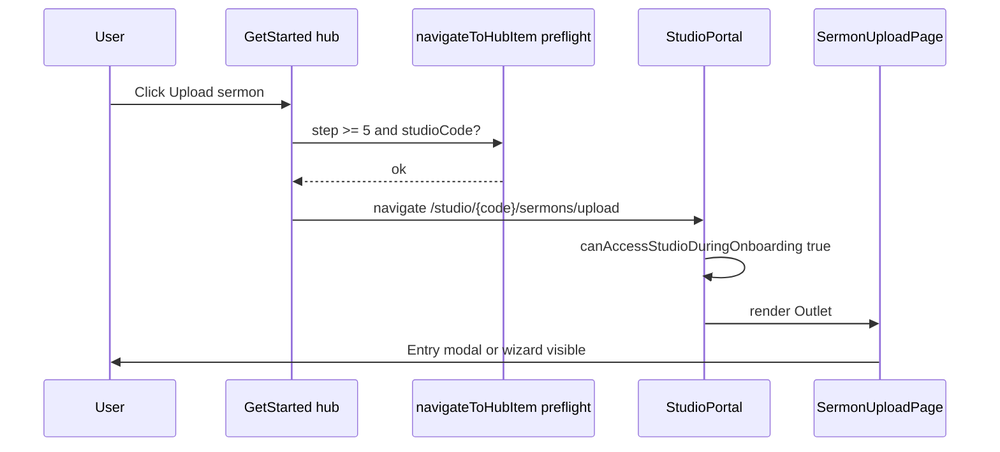

# Get Started — Upload sermon CTA (feat-0031)

Normative contract for hub accordion **item 4** on `/get-started`. Fixes the reported defect: **Upload sermon** click produces only a **blink** with no upload UI.

---

## UI surface

| Element | Copy | Location |
| ------- | ---- | -------- |
| Accordion title | Upload first sermon | Hub checklist item `id: "4"` |
| Collapsed CTA | Upload sermon | Trigger row (`group-data-[state=open]:hidden`) |
| Expanded CTA | Upload sermon | `AccordionContent` primary button |
| Body copy | Create your first sermon post… | Expanded section |

**Data source:** [`apps/web/src/_data/onboarding.tsx`](../../../../apps/web/src/_data/onboarding.tsx) — item 4:

```ts
action: studioPath(PATH_SEG_SERMONS_UPLOAD)  // sermons/upload
```

**Navigation handler:** [`GetStarted.tsx`](../../../../apps/web/src/app/get-started/GetStarted.tsx) `navigateToHubItem` — item 4 uses plain `navigate(item.action)` (unlike item 3 tour, which uses `resolveStudioTourLaunchPath` + toast on failure).

---

## Preconditions (all required)

| # | Gate | Source | Why |
| - | ---- | ------ | --- |
| P1 | User signed in | Auth session | Route is `isAuth` |
| P2 | `onboarding.step >= 5` | Minister/creator API (`onboardingTourComplete`) | [`canAccessStudioDuringOnboarding`](../../../../apps/web/src/utils/hub-onboarding.util.ts) allows upload URLs only when `step >= ONBOARDING_STEP_TOUR` (5) |
| P3 | Studio code present | `getStoredStudioCode()` or `user.studioCode` / context | `studioPath()` without code → `/studio/_/sermons/upload` (invalid) |
| P4 | Onboarding not fully complete OR user intentionally uploading again | `step < 6` for “first sermon” narrative | Item marked complete at `step >= 6` |

**Milestone reference** ([`hub-onboarding.util.ts`](../../../../apps/web/src/utils/hub-onboarding.util.ts)):

| `onboarding.step` | Hub item 4 state |
| ----------------- | ---------------- |
| &lt; 5 | Item 4 **not** complete; upload route **blocked** by studio guard |
| 5 | Tour done; upload route **allowed** |
| ≥ 6 | Item 4 **Completed** on hub (server-backed `hubCompletedItemIds`) |

---

## Target URL

| Field | Value |
| ----- | ----- |
| Path pattern | `/studio/{studioCode}/sermons/upload` |
| `studioCode` | Lowercase public code ([`normalizeStudioCode`](../../../../apps/web/src/utils/studio-nav.util.ts)) |
| Forbidden | `/studio/_/sermons/upload` (placeholder when P3 fails) |

**After navigation (studio host):**

- [`SermonUploadPage`](../../../../apps/web/src/app/studio/SermonUploadPage.tsx) mounts under `StudioPortal`.
- No file yet → [`UploadEntryStepModal`](../../../../apps/web/src/components/shared/upload/UploadEntryStepModal.tsx) open (pick audio).
- Product may normalize to `…/upload/file` on file select ([feat-0027](../feat-0027/DRAFT_UPLOAD_MODAL_SPEC.md)).

---

## Interaction flow (happy path)



---

## Failure flows (must not blink silently)

### F1 — Tour milestone not saved (`step < 5`)

**Cause:** User finished interactive tour UI or hub item 3 visually, but never ran **Continue** on `/get-started/tour-guide` (API `onboardingTourComplete`) or refresh lost context.

**Current behavior:** `navigate('/studio/…/upload')` then `StudioPortal` `navigate(PATH_GET_STARTED, { replace: true })` → **blink**.

**Required behavior:**

- **Before** `navigate`, if `resolveOnboardingStep(...) < 5`:
  - `toast.error('Complete the studio tour before uploading your first sermon.')` (copy adjustable)
  - Optional secondary action: navigate to `/get-started/tour-guide`
  - **Do not** change URL to studio

### F2 — Missing studio code (P3)

**Cause:** `getStoredStudioCode()` empty; `user.studioCode` null; minister context not hydrated.

**Current behavior:** `studioPath` → `/studio/_/sermons/upload`; `getStudio('_')` fails or mis-resolves.

**Required behavior:**

- Same pattern as item 3 tour CTA in `GetStarted.tsx`:
  - `toast.error('Your studio is not ready yet. Finish earlier steps and try again.')`
  - Stay on `/get-started`
- Optionally trigger `GET /studios/me` once and cache code before retry (implementation in TECH).

### F3 — Item marked Completed (`step >= 6`)

**Cause:** First sermon already published.

**Required behavior:**

- Collapsed/expanded buttons show **Completed**, `disabled`, no navigation (current hub pattern).
- Optional: link “View sermons” → `/studio/{code}/sermons` (product choice).

### F4 — Onboarding fully complete (`status === 'completed'`)

**Cause:** [feat-0030](../feat-0030/PRODUCT.md) gate redirects entire `/get-started` tree.

**Required behavior:** User should not stay on hub; if they bookmark hub, redirect to sermons list. Out of item-4-only scope but explains “no upload button” reports.

---

## Hub CTA implementation requirements

1. **Preflight function** (single place used by collapsed + expanded buttons):

   ```text
   canLaunchUploadFromGetStartedHub(userType, minister, creator, user) →
     { ok: true, href } | { ok: false, reason: 'tour' | 'studio' | 'complete' }
   ```

   `href` must use real `studioCode`, never `_`.

2. **Parity with studio guard:** `ok: true` only if `canAccessStudioDuringOnboarding(href, …)` would be true for the upload pathname.

3. **No `stopPropagation` without handler:** collapsed button must call preflight + `navigate` on success (today it calls `navigateToHubItem` — keep, add preflight inside).

4. **Loading:** While minister/creator profile is loading, disable **Upload sermon** or show skeleton; avoid navigate during `ministerLoading`.

5. **Post-tour refresh:** After tour checkpoint, `dispatchOnboardingProfileRefresh()` (existing on other steps) should run so hub reads `step >= 5` before user clicks item 4.

---

## Copy (defaults)

| Key | Message |
| --- | ------- |
| `upload.blocked.tour` | Complete the studio tour before uploading your first sermon. |
| `upload.blocked.studio` | Your studio is not ready yet. Finish earlier steps and try again. |
| `upload.success.hint` | (none — upload UI is the success state) |

---

## Acceptance checks (CTA-specific)

- [ ] No navigation to `/studio/_/…` from hub.
- [ ] `step === 4` → toast, URL stays `/get-started`.
- [ ] `step === 5` + code → upload UI visible ≥ 1s (no immediate replace to get-started).
- [ ] Tour **Continue** on tour-guide page increments step before item 4 works without reload.
- [ ] Vitest: preflight + `canAccessStudioDuringOnboarding` alignment for steps 4, 5, 6.

---

## Files to change (implementation hint)

See [TECH.md](./TECH.md). Do not edit this spec when implementing; update TECH acceptance checklist instead.
