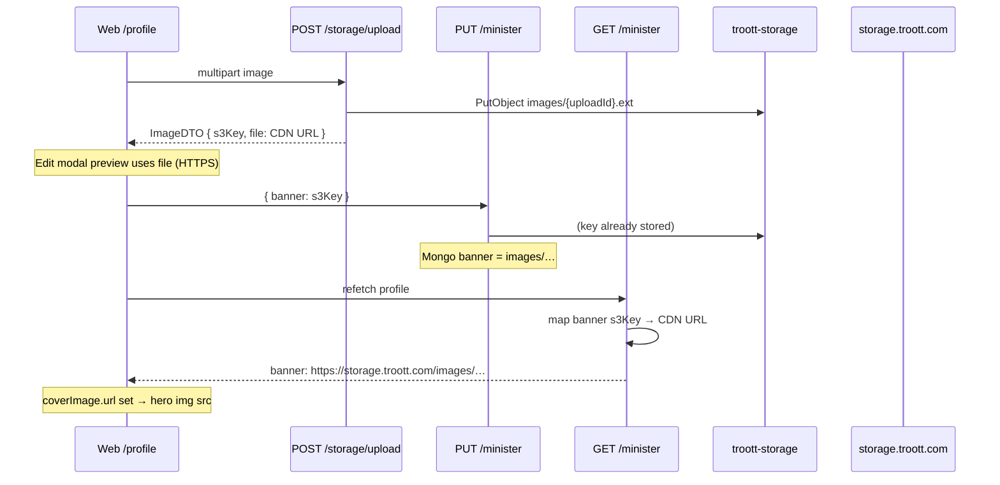

# feat-0033: Profile cover (Background image / `banner`) not visible on web

## Summary

Ministers and creators upload a **profile cover** in the Edit Profile modal (**Figma: Background image**). The API persists it on the minister/creator document as **`banner`**. After save or on reload, **`/profile` must show that image in the hero** — but production often shows only the dark gradient fallback.

This spec is the canonical contract for **profile cover visibility** across web and API. It ties Figma labels to field names, documents the end-to-end URL contract, and lists acceptance criteria to close the gap.

Related: [feat-0024 profile parity](../feat-0024/PRODUCT.md), [feat-0011 image delivery](../feat-0011/PRODUCT.md), [feat-0008 API CDN](../../api/feature/feat-0008/PRODUCT.md), [feat-0012 CDN load failure](../../api/feature/feat-0012/PRODUCT.md), [API profile image investigation](../../api/profile-image-display-spec.md) (superseded by this spec for fix scope).

**Figma file:** [Troott `9lFM6TncipSv0pNVGBWZwA`](https://www.figma.com/design/9lFM6TncipSv0pNVGBWZwA/Troott) — channel `why2d1ga`.

---

## Problem

| Step | Figma / product expectation | Observed |
| ---- | --------------------------- | -------- |
| Edit modal — pick cover | **Background image** tile shows uploaded photo (441×180 upload area) | Sometimes works during upload; may 403 if URL not CDN-loadable |
| Save Changes | `banner` stored on minister/creator row | Mongo has `images/{uploadId}` key (correct for storage) |
| Profile read — hero | Full-width cover photo behind name (1152×368 hero) | **Gradient fallback** — no photo |
| Reload `/profile` | Same cover as saved | Still blank |
| Network `GET /minister` | `banner` loadable in browser | Often bare `images/…` key **or** CDN URL that fails `curl -I` |

**User impact:** Profile looks unfinished vs Figma; ministers think save failed; listener-facing preview (feat-0024) cannot match design.

---

## Figma references (authoritative UI)

| Surface | Node | Link | What must render |
| ------- | ---- | ---- | ---------------- |
| Edit modal — **Background image** block | `11732:105892` | [Figma](https://www.figma.com/design/9lFM6TncipSv0pNVGBWZwA/Troott?node-id=11732-105892) | Label **Background image**; upload tile **441×180**; helper *Upload a cover image. JPEG, PNG, WEBP, MAX 5MB, 1280×740 max.*; filled image + camera affordance |
| Edit modal — full dialog | `11732:105889` | [Figma](https://www.figma.com/design/9lFM6TncipSv0pNVGBWZwA/Troott?node-id=11732-105889) | Parent frame; footer **Save Changes** persists cover |
| Profile read — **hero with cover** | `11745:106757` | [Figma](https://www.figma.com/design/9lFM6TncipSv0pNVGBWZwA/Troott?node-id=11745-106757) | Hero **368px** tall; cover image fill + dark gradient overlay; avatar + text above |
| Profile read — full page | `11745:106250` | [Figma](https://www.figma.com/design/9lFM6TncipSv0pNVGBWZwA/Troott?node-id=11745-106250) | Page context (header, insight cards, About) |

**Figma vs code naming**

| Figma (client) | Web (`ProfileDTO`) | API (`IMinisterDoc` / DTO) | Mongo write |
| -------------- | ------------------- | -------------------------- | ----------- |
| Background image | `coverImage` | `banner` | `banner` = `s3Key` string |
| Profile picture | `avatar` | `avatar` | `avatar` = `s3Key` string |

Same pattern applies to **creator** accounts (`GET/PUT /creator`).

---

## User stories

| ID | As a | I want | So that |
| -- | ---- | ------ | ------- |
| UC-PCOV01 | Minister on `/profile` | My saved **banner** to appear in the hero | Listeners see the cover Figma shows |
| UC-PCOV02 | Minister in Edit Profile | Upload preview (**Background image**) to match what saves | I trust the file before Save Changes |
| UC-PCOV03 | Minister after Save | Hero to update without manual refresh hacks | Save → refetch → visible cover |
| UC-PCOV04 | Engineer | One URL contract: store key, return CDN on GET | Web never builds S3 URLs ([feat-0011](../feat-0011/PRODUCT.md)) |
| UC-PCOV05 | Operator | Runbook when cover URL 403/404 | Distinguish API mapping vs CDN infra ([feat-0012](../../api/feature/feat-0012/PRODUCT.md)) |

---

## End-to-end contract

### Write (PUT)

| Field | Value | Notes |
| ----- | ----- | ----- |
| `banner` | `images/{uploadId}.{ext}` | From `ImageDTO.s3Key`; **not** a CDN URL on write |
| `avatar` | same pattern | Out of scope for hero but same pipeline |

### Read (GET `/minister`, `/creator`)

| Field | Value | Notes |
| ----- | ----- | ----- |
| `banner` | **HTTPS CDN URL** | `toStoragePublicUrl(storedKeyOrLegacyUrl)` |
| `avatar` | **HTTPS CDN URL** | Same helper |

### Web display rule ([feat-0011](../feat-0011/PRODUCT.md))

- Hero and edit preview use **`Asset.url`** only when it is `http://` or `https://`.
- Web **must not** construct URLs from `s3Key` alone (no `VITE_S3_*`).
- `profileImageSrc(coverImage)` → `` in `UserProfile.tsx`.

---

## Root causes (ranked)

| ID | Cause | Symptom |
| -- | ----- | ------- |
| RC-1 | **GET returns bare `s3Key`** without CDN mapping | `assetFromApiField` leaves `url` undefined → gradient hero |
| RC-2 | **Stale Redis cache** (`minister:profile:v2:*`) with pre-mapper payload | Intermittent blank cover after fix deployed |
| RC-3 | **CDN / origin misconfig** — URL shape correct but object not reachable | Broken preview and hero; see [feat-0012](../../api/feature/feat-0012/PRODUCT.md) |
| RC-4 | **Upload `ImageDTO.file` not CDN** (raw S3 Location on private bucket) | Edit modal preview blank immediately after pick |
| RC-5 | **Public profile routes** skip owner mapper | Public minister page missing cover (if/when exposed) |

**Partial fixes already in tree (verify in QA):** `mapMinisterOwnerResponse` / `mapCreatorOwnerResponse` CDN-map `banner` and `avatar`; `getMinisterProfile` uses owner mapper before cache write.

---

## Acceptance criteria

1. Upload cover in Edit Profile → **Background image** tile shows preview (HTTPS 200).
2. Save Changes → `PUT` body includes `banner: images/…` (s3Key).
3. `GET /minister` (or `/creator`) → `data.banner` matches `^https://` and **`curl -I` returns 200** with image `Content-Type`.
4. `/profile` hero renders cover (Figma `11745:106757`) — not gradient — within one refetch after save.
5. Hard reload `/profile` → cover still visible.
6. No web env var required to display cover ([feat-0011](../feat-0011/PRODUCT.md)).
7. Redis cache stores **mapped** DTO (CDN URLs), invalidated on `PUT /minister` / `PUT /creator`.
8. Avatar follows the same contract (same bug class; fix together).

---

## Out of scope

- Ministry logo (`profile.ministryLogo`) — separate field; follow same CDN pattern when audited.
- Listener public profile URL (anonymous) — future; mapper rule still applies.
- Image cropping / focal point — not in Figma v1.

---

## Related

| Doc | Role |
| --- | ---- |
| [TECH.md](./TECH.md) | Files, gaps, implementation checklist, QA |
| [feat-0024 PRODUCT](../feat-0024/PRODUCT.md) | Profile page structure |
| [API feat-0016](../../api/feature/feat-0016/PRODUCT.md) | API-side normative contract |
| [feat-0015 sermon cover](../../api/feature/feat-0015/PRODUCT.md) | Parallel: `image` provenance vs `imageUrl` CDN |
