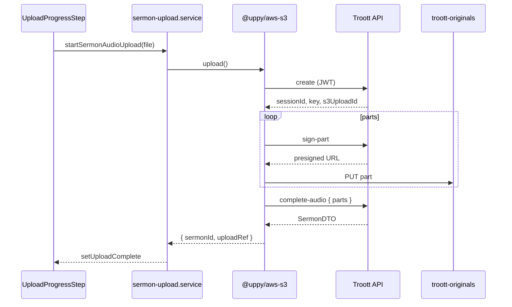

# feat-0037: Tech Spec — Uppy direct S3 uploads (Web)

> **ID disambiguation:** Web Uppy client (`specs/web/feature/feat-0037/`). API signing: [feat-0018 TECH](../../../api/feature/feat-0018/TECH.md). Upload polling: [web feat-0018 UPLOAD_STATUS_POLLING_SPEC](../feat-0018/UPLOAD_STATUS_POLLING_SPEC.md). Tasks: [TASKS.md](./TASKS.md).

## Context

See [PRODUCT.md](./PRODUCT.md). **Implementation in `apps/web` only.** API: [feat-0018 TECH](../../../api/feature/feat-0018/TECH.md).

**Design rule:** Use **`@uppy/core` + `@uppy/aws-s3`** with custom signing callbacks that call Troott API. Wire Uppy **directly in the existing upload services** (`sermon-upload.service.ts`, `sermon-cover-upload.service.ts`, `storage-upload.service.ts`). **No new `utils/*` or `lib/uppy/*` layers. No TUS. No Companion. No `packages/upload`.**

---

## 1. Dependencies

```bash
pnpm --filter @troott/web add @uppy/core @uppy/aws-s3
```

Do **not** add `@uppy/tus` or `@uppy/companion`.

Optional P1: `@uppy/google-drive` (requires Companion or custom remote — defer).

---

## 2. Size threshold (inline)

Use `6 * 1024 * 1024` bytes at the call site — **no shared threshold util**.

| Surface | S3 multipart (Uppy) | Legacy Axios multipart |
| ------- | ------------------- | ---------------------- |
| Sermon audio | Always (default) | `file.size ≤ 6_291_456` + test-only `forceMultipart` |
| Cover / storage | `file.size > 6_291_456` | `file.size ≤ 6_291_456` |

---

## 3. Sermon audio (primary) — `sermon-upload.service.ts`

Extend the existing service. Uppy setup and signing callbacks live **in this file** (not a separate module).

```ts
import Uppy from '@uppy/core';
import AwsS3 from '@uppy/aws-s3';

const S3_MULTIPART_THRESHOLD_BYTES = 6 * 1024 * 1024;

export async function startSermonAudioUpload(params: {
    file: File;
    onProgress?: (percent: number) => void;
    signal?: AbortSignal;
    forceMultipart?: boolean;
}): Promise<{ sermonId: string; uploadRef?: string }> {
    if (params.forceMultipart || params.file.size <= S3_MULTIPART_THRESHOLD_BYTES) {
        return api.sermon.startUpload(/* legacy multipart */);
    }

    const uppy = new Uppy({ restrictions: { maxNumberOfFiles: 1 } });
    uppy.use(AwsS3, {
        shouldUseMultipart: () => true,
        createMultipartUpload: async (file) => {
            const { data } = await api.sermon.createSermonAudioMultipart({ ... });
            file.meta.sessionId = data.sessionId;
            file.meta.troottUploadId = data.uploadId;
            return { uploadId: data.s3UploadId, key: data.key };
        },
        signPart: async (file, { partNumber }) => { /* api.sermon.signSermonAudioPart */ },
        listParts: async (file, { uploadId, key }) => { /* api.sermon.listSermonAudioParts */ },
        completeMultipartUpload: async (file, { parts }) => {
            /* api.sermon.completeSermonAudioMultipart — store response on file.meta */
        },
        abortMultipartUpload: async (file) => { /* api.sermon.abortSermonAudioMultipart */ },
    });

    uppy.addFile({ name: params.file.name, type: params.file.type, data: params.file });
    uppy.on('upload-progress', (_, progress) => params.onProgress?.(...));
    params.signal?.addEventListener('abort', () => uppy.cancelAll());
    await uppy.upload();
    return parseSermonComplete(file.meta); // sermonId, uploadRef
}
```

**Response mapping:** [API feat-0018 TECH §15](../../../api/feature/feat-0018/TECH.md) — unwrap `data`, map `s3UploadId` → Uppy `uploadId`, keep `sessionId` on `file.meta`.

Reference: [Uppy AwsS3 custom signing](https://uppy.io/docs/aws-s3/#createmultipartuploadfile)

### `useStudioSermonAudioUpload`

Unchanged entry point — still calls `startSermonAudioUpload`. [feat-0008](../feat-0008/TECH.md) single-flight preserved:

| Rule | Detail |
| ---- | ------ |
| Flight key | `file.name` + `file.size` + `file.lastModified` (existing) |
| One create per flight | Do not call `create` twice for same signature while in-flight |
| Uppy instance | New headless Uppy per upload attempt; discard after complete/abort |
| Retry | Clear flight in `onUploadError`, then call `startSermonAudioUpload` again |
| Cancel | `signal` → `uppy.cancelAll()` → `abortSermonAudioMultipart` → clear flight (§11) |

### API client — `apps/web/src/api/clients/sermon.ts`

```ts
createSermonAudioMultipart(body: { filename: string; contentType: string; contentLength: number });
signSermonAudioPart(body: { sessionId: string; partNumber: number });
listSermonAudioParts(sessionId: string);
abortSermonAudioMultipart(body: { sessionId: string });
completeSermonAudioMultipart(body: { sessionId: string; parts: Array<{ partNumber: number; etag: string }> });
completeSermonCoverMultipart(body: { sessionId: string; sermonId: string; parts: ... });
```

**Paths** in `api/core/paths.ts`:

```ts
export const URL_SERMON_S3_MULTIPART_CREATE = `${URL_SERMON}/s3/multipart/create`;
export const URL_SERMON_S3_MULTIPART_SIGN_PART = `${URL_SERMON}/s3/multipart/sign-part`;
export const URL_SERMON_S3_MULTIPART_LIST_PARTS = `${URL_SERMON}/s3/multipart/list-parts`;
export const URL_SERMON_S3_MULTIPART_ABORT = `${URL_SERMON}/s3/multipart/abort`;
export const URL_SERMON_S3_MULTIPART_COMPLETE_AUDIO = `${URL_SERMON}/s3/multipart/complete-audio`;
export const URL_SERMON_S3_MULTIPART_COMPLETE_COVER = `${URL_SERMON}/s3/multipart/complete-cover`;
```

**Storage paths** in `api/core/paths.ts`:

```ts
export const URL_STORAGE_S3_MULTIPART_CREATE = `${URL_STORAGE}/s3/multipart/create`;
export const URL_STORAGE_S3_MULTIPART_SIGN_PART = `${URL_STORAGE}/s3/multipart/sign-part`;
export const URL_STORAGE_S3_MULTIPART_LIST_PARTS = `${URL_STORAGE}/s3/multipart/list-parts`;
export const URL_STORAGE_S3_MULTIPART_ABORT = `${URL_STORAGE}/s3/multipart/abort`;
export const URL_STORAGE_S3_MULTIPART_COMPLETE = `${URL_STORAGE}/s3/multipart/complete`;
```

---

## 4. Sermon cover — `sermon-cover-upload.service.ts`

Same pattern as §3: Uppy + `@uppy/aws-s3` **in the service file** when `file.size > 6_291_456`.

Two-step complete per [API feat-0018 TECH §17](../../../api/feature/feat-0018/TECH.md):

1. Uppy `completeMultipartUpload` → `POST /storage/s3/multipart/complete`
2. `POST /sermon/s3/multipart/complete-cover` with `{ sessionId, sermonId }` only

Otherwise legacy `POST /sermon/image-upload`.

---

## 5. Storage image / document — `storage-upload.service.ts`

Uppy + signing callbacks **in this service** when `file.size > 6_291_456` → `POST /storage/s3/multipart/complete` → parse `ImageDTO`.

Legacy Axios path for smaller files stays in `storage-multipart-upload.ts` (existing extract).

**API client** `storage.ts`:

```ts
createStorageMultipart(...);
signStoragePart(...);
completeStorageMultipart(...);
// etc.
```

---

## 6. Drive batch (P1)

Implement in the studio hook or `sermon-upload.service.ts` — **max 2 concurrent** uploads, each calling `startSermonAudioUpload`. No separate queue module. Google Picker adds `File[]` and drains the queue (P1).

---

## 7. Audio sequence



Network tab: **PUT requests go to `*.amazonaws.com` or CloudFront**, not `api.troott.com` body traffic.

---

## 8. Progress and errors

| Uppy event | Handler |
| ---------- | ------- |
| `upload-progress` | `bytesUploaded / bytesTotal` → int % → `uploadActions.setProgress` |
| `upload-error` | `onUploadError()`, toast, Retry |
| `upload-success` | Parse sermon id from complete response |
| `restriction-failed` | Show max size message |
| Cancel | `uppy.cancelAll()` + AbortController |

| HTTP | Message |
| ---- | ------- |
| 401 | Auth redirect (existing) |
| 403 | Not owner / minister gate |
| 404 | Unknown session (clear local resume) |
| 409 | Session aborted — restart upload |
| 413 | Max size from API |
| 429 | Rate limit — backoff toast |
| S3 CORS error | Ops runbook — ETag / origin ([API feat-0018 TECH §20](../../../api/feature/feat-0018/TECH.md)) |

---

## 9. Resume (inline in service / hook)

Optional P0: persist `sessionId` + file signature (`name|size|lastModified`) in `localStorage` under `troott:s3-multipart:v1` **inside** `sermon-upload.service.ts` or `useStudioSermonAudioUpload` — not a separate storage module.

| Event | Action |
| ----- | ------ |
| After `create` | `localStorage.setItem(...)` |
| On success / abort | `localStorage.removeItem(...)` |
| User re-selects same file | If entry &lt; 24h, pass `sessionId` to `listParts` before upload |
| File signature mismatch | Remove entry; new `create` |

Do not persist JWT or presigned URLs.

---

## 10. Cancel and abort

In `sermon-upload.service.ts` (or hook): `uppy.cancelAll()` → `api.sermon.abortSermonAudioMultipart({ sessionId })` → clear single-flight ([feat-0008](../feat-0008/TECH.md)) and any `localStorage` resume entry.

Wire to wizard Cancel and `AbortSignal` on `useStudioSermonAudioUpload`. Cover/storage: same pattern in their services.

**After upload complete:** cancel processing uses existing `POST /sermon/cancel-processing/:id` — not feat-0037.

---

## 11. Call sites (concrete paths)

| File | Change |
| ---- | ------ |
| `hooks/upload/useStudioSermonAudioUpload.ts` | S3 branch via service; cancel + signal |
| `components/studio/upload/UploadProgressStep.tsx` | Progress from Uppy; cancel button |
| `app/studio/SermonEditPage.tsx` | Cover via `sermon-cover-upload.service` |
| `hooks/app/useDocumentVerification.ts` | `uploadStorageFile` for KYC PDFs |
| Profile settings (avatar/banner) | `storage-upload.service.ts` |

---

## 12. Files to touch

| File | Action |
| ---- | ------ |
| `services/upload/sermon-upload.service.ts` | **Edit** — Uppy S3 branch + legacy branch |
| `services/upload/sermon-cover-upload.service.ts` | **Edit** — Uppy S3 branch |
| `services/upload/storage-upload.service.ts` | **Edit** — Uppy S3 branch |
| `services/upload/storage-multipart-upload.ts` | **Keep** — legacy Axios only |
| `hooks/upload/useStudioSermonAudioUpload.ts` | **Edit** — cancel, signal, optional resume |
| `api/clients/sermon.ts` | **Edit** — multipart methods |
| `api/clients/storage.ts` | **Edit** — multipart methods |
| `api/core/paths.ts` | **Edit** — route constants |
| KYC / profile / `SermonEditPage` | **Edit** — call existing upload services |

**Do not add:** `utils/s3-multipart-*`, `lib/uppy/*`, `packages/upload`, `tus-js-client`.

---

## 13. Validation

```bash
pnpm --filter @troott/web test
pnpm --filter @troott/web exec tsc --noEmit
pnpm dev:web
```

| Test | Expected |
| ---- | -------- |
| 50 MB MP3 wizard | S3 PUTs + 1× `complete-audio`; sermon row created |
| Resume | Throttle → parts resume via `listParts` |
| 3 MB audio (test `forceMultipart`) | 1× `start-upload` to API only |
| 10 MB cover | S3 + `complete-cover` |
| Single-flight | 1 create session per file signature ([feat-0008](../feat-0008/TECH.md)) |

---

## 14. Boundaries

- **Always:** Headless Uppy in wizard (no Dashboard swap without product sign-off)
- **Always:** Sermon audio defaults to S3 multipart
- **Always:** Uppy + signing live in existing upload services — no new util/lib layers
- **Never:** `@uppy/tus`, `tus-js-client`, Companion `endpoint` URL, `packages/upload`
- **Ask first:** `@uppy/dashboard` as primary UI; `@uppy/google-drive` without Picker plan

---

## 15. References

- [Uppy AWS S3](https://uppy.io/docs/aws-s3/)
- [Uppy Core](https://uppy.io/docs/uppy/)
- [AwsS3 createMultipartUpload](https://uppy.io/docs/aws-s3/#createmultipartuploadfile)
- [feat-0018 API TECH](../../../api/feature/feat-0018/TECH.md) (§15 mapping, §17 cover, §19–20 abort/CORS)
- [TASKS.md](./TASKS.md)
