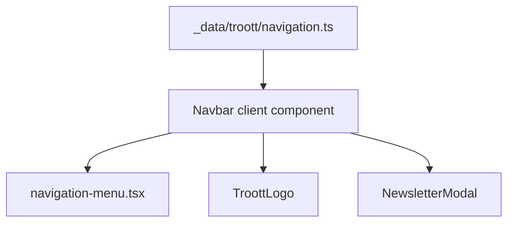

# feat-0002: Tech — Marketing navbar dropdown navigation

## Context

See [PRODUCT.md](./PRODUCT.md). Reference implementation: Pacepard `Navbar` (user-provided snippet). Target: **`apps/website`**.

**Closed decisions (implement as written):** [D1 Studio URL](./PRODUCT.md#d1--studio-url), [D2 Login](./PRODUCT.md#d2--login-in-v1-not-omitted), [D3 Scroll CTAs](./PRODUCT.md#d3--scroll-cta-behavior).

---

## Design decisions (implementation)

### Studio URL (D1)

```ts
// navigation.ts — use siteConfig, never inline production URL
import { siteConfig } from '@/app/siteConfig';

{
  title: 'Troott Studio',
  href: siteConfig.baseLinks.studio, // https://app.troott.com
  external: true,
}
```

Login href: `siteConfig.baseLinks.login` → `https://app.troott.com/login`.

### Login in v1 (D2)

- Render Login in desktop action group and mobile sheet.
- Do not gate behind feature flag or `// v2` comments.

### Scroll CTAs (D3)

- **Forbidden:** Pacepard-style collapse:

```tsx
// DO NOT ship in feat-0002
{!scrolled && ( <> Login + Start listening + Upload </> )}
{scrolled && ( <Button>Start listening</Button> )}
```

- **Required:** All three actions always rendered; `scrolled` only for mobile menu close / optional header styling.

---

## Current state

| Piece | Path | Notes |
| ----- | ---- | ----- |
| Navbar export | `components/containers/Navbar.tsx` | `Navigation()` — floating pill, flat links |
| Layout usage | `components/layouts/Layout.tsx` or `app/layout.tsx` | Confirm import site-wide |
| Navigation menu UI | `components/ui/navigation-menu.tsx` | Radix + shadcn; ready to use |
| Utils | `lib/utils.ts` | `cx()` — use instead of `@pacepard/ui` `cn` |
| Button (shadcn) | `components/ui/button.tsx` | CTA `asChild` + `Link` |
| Button (legacy) | `components/Button.tsx` | Current navbar CTA — migrate CTAs to shadcn or keep for modal triggers |
| Newsletter | `components/NewsletterModal.tsx` | Preserve for CTAs |
| Logo | `public/TroottLogo.tsx` | Keep; do not add `pacepard.svg` |
| Footer links | `components/containers/Footer.tsx` | Parity reference |
| Background | — | **Missing** — implement inline or add `components/background.tsx` (minimal) |

---

## Target file layout

```text
apps/website/
├── _data/troott/
│   └── navigation.ts          # NavigationItems + types
├── components/
│   ├── containers/
│   │   ├── Navbar.tsx         # Replace Navigation() implementation
│   │   └── navbar/
│   │       ├── DesktopNav.tsx       # optional split
│   │       ├── MobileNav.tsx
│   │       └── NavDropdownRow.tsx   # icon + title + description
│   └── background.tsx         # optional: mobile sheet wrapper
```

**v1 recommendation:** Single `Navbar.tsx` refactor (no subfolder) unless file exceeds ~250 lines — then extract `MobileNav`.

---

## Navigation data model

```ts
// apps/website/_data/troott/navigation.ts

import type { LucideIcon } from 'lucide-react';

export type NavDropdownItem = {
  title: string;
  description: string;
  href: string;
  external?: boolean;
  icon?: LucideIcon;
};

export type NavSection = {
  label: string; // e.g. "USE CASES"
  items: NavDropdownItem[];
};

export type NavItem =
  | {
      label: string;
      href: string;
      dropdownItems?: never;
      sections?: never;
    }
  | {
      label: string;
      href?: never;
      dropdownItems: NavDropdownItem[];
      sections?: never;
    }
  | {
      label: string;
      href?: never;
      dropdownItems?: never;
      sections: NavSection[]; // Solutions mega menu
    };

export const NavigationItems: NavItem[] = [ /* PRODUCT.md tables */ ];
```

Populate from [PRODUCT.md § Information architecture](./PRODUCT.md#information-architecture).

---

## Component architecture



### Desktop rendering

```tsx
<NavigationMenu className="max-lg:hidden">
  <NavigationMenuList>
    {NavigationItems.map((link) => {
      if (link.sections) return <SolutionsMegaMenu key={link.label} ... />;
      if (link.dropdownItems) return <SimpleDropdown key={link.label} ... />;
      return <PlainNavLink key={link.label} href={link.href} />;
    })}
  </NavigationMenuList>
</NavigationMenu>
```

### Solutions mega menu (desktop)

- `NavigationMenuContent` with `className="w-[600px] p-0"`
- Grid: `grid grid-cols-2 divide-x divide-border`
- Each column: `p-4` + section label + list of `NavDropdownRow`

### Simple dropdown (Product, Resources)

- `NavigationMenuContent` → `ul className="w-[400px] space-y-2 p-4"` (Pacepard pattern)
- Rows without icons OK for Product; Resources optional icons off

### Mobile rendering

- State: `isMenuOpen`, `openDropdown: string | null`, `scrolled`
- `useEffect` scroll listener closes menu (Pacepard behavior)
- `useEffect` or `matchMedia` closes menu at `lg` breakpoint (keep existing pattern)
- Accordion button toggles `openDropdown === link.label`
- Dark sheet: `fixed inset-0 z-[100] bg-neutral-950 ... lg:hidden`

---

## Pacepard → Troott mapping

| Pacepard snippet | Troott implementation |
| ---------------- | --------------------- |
| `cn` from `@pacepard/ui/lib/utils` | `cx` from `@/lib/utils` |
| `Image` + `/blocks/pacepard.svg` | `TroottLogo` component |
| `NavigationItems` from `@/_data/pacepard/navigation` | `@/_data/troott/navigation` |
| `Background variant="bottom"` | Optional gradient div or skip v1 |
| `Link href="/login"` | `Link href={siteConfig.baseLinks.login}` — **required** |
| Pacepard “Get Started” single CTA | **Two** Troott buttons: Start listening + Upload your sermons — **both required** |
| `Link href="/learn"` | Newsletter modal (listener) — not `/learn` |
| `mailto:hello@pacepard.com` | `mailto:hello@troott.com` |
| Mobile tagline Pacepard copy | Troott tagline from `siteConfig.description` (shortened) |
| Social X / LinkedIn Pacepard URLs | Footer URLs (`thetroott`, company/troott) |
| Mobile sheet `bg-white` | `bg-neutral-950` / `bg-background` |
| Pacepard scroll-collapse CTAs | **Rejected** — all three actions always visible ([D3](./PRODUCT.md#d3--scroll-cta-behavior)) |
| `siteConfig.baseLinks.studio` | Product dropdown + external app links ([D1](./PRODUCT.md#d1--studio-url)) |

---

## CTA wiring (required — all three)

Normative desktop action group — **never omit Login or either button**:

```tsx
import { siteConfig } from '@/app/siteConfig';

// 1. Login (link)
<Button asChild variant="link" size="lg" className="text-sm md:text-base max-lg:hidden">
  <Link
    href={siteConfig.baseLinks.login}
    target="_blank"
    rel="noopener noreferrer"
  >
    Login
  </Link>
</Button>

// 2. Start listening (primary → newsletter)
<Button
  size="lg"
  className="text-sm md:text-base"
  onClick={() => {
    setRole('listener');
    track('listenerSignup');
    setDialogOpen(true);
  }}
>
  Start listening
  <ArrowRightToLineIcon className="size-4" aria-hidden />
</Button>

// 3. Upload your sermons (secondary → newsletter)
<Button
  variant="outline"
  size="lg"
  className="text-sm md:text-base"
  onClick={() => {
    setRole('minister');
    track('ministerSignup');
    setDialogOpen(true);
  }}
>
  Upload your sermons
</Button>
```

**Scroll:** Do **not** wrap the three actions in `{!scrolled && ...}`. All remain mounted at every scroll offset.

**Mobile sheet:** Render the same three actions after accordion nav (stacked full-width buttons + Login link).

For shadcn `Button asChild` + modal triggers, use `onClick` on `Button` without `asChild` for the two newsletter CTAs.

---

## Styling notes

| Element | Classes (indicative) |
| ------- | -------------------- |
| Header | `sticky top-0 z-50 w-full bg-background/70 backdrop-blur-md border-b border-border/70` |
| Container | `mx-auto flex max-w-7xl items-center justify-between px-4 py-3 sm:px-6 lg:px-8` |
| Trigger | `bg-transparent! px-1.5 text-sm md:text-base data-[state=open]:bg-accent/50` |
| Mega section label | `text-xs font-medium uppercase tracking-wider text-muted-foreground mb-3` |
| Icon box | `flex size-9 shrink-0 items-center justify-center rounded-md border border-border/80` |
| Mobile accordion panel | `bg-muted/50 space-y-3 rounded-lg p-4` |

Ensure `navigation-menu` viewport width fits mega menu — may need `viewport={false}` on `NavigationMenu` for Solutions only, or custom width on content (test in browser).

---

## Implementation checklist

| # | Task | File(s) |
| - | ---- | ------- |
| 1 | Add `navigation.ts` with typed `NavigationItems` | `_data/troott/navigation.ts` |
| 2 | Refactor `Navbar.tsx` to Pacepard structure (sticky, desktop menu) | `components/containers/Navbar.tsx` |
| 3 | Implement Solutions 2-column mega panel | `Navbar.tsx` or extract |
| 4 | Implement mobile accordion + dark sheet | `Navbar.tsx` |
| 5 | Wire **Login** + **Start listening** + **Upload your sermons** + `NewsletterModal` | `Navbar.tsx` |
| 6 | Remove unused `MobileLink` import if fully replaced | `Navbar.tsx`, `MobileLink.tsx` |
| 7 | Verify layout still renders `Navigation` | `app/layout.tsx` |
| 8 | Manual QA breakpoints + keyboard nav | — |
| 9 | Optional: extract shared link constants for Footer | follow-up, not blocking |

---

## Testing

| Check | How |
| ----- | --- |
| Dropdown links | Click each row; correct hash / external tab |
| Studio external | `app.troott.com` opens new tab if `external: true` |
| Modal CTAs | Listener + minister roles set correctly |
| Login link | Opens `https://app.troott.com/login` |
| All three CTAs at scroll | Desktop: Login + both buttons still visible after scroll |
| Scroll close mobile | Open menu, scroll → menu closes |
| Resize | Mobile menu closed at `≥1024px` |
| a11y | `sr-only` on hamburger; aria labels on social |
| Build | `pnpm --filter @troott/website build` |

---

## Migration / rollback

- **Export name:** Keep `export function Navigation()` if `layout.tsx` imports that name — or rename to `Navbar` and update one import.
- **Rollback:** Revert `Navbar.tsx` + delete `_data/troott/navigation.ts`.

---

## Dependencies

No new npm packages. Uses existing:

- `@radix-ui/react-navigation-menu`
- `lucide-react`
- `next/link`, `next/navigation`

Do **not** add `@pacepard/ui`.
